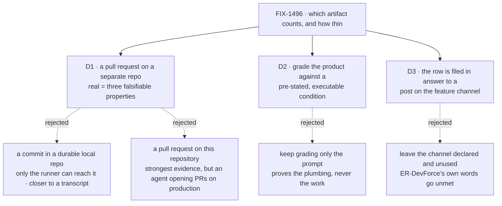

# FIX-1496 · Decisions

[Spec](SPEC.md) · **Decisions** · [Rules](BUSINESS-RULES.md) · [Plan](PLAN.md) · [Docs](DOCS.md)

What was considered, what was chosen, why, and what each locks in. Three decisions are the
sign-off surface; everything else here is context for them.

## The tree

Solid edges are what you are signing. Dashed edges lost, and the label says why.

## D1 · The artifact is a pull request on a separate throwaway repository, and "real" is defined by three falsifiable properties rather than by taste

| | |
|---|---|
| **Instead of** | A commit in a durable local repository, or a pull request against `flow-state-dev` itself |
| **Because** | ER-DevForce contrasts a real artifact with *a transcript*. A commit only the machine that produced it can reach is a transcript with a SHA. A pull request has an address a person opens, a title and a body the run wrote, and a diff a person accepts or rejects — which is the thing the launch claim is actually about |
| **Locks in** | Producing the release proof costs a credential, a network call and a throwaway repository, once. And we have committed to a definition of *real work* that the next Lab proof has to keep meeting — a later artifact that cannot satisfy the three properties does not get to call itself real by analogy |

**The three properties, each with its falsifier.** This is what makes *"would a person accept
this as real work?"* checkable instead of a matter of taste:

| Property | Falsified by |
|---|---|
| **It outlives the run at an address a third party resolves** | The goal's process has exited and its temporary directories are gone; fetching the address returns nothing |
| **The Lab did not author it** | Any graded token of the artifact's content is also found in the lab's own code, its fixtures, or the prompt — the held-out discipline, inverted onto the product |
| **It satisfies a condition the requester stated before the run, executed** | The condition is run in the produced tree and does not pass; or the condition would have passed before the run, which makes it no evidence at all |

**What would change my mind:** if the owner reads "exists outside the run" as *outside the
process* rather than *outside the machine*, a bare repository at a declared path is cheaper and
needs no credential. Say so and the pull-request leg becomes optional rather than the proof.

## D2 · The proof grades what the run produced, against an acceptance condition the brief states first and a machine executes

| | |
|---|---|
| **Instead of** | Keeping the existing rule that only the prompt is graded and the product never is |
| **Because** | The existing rule is right about what it guards — a model writes a plausible file without reading anything, so the file is no evidence a document was *read*. But ER-DevForce asks for a **work product**, and nothing that refuses to look at the product can prove one. The way out is not to grade the file's contents by eye; it is to grade it against a condition the *requester* wrote down before the run and a machine can execute |
| **Locks in** | The feature brief stops being flavour text and becomes a contract. Every future DevForce brief owes an executable done-condition, and a Lab task that cannot state one cannot be proved this way — which is a real limit on what this proof shape can cover |

Both gradings stay, because they answer different questions. *Did the seat's own files reach the
run?* is the prompt's job and is unchanged. *Did the run produce work someone asked for?* is the
condition's job and is new. A run that improvised without reading the brief fails the second
while possibly passing neither.

## D3 · The row is filed in answer to a post on the feature channel, not by calling the EM seat's action directly

| | |
|---|---|
| **Instead of** | Leaving the declared channel walked-but-unopened, as it is today, and filing through the EM seat's own action |
| **Because** | ER-DevForce says *seats **and channels** used honestly*. Today the channel is a Markdown file the loader reads and nothing opens — honest by the letter, empty in fact. The post-reaches-a-seat path is already proven in two sibling labs on the same primitive, so closing this costs composition, not invention |
| **Locks in** | The proof now depends on the channel fan-out as well as the board hand-off, so a regression in either fails it. That is the point: it is one path end to end, and a proof that skipped the front door would have been reporting on a shorter path than the one we ship |

**What would change my mind:** if [ER-Collab](../../epics/FIX-1457/BUSINESS-RULES.md#er-collab)'s
producer is filed this cycle and takes the channel leg explicitly, this becomes duplicated
evidence and should be dropped here to keep the path thinnest. Nothing has been built against it.

## Decided, not asked

- **This is a delta on `goals/devforce-lab/`, not a new Lab tree.** Roughly four fifths of the
  path is built and passing; the issue's own fence says compose
  ([ER-11](../../epics/FIX-1457/BUSINESS-RULES.md), [ER-25](../../epics/FIX-1457/BUSINESS-RULES.md)).
- **The new proof is a third sibling goal**, not an edit to either existing check. They carry
  claims and verdict logs that are still true; rewriting one to mean something else would
  invalidate evidence for no gain.
- **The board stays declared in code.** Moving it onto the channel's `boards:` frontmatter would
  mint a second board and change which one the cross-flow claim gate compares against. The
  interim tax is already labelled as one; paying it for one more proof is cheaper than the risk.
- **No package under `packages/` changes.** Everything the proof needs — the channel primitives,
  the harness manager, the `gh` completion probe — already ships.
- **The existing never-run commit check gets run too.** It is the cheaper half of the same
  wiring, and leaving a written-but-unrun check beside a newly passing one is how the next reader
  learns that unrun checks are normal here.
- **Stores go on disk for the new proof only.** ER-3 asks for durable across the run; the
  model-free gate is a contract check and has no such requirement.

## Considered and dropped

| Alternative | Why not |
|---|---|
| **A commit in a durable local bare repository** | Cheapest, needs no credential — and fails the first property. An artifact only the producing machine can reach is the same defect as the temp directory, arriving more slowly |
| **A pull request against `flow-state-dev` itself** | The strongest possible evidence: a human would merge it or not. Also an agent opening pull requests on the production repository, on a schedule nobody asked for, and a proof whose runtime includes a human review round |
| **Extend `it-commits-from-the-seats-own-file` instead of adding a sibling** | Thinner by one file, and it rewrites a check whose stated claim is deliberately *a commit, not a pull request*. Its verdict log would then describe a check that no longer exists |
| **Grade the artifact by reading its contents for tokens** | The failure the existing goal exists to refuse. A model that never read the brief can still emit a token it was told to emit |
| **Move the board onto the channel's `boards:` declaration** | Removes the interim tax and is the authored shape FIX-1385 settled — and changes the board the hand-off gates against. A substrate-shaped change wearing a polish label is exactly [ER-25](../../epics/FIX-1457/BUSINESS-RULES.md) |
| **Wait for [FIX-1440](https://linear.app/fixpoint-labs/issue/FIX-1440) to land first** | Checked, not assumed: the lab reads dispatch parentage only as provenance, which FIX-1440's own owner amendment keeps, and reads nothing from the browsable child-session surface it removes. Re-derived by [`poc/gap-check/`](poc/gap-check/README.md) |

## Settled

- **FIX-1440 does not fence this work** — re-derived by
  [`poc/gap-check/`](poc/gap-check/README.md), claim 5: nothing under `goals/devforce-lab/`
  reads the browsable child-session surface FIX-1440 removes, and the one parentage read is the
  provenance form the owner amendment explicitly retains. FIX-1440 is `Spec Approved`, not
  shipped; that remains true and remains irrelevant here.
- **The gap table is four rows, not more** — [`poc/gap-check/`](poc/gap-check/README.md) asserts
  all twelve facts the spec rests on, including a totality assertion over every TypeScript file
  in the lab, and goes red under four planted defects. Run 2026-09-22: `PASS — 12 claims held`.

## How it got here

- **Draft** — framed as *the proof is written and has never been run*, after finding
  `it-commits-from-the-seats-own-file` complete, type-checked and logged `NOT RUN`; the approach
  is a four-gap delta on the existing lab rather than a new DevForce path, and the artifact
  question the Architect left open is answered as a pull request with three falsifiable
  properties.
