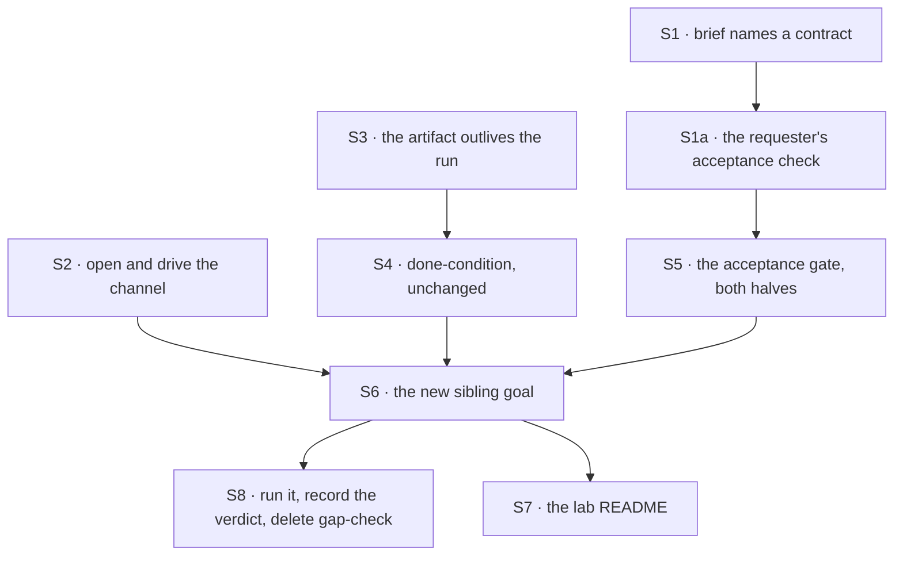

# FIX-1496 · Plan

[Spec](SPEC.md) · [Decisions](DECISIONS.md) · [Rules](BUSINESS-RULES.md) · **Plan** · [Docs](DOCS.md)

Written for the implementing agent. IDs cross-reference [BUSINESS-RULES.md](BUSINESS-RULES.md)
(BR-n) and [DECISIONS.md](DECISIONS.md) (D-n). `tdd`. One PR.

## Surfaces

| ID | Package · role | Change | Rules |
|---|---|---|---|
| S1 | `goals/devforce-lab/lab` · the authored brief | Rewrite the feature brief around a **named contract**: export `greet(name)` from a named path, with stated behaviour for a non-empty and an empty name. Keep the held-out marker — the prompt is still graded for it (D2, BR-12) | BR-3 BR-12 |
| S1a | `goals/devforce-lab/lab` · the acceptance check | **New, and it is the requester's, not the run's.** A small check that imports the named export from the named path and asserts both behaviours. It lives with the lab, **outside the run's checkout**, and is executed against the produced tree after the run — so the agent cannot edit it, delete it, or substitute a test of its own for it | BR-3 BR-3a BR-4 |
| S2 | `goals/devforce-lab/lab` · the host | Open the declared feature channel (`channelInstances` + `openChannels`, as `manager-queue-lab` does) and expose posting on it. The EM seat files its row in answer to the post rather than through a direct action call. **No org wrapper** — see *At implement time* | BR-6 BR-7 BR-8 BR-9 BR-10 |
| S3 | `goals/devforce-lab/lab` · the artifact's repository | **One automated path.** The temp-directory repository stays, and gains a **bare clone at a declared path** that the run pushes to — so the artifact resolves after the process exits without needing a network or a credential. The helper names the leg it built so the verdict can report it (D1, BR-14) | BR-1 BR-14 BR-15 |
| S4 | `goals/devforce-lab/lab` · the phase | Done-condition stays the existing commit probe — *a commit the base ref lacks*, now read from the pushed bare clone. **No `gh` probe and no second phase path in the lab.** The credentialed pull-request release run is documented in `goal.md`, using conductor's existing `prExists` slot, and is not wired as a CI leg | BR-1 BR-4 BR-5 |
| S5 | `goals/devforce-lab/lab` · the acceptance gate | Execute S1a's check against the produced tree, and against the base ref. Both halves, or the leg proves nothing (D2). The two executions share one checkout setup | BR-3 BR-3a BR-4 |
| S6 | `goals/devforce-lab/it-ships-an-artifact-a-person-can-open/` · **new sibling goal** | The runner, its `goal.md` (outcome · input · signal · anti-game · controls · verdict log), and the controls below. Reuses `openLab` with the S2–S5 options; **does not edit either existing check** | all |
| S7 | `goals/devforce-lab/lab/README.md` | Extend *What this directory owns* and *What it works around* for the channel door and the artifact's bare clone. Record that the artifact now outlives the run | — |
| S8 | The verdict log · and `gap-check`'s sunset | Run the new proof and append **one** dated row to its own `goal.md`. Appending only. **Then delete `specs/issues/FIX-1496/poc/gap-check/`** — see the sunset rule below. Running the never-run commit sibling is **not here**: [FIX-1501](https://linear.app/fixpoint-labs/issue/FIX-1501) | BR-17 |

**Nothing is removed.** Named explicitly because tenet 3 expects the question asked: the two
existing checks keep their claims, the board stays declared in code, and the `coder` kind's
second board declaration stays the labelled interim tax it already is
([D · Decided, not asked](DECISIONS.md#decided-not-asked)).

## Sequence



One PR. S1→S1a→S5 is the only chain; S2 and S3→S4 are independent of it and of each other, and
all three feed S6. S8 is the proof itself and is last because it is the only step that needs a
**signed-in coding harness** — it needs no credential and no network beyond that.

## Checks

| ID | Runs after | Passes when |
|---|---|---|
| V1 | S2 | BR-6, BR-7, BR-9. A post opens the channel, lands in the transcript, and produces **exactly one** row. No post, no row |
| V2 | S2 | BR-8. Control `reviewer-files`: the reviewer seat is made to answer the post by filing; the check goes red on the **board** dispatch record (by `flowId`), not merely on the transcript. **Grade the board dispatch, never the notify delivery** — a channel notification to a declared member is expected, so a check that counted any dispatch to the reviewer would go red on correct behaviour |
| V3 | S3, S4 | BR-14, BR-15. The automated leg runs with no `gh`, no token and no network; the artifact resolves from the bare clone after the run's process has exited; and the verdict names the leg. **One leg, not two** |
| V4 | S5 | BR-3, **both halves**: the acceptance check passes against the produced tree and fails against the base ref. Control `already-passing`: a check true before the run goes red |
| V5 | S5 | BR-4, BR-3a. Three controls, because one is not enough here: `ignores-the-brief` (commits something unrelated), `unrelated-passing-test` (adds a passing test that never imports `greet`), and `vacuous-test` (a passing test beside a `greet` that returns the wrong string). **All three must go red**; if any passes, the acceptance check is still too weak to carry D2 |
| V6 | S6 | BR-2. Every graded token of the artifact's content is absent from the lab's `.mts` files, its fixtures and the prompt — asserted **before** any verdict is read |
| V7 | S6 | BR-11. The store is closed and a fresh process reads the same row, run record and transcript |
| V8 | S6 | BR-13. Control `no-harness`: the check fails loudly and does not fall back to a stub |
| VG | S8 | **The goal.** One command: a post produces an artifact whose address resolves after the process exits, whose content the lab did not author, and which satisfies the brief's condition. `goals/devforce-lab/it-ships-an-artifact-a-person-can-open/run.mts` |
| V9 | S8 | BR-16. Diff gate: every changed path is under `goals/devforce-lab/` or `specs/issues/FIX-1496/`. Nothing under `packages/` |
| V10 | S8 | BR-17. The model-free gate still passes with its claim intact; the model-backed sibling still type-checks. Running it is [FIX-1501](https://linear.app/fixpoint-labs/issue/FIX-1501) |

**Every control must be seen red.** A green check nobody has watched fail is not evidence
(tenet 7), and the existing labs record each control's red state in the verdict log — match that.

## `gap-check` sunsets at S8 — delete it, and carry two claims forward

**The checker measures a snapshot, so it goes red on the very PR that closes the gaps it
measures.** That is by construction, not a defect: claims 2–4 assert *`inMemoryStores()` is in
use*, *nothing calls `openChannels`*, and *the artifact's repository is a temp directory*, and
S1–S5 make all three false. A check that fails when the work succeeds is worse than no check, so
it does not survive the work.

**The rule: at S8, delete `specs/issues/FIX-1496/poc/gap-check/` entirely.** Not disabled, not
left failing, not rewritten in place — deleted, in the same PR that closes the last gap. It did
its job before review, which is when a hand-counted factual base is worth anything.

**Two of its twelve claims have value beyond the snapshot, and move rather than die:**

| Claim | Where it goes |
|---|---|
| The **totality** discipline — every tracked file classified as in-scope or deliberately out, so a file nobody listed cannot hide | The new goal's **leg 0**, where the sibling labs already put their held-out scan (`V6`) |
| The **FIX-1440 provenance** read — parentage is read as provenance, never as a work control plane | The new goal's **anti-game** section as a stated invariant, and [ER-13](../../epics/FIX-1457/BUSINESS-RULES.md) already fences it at epic altitude |

The remaining ten are snapshot facts whose whole purpose was to make this spec checkable at
review time. They expire on merge, and saying so here is what stops someone reviving them.

## Pinned names · the only two

| Where | Name | Why pinned |
|---|---|---|
| The new goal directory | `goals/devforce-lab/it-ships-an-artifact-a-person-can-open` | It is the claim, and the verdict log is cited from the epic |
| The brief's held-out marker | `FEATURE-BRIEF-E61B8` | The existing prompt grading keys on it; changing it silently weakens a passing check |

Everything else is yours to name.

## Guardrails

| Rule | Because |
|---|---|
| The artifact's content is graded **only** against the acceptance check, never for tokens | A model emits a token it was told to emit. The check is the only grading that a run which never read the brief cannot fake (D2) |
| The acceptance check names the export, the path and the behaviour — never "some test passes" | *"The repository's tests pass"* is satisfied by an unrelated passing test and by a vacuous test beside a broken `greet`, which leaves `ignores-the-brief` unable to fail. A control that cannot fail is decoration (BR-3a) |
| The acceptance check lives outside the run's checkout and the run cannot edit it | A check the agent can reach is a check the agent can satisfy by rewriting. It is the requester's, applied after the run |
| BR-3 runs both halves — the check against the produced tree *and* against the base ref | A condition that was already true reports PASS on a run that did nothing. This is the vacuous-green shape the sibling labs each found the hard way |
| The verdict names the leg it ran, and CI carries **one** | A proof that quietly ran the weaker leg and reported the stronger one is worse than no proof (BR-14). Two lab code paths is the ongoing cost that buys nothing once the leg is named |
| No stub fallback when the harness is missing | A model-backed check that degrades to a scripted run is the exact failure its model-free sibling exists to detect. The existing check already states this; keep it |
| Every changed path stays inside `goals/devforce-lab/` or this spec | [ER-11](../../epics/FIX-1457/BUSINESS-RULES.md) and [ER-25](../../epics/FIX-1457/BUSINESS-RULES.md). A package change here is a substrate epic wearing a polish label, and V9 is the fence |
| Compose `openChannels` and conductor's `gh` probe; do not re-implement either | [ER-4](../../epics/FIX-1457/BUSINESS-RULES.md). A second copy of a proven path is a second thing to keep true |

## Docs

Reconcile and publish [DOCS.md](DOCS.md) after VG passes. No `apps/docs` page and no package
README changes: nothing user-facing moves. The changed prose is the lab's own README and the new
goal's `goal.md`, both internal evidence.

## Sketch · pseudocode, illustrative, react to the shape

The path itself is [the four-gaps figure](SPEC.md#what-changes) and is not redrawn here. What the
sketch adds is the **wiring and the assertion order**, which the figure does not show:

```
open the lab, as today, plus:
    stores        ← on disk, under a path this check made          (BR-11)
    channels      ← open the declared feature channel              (the epic's wording)
    repository    ← temp repo, as today, plus a bare clone at a
                    declared path that the run pushes to           (D1, one leg)
    doneCondition ← unchanged: a commit the base ref lacks         (S4)

the proof:
    post on the feature channel                                    (BR-6)
    wait for one row to appear on the feature board                (BR-7)
    wait for the row to settle
    assert the artifact resolves with the run's process gone       (BR-1)
    assert none of its graded content lives in the lab             (BR-2)
    run the brief's condition in the produced tree      → passes   (BR-3)
    run the brief's condition against the base ref      → fails    (BR-3)
```

**POC:** `poc/gap-check/` — a Node script that re-derived the twelve
facts this spec rests on straight from the repository, with a totality assertion over every
TypeScript file in the lab and four planted defects each watched going red. **The premise held**:
all twelve green on 2026-09-22 — re-run at implement time before any code was written, and again
unchanged — including the one the brief flagged as worth checking: FIX-1440 does not fence this
work. Nothing in the design changed because of it.

**Deleted at S8**, as the sunset rule above requires, so the command that ran it is no longer
quoted here. Its totality discipline moved into the new goal's leg 0 and its FIX-1440 provenance
read into that goal's anti-game section, which is what the sunset rule said to carry forward.

## At implement time

- **The notify seam, as verified in code — read this before wiring S2.**
  `defineChannelFlow` keeps the member walk and runs the `notify` block **once per declared
  member per post** (`packages/workforce/src/channel/channel-flow.ts`). But the block **declares
  its own dispatch targets**, because the dispatch seam refuses a target read out of stored data:
  `goals/pentest-lab/lab/notify.mts` carries a static `addresses` map, and **a member absent from
  it is recorded and skipped, not dispatched to**. So there are two distinct things a post can do
  to the reviewer — invoke the notify block for it (always), and dispatch work to it (only if the
  app's policy says so). **BR-8 forbids only the second.** You may leave the reviewer out of the
  addresses map entirely, or include it and give it a true no-op; either satisfies BR-8, and V2
  grades the board dispatch record regardless.
- **`openChannels` takes no `orgId`, and needs none. Write no wrapper.** Call it exactly as
  `goals/manager-queue-lab/lab/host.mts:467` does:
  `await openChannels(channels, { client, userId })`. Read in code rather than inferred, because
  two plausible-sounding versions of this are both wrong:
  - *"Wrap the session client to inject the org"* is the **old** workaround. FIX-1412 is Done.
  - *"Pass `orgId` to `openChannels`"* does not exist either — `OpenChannelsOptions` has no such
    field, and `channel-binder.ts:681` says so outright: *"The binder no longer takes an `orgId`
    at all, and never did have the authority to choose one."* **FIX-1443's title —
    *"now that openChannels takes an orgId"* — is wrong about its own resolution**, and is the
    trap that produces the second wrong version. What actually closed it was
    [FIX-1442](https://linear.app/fixpoint-labs/issue/FIX-1442): the server-created session always
    carries an organization from the verified principal, so a board always has an address.

  If the org does not in fact reach where the seats read org-scoped documents, **that is a real
  finding — report it, do not reinstate the wrapper.**
- **Do not copy `goals/pentest-lab/lab/host.mts`'s channel setup.** Its `openChannels` call is
  current, but it still carries `omitOrgWrap` and a header comment describing FIX-1412 as an open
  gap. Some of that is a deliberate control and some is stale; either way it reads as current
  practice and is not. `goals/manager-queue-lab/lab/host.mts` is the reference.
- **Check whether [FIX-1440](https://linear.app/fixpoint-labs/issue/FIX-1440) has landed.** It
  was `Spec Approved` and unshipped when this was written, and
  `poc/gap-check/` claim 5 said it does not fence this work, re-run green on 2026-09-22. Re-derive
  the checker rather than re-reading this sentence.
- **Check whether [FIX-1481](https://linear.app/fixpoint-labs/issue/FIX-1481) has landed.** If
  the org-level inventory view exists by then, note in the verdict that the run is
  Devtool-visible. Soft; not a gate.
- **`gh` is not installed on every runner.** It was absent from the machine this spec was
  written on. Conductor's probe already fails with an instruction rather than a stack trace;
  make sure the automated leg needs none of it.

## Notes from review

Below-the-bar feedback from the spec PR, recorded verbatim for the implementer. **Inputs, not
instructions** — adopt, adapt or discard; you owe no justification for discarding one.

- "Non-EM seats must be true no-ops in channel fan-out." — Cursor ([#2023](https://github.com/fixpoint-labs/flow-state-dev/pull/2023))
- "BR-3/S5's two condition executions should share one checkout setup." — Cursor ([#2023](https://github.com/fixpoint-labs/flow-state-dev/pull/2023))
- "V6's token scan reads the lab tree once." — Cursor ([#2023](https://github.com/fixpoint-labs/flow-state-dev/pull/2023))

A note that turns out to reveal a design problem is a spec blind spot — surface it and fold it
back, per the challenger discipline in `issue-implement`.

## Follow-ups

- `labs/conductor`'s own `implement-phase-opens-a-pr` goal has **no verdict-log rows at all** —
  so "conductor proves the `gh` probe" is a claim about a code path, not a recorded run. Out of
  scope here; worth a ticket against the conductor lab.
- **`goals/pentest-lab/lab/host.mts` reads as stale on the org question** — `omitOrgWrap` and a
  header comment still describe [FIX-1412](https://linear.app/fixpoint-labs/issue/FIX-1412) as an
  open gap, though it and [FIX-1443](https://linear.app/fixpoint-labs/issue/FIX-1443) are both
  Done. Not this issue's to clean, but the next reader of that file will be misled the same way
  this spec nearly was.
- The `coder` kind declaring the feature board a second time is an interim L1 tax carved onto
  [FIX-1408](https://linear.app/fixpoint-labs/issue/FIX-1408). Unchanged by this issue, still owed.
