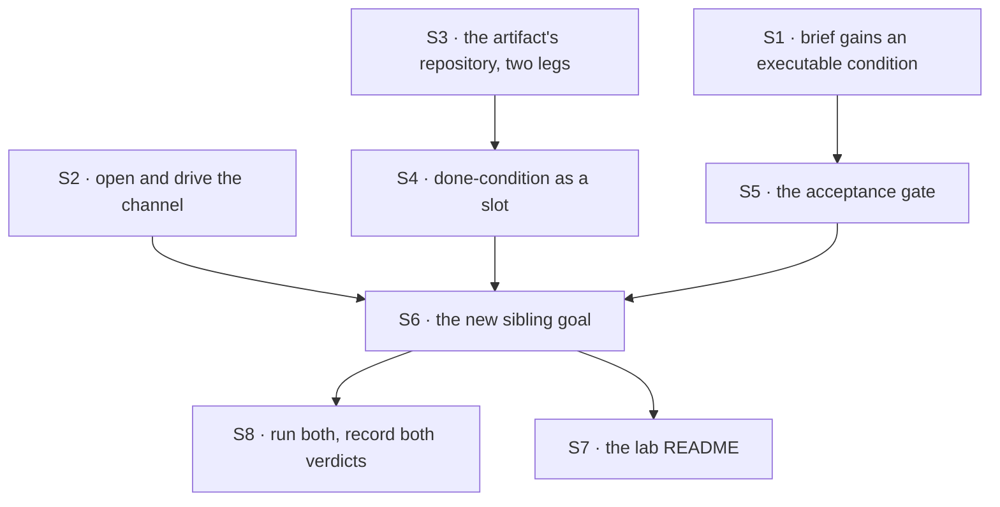

# FIX-1496 · Plan

[Spec](SPEC.md) · [Decisions](DECISIONS.md) · [Rules](BUSINESS-RULES.md) · **Plan** · [Docs](DOCS.md)

Written for the implementing agent. IDs cross-reference [BUSINESS-RULES.md](BUSINESS-RULES.md)
(BR-n) and [DECISIONS.md](DECISIONS.md) (D-n). `tdd`. One PR.

## Surfaces

| ID | Package · role | Change | Rules |
|---|---|---|---|
| S1 | `goals/devforce-lab/lab` · the authored brief | Rewrite the feature brief around an **executable** done-condition: an exported greeting function plus a test the repository's own runner picks up, and the existing held-out marker carried into the pull request body. Keep the marker — the prompt is still graded for it (D2) | BR-3 BR-12 |
| S2 | `goals/devforce-lab/lab` · the host | Open the declared feature channel (`channelInstances` + `openChannels`, as both sibling labs do) and expose posting on it. The EM seat files its row in answer to the post rather than through a direct action call (D3) | BR-6 BR-7 BR-8 BR-9 BR-10 |
| S3 | `goals/devforce-lab/lab` · the artifact's repository | Give the scratch repository a **real** remote and a second construction mode: today's temp-dir repository for the default leg, and a configured remote for the credentialed leg. Name the leg in what the helper returns so the verdict can report it (D1) | BR-1 BR-14 BR-15 |
| S4 | `goals/devforce-lab/lab` · the phase | Make the done-condition a slot rather than a fixed commit probe. Default stays *a commit the base ref lacks*; the credentialed leg uses the `gh` completion probe `labs/conductor` already ships. **Do not re-implement it** | BR-1 BR-4 BR-5 |
| S5 | `goals/devforce-lab/lab` · the acceptance gate | Execute the brief's condition in the produced tree, and the same condition against the base ref. Both halves, or the leg proves nothing (D2) | BR-3 BR-4 |
| S6 | `goals/devforce-lab/it-ships-an-artifact-a-person-can-open/` · **new sibling goal** | The runner, its `goal.md` (outcome · input · signal · anti-game · controls · verdict log), and the controls below. Reuses `openLab` with the S2–S5 options; **does not edit either existing check** | all |
| S7 | `goals/devforce-lab/lab/README.md` | Extend *What this directory owns* and *What it works around* for the channel door and the two legs. Record that the artifact now leaves the run | — |
| S8 | The verdict logs | Run the new proof **and** the never-run `it-commits-from-the-seats-own-file`, and append a dated row to each. Appending only — never rewrite an existing row | BR-17 |

**Nothing is removed.** Named explicitly because tenet 3 expects the question asked: the two
existing checks keep their claims, the board stays declared in code, and the `coder` kind's
second board declaration stays the labelled interim tax it already is
([D · Decided, not asked](DECISIONS.md#decided-not-asked)).

## Sequence



One PR. S1–S5 are independent of each other and all feed S6; S8 is the proof itself and is last
because it is the only step that needs a credentialed machine.

## Checks

| ID | Runs after | Passes when |
|---|---|---|
| V1 | S2 | BR-6, BR-7, BR-9. A post opens the channel, lands in the transcript, and produces **exactly one** row. No post, no row |
| V2 | S2 | BR-8. Control `reviewer-files`: the reviewer seat is made to answer the post by filing; the check goes red on the dispatch record, not merely on the transcript |
| V3 | S3, S4 | BR-14, BR-15. The default leg runs with no `gh`, no token and no network, and the verdict names which leg ran. Both legs exercised |
| V4 | S5 | BR-3, **both halves**: the condition passes in the produced tree and fails against the base ref. Control `already-passing`: a condition true before the run goes red |
| V5 | S5 | BR-4. Control `ignores-the-brief`: a run that commits something unrelated does not settle the row `completed` |
| V6 | S6 | BR-2. Every graded token of the artifact's content is absent from the lab's `.mts` files, its fixtures and the prompt — asserted **before** any verdict is read |
| V7 | S6 | BR-11. The store is closed and a fresh process reads the same row, run record and transcript |
| V8 | S6 | BR-13. Control `no-harness`: the check fails loudly and does not fall back to a stub |
| VG | S8 | **The goal.** One command on a credentialed machine: a post produces a pull request whose address resolves after the process exits, whose content the lab did not author, and which satisfies the brief's condition. `goals/devforce-lab/it-ships-an-artifact-a-person-can-open/run.mts` |
| V9 | S8 | BR-16. Diff gate: every changed path is under `goals/devforce-lab/` or `specs/issues/FIX-1496/`. Nothing under `packages/` |
| V10 | S8 | BR-17. Both existing siblings still pass, claims unchanged |

**Every control must be seen red.** A green check nobody has watched fail is not evidence
(tenet 7), and the existing labs record each control's red state in the verdict log — match that.

## Pinned names · the only two

| Where | Name | Why pinned |
|---|---|---|
| The new goal directory | `goals/devforce-lab/it-ships-an-artifact-a-person-can-open` | It is the claim, and the verdict log is cited from the epic |
| The brief's held-out marker | `FEATURE-BRIEF-E61B8` | The existing prompt grading keys on it; changing it silently weakens a passing check |

Everything else is yours to name.

## Guardrails

| Rule | Because |
|---|---|
| The artifact's content is graded **only** against the brief's condition, never for tokens | A model emits a token it was told to emit. The condition is the only grading that a run which never read the brief cannot fake (D2) |
| BR-3 runs both halves — the condition against the produced tree *and* against the base ref | A condition that was already true reports PASS on a run that did nothing. This is the vacuous-green shape the sibling labs each found the hard way |
| The credentialed leg and the default leg are named in the verdict, never merged into one claim | A proof that quietly ran the weaker leg and reported the stronger one is worse than no proof (BR-14) |
| No stub fallback when the harness is missing | A model-backed check that degrades to a scripted run is the exact failure its model-free sibling exists to detect. The existing check already states this; keep it |
| Every changed path stays inside `goals/devforce-lab/` or this spec | [ER-11](../../epics/FIX-1457/BUSINESS-RULES.md) and [ER-25](../../epics/FIX-1457/BUSINESS-RULES.md). A package change here is a substrate epic wearing a polish label, and V9 is the fence |
| Compose `openChannels` and conductor's `gh` probe; do not re-implement either | [ER-4](../../epics/FIX-1457/BUSINESS-RULES.md). A second copy of a proven path is a second thing to keep true |

## Docs

Reconcile and publish [DOCS.md](DOCS.md) after VG passes. No `apps/docs` page and no package
README changes: nothing user-facing moves. The changed prose is the lab's own README and the new
goal's `goal.md`, both internal evidence.

## Sketch · pseudocode, illustrative, react to the shape

```
open the lab, as today, plus:
    stores        ← on disk, under a path this check made          (BR-11)
    channels      ← open the declared feature channel              (D3)
    repository    ← default: a temp repo, as today
                    credentialed: a repo with a real remote        (D1)
    doneCondition ← default: a commit the base ref lacks, as today
                    credentialed: conductor's gh probe             (D1)

the proof:
    post on the feature channel                                    (BR-6)
    wait for one row to appear on the feature board                (BR-7)
    wait for the row to settle
    assert the artifact resolves with the run's process gone       (BR-1)
    assert none of its graded content lives in the lab             (BR-2)
    run the brief's condition in the produced tree      → passes   (BR-3)
    run the brief's condition against the base ref      → fails    (BR-3)
```

**POC:** [`poc/gap-check/`](poc/gap-check/README.md) — a Node script that re-derives the twelve
facts this spec rests on straight from the repository, with a totality assertion over every
TypeScript file in the lab and four planted defects each watched going red. Run
`node specs/issues/FIX-1496/poc/gap-check/check.mjs`. **The premise held**: all twelve green on
2026-09-22, including the one the brief flagged as worth checking — FIX-1440 does not fence this
work. Nothing in the design changed because of it; it is here so a reviewer can re-run the
argument instead of re-reading it.

## At implement time

- **Confirm how a channel post reaches a seat's action.** The plan names the seam, not the
  entry. `goals/pentest-lab/lab/host.mts` and `goals/manager-queue-lab/lab/host.mts` both do
  this; copy whichever is closer. The fan-out reaches *every* declared member, so decide there
  what the coder and reviewer seats do with a post — BR-8 only requires that neither files.
- **The org is not threaded through `openChannels`** (FIX-1412). Both sibling labs wrap the
  session client to inject it. Wrap, do not work around, and do not fix FIX-1412 here.
- **Check whether [FIX-1440](https://linear.app/fixpoint-labs/issue/FIX-1440) has landed.** It
  was `Spec Approved` and unshipped when this was written, and
  [`poc/gap-check/`](poc/gap-check/README.md) claim 5 says it does not fence this work. Re-run
  the checker rather than re-reading this sentence.
- **Check whether [FIX-1481](https://linear.app/fixpoint-labs/issue/FIX-1481) has landed.** If
  the org-level inventory view exists by then, note in the verdict that the run is
  Devtool-visible. Soft; not a gate.
- **`gh` is not installed on every runner.** It was absent from the machine this spec was
  written on. Conductor's probe already fails with an instruction rather than a stack trace;
  make sure the default leg is what runs when it is missing.

## Follow-ups

- `labs/conductor`'s own `implement-phase-opens-a-pr` goal has **no verdict-log rows at all** —
  so "conductor proves the `gh` probe" is a claim about a code path, not a recorded run. Out of
  scope here; worth a ticket against the conductor lab.
- The `coder` kind declaring the feature board a second time is an interim L1 tax carved onto
  [FIX-1408](https://linear.app/fixpoint-labs/issue/FIX-1408). Unchanged by this issue, still owed.
