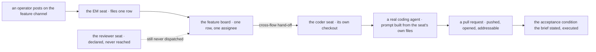

# FIX-1496 · ER-DevForce proof: thinnest DevForce path ships a real artifact

**Spec** · [Decisions](DECISIONS.md) · [Rules](BUSINESS-RULES.md) · [Plan](PLAN.md) · [Docs](DOCS.md)

Feature · `goals/devforce-lab` only · **small** · 1 PR · epic [FIX-1457](../../epics/FIX-1457/SPEC.md) ([ER-DevForce](../../epics/FIX-1457/BUSINESS-RULES.md#er-devforce))

## Five people, before and after

| Someone who… | Today | After |
|---|---|---|
| **is deciding whether Workforce is ready to ship** | "A Lab can build" rests on a check that was written, type-checked, and **never executed**. Its verdict log has one row and that row reads `NOT RUN` | Opens a pull request a hired coder seat wrote, and reads the diff. The verdict log carries a dated `PASS` with the pull request's address in it |
| **asks what the workforce actually produced** | A commit in a temporary directory on whatever machine ran it, swept away with the rest of `/tmp` | A pull request with a title, a body and a diff, at an address that still resolves after the run is over |
| **asks whether the work is any good, not merely that it exists** | Nothing grades the product. The check grades the *prompt*, deliberately, so a model that improvised a plausible file still passes | The brief names an acceptance condition **before** the run, and the check executes it against what the run produced. Improvising does not pass |
| **asks whether the seats really used their channels** | The feature channel is a Markdown file the loader walks and nothing ever opens | A post on the feature channel is what starts the work. The channel is driven, not decorated |
| **has to re-run this proof a year from now** | Impossible: it has never been run once | One command. The credentialed pull-request leg is a flag; the default leg needs no network, no token and no `gh` |

**Why now.** W5's done condition is three exit proofs and none has been run
([FIX-1457](../../epics/FIX-1457/SPEC.md)). ER-DevForce is the one that decides whether
"Workforce can host a Lab that builds" is a claim or a fact. The research finding is that it is
**nearly built already** — and that the last mile is not more substrate, it is running the thing
and letting what it makes survive.

## What changes

![Two lanes over the same five-stage DevForce path. Today three stages are built and green while the declared channel sits unused and the artifact is a commit in a temp directory; a banner reads never run, on in-memory stores. After, the same five stages with four marked gaps closed: a post on the feature channel drives the filing, the run is on durable on-disk stores, the artifact is a pull request at an address a person can open, and it is graded against an acceptance condition the brief stated before the run.](figures/the-four-gaps.svg)

The five stages are the same in both lanes, and the middle three are untouched. Only the two
ends move, plus two properties of the run. **Nothing new is built** — the four gaps are the whole
issue ([D1](DECISIONS.md#d1), [D2](DECISIONS.md#d2), [D3](DECISIONS.md#d3)).

**The brief the coder seat works from, as its author writes it** — this is the surface that turns
"a file exists" into "work a person would accept":

```diff
  # Feature brief

  Add a greeting module to the repository you are working in.

- Write the file `GREETING.md`, and make its first line exactly:
+ Export a `greet(name)` function that returns a greeting, and cover it with a
+ test the repository's own test runner picks up.
+
+ ## Done when
+
+ The repository's test run reports at least one passing test and no failing
+ ones. Before your change it reports none, so an untested module is not done.
+
+ Put this marker in the body of the pull request you open:

  FEATURE-BRIEF-E61B8
```

The marker stays because the existing check grades the *prompt* for it, which is how we know the
seat read its own files. What is new is everything above it: a condition a machine can run.

## How the proof reaches an artifact



Everything from the EM seat to the coding agent exists and passes today under a scripted stub.
The two ends are what this issue adds, and the dashed edge is the negative claim the existing
gate already holds.

## What stays as it is

- **The substrate.** Boards, inventory, manager-queue, org identity. Composed, never re-decided
  ([ER-4](../../epics/FIX-1457/BUSINESS-RULES.md)). No package under `packages/` changes.
- **The existing two checks.** `it-wakes-the-seat-a-file-declared` (the model-free contract gate)
  and `it-commits-from-the-seats-own-file` (the commit claim) keep their claims and their verdict
  logs. The new proof is a **third sibling**, not a rewrite of either.
- **The board's provenance.** It stays declared in code, with the `coder` kind's second
  declaration as the labelled interim tax it already is. Moving it onto the channel would change
  which board the hand-off gates against, and that is not this issue's risk to take.
- **Devtool.** Observing this run in the inspector is [ER-Devtool](../../epics/FIX-1457/BUSINESS-RULES.md#er-devtool)'s
  job and [FIX-1481](https://linear.app/fixpoint-labs/issue/FIX-1481) owns it. Soft, not a gate here.
- **CyberForce, kitchen-sink, and any Lab product surface.** Out
  ([ER-11](../../epics/FIX-1457/BUSINESS-RULES.md), [ER-24](../../epics/FIX-1457/BUSINESS-RULES.md#er-24)).

## Sign off

1. **[D1](DECISIONS.md#d1) · The artifact is a pull request on a separate throwaway repository,
   and "real" is three falsifiable properties rather than a judgement call.** *If wrong:* the
   release proof needs a token and network once, and we have committed to a definition of "real
   work" that a later Lab has to keep meeting.
2. **[D2](DECISIONS.md#d2) · The proof grades what the run produced, against a condition the
   brief stated first and a machine executes.** *If wrong:* every future DevForce brief owes an
   executable acceptance condition, and a brief that cannot state one cannot be proved this way.
3. **[D3](DECISIONS.md#d3) · The row is filed in answer to a post on the feature channel, not by
   calling the EM seat's action directly.** *If wrong:* one extra leg in a proof whose whole
   virtue is thinness, for a claim ER-Collab may cover anyway.

**Open: none.** Number 1 is the one to weigh — it is the question the Architect deliberately left
open, answered here as a proposal with a falsifier rather than left open again. The reasoning and
what lost: [DECISIONS.md](DECISIONS.md). The cases: [BUSINESS-RULES.md](BUSINESS-RULES.md).
