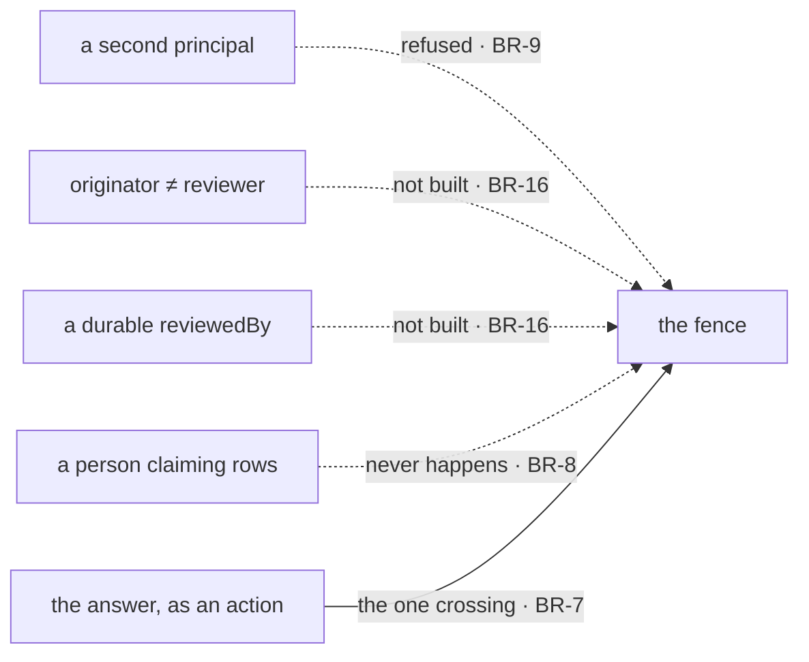

# FIX-1497 · Business rules

[Spec](SPEC.md) · [Decisions](DECISIONS.md) · **Rules** · [Plan](PLAN.md) · [Docs](DOCS.md)

The cases, written as rules. Each says what a person or the system does and what happens. The
*proved by* column is the check the plan runs. **A row that cannot go red is not a proof row**, so
where a leg has a named control it is named here and the plan owes its red state.

## The scenario runs: filed, assigned, drained

| # | When | Then | Proved by |
|---|---|---|---|
| BR-1 | The scenario is loaded | The Markdown tree alone produces three seats, one channel and one ledger, and **no file under the scenario carries the minted ledger id** | Goal · leg 0, a scan of every file |
| BR-2 | The planner seat files | Exactly one row lands, carrying the goal verbatim and an assignee that is a desk key the tree declared. Not one row per channel member | Goal · graded against the input, per row and per piece |
| BR-3 | A seat drains | It claims only rows for the desk **its own `WORKER.md`** answers for, and leaves the other desk's row for the other seat | Goal · control `swapped-desks`, which swaps the app's seat→desk map and leaves the tree alone |
| BR-4 | A claimed row runs | It runs in its own child session on the seat the desk resolves to. **Proved by a side effect outside the board** — the board would report a completion whatever actually happened | Goal · a file the worker body writes, never the board's own report |
| BR-5 | A row is filed for a desk no seat answers for | It is refused by name where it would have run, and settles loudly rather than sitting `pending` in silence | Goal |

## A person is asked, and answers

| # | When | Then | Proved by |
|---|---|---|---|
| BR-6 | The work reaches something only a person can settle | **The seat that owns the row parks it**, with a reason naming what it needs. The drain returns and the row stays parked and durable | Goal · the drain's own termination reason, and the row read back after the drain returned |
| BR-7 | The person answers | Through a **flow action on the owning seat**, carrying the request's own principal. The answer replaces the reason, the row re-queues, and the same seat finishes it | Goal |
| BR-8 | Across the whole run | **Nothing claims a row on a person's behalf.** Every claim in the run belongs to a seat, and the person's only door is the answer action | Goal · asserted on the claiming identity of every claim, not on the absence of a feature |
| BR-9 | An answer is delivered as a different person | It does not land. A session belongs to one user, and nothing in the scenario derives a second | Goal · control `second-principal`. **If the run shows it landing, that is a finding to raise up ([ER-17](../../epics/FIX-1457/BUSINESS-RULES.md#er-17)), never a rule to soften** |
| BR-10 | One park is answered twice | The second delivery is declined and the first answer stands | Goal |
| BR-11 | The seat parks with no reason at all | Every other leg stays green and **the observation leg goes red**. The reason is the thing being proved; the park alone is not | Goal · control `silent-park` |

Inside the box is what BR-6 to BR-11 assert; outside is what BR-16 forbids. One thing crosses the
fence, and it crosses as an action. The mermaid below is the same four outside shapes by name.

## Work changes hands

| # | When | Then | Proved by |
|---|---|---|---|
| BR-12 | A seat finishes a row whose work implies another desk's | It files **a second row** for that desk, on the same board, naming the first | Goal |
| BR-13 | The second row is drained | By the **other seat**, in its own child session. Two rows, two assignees, two seat instances — and the seat that ran each is read from that seat's own file, never from the map that routed it | Goal · control `one-seat`, which points both desks at one seat: every row still runs and still completes, and only this leg moves |
| BR-14 | Anything tries to move a row's assignee | Refused (`immutable-assignee`), and nothing in the run depends on it succeeding | Goal · asserted on the decline, so a later board that permitted it would be caught |

## It is observed in the DevTool

| # | When | Then | Proved by |
|---|---|---|---|
| BR-15 | A person opens the served hire and the seat's Tasks tab | Each seat is its own navigator row addressable by its exact seat id, and the board's rows are there with id, goal, status and assignee | Goal, in a browser, over the shipped `fsdev dev` |
| BR-16 | A row is parked with a reason | **The reason is legible on the row, with no expander opened.** After the answer, the row carries the answer in the same place, because the unpark wrote it | Goal, in a browser. **Depends on [#2032](https://github.com/fixpoint-labs/flow-state-dev/pull/2032), content-complete and unmerged** |
| BR-17 | Both rows are on screen | Two different assignees on one board, and a row links its child session wherever one matched. That is the handoff, seen | Goal, in a browser |
| BR-18 | The inspection is looked at for wrappers | Nothing was written to make it possible: the scenario's whole surface is a Markdown tree plus flow modules handing the hire to the ordinary dev server, and the DevTool is the shipped bundle | Diff gate, plus the POC's catalog read |

## What this proof may not become

| # | When | Then | Proved by |
|---|---|---|---|
| BR-19 | The change is reviewed against the epic's fences | No L1 type, no second work plane, no multi-human machinery, no new substrate, nothing under `packages/` | Diff gate: every changed path inside `goals/` or `specs/issues/FIX-1497/` |
| BR-20 | The proof ships | `TaskStatus` has gained no value — not for *handed-off*, not for *notified*, not for *waiting on you* | Asserted inside the goal on the exported status union, so a later widening fails here |
| BR-21 | The graded run is scheduled | It waits on a live hired Workforce (ER-26, arriving with the epic amendment on [#2033](https://github.com/fixpoint-labs/flow-state-dev/pull/2033) — **not yet on `main`**) — **but not this spec and not its implementation PR**, both of which proceed now | Stated here so the fence is not read wider than it is; the plan sequences the run last |

## Failure taxonomy

**Fatal and loud:** a tree that does not load, a seat that fails to hire, a dev server that does
not start. All refused before anything is graded, because a short roster that still runs proves
something other than what is claimed. **Non-fatal:** a park with no reason degrades to a red
observation leg (BR-11) rather than a crashed run. **Never silent:** a row nobody answers for is
refused by name (BR-5), and a claim that was never made is a failure rather than an empty pass.

## Acceptance criteria this issue owns

One command stands up a real hire, runs the scenario end to end, and leaves a dated verdict row.
On a browser pointed at that hire, **a person who has not read this spec can say which seat was
waiting, what it was waiting for, what it was told, and which other seat picked the work up** —
with no expander opened and no debug flag beyond what `fsdev dev` already sets. Every control
above has been **seen red**; a green check whose controls were never run does not close this issue.
