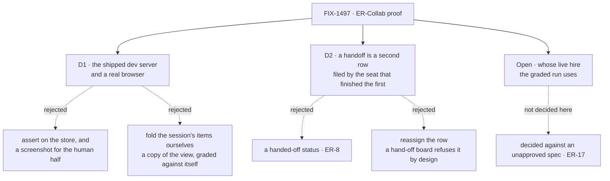

# FIX-1497 · Decisions

[Spec](SPEC.md) · **Decisions** · [Rules](BUSINESS-RULES.md) · [Plan](PLAN.md) · [Docs](DOCS.md)

What was considered, what was chosen, why, and what each locks in. Two decisions are the sign-off
surface, and one question is routed up rather than answered here.

## The tree

Solid edges are what you're signing. The dashed edge off *Open* is the one thing this spec
deliberately does not close.

## D1 · The proof drives the shipped `fsdev dev` and reads the handoff in a real browser

| | |
|---|---|
| **Instead of** | Running headless and asserting the rows in the store, with a screenshot and a human's word for the *"observed in DevTool"* half · or replaying the session and folding its items into a board ourselves |
| **Because** | *Observed in DevTool, with no special wrapper* is a claim about what a person sees, and a store read cannot make it. The repo already grades the shipped bundle in Chromium exactly this way (`goals/flow-instances/devtool-shows-the-selected-copy`), so this reuses a shipped technique instead of inventing an observation surface. Folding the items ourselves is worse than either: the fold is the DevTool's, it is not exported, and a copy of it would be graded against itself |
| **Locks in** | The proof needs a browser and built DevTool assets, so it is out of CI like every goal. And its strength is bounded by the rows it reads: those are [FIX-1481](https://linear.app/fixpoint-labs/issue/FIX-1481)'s, content-complete and **unmerged** |

**What would change my mind:** a DevTool surface that exports its board fold as a supported API.
Then the cheap check grades the real fold without a browser, and the browser leg narrows to the
one thing only a browser can answer — that a person can read it.

## D2 · A handoff is a second row, filed by the seat that finished the first

| | |
|---|---|
| **Instead of** | A `handed-off` value on the task status · or moving a row's assignee from one seat to the other |
| **Because** | A status value for a handoff is a named invent-kill ([ER-8](../../epics/FIX-1457/BUSINESS-RULES.md)), and reassignment is not available to be chosen: a board that hands rows off to seats **freezes** the assignee and declines the write, because the child session a row was dispatched into is keyed the moment it is dispatched. What is left is what the board already does — one seat finishes its row and files the next one for another desk |
| **Locks in** | *Handed over* means two rows on one board with two assignees, for this proof and for anything that cites it. A later notify-based compose ([FIX-1474](https://linear.app/fixpoint-labs/issue/FIX-1474)) has to be shown to produce the same observable, rather than quietly replacing the definition |

Inside the box is [ER-1](../../epics/FIX-1457/BUSINESS-RULES.md); outside is
[ER-22](../../epics/FIX-1457/BUSINESS-RULES.md). One thing crosses, and it crosses as an action.
The same four shapes are in [BUSINESS-RULES.md](BUSINESS-RULES.md) as rules with red states.

## Decided, not asked

- **The human leg's shape is not a fork.** ER-1 and [D7](../../epics/FIX-1457/DECISIONS.md#d7)
  already fix it: the seat that owns the row parks it, and the person answers through a flow
  action carrying the request's own principal. This spec obeys it and exercises it.
- **Ordering against FIX-1481 is soft.** Authoring and building this issue need neither code PR
  merged; only the *graded run* needs them, and the run is already fenced until a live hire exists
  (ER-26, which is **not yet on `main`** — it arrives with the epic amendment on
  [#2033](https://github.com/fixpoint-labs/flow-state-dev/pull/2033), still a draft). Recorded so
  nobody reads the spec as blocked.
- **The acceptance names the board by its local name**, and asserts the minted ledger id appears
  in no file under the scenario. The Architect left this open leaning yes; board v1's whole point
  is that a file says a name and the framework owns the identity.
- **One channel, not two.** The bar is ≥1. A second channel adds no claim and one more thing to
  keep in step.
- **The board hands rows off to the seats' task entries** rather than running inline workers, so
  an assignee genuinely routes *to a seat* instead of naming the worker itself.
- **Model-free.** A row is filed or it is not; a seat claims it or it does not; a reason is on the
  screen or it is not. A model in the loop adds a way to fail that has nothing to do with the claim.

## Considered and dropped

| Alternative | Why not |
|---|---|
| Extend `manager-queue-lab` with a handoff leg | It has a green verdict log and two published claims. A proof that edits its own evidence is worse than a sibling that leaves it alone |
| Prove the handoff from the board's own report | The board reports what it did on the path under test. Execution has to be shown by something outside it |
| A screenshot plus a human's sign-off, as the whole observation leg | Not repeatable, not falsifiable, and worth nothing as a regression record a year out |
| An org-level board view so both rows sit on one screen | Boards are session-scoped today, and widening that is [FIX-1320](https://linear.app/fixpoint-labs/issue/FIX-1320)'s. Reaching for it here would be new substrate under a QA label ([ER-25](../../epics/FIX-1457/BUSINESS-RULES.md)) |
| Require [FIX-1474](https://linear.app/fixpoint-labs/issue/FIX-1474)'s composed notify-plus-file path | Its own body keeps this gate on today's separate paths, and says it is not an ER-Collab gate |

## Open

One, and it belongs a level up.

### The graded run: share the DevForce proof's workforce, or give this one its own?

**Plain terms.** The release needs two demonstrations. One shows a hired team building something
real. This one shows two workers sharing a queue, handing work between them, and a person
answering a question one of them raises — where you can watch it happen. Both need a real hired
team standing up. We can run this second demonstration inside the first one's setup, or give it
its own small one.

**The trade-off.** Sharing means one team to maintain and one place to point people at. But the
first demonstration is deliberately built so that **only one worker ever receives a job** — that
is how it proves work went to the worker it was addressed to, and it has a check that goes red if
a second one is given work. Making the same setup also carry two collaborating workers changes
what that demonstration proves, and the change would have to be made on purpose and re-approved.
Separate setups mean two small teams described in Markdown, in the same folder, and two places to
update the day hiring changes shape.

**My recommendation: give this one its own.** The first demonstration is at your gate right now
and not yet approved, so binding this one to choices that may still move means re-cutting this one
when they do. The two are also asking different questions, and the cheapest way to keep each
answer clean is to let each fail on its own terms. If we later want one demo to point at, merging
two small file trees is an afternoon; unpicking a shared one that lost its sharpness is not.

**What would change my mind:** if you want exactly one thing people are shown for this release —
one team, one run, one demonstration to point at. Then we share, and I would want the first
demonstration's one-worker rule relaxed deliberately and re-gated, not worked around.

**Cost of being wrong: low, and it surfaces immediately.** Both live in the same folder and are a
few hundred lines each. The expensive mistake is the other direction — bending the first
demonstration to fit this one and costing it the thing it exists to prove.

## How it got here

- **Draft** — the scenario shaped as one board, two desk keys and three seats, with the human leg
  on the park-and-answer path the epic already ratified. The one premise the acceptance rests on
  was run rather than argued: the shipped dev server registers a file-declared hire, three seats
  and the channel singleton, with the channel's own four doors
  ([the POC](poc/served-hire-observable/README.md)). Both of its controls were seen red.
- **A stall the POC hit was isolated rather than disclosed**, because two controls pointing away
  from the change under test is the shape of a substrate defect. It is environmental:
  `FSDEV_DEFAULT_MODEL` set with no declared intent makes the model resolver throw, and the served
  path swallows it into a request that never advances. Stripped, the same server settles in 0 ms,
  so **[D1](#d1) stands**. The *silent* shape of that failure is raised up
  ([ER-17](../../epics/FIX-1457/BUSINESS-RULES.md#er-17)), not worked around — it is a follow-up in
  [PLAN.md](PLAN.md), and the EM owns whether it is filed.
