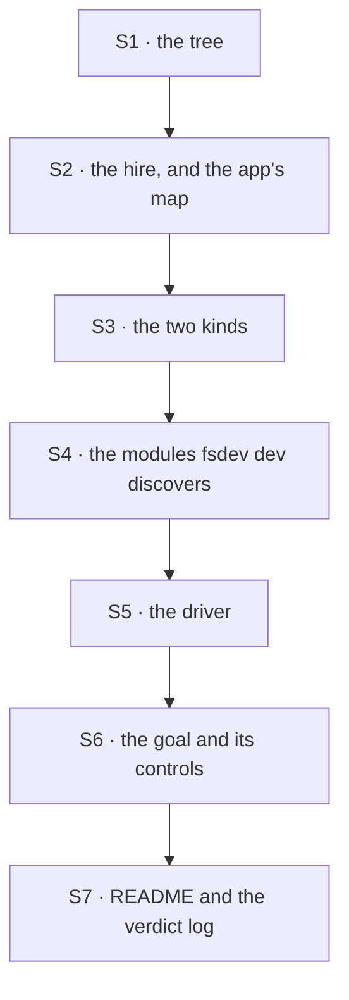

# FIX-1497 · Plan

[Spec](SPEC.md) · [Decisions](DECISIONS.md) · [Rules](BUSINESS-RULES.md) · **Plan** · [Docs](DOCS.md)

Written for the implementing agent. IDs cross-reference [BUSINESS-RULES.md](BUSINESS-RULES.md)
(BR-n) and [DECISIONS.md](DECISIONS.md) (D-n). `tdd`. One PR.

**The run is fenced; the build is not.** ER-26 holds the *graded run* until
[FIX-1496](https://linear.app/fixpoint-labs/issue/FIX-1496) stands up a live hired Workforce. It
does not hold this spec and it does not hold this PR — build S1 to S7 now, and run VG last
(BR-21). **ER-26 is not on `main`**: it arrives with the epic amendment on
[#2033](https://github.com/fixpoint-labs/flow-state-dev/pull/2033), which is still a draft. Read it
there, and re-point this link at `BUSINESS-RULES.md#er-26` once that merges.

## Surfaces

| ID | Package · role | Change | Rules |
|---|---|---|---|
| S1 | `goals/multi-seat-collab/lab/workforce/` · the tree | One team, one `CHANNEL.md` declaring `boards: [work]` and three members, three `WORKER.md` files naming two kinds and two desk keys. **No ledger id anywhere.** Start from the POC's tree — it loads and hires | BR-1 |
| S2 | `goals/multi-seat-collab/lab/host.mts` · the hire | Read the tree, build the kinds, hire, hand back handles. The **seat → desk map is the app's**, supplied by the caller, never read off the tree — that is what lets `swapped-desks` go red | BR-3 BR-13 |
| S3 | `goals/multi-seat-collab/lab/` · the two kinds | `planner`: one dispatcher into the channel's own `fileTask`; no board, no drain. `worker`: the channel's board with a desk-narrowed claim, a same-flow dispatcher per desk into its task entry, `onReview: "exit"`, a `drain` action and an `answer` action on the board's unpark-and-drain step | BR-2 BR-4 BR-5 BR-6 BR-7 BR-12 |
| S4 | `goals/multi-seat-collab/lab/flows/` · what `fsdev dev` discovers | One module per registered instance, each default-exporting one hired seat or the channel kind from the shared host. This is the whole of *serving* the hire — there is no app and no wrapper (D1, BR-18) | BR-15 BR-18 |
| S5 | `goals/multi-seat-collab/lab/run-scenario.mts` · the driver | Spawn the shipped `fsdev dev` against S4, open the channel through `openChannels` over the HTTP session door, then file → drain → answer → drain, and report raw observations. One place, so the headless legs and the browser leg drive the same run | BR-2 BR-6 BR-7 BR-10 |
| S6 | `goals/multi-seat-collab/it-hands-a-row-between-two-seats-in-view/` · **the goal** | `run.mts`, `goal.md` (outcome · input · signal · anti-game · controls · verdict log), and the browser leg in Chromium against the shipped bundle, following `goals/flow-instances/devtool-shows-the-selected-copy` | all |
| S7 | `goals/multi-seat-collab/lab/README.md` and the verdict log | What the lab owns and what it works around; then run the proof and append **one** dated row per run. Appending only | — |

**Nothing is removed.** Named because tenet 3 expects the question asked: `channel-boards` and
`manager-queue-lab` keep their trees, their claims and their verdict logs untouched.

## Sequence



One PR. The chain is linear because every later surface drives the earlier one; there is no seam
worth splitting.

## Checks

| ID | Runs after | Passes when |
|---|---|---|
| V0 | S1 | BR-1. Every file under the scenario is read and searched for the minted ledger id; a hit fails. **This is the leg that makes the rest mean something** |
| V1 | S5 | BR-2, BR-5. One row per piece **in both directions** — one row carries one piece, one piece is carried by one row — and a row filed for an undeclared desk settles loudly where it would have run |
| V2 | S5 | BR-3, BR-4. Each row ran on the seat whose **own file** answers for its desk, proved by a file on disk. Control `swapped-desks` must fail here and nowhere else |
| V3 | S5 | BR-6, BR-7, BR-10. The drain returns with the row still parked and durable; the answer lands through the seat's action and the same seat finishes the row; a second delivery declines |
| V4 | S5 | BR-8, BR-9. Every claim in the run belongs to a seat; control `second-principal` must not land. **Assert on the claim records, not on the absence of a feature** |
| V5 | S5 | BR-12, BR-13, BR-14. Two rows, two assignees, two seat instances, the second naming the first. Control `one-seat` must fail here only — every row still runs and still completes under it |
| V6 | S6 | BR-20. The exported `TaskStatus` union equals a written-out list, so a later widening fails here rather than passing quietly |
| VB | S6 | BR-15, BR-16, BR-17. In Chromium against the shipped bundle: each seat is its own navigator row by its exact seat id; the Tasks tab shows the board; the reason is on the row with nothing expanded, then the answer in its place; two assignees on one board. Control `silent-park` must fail **here only** |
| VG | S7 | **The goal.** One command: two seats work one channel's board, a person answers a parked row through a flow action, work changes hands, and a reader can say what happened from the screen. `goals/multi-seat-collab/it-hands-a-row-between-two-seats-in-view/run.mts` |
| V7 | S7 | BR-19. Diff gate, derived from `git diff` against the merge base: every changed path inside `goals/` or `specs/issues/FIX-1497/`. Nothing under `packages/` |

**Every control must be seen red, and must fail at the leg it names.** Each run ends by checking
that the failures it collected belong to its own control — a control that goes red somewhere else
has demonstrated a different check. Record each as a `FAIL (expected)` row in the verdict log with
what it printed, the way the sibling labs do.

## Pinned names · four, and only four

| Where | Name | Why pinned |
|---|---|---|
| The goal | `goals/multi-seat-collab/it-hands-a-row-between-two-seats-in-view/` | Public: it is the command a person runs, and the epic's proof cites it |
| The board | `work`, declared in `CHANNEL.md` | The acceptance names the board by its **local name** and asserts the mint appears in no file |
| The desks | `build`, `review` | They must be spelled unlike any seat id, or a check that conflated a routing key with a seat could pass (ER-7) |
| The person's door | one action per worker seat, over the board's unpark-and-drain step | ER-1: the person answers through a flow action on the **owning** seat |

Everything else — module layout, helper names, the worker body — is yours.

## Guardrails

| Rule | Because |
|---|---|
| Grade the seat that ran a row against **that seat's own file**, never against the host's map | Grading the map against itself puts the tree on both sides and the leg cannot fail however badly the row was routed. `manager-queue-lab`'s own README names this as the defect it shipped and fixed |
| Prove execution by a side effect **outside** the board | The board's report is generated on the path under test, and it reports a completion whatever actually ran |
| Read the board's name, the members and the desks off the tree at run time | Agreeing with a string in the check is not a route to green (BP-003) |
| Never reach for an org-level board view to get both rows on one screen | Boards are session-scoped and widening that is FIX-1320's. New substrate under a QA label is [ER-25](../../epics/FIX-1457/BUSINESS-RULES.md) |
| Never edit the DevTool to make a row pass | *No special wrapper* is the point of the proof. A row that needs rendering that does not exist is a dependency to name, not a diff to write |
| Keep every changed path inside `goals/` and this spec folder | [ER-25](../../epics/FIX-1457/BUSINESS-RULES.md) and BR-19; also what makes V7 a real gate |
| Spawn the dev server with the intent overrides stripped — `goals/lib/env`'s `intentFreeEnv`, exactly as every other goal does | `FSDEV_DEFAULT_MODEL` set while no flow declares an intent makes `createModelResolver` throw, and on the served path that throw becomes a request that never advances and never errors. Inherit them and the run measures the machine |

## Docs

Publish [DOCS.md](DOCS.md) after VG passes. No new page and no changeset — `goals/` is private and
nothing downstream of a published package changes (BP-022).

## Sketch · pseudocode, illustrative, react to the shape

```
planner.file(goal, desk)      → dispatch into the channel's own fileTask
worker.drain()                → claim, narrowed to this seat's desk; hand off per-task
  the row's work:
     if it needs a person:     park it, with the question as the reason
     else:                     do it, and file the next row for the other desk
worker.answer(taskId, text)   → unpark with the answer, then drain, in the answering request
```

**POC:** [`poc/served-hire-observable/`](poc/served-hire-observable/README.md), cited from the spec
PR. It showed the premise holds — the shipped `fsdev dev` registers a file-declared hire as three
ordinary seat copies plus the channel singleton with its four doors, so the DevTool has something
to open and no wrapper is needed. Both of its controls were run red. **It grades registration
only, deliberately**: driving the scenario is V1–VG's job, not a registration probe's.

**One thing it had to settle on the way, and did.** Every action on the served path appeared to
stall at `in_progress` — including on a shipped goal fixture and on a three-line control flow. It
is environmental and the variable is named: `FSDEV_DEFAULT_MODEL` set while no flow declares an
intent makes `createModelResolver` throw, and the served path swallows that into a request that
never advances. Strip the overrides and the same server settles in 0 ms. The A/B is in the POC's
README; the guardrail above is what keeps it out of your run.

## At implement time

- **If an action never advances past `in_progress`, it is the environment, and it is named.**
  `FSDEV_DEFAULT_MODEL` set while no flow declares an intent makes `createModelResolver` throw,
  and the served path swallows it. The guardrail above is the fix; the POC's README has the A/B.
  Confirm with `goals/flow-instances/devtool-shows-the-selected-copy` before suspecting anything
  in this scenario.
- **If the [Open fork](DECISIONS.md#open) came back *share*,** re-cut S1–S4 onto
  `goals/devforce-lab` and keep every check. Its one-worker rule has to be relaxed deliberately
  and re-gated first — do not work around it.
- **[FIX-1496](https://linear.app/fixpoint-labs/issue/FIX-1496) may have reshaped that lab.**
  Nothing here depends on which artifact it picks, only on a live hire existing.
- **[#2032](https://github.com/fixpoint-labs/flow-state-dev/pull/2032) may still be unmerged.**
  Then BR-16's browser leg cannot pass on `main`. Run it against that branch's head and record
  which head it ran on, or hold the row and say so in the verdict log. Never make it pass by
  editing the view.
- **BR-9 is asserted, not yet observed.** If a second principal's answer does land, that is a
  finding to comment up ([ER-17](../../epics/FIX-1457/BUSINESS-RULES.md#er-17)), not a rule to soften.

## Follow-ups

- The DevTool's board fold is not exported, so the cheap half of the observation needs a browser
  ([D1](DECISIONS.md#d1)'s *what would change my mind*). File it if the browser leg proves
  expensive to keep green.
- **A model-resolver throw on the served path surfaces as a request that never advances and never
  errors** — on a flow with no generator in it. Observed, not diagnosed; the POC's README carries
  the A/B. Raised up rather than worked around
  ([ER-17](../../epics/FIX-1457/BUSINESS-RULES.md#er-17)); the EM owns whether it is filed.
