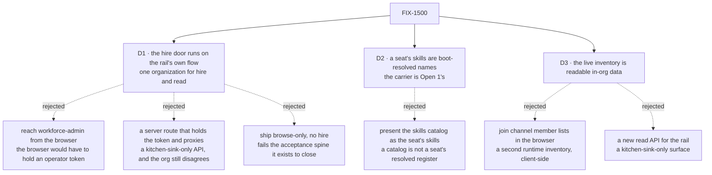

# FIX-1500 · Decisions

[Spec](SPEC.md) · **Decisions** · [Rules](BUSINESS-RULES.md) · [Plan](PLAN.md) · [Docs](DOCS.md) · [Evolution](EVOLUTION.md)

What was considered, what was chosen, and what each locks in. Three decisions are the sign-off
surface. The issue's Architect fences are locked input and are not reopened here: one navigator
and depth from cardinality ([epic D8](../../epics/FIX-1455/DECISIONS.md#d8)), the organization
from the principal or the default-org framework path and never from a body, the shared hire and
persistence path from [FIX-1475](https://linear.app/fixpoint-labs/issue/FIX-1475), and the
registered-kind / named-instance split from
[FIX-1476](https://linear.app/fixpoint-labs/issue/FIX-1476).

## The tree

Solid edges are what you are signing. Dashed edges lost, and the label says why.

## D1 · The rail's hire door is an action on the flow the rail's own session already runs on

| | |
|---|---|
| **Instead of** | The operator's credentialed flow reached from the browser · a server route proxying it · browse-only, no hire ([what each cost](#considered-and-dropped)) |
| **Because** | The acceptance spine requires one run in which a person hires and then *sees the result in the same surface*. That is only true when the hire and the read resolve their organization the same way. An action on the rail's own flow does exactly that: the session's organization is `ctx.principal?.orgId ?? DEFAULT_ORG_ID` and `body.orgId` is never consulted (`packages/engine/src/routes/session-routes.ts:277`, `:285`), so the two cannot disagree by construction rather than by care. The rejected shapes each break one half — a token in the browser hands an operator credential to every visitor, a server proxy is an app-local API the invent-kill list names *and* still hires into the token's organization while the rail reads the default one, and browse-only fails steps 3 to 5 of the spine outright |
| **Locks in** | In a deployment that authenticates nobody, the app can hire. That is the same posture every other action in such a deployment already has — `chat-agent` declares no `authentication` block, so nothing there authenticates anybody today — but hire is the first one that writes durable organization state, and that is a step rather than a restatement. Reversing this later does not just move code: it removes the only way the Goal 1 run is demonstrable, until identity ships |

**What would change my mind:** kitchen-sink being positioned as deployable rather than as a
reference people read and copy. The moment somebody is expected to run it facing the internet,
this door belongs behind [FIX-1503](https://linear.app/fixpoint-labs/issue/FIX-1503)'s identity
and the Goal 1 run waits for it. Today the app ships with `userId` a caller-side constant
(`apps/kitchen-sink/app/page.tsx:95`), which is the same statement about what it is for.

**What this is not.** It is not a second hire path. The stored contract — the roster collection,
`create()` as the duplicate refusal, register-after-write, the compensating delete — stays exactly
[FIX-1475](https://linear.app/fixpoint-labs/issue/FIX-1475)'s, and the way this issue keeps it
exactly one contract is by giving it **one home**: the sequence moves out of the operator flow's
handler into the `workforce` package, and both doors call it. Today that sequence exists at
precisely one site, verified rather than assumed
([`poc/evidence/`](poc/evidence/README.md) → C2), which is what makes extraction a move rather
than a merge. Two doors over two copies of an invariant is the defect class this repository keeps
paying for (tenet 5); two doors over one is ordinary.

## D2 · A seat's skills are the names its own folders resolved at boot

| | |
|---|---|
| **Instead of** | The live skills catalog, presented as the seat's skills ([why it loses](#considered-and-dropped)) |
| **Because** | The register a seat actually holds is `org/skills ∪ teams/<id>/skills ∪ worker-local`, computed by `readSeatSkills` and imposed as the `seatSkills` key of the `WorkerConfig` admission bag ([FIX-1367](https://linear.app/fixpoint-labs/issue/FIX-1367)). That is a boot-time answer and there is no honest way to make it a live one, because the loader is Node-only and reads folders. Publishing the names beside the seat's identity shows the register itself rather than a catalog standing in for it, which is the distinction the Architect's fence draws. **Where they are published is [Open 1](#open)'s** |
| **Locks in** | The rail's skills view is as fresh as the last boot. A skill added to a folder while the app is running does not appear until it restarts, and that is a promise we are making rather than a bug somebody will file. It also means **whatever carrier [Open 1](#open) picks** holds something derived from a seat's configuration, so a future change to how a seat resolves skills gains a second reader |

**What D2 decides, and what it does not.** It decides *what* a seat's skills are — the resolved
register, as names — and *how fresh* they are: boot-fresh. It does **not** decide where they are
published. That carrier is [Open 1](#open)'s, and no surface in this issue writes one today.

**Names, not contents.** What a skill *does* is not published here. This is visibility and
navigation, not a skills product, and the fence is explicit that catalog-only visibility is not
the proof — the resolved register is.

**What would change my mind:** the skills register becoming a runtime-writable surface for seats
rather than a boot-time resolution. Then a seat's skills have a live home, and whatever carrier
Open 1 picks should point at it rather than copy from it.

## D3 · The live inventory becomes ordinary readable in-organization data

| | |
|---|---|
| **Instead of** | A browser-side filter over every channel's `members` · a read API of the rail's own ([what each cost](#considered-and-dropped)) |
| **Because** | The product owner's rule, already given and already applied once: *a user can see all workers within their org, unless they are user-scoped as a resource* ([FIX-1477 D4](../FIX-1477/DECISIONS.md#d4)). All three inventory collections declare `scope: "org"`, so they qualify on exactly the axis that rule names. The browser filter is the invent-kill list's *"client-side joins that become a second runtime inventory"* spelled out — and it is also strictly worse, because the membership index is keyed `<seatId>/<channelId>` precisely so a seat's channels are a `topicPrefix` read at the source rather than a scan (BP-033). A new read API is the *"kitchen-sink-only APIs"* kill |
| **Locks in** | Three more collections that any session in an organization whose flow installs them can list. The permission belongs to the collection, not to the panel, so flows this issue never touches gain the read too. Each therefore ships with an `expose` allowlist rather than bare — a bare opt-in republishes the stored row unchanged, and taking a published field back later breaks whatever started reading it |

**What would change my mind:** an inventory row gaining something a member of the organization
should not see. The rule would not change; that field would be withheld from the allowlist, and
if it could not be, the collection would come off the list.

## Decided, not asked

- **The rail refreshes its roster by a specified, checked remount, not by a new public API on the
  panel.** `RosterProps` carries no refresh, ref or version, so the alternative is not *use the
  existing API* — it is **adding one**, on a package other consumers hold, for a single caller. A
  remount is already the host's to do and costs no published surface. **The promotion rule is
  written down rather than left to taste: a second consumer needing the same trigger makes it a
  contract, and then the public API is right.** Engineering call, taken by review; recorded here
  rather than as a card because the owner weighs outcomes, not this.
- **Fire is not in the rail.** The spine asks to hire another instance and observe it; removing a
  seat is not in it. `workforce-admin` keeps `fire`, and the extracted helper carries both halves
  so a later issue adding it to the rail writes no new sequence. Smaller is the conservative
  direction here (tenet 3).
- **The hire's refresh is not a subscription** — it is [D4](#d4)'s remount.
  Cross-session liveness is [FIX-1506](https://linear.app/fixpoint-labs/issue/FIX-1506)'s, and
  designing against a seam that delivers only the writer's own changes would be designing against
  a seam that does not exist.
- **A board's ledger id stays `<channelId>.<boardName>`, minted by the workforce package** — the
  UI never re-derives that join. That is all this bullet decides: where a board *name* comes from
  is [Open 1](#open)'s.
- **The seat detail is a `react` component, not kitchen-sink code.** Everything else the rail
  renders ships from the package ([FIX-1477 D1](../FIX-1477/DECISIONS.md#d1)); a seat detail built
  in the app is the fork that decision exists to prevent.
- **If a browse carrier ever holds hired seats, one writer holds it.** Two writers over one row
  shape is the drift a shared writer exists to prevent. The rule applies to whatever
  [Open 1](#open) lands; it does not name a carrier, and the seat inventory row is not one —
  FIX-1475's BR-35 forbids it ([the clash](EVOLUTION.md#br35-conflict)).

## Considered and dropped

**The one catalog.** Every rejected shape is priced here and nowhere else; the tree shows *that*
they lost and each card's *Instead of* names them, so neither restates the reasoning.

| Alternative | Why not |
|---|---|
| Put the hire affordance behind the operator credential and have the *browser* send it | Hands an operator token to every visitor. Ruled out before it was priced |
| A kitchen-sink server route holding the token and proxying the hire | An app-local API the invent-kill list names, and it does not even work: the hire lands in the token's organization while the rail reads the default one, which is the empty-panel failure with an extra layer |
| Widen `workforce-admin` to register unconditionally when no credential is set | Its resolver would be absent, so the stock body-reading resolver applies and `orgId` becomes caller-supplied — the *"caller-selected `orgId` without principal authorization"* kill, and a reversal of FIX-1475's deliberate fail-closed choice rather than an addition beside it |
| A public `refresh` or version prop on `Roster` | Published API on a package other consumers hold, added for one caller, and not withdrawable. A remount costs nothing and is the host's to do ([D4](#d4)). Right the moment a **second** consumer needs the trigger |
| Show skills by listing the org skills collection | Shows the org's catalog, not the seat's register. Two seats on different teams would read identically, which is the thing a seat view exists to distinguish |
| Derive a seat's channels by reading every channel row and filtering `members` in React | A second runtime inventory, client-side, and it lists-then-discards where a prefix read exists |
| Hold the spine open until [FIX-1503](https://linear.app/fixpoint-labs/issue/FIX-1503) ships identity | FIX-1503's own *Out* section rules out hard-blocking kitchen-sink, and the issue's fences name hard-blocking on soft-related cleanups as an invent-kill. The limit is written down instead |

## Settled

Three claims this design rests on, settled by execution at authoring time rather than argued.
Verdicts here; what each asserts, how, and what it corrected is in
[`poc/evidence/README.md`](poc/evidence/README.md).

| Claim | Verdict | Why it mattered |
|---|---|---|
| The durable-hire sequence exists at exactly one site (C2) | **CONFIRMED** | [D1](#d1)'s extraction is a *move*, not a reconciliation of two already-drifted copies |
| No collection in `packages/workforce/src` serves the live inventory to a browser (C1) | **CONFIRMED**, as a totality over all six definitions, with a planted seventh as the negative control | [D3](#d3) is opening something genuinely closed, and the delta it owes is exactly three |
| A default deployment registers no hire door at all (C3) | **CONFIRMED** | [D1](#d1)'s rejected *"ship browse-only"* option does not quietly still work in a clean clone |

## How it got here

- **Draft** — framed as the one run that crosses the pieces rather than as four features beside
  each other; the organization-disagreement that made FIX-1477's panels render empty was treated
  as the thing to make unreachable rather than as a limit to restate, which is what put the hire
  door on the rail's own flow; the seat detail assembled from four existing sources with no new
  storage beyond one field and three read declarations.
- **Review round 1** — no decision moved; the direction was approved as drafted. One check was
  **removed**: the plan had made the authoring-time evidence checker a permanent gate, and a spec
  directory is retained design history rather than a home for live CI machinery (BP-037). The
  stated read fan-out was **corrected** — the sketch reads a channel's state per channel, so it is
  three reads plus the seat's channels, not a flat four. A reuse index was added naming the
  helpers this work must compose rather than re-derive. The four-PR plan was challenged and
  **kept**: attributability beats throughput on an epic whose defect history is unattributable
  failures.
- **Review round 2** — no decision moved; approved again. Editorial only: the struck V15 row left
  the live checks table for [EVOLUTION.md](EVOLUTION.md#v15), the rejected shapes were consolidated
  so *Considered and dropped* is their one catalog, and VG was made to say which of the two seats
  it opens is file-declared — a reviewer read that coverage as inferred, and an implementer writing
  the fixture hired-seat-first would have lost the declared path silently.
- **Review round 3** — no decision moved; approved again, with three real corrections rather than
  polish. The evidence checker's header **claimed a negative control for all three checks and had
  one**, which is a falsifiability claim that was itself never checked, inside the artifact built
  to stop exactly that ([EVOLUTION.md](EVOLUTION.md#unchecked-falsifiability)). C2's predicate was
  **aimed at a neighbour of its claim** — any `.create(` co-occurring with the registrar's name —
  and is now anchored on the roster and on proximity, with the written claim narrowed to match.
  And S7's *"organization from `ctx.org`"* was **ambiguous in the dangerous direction**: the
  operator flow's credential-derived org is also "not the body" and is the wrong source, so S7 now
  names the session's own binding and the reuse index carries it as a guardrail.
- **Review round 4** — the first material rework. Automated review found that **three of the four
  sources the seat detail was drawn from do not exist**: skills live in flow config, the live
  inventory is never opened in this app, and a channel's declared boards are in an action's
  **output** schema rather than in its session state, which this spec had cited wrongly. The
  design's hire half is untouched; its browse half became [Open 1](#open). Two mechanisms were
  also found missing rather than merely unspecified — a public panel refresh and a restartable
  test harness — and a **conflict with an approved spec** was raised rather than settled
  ([BR-35](EVOLUTION.md#br35-conflict)).
- **Review round 5** — no decision moved; a coherence pass scrubbed passages still asserting the
  mechanisms round 4 had withdrawn, and closed the refresh fork as [D4](#d4). The transferable
  lesson is in [EVOLUTION.md](EVOLUTION.md#retraction-sweep).

## Open

**One fork.** It changes what this issue delivers, so it is not the implementer's to settle and a
reviewer agreeing with a recommendation does not close it. (The refresh question that sat here is
now [D4](#d4).)

### Open 1 · A seat's skills, channels and boards have no browser-readable source. What builds one?

**In plain terms.** The issue asks that opening a seat shows its kind, its skills, the channels
it is in and those channels' boards. Only the kind has a path to a browser today. The other three
are real data the app already computes — it just never publishes any of it.

**The trade-off.** The live inventory is the framework's designed answer and would serve channels
directly, but this app never opens one, and the spec that last looked at this said standing one
up is *"a surface, not a line"*. Building less means the seat detail shows less than the issue
asks for.

**The candidates**, none picked:

| | What it is | What it costs |
|---|---|---|
| **A** | Stand up the live inventory in kitchen-sink — call `openInventory` at boot, declare its three collections on the rail's flow | The largest. Needs a seat-writer flow and a boot door. Also runs into the [BR-35 clash](EVOLUTION.md#br35-conflict) for hired seats, and still answers **no** for board names |
| **B** | One purpose-built org-scoped read model, **written server-side** by the boot and the hire: per seat, its kind, skills, channels and boards | Smaller, and answers all three at once. The invent-kill names ***client-side*** joins, so a server-written projection is not that kill by default — but it is near-miss substrate and **carries four fences into whatever issue files it**: a projection is **not** an inventory · exactly **one writer** · **fire updates or deletes the projection** · it must **not** become a second hire/fire store. The fire clause is load-bearing: without it a browser-readable projection recreates [BR-35](EVOLUTION.md#br35-conflict)'s failure exactly, as a fired seat still advertised live |
| **C** | Ship the seat detail with what has a source — kind and instructions — and move skills, channels and boards to a follow-up | Cheapest and keeps the spine's hire-and-observe steps intact. It does **not** deliver the issue's desired outcome 2 |

**My recommendation: C for this issue, with B filed as the follow-up that completes it.** The
acceptance spine's load-bearing half — enter, hire, observe, restart, still there — closes under
C, and that is the half no other child proves. Outcome 2 is real but it is a *browsing* feature,
and buying it here means either standing up a surface FIX-1475 already priced as out of scope, or
inventing a read model beside the inventory while an invent-kill points at exactly that shape.

**What would change my mind:** the Architect reading B as ordinary composition rather than as a
second inventory. Then B is one collection for three answers and is clearly better than deferring.

**What being wrong costs:** under C, Goal 1 acceptance demonstrates a thinner seat view than the
issue's text promises, and somebody has to agree that is still Goal 1. Under B, we ship substrate
that a later inventory rollout may duplicate.

### Input on these forks, from review — not an answer to them

The FSD Architect read both, on the record and **explicitly not as owner approval**
([thread](https://github.com/fixpoint-labs/flow-state-dev/pull/2061#issuecomment-5782491000)):
**C**, matching the recommendation above. Its read on **B** — that a server-written projection is
not the invent-kill by default, and the four fences that keep it from becoming one — is folded
into B's row in the table, so whoever picks B inherits them rather than finding them in a review
thread. It also said: **do not pick A while BR-35 stands** without an owner re-gate.

**Open: one — Open 1.** No decision card is open, and D1–D3 are unchanged in substance by the
rework; D2's carrier and D3's timing move with Open 1's answer. A reviewer agreeing with a
recommendation does not close a fork that changes what the issue delivers; that is the owner's.
