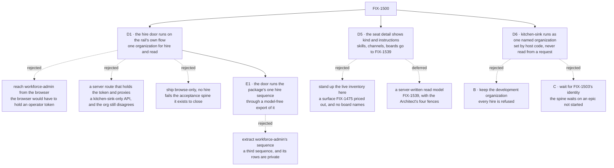

# FIX-1500 · Decisions

[Spec](SPEC.md) · **Decisions** · [Rules](BUSINESS-RULES.md) · [Plan](PLAN.md) · [Docs](DOCS.md) · [Evolution](EVOLUTION.md)

What was considered, what was chosen, and what each locks in. Three decisions are the product
owner's: the hire door ([D1](#d1)), the scope ([D5](#d5)), and the one organization kitchen-sink
runs as ([D6](#d6)). A fourth, [H1](#h1), is the owner's too: a store written before PR-B is
wiped, not upgraded. The rest are engineering calls,
recorded under [Decided, not asked](#decided-not-asked). The issue's Architect fences are locked
input and are not reopened here: one navigator and depth from cardinality
([epic D8](../../epics/FIX-1455/DECISIONS.md#d8)), the organization from the principal or the
default-org framework path and never from a body (D6 takes the principal path), the shared hire and persistence path from
[FIX-1475](https://linear.app/fixpoint-labs/issue/FIX-1475), and the registered-kind /
named-instance split from [FIX-1476](https://linear.app/fixpoint-labs/issue/FIX-1476).

## The tree

Solid edges are what is decided. Dashed edges lost or were deferred, and the label says why.

## D1 · The rail's hire door is an action on the flow the rail's own session already runs on

| | |
|---|---|
| **Instead of** | The operator's credentialed flow reached from the browser · a server route proxying it · browse-only, no hire ([what each cost](#considered-and-dropped)) |
| **Because** | The acceptance spine requires one run in which a person hires and then *sees the result in the same surface*. That is only true when the hire and the read resolve their organization the same way. An action on the rail's own flow does exactly that: the session's organization is `ctx.principal?.orgId ?? DEFAULT_ORG_ID` and `body.orgId` is never consulted (`packages/engine/src/routes/session-routes.ts:300`), and the hire sequence takes its organization from `ctx.org`, which the engine builds from that same session binding and refuses to run under any other ([Settled](#settled)). In kitchen-sink that principal is [D6](#d6)'s one named organization. So the two cannot disagree by construction rather than by care. The rejected shapes each break one half — a token in the browser hands an operator credential to every visitor, a server proxy is an app-local API the invent-kill list names *and* still hires into the token's organization while the rail reads its own session's, and browse-only fails steps 3 to 5 of the spine outright |
| **Locks in** | **An anonymous visitor to a kitchen-sink deployment can hire seats into its one named organization** through this door, and — through mara ([FIX-1527](https://linear.app/fixpoint-labs/issue/FIX-1527)) — hire and fire them. That holds only under [D6](#d6): with no resolver the app runs under the framework's development organization, whose name is not a legal seat address, and **every hire is refused**. Hire is the first action in the app that writes durable organization state, so this is a step rather than a restatement of the app's posture. Reversing it later does not just move code: it removes the only way the Goal 1 run is demonstrable, until identity ships |

**What would change my mind:** kitchen-sink being positioned as deployable rather than as a
reference people read and copy. The moment somebody is expected to run it facing the internet,
this door belongs behind [FIX-1503](https://linear.app/fixpoint-labs/issue/FIX-1503)'s identity
and the Goal 1 run waits for it. [D6](#d6) rests on the same trigger. Today the app ships with `userId` a caller-side constant
(`apps/kitchen-sink/app/page.tsx:95`), which is the same statement about what it is for.

**What this is not.** It is not a second hire path. The rail's action runs the sequence the
`workforce` package already owns — the one behind `createSeatHireCapability`'s `hire` tool
([FIX-1525](https://linear.app/fixpoint-labs/issue/FIX-1525)) — through a model-free export of
it ([E1](#e1)). The stored contract stays [FIX-1475](https://linear.app/fixpoint-labs/issue/FIX-1475)'s:
the roster collection, `create()` as the duplicate refusal, register-after-write, the
compensating delete. Two doors over one sequence is ordinary; two doors over two copies of an
invariant is the defect class this repository keeps paying for (tenet 5).

## D5 · The seat detail ships kind and instructions; skills, channels and boards move to FIX-1539

**Decided by the product owner, 2026-09-23**, choosing candidate C of the fork this spec left
open.

| | |
|---|---|
| **Instead of** | Standing up the live inventory in kitchen-sink (A) · a server-written read model of each seat's kind, skills, channels and boards (B) ([what each cost](#considered-and-dropped)) |
| **Because** | Ship what has a browser-readable source and move the rest. The acceptance spine's load-bearing half — enter, hire, observe, restart, still there — closes without skills, channels or boards, and that is the half no other child proves. A would build a surface FIX-1475 priced as out of scope and still not answer board names. B is real substrate that needs its own spec |
| **Locks in** | Goal 1 acceptance shows a thinner seat view than the issue's desired outcome 2. A seat's skills, its channels and those channels' boards are [FIX-1539](https://linear.app/fixpoint-labs/issue/FIX-1539)'s ("Seat-detail read model"), which relates to this issue, sits outside the FIX-1455 epic, and does not block it. FIX-1539 carries the FSD Architect's four fences for B: a projection is **not** an inventory · exactly **one writer** · **fire updates or deletes the projection** · it must **not** become a second hire/fire store |

**What instructions covers, exactly.** A seat hired into the organization has its instructions
on its public roster row, so the detail shows them. A seat declared in a `WORKER.md` has no such
row. Its instructions are in its flow's configuration, which no browser can read, so its detail
says plainly that its instructions are not published. Publishing those joins FIX-1539 ([E2](#e2)).

**What D5 took with it.** The two questions this spec once carried as D2 and D3 are FIX-1539's,
not this issue's: a seat's skills and how fresh the rail shows them, and whether the live
inventory is published to a browser at all. This issue shows no skills and opens no inventory
collection to a browser.

## D6 · Kitchen-sink runs as one named organization, rather than refusing every hire or waiting for real identity

**Decided by the product owner, 2026-09-24, choosing A.** The decision and its full reasoning
live in the epic, as [FIX-1455 D9](../../epics/FIX-1455/DECISIONS.md#d9). They are summarized
here only as far as this spec depends on them. This spec's own content is the mechanism below,
and the POC that settled it.

| | |
|---|---|
| **Instead of** | B · keep the development organization and let every hire be refused · C · wait for [FIX-1503](https://linear.app/fixpoint-labs/issue/FIX-1503)'s verified identity ([epic D9](../../epics/FIX-1455/DECISIONS.md#d9)) |
| **Because** | Without it, D1's door cannot hire at all. The development organization's id is not a legal seat address, and kitchen-sink authenticates nobody, so every hire in the app is refused |
| **Locks in** | **An anonymous visitor to a kitchen-sink deployment can hire and fire seats in that organization**: hire through the rail's door, and hire and fire through mara's tools. Every visitor is the same user in the same organization. FIX-1503 replaces the resolver later, and the one organization goes with it |

- **Plain terms.** A seat's address starts with its organization. Kitchen-sink's placeholder
  organization cannot start one, so the app gets one real organization name, chosen by the app
  and by no caller.
- **The trade-off.** Goal 1 becomes demonstrable in the app now, and anyone who can open a
  deployment can hire and fire in it. B exposes nothing and demonstrates nothing. C waits on an
  epic still in spec.
- **The recommendation was A**, for a reference app that already treats every visitor as one
  user.
- **What would change my mind:** as in D9. FIX-1503 lands before PR-B ships, or a deployment is
  reachable by people who must not hire.
- **Cost of being wrong: low to moderate, and mostly reversible.** Reverting means removing one
  resolver. Seats visitors hired remain until someone fires them. A persistent store written
  before PR-B is wiped, not upgraded ([H1](#h1)).

**How it is set** (engineering, [`poc/named-org/`](poc/named-org/README.md)). Kitchen-sink's
runtime assembly gets one host-level `resolvePrincipal`. It returns one constant organization and
one constant user and reads neither from the request (BP-031). **It is the host's fallback: every
flow that declares no resolver of its own resolves through it**, which covers the rail's flow,
every seat and every channel. So the rail's hire, the rail's read, a seat's `discover` and the
boot's reload all land in the same organization, and none of them has to be told which one.
**Two flows keep a resolver of their own, and neither splits D1** ([E3](#e3)).
`workforce-admin` keeps its credential check, and its organization is pinned to the named one.
`weekly-digest` keeps its own, but it never hires and never reads the roster.

## Decided, not asked

- **E1 · The rail's hire door reuses the package's seat-hire sequence, through one additive,
  model-free export.** Today the package publishes that sequence only as catalog tools a model
  calls: `hire` and `fire` are local handlers inside `createSeatHireCapability`, reachable
  through no public API, so an action cannot mount them. The export is
  **`createSeatHireBlocks(options)`**, which returns the `hire` and `fire` handlers themselves;
  the capability builds its tools from it and changes nothing else ([PLAN S1](PLAN.md#surfaces)).
  Extracting workforce-admin's sequence instead, as this spec first planned, would add a third
  sequence beside one the owner already ratified in FIX-1525.
  **Visibility follows: a rail hire writes an org-visible roster row.** That is the owner's rule
  from [FIX-1477 D4](../FIX-1477/DECISIONS.md#d4) — *a user can see all workers within their org,
  unless they are user-scoped as a resource* — so it is derived, not a new fork. The reversal
  point is the owner saying rail hires should be private by default. Engineering call, taken by
  the epic coordinator at this amendment.

- **E2 · What the seat detail reads, and from where.** **Kind** for every seat, from the row the
  host already holds — the navigator's flow listing carries each seat's `kind` — so the detail
  makes no read for it and takes no `PanelRowSource` for it. **Instructions** for org-visible
  hired seats only, from the public roster's exposed `instructions`, read as one item through the
  rail's declared roster ref and the host's own resource client. A file-declared seat's detail
  says its instructions are not published. This applies D5's own principle — ship what has a
  source — so it is not a second ask. Engineering call, taken by the epic coordinator at this
  amendment.

- **E3 · Where D6's organization is set, and the two flows that keep their own resolver.** It
  is one host-level resolver passed to `createFlowState` in `apps/kitchen-sink/fsdev.config.ts`,
  not one resolver per flow. It is the **fallback** for every flow without a resolver of its own.
  Seats are minted from shared kinds that take no authentication option, so a per-flow resolver
  would miss them, and `discover` would then read a different organization from the one the rail
  hired into. The POC's N3 control shows exactly that. D1's invariant is about the rail's hire
  and the rail's read. **Both run on the rail's own flow, which has no resolver, so both take the
  fallback.** The two exceptions:
  - **`workforce-admin` keeps its own resolver, and its organization is pinned.** Today a token's
    organization is whatever its `WORKFORCE_ADMIN_TOKENS` entry names
    (`apps/kitchen-sink/lib/workforce-admin-auth.ts:82`, returned at `:150`). The README's
    example is `acme:dev-token`. A token bound anywhere else would fire into a roster the rail
    never wrote, and it would miss every rail and mara hire (POC N5's red). So PR-B accepts only
    entries that name `KITCHEN_SINK_ORG_ID`, and refuses the rest at boot, fail-closed and
    logged, the way the shared-token collision is refused today (S10, V22). The credential
    still authenticates the operator. FIX-1475's two-customer example goes for this app
    ([EVOLUTION](EVOLUTION.md#named-org-review)).
  - **`weekly-digest` keeps its own resolver.** Its scheduled path stays on `org_test`. It never
    hires and never reads the roster, so it cannot split D1.

  **The user is a constant too.** A resolver other than the framework's default turns on ownership checks for
  every read route. Those routes carry no body, so a user read from the body breaks the session
  it just created (N7). Engineering call, taken by the epic coordinator at this amendment.

- **E4 · A seat's details and "Hire another" open from the seat row's one action, outside the
  rail row.** The seat row carries a single row action in `leafToolbar`: an icon button with an
  `aria-label`. It opens the seat's kind, its instructions and the hire form in a popover or in
  the right-hand panel, whichever [#2203](https://github.com/fixpoint-labs/flow-state-dev/pull/2203)
  ships. **Why it moved:** PR-D ([#2193](https://github.com/fixpoint-labs/flow-state-dev/pull/2193))
  drew the whole pane in `leafToolbar`. [FIX-1561 D1](../FIX-1561/DECISIONS.md#d1) then made that
  slot draw on the leaf's own row, as actions shown on hover or focus, and its guardrail adds no
  new slot. With the pane on it, a seat row overflowed the 256px rail and FIX-1561's goal checks
  failed. What a seat shows, where each answer is read from, and VG's assertions are unchanged.
  Only where the details open has moved. Kitchen-sink only, no package change, and reversible.
  **Engineering call, taken by the epic coordinator on 2026-09-24. The owner can redirect it**;
  the alternative, a navigator slot for content inside an open leaf, is priced under
  [Considered and dropped](#considered-and-dropped).

  *S8 as it was, kept for the record:* "A seat row opens `SeatDetail` with its kind. The hire
  affordance calls S7, then refreshes the roster by a **specified, checked remount**." PR-D read
  "opens" as the pane inside the open leaf's `leafToolbar`, which was true of that slot until
  FIX-1561 D1.

- **The rail refreshes its roster by a specified, checked remount, not by a new public API on the
  panel.** `RosterProps` carries no refresh, ref or version, so the alternative is not *use the
  existing API* — it is **adding one**, on a package other consumers hold, for a single caller. A
  remount is already the host's to do and costs no published surface. **The promotion rule is
  written down rather than left to taste: a second consumer needing the same trigger makes it a
  contract, and then the public API is right.** Engineering call, taken by review.
- **Fire is not in the rail.** The spine asks to hire another instance and observe it; removing a
  seat is not in it. The export carries `fire` too, so a later issue adding it to the rail writes
  no new sequence. It inherits fire's current behaviour exactly, including that fire **leaves the
  seat's inventory row** ([FIX-1540](https://linear.app/fixpoint-labs/issue/FIX-1540);
  [EVOLUTION](EVOLUTION.md#br35-overtaken)). Smaller is the conservative direction here (tenet 3).
- **The hire's refresh is not a subscription** — it is [D4](#d4)'s remount.
  Cross-session liveness is [FIX-1506](https://linear.app/fixpoint-labs/issue/FIX-1506)'s, and
  designing against a seam that delivers only the writer's own changes would be designing against
  a seam that does not exist.
- **The seat detail is a `react` component, not kitchen-sink code.** Everything else the rail
  renders ships from the package ([FIX-1477 D1](../FIX-1477/DECISIONS.md#d1)); a seat detail built
  in the app is the fork that decision exists to prevent.

## Considered and dropped

**The one catalog.** Every rejected shape is priced here and nowhere else; the tree shows *that*
they lost and each card's *Instead of* names them, so neither restates the reasoning.

| Alternative | Why not |
|---|---|
| Put the hire affordance behind the operator credential and have the *browser* send it | Hands an operator token to every visitor. Ruled out before it was priced |
| A kitchen-sink server route holding the token and proxying the hire | An app-local API the invent-kill list names, and it does not even work: the hire lands in the token's organization while the rail reads its own session's, which is the empty-panel failure with an extra layer |
| Widen `workforce-admin` to register unconditionally when no credential is set | Its resolver would be absent, so the stock body-reading resolver applies and `orgId` becomes caller-supplied — the *"caller-selected `orgId` without principal authorization"* kill, and a reversal of FIX-1475's deliberate fail-closed choice rather than an addition beside it |
| Extract workforce-admin's sequence into the package for both doors | A third sequence while the package already owns one. It also writes **user-owned** rows under a nested key the browser roster does not list, so a seat hired that way would never appear in the rail ([Settled](#settled)) |
| Mount the capability's `hire` tool as the action's block by reaching into the capability's preset internals | Internal API (`AGENTS.md` → code style rule 4). It works until the capability's internals move, and nothing tells the app when they do |
| A public `refresh` or version prop on `Roster` | Published API on a package other consumers hold, added for one caller, and not withdrawable. A remount costs nothing and is the host's to do ([D4](#d4)). Right the moment a **second** consumer needs the trigger |
| Stand up the live inventory in kitchen-sink (D5's candidate A) | The largest option: a seat-writer flow and a boot door, a surface FIX-1475 priced as out of scope — and it still answers **no** for board names, which live in a channel action's output |
| Publish a file-declared seat's instructions in this issue | No carrier exists; building one is FIX-1539's read model under another name |
| Hold the spine open until [FIX-1503](https://linear.app/fixpoint-labs/issue/FIX-1503) ships identity ([D6](#d6)'s C) | FIX-1503's own *Out* section rules out hard-blocking kitchen-sink, and the issue's fences name hard-blocking on soft-related cleanups as an invent-kill. The owner chose A |
| Keep the development organization and let every hire be refused ([D6](#d6)'s B) | Nothing is exposed, and nothing can be demonstrated: the spine's hire step fails in front of whoever runs it, and so does mara's |
| Set D6's organization with a resolver on each flow instead of one on the host | Seats are minted from shared kinds that take no authentication option, so they would miss it, and their `discover` would read a different organization from the rail's hire ([E3](#e3)) |
| Read the visitor's user from the request body, beside the constant organization | Read routes carry no body. The session is created for one user, the action arrives as another, and the action is refused ([E3](#e3), POC N7) |
| Keep a seat's details inside the rail, through a new navigator slot for content in an open leaf ([E4](#e4)'s option B) | It re-opens [FIX-1561 D1](../FIX-1561/DECISIONS.md#d1), whose guardrail adds no new slot, and it adds published API on `react` for one host. The detail fits beside the rail with no package change |

## Settled

Claims this design rests on, with how each was established. C1–C3 are the authoring-time
checker's ([`poc/evidence/README.md`](poc/evidence/README.md)). The next three were established at
the first amendment against `origin/main` `ffe2b6e26`. The rest were established by
[`poc/named-org/`](poc/named-org/README.md) against `origin/main` `95049473f`, at the
named-organization amendment. Each of its legs has a planted control that was seen to go red.

| Claim | Verdict | Why it mattered |
|---|---|---|
| No collection in `packages/workforce/src` serves the live inventory to a browser (C1) | **CONFIRMED** at authoring. Its subject, D3, moved to FIX-1539 | FIX-1539 inherits it as a starting fact |
| A default deployment registers no operator hire door (C3) | **CONFIRMED**, and still true on re-run | [D1](#d1)'s rejected *"ship browse-only"* option does not quietly still work in a clean clone |
| The durable-hire sequence exists at exactly one site (C2) | **No longer holds.** The tree has two: workforce-admin's handler and the capability's `hire` tool. The checker's re-run reports **zero**, because its predicate matches neither spelling | [E1](#e1) reuses the package's sequence instead of extracting one |
| A user-owned roster row is not returned by the browser roster read | **CONFIRMED by execution**: `packages/engine/test/hire-plane-fence.test.ts` → E4 and D pass | Why the rail cannot adopt workforce-admin's row shape |
| The single-item roster read is gated by the collection's read declaration, returns only the exposed fields, and answers `200` with `null` for an absent seat | **Read, not executed**: `handleGetCollectionItemState`, `packages/engine/src/routes/resource-routes.ts:529`–`:627` | [E2](#e2)'s instructions read, and the *not published* state |
| The hire sequence's `ctx.org` is the session's bound organization, and an action whose organization differs from its session's is refused | **CONFIRMED by execution** (N1, N2). The split control is refused with `Session … is bound to org globex but request supplied org kitchen-sink` (`packages/engine/src/context/createExecutionContext.ts:757`–`:759`). The earlier wording, *"including an unauthenticated session on the default one"*, was true of the binding and false of the hire, because the hire refuses that organization | [D1](#d1)'s "hire and read are one organization" |
| One host-level resolver puts the rail, the seats and the boot's reload in one named organization. A rail hire is then read by the rail, listed by a seat's `discover`, reloaded after a restart, and released by an operator whose token names that organization | **CONFIRMED** (N1 to N5) | [D6](#d6), [E3](#e3) |
| The capability's `fire` releases an address only when the registrar recorded it as roster-minted, provided the shared options route `unregister` through `isFromRoster` | **CONFIRMED** (N6). Without that guard, it released a registration the roster never made | FIX-1527's shared options object, [PLAN → Reuse](PLAN.md#reuse) |
| The first named-organization boot over a store the shipped app wrote cannot open its channels | **CONFIRMED** (N8): `could not be opened — Request failed (403)` | PR-B's boot guard and V19. There is no upgrade step: the store is wiped ([H1](#h1)) |

## How it got here

- **Draft** — framed as the one run that crosses the pieces rather than as four features beside
  each other; the organization-disagreement that made FIX-1477's panels render empty was treated
  as the thing to make unreachable rather than as a limit to restate, which is what put the hire
  door on the rail's own flow.
- **Review rounds 1–3** — no decision moved; the direction was approved each time, with
  corrections to the evidence checker and to S7's organization source.
- **Review round 4** — the first material rework. Three of the four sources the seat detail was
  drawn from did not exist; the browse half became an open fork, and a conflict with FIX-1475's
  BR-35 was raised rather than settled.
- **Review round 5** — a coherence pass, and the refresh fork closed as [D4](#d4).
- **Amendment after merge** — the owner closed the fork as [D5](#d5), and the tree had moved
  under the plan. What changed and why is told once, in
  [EVOLUTION.md → Amendment](EVOLUTION.md#amendment-option-c).
- **Second amendment after merge**: the claim that an unauthenticated app can hire turned out
  to be false. The owner chose a named organization, recorded as [D6](#d6), and a POC settled
  where it is set ([EVOLUTION.md → Named organization](EVOLUTION.md#amendment-named-org)).
- **Fourth amendment after merge**: FIX-1561 put `leafToolbar` on the leaf's own row, so the
  seat pane PR-D drew there no longer fit. A seat's details now open from the row's one action
  ([E4](#e4), [EVOLUTION.md → Seat details](EVOLUTION.md#amendment-seat-pane)).

## Closed by the owner after merge

### H1 · A deployment that already has data: upgrade its store, or wipe it?

**Decided by the product owner, 2026-09-24: wipe it.** In [the owner's review comment on #2159](https://github.com/fixpoint-labs/flow-state-dev/pull/2159#discussion_r4097667270):
*"Lets not do this, lets just wipe everything and start from fresh. On next upgrade any dev can
just wipe their .fsdev directory and start fresh."* So there is **no upgrade path**. Channels are
not reopened over the old records, and nothing is carried over or kept readable. A boot over a
pre-change store **fails loudly**, naming each channel stored under another organization and
saying to delete the store (`.fsdev/data` for the dev profile, an empty database for Postgres).
The kitchen-sink README says to wipe the store after upgrading.

**It supersedes** the question below and its answer. That answer was to leave history behind,
unread and not deleted, while PR-B made the channels open under the new organization. PR-B built
that first, as a set-aside step, and the owner removed it in review. What is kept from the
question below: its recommendation not to migrate history, and its reason that kitchen-sink's
persistent deployments are the team's own.

*The question as it was asked, kept for the record:*

**Plain terms.** A kitchen-sink deployment with a persistent store has conversations and
channels recorded under the old placeholder organization. After PR-B, the app runs as the named
organization and cannot see those records. The channels themselves are rebuilt and work either
way: PR-B has to guarantee that (V19). This question is only about the **history**. Either
earlier conversations still show up, or the app starts with a clean slate.

**The trade-off.** Carrying history over means a one-time rewrite of every stored record from one
organization to another. That is a data migration in a reference app, and it moves records whose
owner nobody verified. Leaving it behind costs whoever runs a persistent deployment their earlier
chats and channel threads. No hired seat is lost, because no hire ever succeeded under the old
organization.

**Recommendation: leave it behind.** Kitchen-sink is a reference, and most copies run on the
in-memory store, where there is nothing to carry. The persistent deployments are ours. A
migration would be code nobody copies, written for data nobody depends on.

**What would change my mind:** a kitchen-sink deployment whose conversation history someone
outside the team is relying on, such as a demo environment with a customer's threads in it.

**Cost of being wrong: low.** If we leave it behind and someone wanted it, the old records are
still in the store, unread rather than deleted, so a migration can be written later. If we
migrate and nobody wanted it, we have maintained a one-off script for nothing.

The other forks this spec carried are closed as [D5](#d5) and [D6](#d6), by the product owner.
H1 is closed above.
