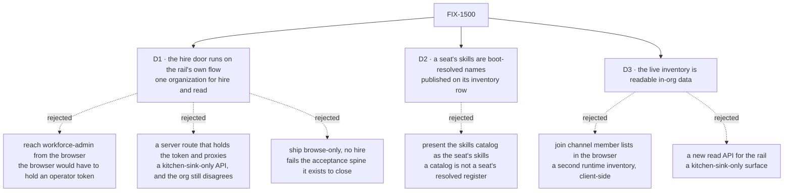

# FIX-1500 · Decisions

[Spec](SPEC.md) · **Decisions** · [Rules](BUSINESS-RULES.md) · [Plan](PLAN.md) · [Docs](DOCS.md) · [Evolution](EVOLUTION.md)

What was considered, what was chosen, and what each locks in. Three decisions are the sign-off
surface. The issue's Architect fences are locked input and are not reopened here: one navigator
and depth from cardinality ([epic D8](../../epics/FIX-1455/DECISIONS.md#d8)), the organization
from the principal or the default-org framework path and never from a body, the shared hire and
persistence path from [FIX-1475](https://linear.app/fixpoint-labs/issue/FIX-1475), and the
registered-kind / named-instance split from
[FIX-1476](https://linear.app/fixpoint-labs/issue/FIX-1476).

## The tree

Solid edges are what you are signing. Dashed edges lost, and the label says why.

## D1 · The rail's hire door is an action on the flow the rail's own session already runs on

| | |
|---|---|
| **Instead of** | Calling `workforce-admin` from the browser, which would mean the browser holding an operator bearer token · a kitchen-sink server route that holds the token and proxies the hire · shipping the rail browse-only and leaving hire where it is |
| **Because** | The acceptance spine requires one run in which a person hires and then *sees the result in the same surface*. That is only true when the hire and the read resolve their organization the same way. An action on the rail's own flow does exactly that: the session's organization is `ctx.principal?.orgId ?? DEFAULT_ORG_ID` and `body.orgId` is never consulted (`packages/engine/src/routes/session-routes.ts:277`, `:285`), so the two cannot disagree by construction rather than by care. The rejected shapes each break one half — a token in the browser hands an operator credential to every visitor, a server proxy is an app-local API the invent-kill list names *and* still hires into the token's organization while the rail reads the default one, and browse-only fails steps 3 to 5 of the spine outright |
| **Locks in** | In a deployment that authenticates nobody, the app can hire. That is the same posture every other action in such a deployment already has — `chat-agent` declares no `authentication` block, so nothing there authenticates anybody today — but hire is the first one that writes durable organization state, and that is a step rather than a restatement. Reversing this later does not just move code: it removes the only way the Goal 1 run is demonstrable, until identity ships |

**What would change my mind:** kitchen-sink being positioned as deployable rather than as a
reference people read and copy. The moment somebody is expected to run it facing the internet,
this door belongs behind [FIX-1503](https://linear.app/fixpoint-labs/issue/FIX-1503)'s identity
and the Goal 1 run waits for it. Today the app ships with `userId` a caller-side constant
(`apps/kitchen-sink/app/page.tsx:95`), which is the same statement about what it is for.

**What this is not.** It is not a second hire path. The stored contract — the roster collection,
`create()` as the duplicate refusal, register-after-write, the compensating delete — stays exactly
[FIX-1475](https://linear.app/fixpoint-labs/issue/FIX-1475)'s, and the way this issue keeps it
exactly one contract is by giving it **one home**: the sequence moves out of the operator flow's
handler into the `workforce` package, and both doors call it. Today that sequence exists at
precisely one site, verified rather than assumed
([`poc/evidence/`](poc/evidence/README.md) → C2), which is what makes extraction a move rather
than a merge. Two doors over two copies of an invariant is the defect class this repository keeps
paying for (tenet 5); two doors over one is ordinary.

## D2 · A seat's skills are the names its own folders resolved at boot, published on its inventory row

| | |
|---|---|
| **Instead of** | Reading the live skills catalog and presenting it as the seat's skills |
| **Because** | The register a seat actually holds is `org/skills ∪ teams/<id>/skills ∪ worker-local`, computed by `readSeatSkills` and imposed as the `seatSkills` key of the `WorkerConfig` admission bag ([FIX-1367](https://linear.app/fixpoint-labs/issue/FIX-1367)). That is a boot-time answer and there is no honest way to make it a live one, because the loader is Node-only and reads folders. Publishing the names beside the seat's identity — where the binder already writes a row for that seat — shows the register itself rather than a catalog standing in for it, which is the distinction the Architect's fence draws |
| **Locks in** | The rail's skills view is as fresh as the last boot. A skill added to a folder while the app is running does not appear until it restarts, and that is a promise we are making rather than a bug somebody will file. It also means the seat inventory row carries something derived from a seat's configuration, so a future change to how a seat resolves skills has a second reader |

**Names, not contents.** What a skill *does* is not published here. This is visibility and
navigation, not a skills product, and the fence is explicit that catalog-only visibility is not
the proof — the resolved register is.

**What would change my mind:** the skills register becoming a runtime-writable surface for seats
rather than a boot-time resolution. Then a seat's skills have a live home and the inventory row
should point at it rather than copy from it.

## D3 · The live inventory becomes ordinary readable in-organization data

| | |
|---|---|
| **Instead of** | Reading `inventory/channels/*` whole and filtering each row's `members` array in the browser · standing up a read API for the rail to call |
| **Because** | The product owner's rule, already given and already applied once: *a user can see all workers within their org, unless they are user-scoped as a resource* ([FIX-1477 D4](../FIX-1477/DECISIONS.md#d4)). All three inventory collections declare `scope: "org"`, so they qualify on exactly the axis that rule names. The browser filter is the invent-kill list's *"client-side joins that become a second runtime inventory"* spelled out — and it is also strictly worse, because the membership index is keyed `<seatId>/<channelId>` precisely so a seat's channels are a `topicPrefix` read at the source rather than a scan (BP-033). A new read API is the *"kitchen-sink-only APIs"* kill |
| **Locks in** | Three more collections that any session in an organization whose flow installs them can list. The permission belongs to the collection, not to the panel, so flows this issue never touches gain the read too. Each therefore ships with an `expose` allowlist rather than bare — a bare opt-in republishes the stored row unchanged, and taking a published field back later breaks whatever started reading it |

**What would change my mind:** an inventory row gaining something a member of the organization
should not see. The rule would not change; that field would be withheld from the allowlist, and
if it could not be, the collection would come off the list.

## Decided, not asked

- **Fire is not in the rail.** The spine asks to hire another instance and observe it; removing a
  seat is not in it. `workforce-admin` keeps `fire`, and the extracted helper carries both halves
  so a later issue adding it to the rail writes no new sequence. Smaller is the conservative
  direction here (tenet 3).
- **A hire refreshes the roster by calling the panel's own `refresh`.** `PanelRows.refresh` is
  already published for exactly this and its own note says it is safe to call from a host
  affordance (`packages/react/src/components/panels/reads.ts`). Not a subscription: cross-session
  liveness is [FIX-1506](https://linear.app/fixpoint-labs/issue/FIX-1506)'s, and designing against
  a seam that delivers only the writer's own changes would be designing against a seam that does
  not exist yet.
- **Board names come from the channel's session state**, where `CHANNEL.md`'s `boards:` already
  lands as a `boards: string[]` projection (`packages/workforce/src/channel/channel-flow.ts:108`).
  No new storage, and the board's ledger id stays `<channelId>.<boardName>` minted by the
  workforce package — the UI does not re-derive that join.
- **The seat detail is a `react` component, not kitchen-sink code.** Everything else the rail
  renders ships from the package ([FIX-1477 D1](../FIX-1477/DECISIONS.md#d1)); a seat detail built
  in the app is the fork that decision exists to prevent.
- **A hired seat's row is written by the same binder that writes a declared seat's.** A runtime
  hire that produced no inventory row would make the rail's seat detail work for file-declared
  seats and silently not for hired ones — which is the acceptance spine's own step 4.

## Considered and dropped

| Alternative | Why not |
|---|---|
| Put the hire affordance behind the operator credential and have the *browser* send it | Hands an operator token to every visitor. Ruled out before it was priced |
| A kitchen-sink server route holding the token and proxying the hire | An app-local API the invent-kill list names, and it does not even work: the hire lands in the token's organization while the rail reads the default one, which is the empty-panel failure with an extra layer |
| Widen `workforce-admin` to register unconditionally when no credential is set | Its resolver would be absent, so the stock body-reading resolver applies and `orgId` becomes caller-supplied — the *"caller-selected `orgId` without principal authorization"* kill, and a reversal of FIX-1475's deliberate fail-closed choice rather than an addition beside it |
| Show skills by listing the org skills collection | Shows the org's catalog, not the seat's register. Two seats on different teams would read identically, which is the thing a seat view exists to distinguish |
| Derive a seat's channels by reading every channel row and filtering `members` in React | A second runtime inventory, client-side, and it lists-then-discards where a prefix read exists |
| Hold the spine open until [FIX-1503](https://linear.app/fixpoint-labs/issue/FIX-1503) ships identity | FIX-1503's own *Out* section rules out hard-blocking kitchen-sink, and the issue's fences name hard-blocking on soft-related cleanups as an invent-kill. The limit is written down instead |

## Settled

- **The durable-hire sequence exists at exactly one site today** — **CONFIRMED** by execution, not
  by reading: one file pairs a roster `create()` with `registerFromRoster()`
  (`apps/kitchen-sink/flows/workforce-admin/flow.ts`). D1's extraction is therefore a move, not a
  reconciliation of two drifted copies. ([`poc/evidence/`](poc/evidence/README.md) → C2)
- **No collection under `packages/workforce/src` serves the live inventory to a browser** —
  **CONFIRMED**, and asserted as a totality rather than as a spot check: all six collection
  definitions in the package are classified, two are readable today (both FIX-1477's), one is a
  caller-parameterised factory that fixes no address, and the three inventory collections are the
  delta this issue owes. A planted seventh collection is rejected by the same assertion, which is
  the negative control. ([`poc/evidence/`](poc/evidence/README.md) → C1)
- **A default deployment has no hire path at all** — **CONFIRMED**: the operator flow is
  registered only when a credential is configured (`apps/kitchen-sink/fsdev.config.ts:104`,
  `apps/kitchen-sink/lib/workforce-admin-auth.ts:103`). This is why D1's rejected *"ship
  browse-only"* option does not quietly still work in a clean clone.
  ([`poc/evidence/`](poc/evidence/README.md) → C3)

## How it got here

- **Draft** — framed as the one run that crosses the pieces rather than as four features beside
  each other; the organization-disagreement that made FIX-1477's panels render empty was treated
  as the thing to make unreachable rather than as a limit to restate, which is what put the hire
  door on the rail's own flow; the seat detail assembled from four existing sources with no new
  storage beyond one field and three read declarations.

**Open: none.**
