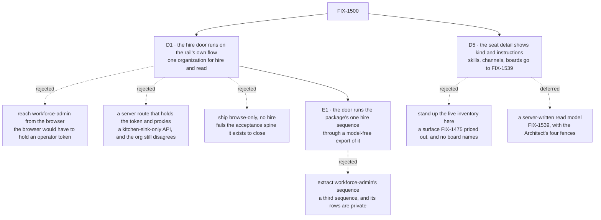

# FIX-1500 · Decisions

[Spec](SPEC.md) · **Decisions** · [Rules](BUSINESS-RULES.md) · [Plan](PLAN.md) · [Docs](DOCS.md) · [Evolution](EVOLUTION.md)

What was considered, what was chosen, and what each locks in. Two decisions are the product
owner's: the hire door ([D1](#d1)) and the scope ([D5](#d5)). The rest are engineering calls,
recorded under [Decided, not asked](#decided-not-asked). The issue's Architect fences are locked
input and are not reopened here: one navigator and depth from cardinality
([epic D8](../../epics/FIX-1455/DECISIONS.md#d8)), the organization from the principal or the
default-org framework path and never from a body, the shared hire and persistence path from
[FIX-1475](https://linear.app/fixpoint-labs/issue/FIX-1475), and the registered-kind /
named-instance split from [FIX-1476](https://linear.app/fixpoint-labs/issue/FIX-1476).

## The tree

Solid edges are what is decided. Dashed edges lost or were deferred, and the label says why.

## D1 · The rail's hire door is an action on the flow the rail's own session already runs on

| | |
|---|---|
| **Instead of** | The operator's credentialed flow reached from the browser · a server route proxying it · browse-only, no hire ([what each cost](#considered-and-dropped)) |
| **Because** | The acceptance spine requires one run in which a person hires and then *sees the result in the same surface*. That is only true when the hire and the read resolve their organization the same way. An action on the rail's own flow does exactly that: the session's organization is `ctx.principal?.orgId ?? DEFAULT_ORG_ID` and `body.orgId` is never consulted (`packages/engine/src/routes/session-routes.ts:285`), and the hire sequence takes its organization from `ctx.org`, which the engine builds from that same session binding ([Settled](#settled)). So the two cannot disagree by construction rather than by care. The rejected shapes each break one half — a token in the browser hands an operator credential to every visitor, a server proxy is an app-local API the invent-kill list names *and* still hires into the token's organization while the rail reads the default one, and browse-only fails steps 3 to 5 of the spine outright |
| **Locks in** | In a deployment that authenticates nobody, the app can hire. That is the same posture every other action in such a deployment already has — `chat-agent` declares no `authentication` block, so nothing there authenticates anybody today — but hire is the first one that writes durable organization state, and that is a step rather than a restatement. Reversing this later does not just move code: it removes the only way the Goal 1 run is demonstrable, until identity ships |

**What would change my mind:** kitchen-sink being positioned as deployable rather than as a
reference people read and copy. The moment somebody is expected to run it facing the internet,
this door belongs behind [FIX-1503](https://linear.app/fixpoint-labs/issue/FIX-1503)'s identity
and the Goal 1 run waits for it. Today the app ships with `userId` a caller-side constant
(`apps/kitchen-sink/app/page.tsx:95`), which is the same statement about what it is for.

**What this is not.** It is not a second hire path. The rail's action runs the sequence the
`workforce` package already owns — the one behind `createSeatHireCapability`'s `hire` tool
([FIX-1525](https://linear.app/fixpoint-labs/issue/FIX-1525)) — through a model-free export of
it ([E1](#e1)). The stored contract stays [FIX-1475](https://linear.app/fixpoint-labs/issue/FIX-1475)'s:
the roster collection, `create()` as the duplicate refusal, register-after-write, the
compensating delete. Two doors over one sequence is ordinary; two doors over two copies of an
invariant is the defect class this repository keeps paying for (tenet 5).

## D5 · The seat detail ships kind and instructions; skills, channels and boards move to FIX-1539

**Decided by the product owner, 2026-09-23**, choosing candidate C of the fork this spec left
open.

| | |
|---|---|
| **Instead of** | Standing up the live inventory in kitchen-sink (A) · a server-written read model of each seat's kind, skills, channels and boards (B) ([what each cost](#considered-and-dropped)) |
| **Because** | Ship what has a browser-readable source and move the rest. The acceptance spine's load-bearing half — enter, hire, observe, restart, still there — closes without skills, channels or boards, and that is the half no other child proves. A would build a surface FIX-1475 priced as out of scope and still not answer board names. B is real substrate that needs its own spec |
| **Locks in** | Goal 1 acceptance shows a thinner seat view than the issue's desired outcome 2. A seat's skills, its channels and those channels' boards are [FIX-1539](https://linear.app/fixpoint-labs/issue/FIX-1539)'s ("Seat-detail read model"), which relates to this issue, sits outside the FIX-1455 epic, and does not block it. FIX-1539 carries the FSD Architect's four fences for B: a projection is **not** an inventory · exactly **one writer** · **fire updates or deletes the projection** · it must **not** become a second hire/fire store |

**What instructions covers, exactly.** A seat hired into the organization has its instructions
on its public roster row, so the detail shows them. A seat declared in a `WORKER.md` has no such
row. Its instructions are in its flow's configuration, which no browser can read, so its detail
says plainly that its instructions are not published. Publishing those joins FIX-1539 ([E2](#e2)).

## D2 · A seat's skills — moved to FIX-1539

What a seat's skills are, and how fresh the rail shows them, is decided in FIX-1539 along with
the carrier that publishes them. This issue shows no skills ([D5](#d5)).

## D3 · The live inventory as browser-readable data — moved to FIX-1539

This issue opens no inventory collection to a browser: under [D5](#d5) no pane here reads one.
Whether and how the inventory is published is FIX-1539's.

## Decided, not asked

- **E1 · The rail's hire door reuses the package's seat-hire sequence, through one additive,
  model-free export.** Today the package publishes that sequence only as catalog tools a model
  calls: `hire` and `fire` are local handlers inside `createSeatHireCapability`, reachable
  through no public API, so an action cannot mount them. The export is
  **`createSeatHireBlocks(options)`**, which returns the `hire` and `fire` handlers themselves;
  the capability builds its tools from it and changes nothing else ([PLAN S1](PLAN.md#surfaces)).
  Extracting workforce-admin's sequence instead, as this spec first planned, would add a third
  sequence beside one the owner already ratified in FIX-1525.
  **Visibility follows: a rail hire writes an org-visible roster row.** That is the owner's rule
  from [FIX-1477 D4](../FIX-1477/DECISIONS.md#d4) — *a user can see all workers within their org,
  unless they are user-scoped as a resource* — so it is derived, not a new fork. The reversal
  point is the owner saying rail hires should be private by default. Engineering call, taken by
  the epic coordinator at this amendment.

- **E2 · What the seat detail reads, and from where.** **Kind** for every seat, from the row the
  host already holds — the navigator's flow listing carries each seat's `kind` — so the detail
  makes no read for it and takes no `PanelRowSource` for it. **Instructions** for org-visible
  hired seats only, from the public roster's exposed `instructions`, read as one item through the
  rail's declared roster ref and the host's own resource client. A file-declared seat's detail
  says its instructions are not published. This applies D5's own principle — ship what has a
  source — so it is not a second ask. Engineering call, taken by the epic coordinator at this
  amendment.

- **The rail refreshes its roster by a specified, checked remount, not by a new public API on the
  panel.** `RosterProps` carries no refresh, ref or version, so the alternative is not *use the
  existing API* — it is **adding one**, on a package other consumers hold, for a single caller. A
  remount is already the host's to do and costs no published surface. **The promotion rule is
  written down rather than left to taste: a second consumer needing the same trigger makes it a
  contract, and then the public API is right.** Engineering call, taken by review.
- **Fire is not in the rail.** The spine asks to hire another instance and observe it; removing a
  seat is not in it. The export carries `fire` too, so a later issue adding it to the rail writes
  no new sequence. It inherits fire's current behaviour exactly, including that fire **leaves the
  seat's inventory row** ([FIX-1540](https://linear.app/fixpoint-labs/issue/FIX-1540);
  [EVOLUTION](EVOLUTION.md#br35-overtaken)). Smaller is the conservative direction here (tenet 3).
- **The hire's refresh is not a subscription** — it is [D4](#d4)'s remount.
  Cross-session liveness is [FIX-1506](https://linear.app/fixpoint-labs/issue/FIX-1506)'s, and
  designing against a seam that delivers only the writer's own changes would be designing against
  a seam that does not exist.
- **The seat detail is a `react` component, not kitchen-sink code.** Everything else the rail
  renders ships from the package ([FIX-1477 D1](../FIX-1477/DECISIONS.md#d1)); a seat detail built
  in the app is the fork that decision exists to prevent.

## Considered and dropped

**The one catalog.** Every rejected shape is priced here and nowhere else; the tree shows *that*
they lost and each card's *Instead of* names them, so neither restates the reasoning.

| Alternative | Why not |
|---|---|
| Put the hire affordance behind the operator credential and have the *browser* send it | Hands an operator token to every visitor. Ruled out before it was priced |
| A kitchen-sink server route holding the token and proxying the hire | An app-local API the invent-kill list names, and it does not even work: the hire lands in the token's organization while the rail reads the default one, which is the empty-panel failure with an extra layer |
| Widen `workforce-admin` to register unconditionally when no credential is set | Its resolver would be absent, so the stock body-reading resolver applies and `orgId` becomes caller-supplied — the *"caller-selected `orgId` without principal authorization"* kill, and a reversal of FIX-1475's deliberate fail-closed choice rather than an addition beside it |
| Extract workforce-admin's sequence into the package for both doors | A third sequence while the package already owns one. It also writes **user-owned** rows under a nested key the browser roster does not list, so a seat hired that way would never appear in the rail ([Settled](#settled)) |
| Mount the capability's `hire` tool as the action's block by reaching into the capability's preset internals | Internal API (`AGENTS.md` → code style rule 4). It works until the capability's internals move, and nothing tells the app when they do |
| A public `refresh` or version prop on `Roster` | Published API on a package other consumers hold, added for one caller, and not withdrawable. A remount costs nothing and is the host's to do ([D4](#d4)). Right the moment a **second** consumer needs the trigger |
| Stand up the live inventory in kitchen-sink (D5's candidate A) | The largest option: a seat-writer flow and a boot door, a surface FIX-1475 priced as out of scope — and it still answers **no** for board names, which live in a channel action's output |
| Publish a file-declared seat's instructions in this issue | No carrier exists; building one is FIX-1539's read model under another name |
| Hold the spine open until [FIX-1503](https://linear.app/fixpoint-labs/issue/FIX-1503) ships identity | FIX-1503's own *Out* section rules out hard-blocking kitchen-sink, and the issue's fences name hard-blocking on soft-related cleanups as an invent-kill. The limit is written down instead |

## Settled

Claims this design rests on, with how each was established. C1–C3 are the authoring-time
checker's ([`poc/evidence/README.md`](poc/evidence/README.md)); the rest were established at this
amendment against `origin/main` `ffe2b6e26`.

| Claim | Verdict | Why it mattered |
|---|---|---|
| No collection in `packages/workforce/src` serves the live inventory to a browser (C1) | **CONFIRMED** at authoring. Its subject, D3, moved to FIX-1539 | FIX-1539 inherits it as a starting fact |
| A default deployment registers no operator hire door (C3) | **CONFIRMED**, and still true on re-run | [D1](#d1)'s rejected *"ship browse-only"* option does not quietly still work in a clean clone |
| The durable-hire sequence exists at exactly one site (C2) | **No longer holds.** The tree has two: workforce-admin's handler and the capability's `hire` tool. The checker's re-run reports **zero**, because its predicate matches neither spelling | [E1](#e1) reuses the package's sequence instead of extracting one |
| A user-owned roster row is not returned by the browser roster read | **CONFIRMED by execution**: `packages/engine/test/hire-plane-fence.test.ts` → E4 and D pass | Why the rail cannot adopt workforce-admin's row shape |
| The single-item roster read is gated by the collection's read declaration, returns only the exposed fields, and answers `200` with `null` for an absent seat | **Read, not executed**: `handleGetCollectionItemState`, `packages/engine/src/routes/resource-routes.ts:529`–`:627` | [E2](#e2)'s instructions read, and the *not published* state |
| The hire sequence's `ctx.org` is the session's bound organization, including an unauthenticated session on the default one | **Read by one author, not executed and not independently re-run**: `packages/engine/src/context/createExecutionContext.ts:772`–`:835` builds the org record from the session's `orgId` | [D1](#d1)'s "hire and read are one organization". It agrees with the session binding the spec already cited, but a reviewer should treat it as one reading |

## How it got here

- **Draft** — framed as the one run that crosses the pieces rather than as four features beside
  each other; the organization-disagreement that made FIX-1477's panels render empty was treated
  as the thing to make unreachable rather than as a limit to restate, which is what put the hire
  door on the rail's own flow.
- **Review rounds 1–3** — no decision moved; the direction was approved each time, with
  corrections to the evidence checker and to S7's organization source.
- **Review round 4** — the first material rework. Three of the four sources the seat detail was
  drawn from did not exist; the browse half became an open fork, and a conflict with FIX-1475's
  BR-35 was raised rather than settled.
- **Review round 5** — a coherence pass, and the refresh fork closed as [D4](#d4).
- **Amendment after merge** — the owner closed the fork as [D5](#d5), and the tree had moved
  under the plan. What changed and why is told once, in
  [EVOLUTION.md → Amendment](EVOLUTION.md#amendment-option-c).

## Open

**None.** The one fork this spec carried is closed as [D5](#d5), by the product owner.
