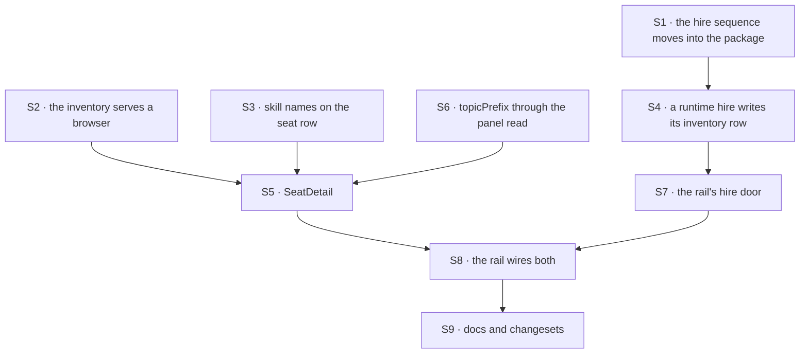

# FIX-1500 · Plan

[Spec](SPEC.md) · [Decisions](DECISIONS.md) · [Rules](BUSINESS-RULES.md) · **Plan** · [Docs](DOCS.md) · [Evolution](EVOLUTION.md)

Written for the implementing agent. IDs cross-reference [BUSINESS-RULES.md](BUSINESS-RULES.md)
(BR-n) and [DECISIONS.md](DECISIONS.md) (D-n). `tdd`. **Four PRs**, seamed so that the substrate
half is checkable with no app running and the app half is the only one that waits
([PR plan](#pr-plan)).

## Surfaces

| ID | Package · role | Change | Rules |
|---|---|---|---|
| S1 | `workforce` · the durable-hire sequence | **Move** it out of `apps/kitchen-sink/flows/workforce-admin/flow.ts` and into this package as one exported pair — hire and fire — taking the collection ref, the kind map and the registrar as parameters. The operator flow becomes its **first caller** and keeps its own resolver, its own credential and its fail-closed registration. The sequence itself does not change: refuse-then-mint-then-`create()`-then-register, compensating delete on a registration failure, `create()` **never** `upsert()`. Verified as a move rather than a merge — the sequence is at exactly one site today ([`poc/evidence/`](poc/evidence/README.md) → C2) | BR-11 – BR-15 |
| S2 | `workforce` · the three inventory collections | Each declares `client: { state: { read: true }, expose: [...] }`. **Never bare** — a bare opt-in republishes the stored row unchanged. The allowlists are the fields the seat detail draws and no more | BR-25 BR-26 BR-28 |
| S3 | `workforce` · the seat inventory row and its writer | The row schema gains the seat's **resolved skill names** — `z.array(z.string()).default([])`, so a row written before the field still reads (BP-030). `InventorySeat` widens to carry them and `openInventory`'s seat write publishes them. Names only; contents are not published (D2) | BR-5 BR-7 BR-9 BR-10 |
| S4 | `workforce` · a runtime hire's inventory row | A seat hired at runtime gets its inventory row written too, through S1. Without it the seat detail works for file-declared seats and silently not for hired ones — which is the spine's own step 4 | BR-16 |
| S5 | `react` · `SeatDetail` | One seat's kind, skills, channels and declared boards. Host-passed `PanelRowSource`, the same seam `Roster` and `BoardColumns` take — **it must not build its own client** (BR-27). Each section has a distinct empty state; a section that failed to read says so rather than rendering as empty | BR-5 – BR-8 BR-27 |
| S6 | `react` · the panels' shared read | `usePanelRows` forwards `topicPrefix`, which the client's `listCollectionItems` already accepts (`packages/client/src/resource-client/resources.ts:105`–`:109`) and the hook does not pass today. This is what makes a seat's channels a read at the source rather than a scan | BR-6 |
| S7 | kitchen-sink · the hire door | One action on the flow the rail's session runs on, calling S1. Organization from `ctx.org`, never from the body. The flow installs the roster collection so the ref resolves against its owning flow | BR-1 – BR-3 BR-11 – BR-15 |
| S8 | kitchen-sink · the rail | A seat row opens `SeatDetail`; a channel row opens its declared boards and mounts `BoardColumns` per board; the hire affordance calls S7 and then the roster panel's own `refresh`. **No create affordance for a channel or a board** | BR-16 BR-21 – BR-24 |
| S9 | Docs · changesets | [DOCS.md](DOCS.md)'s operations; `packages/workforce/README.md` and `packages/react/README.md` for the public changes. **None for kitchen-sink** — private (BP-022) | — |

**What is *not* here.** The rail itself — the `FlowNavigator` mount, the `Roster` and
`BoardColumns` panels and the shell that holds them — is
[FIX-1477](https://linear.app/fixpoint-labs/issue/FIX-1477)'s S8 and this issue does not re-own
it ([Blocked on](#blocked-on)). Neither is `fire` in the rail, nor runtime channel or board
creation, nor any skills editing.

## Sequence



<a name="pr-plan"></a>
## PR plan

| PR | Surfaces | depends_on | Why this seam |
|---|---|---|---|
| PR-A | S1 S4 | — | The hire sequence and its one new writer. Checkable with no UI at all, and the operator flow's existing suite is the regression fence on the move |
| PR-B | S2 S3 S6 | — | The read surface. Independent of PR-A on purpose: nothing here touches hiring, so the two substrate halves are reviewable in parallel and a failure in either is attributable |
| PR-C | S5 | PR-B | The component. Needs the read declaration and `topicPrefix` to be checked against a real read rather than a fixture — the fixture version is the check that cannot fail |
| PR-D | S7 S8 S9 | PR-A, PR-C | The app. The only one that waits, and the only one carrying the goal check |

**The completion gate is determinate: `VG` passes on PR-D.** Not "the rail looks right" and not a
screenshot — the run in [BUSINESS-RULES.md](BUSINESS-RULES.md) → *Acceptance criteria*, asserted
including its network path. A shell merged without its goal check is the defect class this epic
has already found more than once, so `VG` does not move to a follow-up.

### Changesets

| Fragment | Packages | Bump | Rides |
|---|---|---|---|
| `durable-hire-one-home` | `workforce` | `patch` | PR-A |
| `inventory-client-read` | `workforce` | `patch` | PR-B |
| `seat-skills-on-inventory-row` | `workforce` | `patch` | PR-B |
| `panel-read-topic-prefix` | `react` | `patch` | PR-B |
| `seat-detail` | `react` | `patch` | PR-C |
| — | kitchen-sink | **none** | private (BP-022) |

All `patch`: the pre-1.0 rule is *can this break somebody*, not *is this new*
([release-notes-workflow.md](../../../docs/contributing/release-notes-workflow.md#pre-10-discipline-current-state)).
Every change here is additive — a new export, a new optional field with a default, a forwarded
option, a read declaration. That the inventory becomes browser-readable is a real posture change
and belongs in the **body** of `inventory-client-read`, naming the org scoping and what each
allowlist withholds; not in the bump.

## Checks

Every row names what would make it fail. A check with no producible red state proves nothing.

| ID | Runs after | Passes when | Would fail if — the red state |
|---|---|---|---|
| V1 | S1 | The operator flow's existing hire and fire behaviour is unchanged after the move: same refusals, same order, same compensating delete | **Available before a line is written** — run the operator flow's current suite against the extracted helper. A move that changed behaviour fails it. This is the whole regression fence on S1, which is why S1 is not allowed to "tidy" the sequence while moving it |
| V2 | S1 | A second hire of one seat id is refused **by `create()` throwing**, not by a check beside it | Replace `create()` with `upsert()`. The check must go red. A test that only asserts "the second hire is refused" passes either way if someone adds a read-before-write, so assert that no such read happens — the refusal and its mechanism are one rule (BR-12) |
| V3 | S1 | Registration refused after the row is written leaves **no row** | Remove the compensating delete: the row survives and the check goes red. Asserted by reading the collection back, not by trusting the handler's return |
| V4 | S2 | Each collection's browser read returns **exactly** its allowlisted fields, with rows seeded first | Drop the `expose` and it goes red on the **extra** keys. Asserting only the fields you wanted passes on the whole envelope, and a 200 with an empty list satisfies any field assertion vacuously — so seed rows, and assert the absence of what is withheld (BR-25) |
| V5 | S2 | Reading an inventory collection **without** its declaration is refused `403 State read not permitted` | Remove the declaration: the seat detail goes visibly empty rather than silently reading. Pins the opt-in so a later refactor cannot delete it and leave the pane merely looking broken (BR-26) |
| V6 | S2 | Two organizations, one seat id in each: each session lists its own row and not the other's | Bind both sessions to one organization and it goes red. Two organizations, asserted separately — one org proves nothing about a boundary (BR-28) |
| V7 | S3 | A seat whose folders resolved three skills publishes those three names; a seat that resolved none publishes an empty array; **a row written before the field reads with an empty array** | Three assertions, one per failure mode, because none covers another. Drop the `.default([])` and the third goes red while the first two stay green — that is the BP-030 regression (BR-10). Publish the org's whole catalog instead of the seat's register and the *first* goes red only if the two seats in the fixture resolve **different** sets, so the fixture must give them different sets or the assertion is vacuous (BR-5) |
| V8 | S6 | A seat's channel read sends `topicPrefix=<seatId>/` and the response contains no other seat's membership | Assert on the **request**, not on the rendered rows: a component that fetched everything and filtered in React renders identically and is the invent-kill this check exists for (BR-6) |
| V9 | S5 | Rendered against a deployment whose resource routes require `Authorization`, with the host passing its own resource client, the rows arrive | Build the component on `useResourceCollection` instead and it 401s — that hook constructs a client with no fetcher and none is plumbed through the react context. This is [FIX-1477's V16](../FIX-1477/PLAN.md#checks) pointed at a third component; every other check here passes against a deployment that authenticates nobody, so nothing else catches it (BR-27) |
| V10 | S5 | Four distinguishable states per section: rows, empty, still loading, failed to read | Collapse *empty* and *failed* into one: the check goes red. A seat that is genuinely in no channel and a channel read that 403'd must not look the same — that is the silent-partial shape (BR-7, BR-8) |
| V11 | S7 | A hire whose body carries `orgId: "other"` lands in the **session's** organization | Read the body's value: the seat lands in `other` and the check goes red. The assertion is on *where the row ended up* with a differing body value present — a check that only asserts the call succeeded passes on the defect (BR-2) |
| V12 | S8 | The rail publishes no affordance that creates a channel or a board | Written as an **allow-list over the surface's actions**, not a denylist of two names, so a third spelling fails too (BR-24) |
| V13 | S4 S8 | A seat hired through the rail has a seat detail that opens, with its kind and an (empty) register — the same pane a file-declared seat opens | Skip the inventory row on a runtime hire: the roster lists the seat and its detail is blank. That split — listed but not openable — is the failure S4 exists for (BR-16) |
| V14 | S1 S4 | **Persistence boundary, two assertions.** (a) After a hire, the row is present in the durable store read **out of band**, not through the runtime that wrote it. (b) A runtime built on a **fresh** store handle over the same durable location lists the seat | (a) goes red if the hire only registered in-process. (b) goes red if the reload is skipped. **And the negative control for (b):** point boot two at an **empty** durable location — it must go red. Without that control, a `globalThis` cache or a module-level array makes (b) pass while proving nothing, which is precisely the "does not come from process memory" claim BR-19 makes (BR-18, BR-19) |
| V15 | S2 S3 | [`poc/evidence/`](poc/evidence/README.md) runs green: every collection in the package is classified and the delta this issue owes is empty | Today it reports a delta of three. After S2 the delta is empty. `--plant` must still fail — a totality assertion that stops rejecting a planted collection has stopped asserting totality |
| VG | S8 | **Playwright, against the Next-built app** (`apps/kitchen-sink/e2e/`): open the rail → open a seat → its kind, skills, channels and boards render → hire another instance of that kind → the new seat appears **with no page reload** → restart the server → reopen → the seat is there → open a channel's board through the rail and its rows render. **And the network log shows the board rows arriving from the collection route**, with no request to a developer-tool or app-private endpoint anywhere in the run | Serve the board from app-owned state: every DOM assertion still passes and the network assertion fails. That half is what makes this a goal check rather than a screenshot. Reload the page after the hire and the no-reload assertion goes red. Skip the restart and the last two go red |

**No model runs in any of this**, so no `goals/` check applies: every claim is about what a
browser and a boot do with data the server already has. `VG` is the real-path check, in a suite
that already drives the built app.

## Pinned names

| Where | Name | Why pinned |
|---|---|---|
| `react` export | `SeatDetail` | Public, and it sits beside `Roster` and `BoardColumns` in the same family |
| Seat inventory row field | `skills` | Public: a stored field on a shipped collection, and moving it later breaks every deployment that has written one |
| Panel read option | `topicPrefix` | Already the client's spelling; a second name for one concept is the bug |

Everything else — the extracted helper's name and signature, the hire action's name, hook names,
file layout, the allowlists' exact members — is yours.

## Guardrails

| Rule | Because |
|---|---|
| The hire sequence has **one** home, and both doors call it (tenet 5) | An invariant enumerated at one entry point is the most expensive review class we have. The convergence point is the extracted helper; its writers are the operator flow and the rail's action, and there must be no third |
| S1 **moves** the sequence; it does not improve it while moving | The only regression fence available is the operator flow's existing suite (V1), and a move that also edits behaviour makes that fence useless exactly when it is needed |
| Never open a collection's browser read **bare** (BP-015) | With no projection the read returns the stored row unchanged. The roster and board already carry allowlists to copy the shape of rather than invent |
| Organization is never read from a body, a query or a header the caller controls (BP-031) | It is the whole of D1's safety. `session-routes.ts:277` already refuses to consult `body.orgId`; nothing this issue adds may reintroduce it one layer up |
| Every new read is filtered at the source (BP-033) | The membership index is keyed seat-first *specifically* so a seat's channels are a prefix read. Listing everything and filtering in React is a second runtime inventory wearing a different name |
| A new nullable or additive stored field carries a default (BP-030) | A seat row written before `skills` existed must still read, and it will exist in every deployment that has already hired |
| A component takes its row source from its host (BR-27) | A component that builds its own client reads through no credential and fails against any deployment that authenticates. FIX-1477 pinned this once already; a third component is where it gets forgotten |
| Empty and failed are different states, everywhere in the seat detail | Three sections rendering and a fourth silently blank is the silent-partial failure this epic keeps rediscovering |

## Docs

[DOCS.md](DOCS.md) carries the proposed prose and owns its own publish order. Reconcile it against
the built behaviour before publishing; the limit in BR-4 is written for a reader, not just for
this plan.

## Sketch · pseudocode, illustrative, react to the shape

```
the extracted hire, in the workforce package:
    refuse   a kind this app does not carry, an address something holds
    mint     the seat from what will be STORED, not from the request
    create   the roster row            ← the throw IS the duplicate refusal
    register the address
    on a registration failure: delete the row, report the registration failure
    write    the seat's inventory row  ← S4, so a hired seat has a detail pane

the rail's door:
    org ← the session's, from the principal or the default        (never the body)
    call the extracted hire with the app's kind map and registrar

opening a seat:
    kind      ← its roster row
    skills    ← its seat inventory row                            (boot-resolved names)
    channels  ← memberships, read with topicPrefix "<seatId>/"    ← the whole of S6
    boards    ← for each channel, that channel's session state
                then BoardColumns on "<channelId>.<board>"
```

**POC:** [`poc/evidence/`](poc/evidence/README.md) — not a design experiment, a checker for this
spec's counted claims. It settled three: the hire sequence is at one site, no inventory collection
serves a browser today (asserted as a totality, with a planted collection as the negative
control), and a default deployment registers no hire door at all. All three held as drafted; the
run also **corrected two errors in the spec's own table** before review saw them — the membership
pattern is `inventory/members/**`, not `/*`, and `definePersona` is a caller-parameterised factory
that had gone unclassified.

## At implement time

Re-check these against the repo before building; each of them moves.

- **Is FIX-1477's rail on `main`?** This issue extends the shell that mounts `FlowNavigator`,
  `Roster` and `BoardColumns` and does **not** re-own it ([Blocked on](#blocked-on)). PR-A, PR-B
  and PR-C need none of it and can proceed regardless; **PR-D is the one that cannot land
  without it.** If it is not there, that is a sequencing fact to raise, not a surface to rebuild.
- **Has the operator flow's hire sequence changed?** S1 moves what is there, so read it fresh
  rather than from this plan's summary of it. If it has gained a step, the step moves too.
- **What are the inventory row schemas now?** S3 adds a field to one of them. They are a public
  storage surface and their own header says moving a prefix breaks every deployment that has
  already hired.
- **Does the rail's flow already install the roster collection?** S7 needs it, because a
  collection read resolves the ref against the session's **owning flow**. And the ref it is
  declared under must contain **no slash** — the list route is `/sessions/:id/resources/:ref`
  with no trailing segment, so `workforce/roster` parses as `ref: "workforce"`, `topic: "roster"`
  and reads a different collection's item. That failure reads like missing rows rather than like
  a wrong address. FIX-1477 hit it; do not hit it twice.
- **Has [FIX-1506](https://linear.app/fixpoint-labs/issue/FIX-1506) landed?** If it has, BR-17
  stops being a named non-goal and the refresh-after-hire in S8 may become a subscription. If it
  has not, do not design one — the seam available today delivers only the writer's own changes.
- **Has [FIX-1503](https://linear.app/fixpoint-labs/issue/FIX-1503) landed?** If it has, D1's
  *what would change my mind* is live: the rail's hire door goes behind a viewer identity, the
  organization stops being the default one, and BR-4's documented limit is deleted rather than
  reworded.

## Blocked on

**One dependency inside the epic, and two deferrals outside it. None of them is a reason to hold
the design.**

**The rail is [FIX-1477](https://linear.app/fixpoint-labs/issue/FIX-1477)'s S8.** That surface —
the kitchen-sink shell whose left rail is one `FlowNavigator` with Channels and Seats sections and
whose right panel is `BoardColumns` plus `Roster` — is assigned to FIX-1477's PR-C by
[its plan](../FIX-1477/PLAN.md#pr-plan). This issue mounts what a row opens *into* and adds the
hire door; it does not build the rail, and a second navigator is an invent-kill. **PR-D is the
only part of this plan that needs it**; PR-A, PR-C and PR-B stand alone. If the rail is not
available when PR-D is ready, that is a sequencing conversation, not a licence to rebuild it here.

**There is no credential in this repository that represents a viewer, and there will not be one
in this issue.** Every operator token resolves to a single fixed machine user
(`ADMIN_USER_ID = "workforce-admin"`, `apps/kitchen-sink/lib/workforce-admin-auth.ts:40`), and the
browser's identity is a caller-side constant a resolver cannot trust
(`const userId = e2eUserId ?? "devuser"`, `apps/kitchen-sink/app/page.tsx:95`). So a session binds
to its principal's organization, or to the default one when there is no principal
(`orgId: ctx.principal?.orgId ?? DEFAULT_ORG_ID`,
`packages/engine/src/routes/session-routes.ts:285`). Real identity is
[FIX-1503](https://linear.app/fixpoint-labs/issue/FIX-1503).

**What that costs here is different from what it cost FIX-1477, and the difference is the point.**
FIX-1477's panels read an organization that a hire under an operator token had not written to, so
a configured deployment rendered them *correct and empty*. This issue's hire and read resolve
their organization the same way ([D1](DECISIONS.md#d1)), so they cannot disagree:

| Deployment | The rail |
|---|---|
| A clone with no operator tokens | **The whole spine works.** Hire and read are both the default organization, and every acceptance step closes |
| Operator tokens configured | **The whole spine still works**, on the default organization. Seats hired under a token are in that token's organization and are not listed here. The rail is never empty-for-no-reason; it is showing a different organization, and the docs say which |

That second row is a **known limit, documented in [DOCS.md](DOCS.md)** — not a defect for someone
to rediscover. It is also strictly smaller than the limit FIX-1477 shipped, which is the honest
argument for shipping rather than waiting.

**Waiting would be incoherent, not cautious.** FIX-1503's own *Out* section names FIX-1477 and
rules out hard-blocking kitchen-sink on it, and this issue's own fences name *"hard-blocking the
slice on every soft-related cleanup"* as an invent-kill. Neither side is waiting on the other.

**Cross-session liveness is [FIX-1506](https://linear.app/fixpoint-labs/issue/FIX-1506)'s.** The
panels read on mount and after an action this rail performed. A second browser seeing the first
one's hire is BR-17, named so its absence is visibly deliberate. Do not design a subscription
against a seam that today delivers only the writer's own changes.

## Follow-ups

- `fire` from the rail. The extracted helper carries it, so adding the affordance later writes no
  new sequence. Out of scope: the spine does not ask for it.
- The seat detail's channel list reads one page, like the panels it sits beside. At reference
  scale that is fine and at a hundred channels per seat it is not; the pagination question is
  `BoardColumns`' and `Roster`'s too, and belongs to whoever answers it for all three.
- A seat's skill *contents* — what a skill does, not just its name — have no browser-readable home.
  Flagged, not filed: it is a skills-product question, and this issue is explicitly not that.
