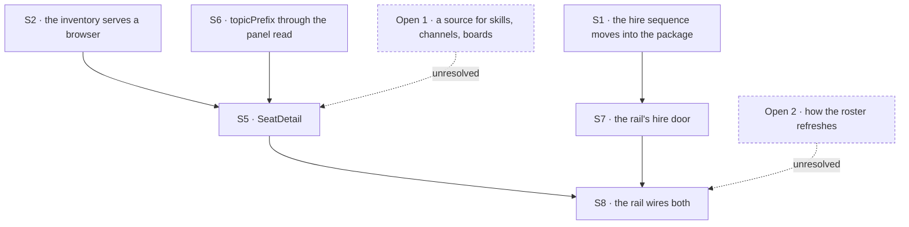

# FIX-1500 · Plan

[Spec](SPEC.md) · [Decisions](DECISIONS.md) · [Rules](BUSINESS-RULES.md) · **Plan** · [Docs](DOCS.md) · [Evolution](EVOLUTION.md)

Written for the implementing agent. IDs cross-reference [BUSINESS-RULES.md](BUSINESS-RULES.md)
(BR-n) and [DECISIONS.md](DECISIONS.md) (D-n). `tdd`. **Four PRs**, seamed so that the substrate
half is checkable with no app running and the app half is the only one that waits
([PR plan](#pr-plan)).

## Surfaces

| ID | Package · role | Change | Rules |
|---|---|---|---|
| S1 | `workforce` · the durable-hire sequence | **Move** it out of `apps/kitchen-sink/flows/workforce-admin/flow.ts` and into `packages/workforce/src/roster/`, beside `reload.ts`, as one exported pair — hire and fire — taking the collection ref, the kind map and the registrar as parameters. The operator flow becomes its **first caller** and keeps its own resolver, its own credential and its fail-closed registration. The sequence itself does not change: refuse-then-mint-then-`create()`-then-register, compensating delete on a registration failure, `create()` **never** `upsert()`. Verified as a move rather than a merge — the sequence is at exactly one site today ([`poc/evidence/`](poc/evidence/README.md) → C2) | BR-11 – BR-15 |
| S2 | `workforce` · the three inventory collections | Each declares `client: { state: { read: true }, expose: [...] }` ([D3](DECISIONS.md#d3)). **Never bare** — a bare opt-in republishes the stored row unchanged. The allowlists are the fields the seat detail draws and no more | BR-25 BR-26 BR-28 |
| ~~S3~~ | **Blocked on [Open 1](DECISIONS.md#open).** Written against the seat inventory row, which **this app never populates** — `openInventory` is called nowhere under `apps/kitchen-sink`. Its content (names only, `.default([])` for BP-030, boot-fresh) survives whatever carrier Open 1 picks; the carrier does not. Do not build as written | The row schema gains the seat's **resolved skill names** — `z.array(z.string()).default([])`, so a row written before the field still reads (BP-030). `InventorySeat` widens to carry them and `openInventory`'s seat write publishes them. Names only; contents are not published (D2) | BR-5 BR-7 BR-9 BR-10 |
| ~~S4~~ | **Blocked on a conflict with an approved spec** ([BR-35](EVOLUTION.md#br35-conflict)) *and* on [Open 1](DECISIONS.md#open). It proposed exactly what FIX-1475's BR-35 forbids, and D3's browser read makes the consequence worse: a fired seat still advertised as live. Do not build as written | A seat hired at runtime gets its inventory row written too, through S1. Without it the seat detail works for file-declared seats and silently not for hired ones — which is the spine's own step 4 | BR-16 |
| S5 | `react` · `SeatDetail` | One seat's kind, skills, channels and declared boards. Host-passed `PanelRowSource`, the same seam `Roster` and `BoardColumns` take — **it must not build its own client** (BR-27). Each section has a distinct empty state; a section that failed to read says so rather than rendering as empty | BR-5 – BR-8 BR-27 |
| S6 | `react` · the panels' shared read | `usePanelRows` forwards `topicPrefix`, which the client's `listCollectionItems` already accepts (`packages/client/src/resource-client/resources.ts:105`–`:109`) and the hook does not pass today. This is what makes a seat's channels a read at the source rather than a scan | BR-6 |
| S7 | kitchen-sink · the hire door | One action on the flow the rail's session runs on, calling S1. **The organization is the one the session is already bound to** — the principal-or-default-org binding the engine applies when the session is created, which is the same resolution the panels' reads go through. Never from the body, and **not** `workforce-admin`'s credential-derived org either: that is also "not the body" and is the wrong source, because it is the operator's organization rather than this session's ([D1](DECISIONS.md#d1), BR-2). **The flow must declare every collection the rail reads, under slash-free refs** — a read resolves its ref against the session's *owning flow*, and `chat-agent` today declares only memory's user resources (`flows/chat-agent/flow.ts:144`). Making a collection browser-readable does **not** make it reachable; the ref has to exist on this flow too. Today that is the roster; whatever [Open 1](DECISIONS.md#open) adds is declared here as well | BR-1 – BR-3 BR-11 – BR-15 |
| S8 | kitchen-sink · the rail | A seat row opens `SeatDetail`; a channel row opens its declared boards and mounts `BoardColumns` per board; the hire affordance calls S7 and then refreshes the roster by whichever mechanism [Open 2](DECISIONS.md#open) settles — **`RosterProps` publishes no refresh, ref or version today** (`packages/react/src/components/panels/Roster.ts`), so this is not a call the host can make as written. **No create affordance for a channel or a board** | BR-16 BR-21 – BR-24 |
| S9 | Docs · changesets | **Each public surface's documentation rides its own PR, not a batch at the end** — `packages/workforce/README.md` with PR-A, the `react` README lines with PR-B and PR-C, the [DOCS.md](DOCS.md) site operations with the PR whose behaviour they describe. Batching them onto PR-D would release `hireSeat`, the inventory reads and `SeatDetail` with changesets while their docs sit unmerged (AGENTS.md → document user-facing functionality in the same change set). **None for kitchen-sink** — private (BP-022) | — |

**Two rules are inherited rather than built.** BR-20 (a stored seat that cannot be brought back at
boot is named in the rail) is [FIX-1477](https://linear.app/fixpoint-labs/issue/FIX-1477)'s boot
report and `problems` prop, which a seat hired through this rail reaches by writing an ordinary
roster row. BR-17 (another browser seeing this one's hire) is
[FIX-1506](https://linear.app/fixpoint-labs/issue/FIX-1506)'s. Neither has a surface or a check
here, and both are written down so their absence is visibly deliberate.

**What is *not* here.** The rail itself — the `FlowNavigator` mount, the `Roster` and
`BoardColumns` panels and the shell that holds them — is
[FIX-1477](https://linear.app/fixpoint-labs/issue/FIX-1477)'s S8 and this issue does not re-own
it ([Blocked on](#blocked-on)). Neither is `fire` in the rail, nor runtime channel or board
creation, nor any skills editing.

## Sequence



Dashed nodes are unanswered questions, not surfaces. **S3 and S4 are struck** and are not in this
graph; what replaces them depends on [Open 1](DECISIONS.md#open).

```

<a name="pr-plan"></a>
## PR plan

| PR | Surfaces | depends_on | Why this seam |
|---|---|---|---|
| PR-A | S1 · its docs | — | The hire sequence and its one new writer. Checkable with no UI at all, and the operator flow's existing suite is the regression fence on the move |
| PR-B | S2 S6 · its docs | — | The read surface. Independent of PR-A on purpose: nothing here touches hiring, so the two substrate halves are reviewable in parallel and a failure in either is attributable |
| PR-C | S5 · its docs | PR-B | The component. Needs the read declaration and `topicPrefix` to be checked against a real read rather than a fixture — the fixture version is the check that cannot fail |
| PR-D | S7 S8 · kitchen-sink docs | PR-A, PR-C | The app. The only one that waits, and the only one carrying the goal check. **S9 is not here**: each surface's docs ride the PR that ships it |

**The completion gate is determinate: `VG` passes on PR-D.** Not "the rail looks right" and not a
screenshot — the run in [BUSINESS-RULES.md](BUSINESS-RULES.md) → *Acceptance criteria*, asserted
including its network path. A shell merged without its goal check is the defect class this epic
has already found more than once, so `VG` does not move to a follow-up.

### Changesets

| Fragment | Packages | Bump | Rides |
|---|---|---|---|
| `durable-hire-one-home` | `workforce` | `patch` | PR-A |
| `inventory-client-read` | `workforce` | `patch` | PR-B |
| ~~`seat-skills-on-inventory-row`~~ | — | — | **Struck with [S3](#surfaces)** — it named a row this app never writes. Whatever [Open 1](DECISIONS.md#open) lands brings its own fragment, named for the carrier it actually ships |
| `panel-read-topic-prefix` | `react` | `patch` | PR-B |
| `seat-detail` | `react` | `patch` | PR-C |
| — | kitchen-sink | **none** | private (BP-022) |

All `patch`: the pre-1.0 rule is *can this break somebody*, not *is this new*
([release-notes-workflow.md](../../../docs/contributing/release-notes-workflow.md#pre-10-discipline-current-state)).
Every change here is additive — a new export, a new optional field with a default, a forwarded
option, a read declaration. That the inventory becomes browser-readable is a real posture change
and belongs in the **body** of `inventory-client-read`, naming the org scoping and what each
allowlist withholds; not in the bump.

## Checks

Every row names what would make it fail. A check with no producible red state proves nothing.

| ID | Runs after | Passes when | Would fail if — the red state |
|---|---|---|---|
| V1 | S1 | The operator flow's existing hire and fire behaviour is unchanged after the move: same refusals, same order, same compensating delete | **Available before a line is written** — run the operator flow's current suite against the extracted helper. A move that changed behaviour fails it. This is the whole regression fence on S1, which is why S1 is not allowed to "tidy" the sequence while moving it |
| V2 | S1 | A second hire of one seat id is refused **by `create()` throwing**, not by a check beside it | Replace `create()` with `upsert()`. The check must go red. A test that only asserts "the second hire is refused" passes either way if someone adds a read-before-write, so assert that no such read happens — the refusal and its mechanism are one rule (BR-12) |
| V3 | S1 | Registration refused after the row is written leaves **no row** | Remove the compensating delete: the row survives and the check goes red. Asserted by reading the collection back, not by trusting the handler's return |
| V4 | S2 | Each collection's browser read returns **exactly** its allowlisted fields, with rows seeded first | Drop the `expose` and it goes red on the **extra** keys. Asserting only the fields you wanted passes on the whole envelope, and a 200 with an empty list satisfies any field assertion vacuously — so seed rows, and assert the absence of what is withheld (BR-25) |
| V5 | S2 | Reading an inventory collection **without** its declaration is refused `403 State read not permitted` | Remove the declaration: the seat detail goes visibly empty rather than silently reading. Pins the opt-in so a later refactor cannot delete it and leave the pane merely looking broken (BR-26) |
| V6 | S2 | Two organizations, one seat id in each: each session lists its own row and not the other's | Bind both sessions to one organization and it goes red. Two organizations, asserted separately — one org proves nothing about a boundary (BR-28) |
| V7 | S3 | A seat whose folders resolved three skills publishes those three names; a seat that resolved none publishes an empty array; **a row written before the field reads with an empty array** | Three assertions, one per failure mode, because none covers another. Drop the `.default([])` and the third goes red while the first two stay green — that is the BP-030 regression (BR-10). Publish the org's whole catalog instead of the seat's register and the *first* goes red only if the two seats in the fixture resolve **different** sets, so the fixture must give them different sets or the assertion is vacuous (BR-5) |
| V8 | S6 | A seat's channel read sends `topicPrefix=<seatId>/` and the response contains no other seat's membership | Assert on the **request**, not on the rendered rows: a component that fetched everything and filtered in React renders identically and is the invent-kill this check exists for (BR-6) |
| V9 | S5 | Rendered against a deployment whose resource routes require `Authorization`, with the host passing its own resource client, the rows arrive | Build the component on `useResourceCollection` instead and it 401s — that hook constructs a client with no fetcher and none is plumbed through the react context. This is [FIX-1477's V16](../FIX-1477/PLAN.md#checks) pointed at a third component; every other check here passes against a deployment that authenticates nobody, so nothing else catches it (BR-27) |
| V10 | S5 | Four distinguishable states per section: rows, empty, still loading, failed to read | Collapse *empty* and *failed* into one: the check goes red. A seat that is genuinely in no channel and a channel read that 403'd must not look the same — that is the silent-partial shape (BR-7, BR-8) |
| V11 | S7 | A hire whose body carries `orgId: "other"` lands in the **session's** organization | Read the body's value: the seat lands in `other` and the check goes red. The assertion is on *where the row ended up* with a differing body value present — a check that only asserts the call succeeded passes on the defect (BR-2) |
| V12 | S8 | The rail publishes no affordance that creates a channel or a board | Written as an **allow-list over the surface's actions**, not a denylist of two names, so a third spelling fails too (BR-24) |
| ~~V13~~ | — | **Retired with [S4](#surfaces).** It asserted a hired seat's detail pane opens like a declared seat's — which presumed inventory rows this app does not have, for either kind of seat. Whatever [Open 1](DECISIONS.md#open) lands needs a check of this shape, written against the carrier it picks | — |
| V14 | S1 | **Persistence boundary, two assertions, and it does NOT run in the browser suite.** (a) After a hire, the row is present in the durable store read **out of band**. (b) A runtime built on a **fresh** store handle over the same durable location lists the seat | (a) goes red if the hire only registered in-process; (b) if the reload is skipped. **Negative control for (b):** point boot two at an **empty** durable location — it must go red, or a module-level cache makes (b) pass while proving nothing (BR-18, BR-19). This is a node-level check by necessity: see VG's row for why the browser suite cannot host it |
| ~~V15~~ | — | **Dropped in review** (BP-037): a spec directory is retained design history, not a home for CI machinery. The forward-looking totality assertion it carried went to [Follow-ups](#follow-ups) as `packages/workforce`'s. Full reasoning: [EVOLUTION.md](EVOLUTION.md#v15). Evidence: [`poc/evidence/`](poc/evidence/README.md) | — |
| VG | S8 | **Playwright, against the Next-built app** (`apps/kitchen-sink/e2e/`): open the rail → open a **file-declared** seat → what the seat pane shows renders → hire another instance of that kind → **the hired** seat appears **with no page reload** → open it and its pane renders too → open a channel's board through the rail. **And the network log shows the board rows arriving from the collection route**, with no request to a developer-tool or app-private endpoint anywhere in the run. **The restart step is NOT in this run** — see the red-state column | Serve the board from app-owned state: every DOM assertion still passes and the network assertion fails. Reload after the hire and the no-reload assertion goes red. **Both seats are named on purpose**: a fixture that opens a hired seat first still passes every assertion while never exercising the declared path. **Why the restart step moved out:** the suite launches `next start` itself (`apps/kitchen-sink/playwright.config.ts`) with `STORE_TYPE: "memory"`, so the test has no restart control and an in-memory store discards the hired row on restart — the step could not have failed honestly, and a step that cannot fail is not a check. BR-18 and BR-19 are V14's until a persistent store profile and a harness that genuinely replaces the server process exist; specifying those is [Open 1](DECISIONS.md#open)'s neighbour and is named in [Blocked on](#blocked-on) |

**No model runs in any of this**, so no `goals/` check applies: every claim is about what a
browser and a boot do with data the server already has. `VG` is the real-path check, in a suite
that already drives the built app.

## Reuse — what already exists, so it is not written twice

Every row is a thing the tree already has. Reaching for a new one is the drift this plan exists to
avoid (tenet 5); if one of these does not fit, that is a finding to raise, not a reason to
reimplement it.

| For | Use | Not |
|---|---|---|
| The prefix of a seat's memberships | `membershipPrefix(seatId)` — it validates the id is one whole path segment and refuses a separator, because one that slipped through *"would file the row under another seat"* (`packages/workforce/src/inventory/collections.ts:217`, `:226`) | A hand-built `` `${seatId}/` `` |
| Turning a hire request into a stored row, and a stored row into a seat manifest | `toHiredSeatRow` and `hiredSeatManifest` (`packages/workforce/src/roster/`, re-exported from the package root) — the operator flow already builds S1's sequence out of exactly these | A second shape for a row on its way in |
| Building a seat's address from an org and a seat id | `seatAddress(orgId, seatId)` — it refuses a dotted or empty org, without which `acme` + `support.ada` and `acme.support` + `ada` spell one address and the second hire silently rebinds the first | String concatenation |
| The organization a hire lands in (S7) | **The session's own binding** — the principal-or-default resolution the engine already applies, the same one the panels' reads resolve through, so hire and read cannot diverge | `orgOf(credential)` as `workforce-admin` derives it — that is the **operator's** organization, and using it here rebuilds the exact split D1 exists to close, while looking correct because it is not the body |
| Where S1's extracted sequence lives | `packages/workforce/src/roster/`, beside `reload.ts` — the boot-side reader of the same rows. One directory owns writing a roster row and reading it back | A new top-level module |
| Writing a seat's inventory row (S3, S4) | **One writer, shared** with `openInventory`'s seat write. A runtime hire and a boot must not be able to produce differently-shaped rows for the same seat | A second write path for hired seats |

## Pinned names

| Where | Name | Why pinned |
|---|---|---|
| `react` export | `SeatDetail` | Public, and it sits beside `Roster` and `BoardColumns` in the same family |
| Seat inventory row field | `skills` | Public: a stored field on a shipped collection, and moving it later breaks every deployment that has written one |
| Panel read option | `topicPrefix` | Already the client's spelling; a second name for one concept is the bug |

Everything else — the extracted helper's name and signature, the hire action's name, hook names,
file layout, the allowlists' exact members — is yours.

## Guardrails

| Rule | Because |
|---|---|
| Every durable effect the hire makes is inside one compensation boundary, not just the registration | The sequence writes a roster row, then registers. If [Open 1](DECISIONS.md#open) adds a **third** write, a failure in it would leave a durable row and a live address behind — BR-11 promises a failed hire leaves nothing. Today's compensation covers registration only, so a third effect needs the boundary widened *and* a red-state check, or it must sit outside the hire call entirely |
| The hire sequence has **one** home, and both doors call it (tenet 5) | An invariant enumerated at one entry point is the most expensive review class we have. The convergence point is the extracted helper; its writers are the operator flow and the rail's action, and there must be no third |
| S1 **moves** the sequence; it does not improve it while moving | The only regression fence available is the operator flow's existing suite (V1), and a move that also edits behaviour makes that fence useless exactly when it is needed |
| Never open a collection's browser read **bare** (BP-015) | With no projection the read returns the stored row unchanged. The roster and board already carry allowlists to copy the shape of rather than invent |
| Organization is never read from a body, a query or a header the caller controls (BP-031) | It is the whole of D1's safety. `session-routes.ts:277` already refuses to consult `body.orgId`; nothing this issue adds may reintroduce it one layer up |
| Every new read is filtered at the source (BP-033) | The membership index is keyed seat-first *specifically* so a seat's channels are a prefix read. Listing everything and filtering in React is a second runtime inventory wearing a different name |
| A new nullable or additive stored field carries a default (BP-030) | A seat row written before `skills` existed must still read, and it will exist in every deployment that has already hired |
| A component takes its row source from its host (BR-27) | A component that builds its own client reads through no credential and fails against any deployment that authenticates. FIX-1477 pinned this once already; a third component is where it gets forgotten |
| Empty and failed are different states, everywhere in the seat detail | Three sections rendering and a fourth silently blank is the silent-partial failure this epic keeps rediscovering |

## Docs

[DOCS.md](DOCS.md) carries the proposed prose and owns its own publish order. Reconcile it against
the built behaviour before publishing; the limit in BR-4 is written for a reader, not just for
this plan.

## Sketch · pseudocode, illustrative, react to the shape

```
the extracted hire, in the workforce package:
    refuse   a kind this app does not carry, an address something holds
    mint     the seat from what will be STORED, not from the request
    create   the roster row            ← the throw IS the duplicate refusal
    register the address
    on a registration failure: delete the row, report the registration failure
    ── no third write here. S4's inventory row is struck (BR-35), and anything
       Open 1 adds needs the compensation boundary widened first (Guardrails)

the rail's door:
    org ← the session's, from the principal or the default        (never the body)
    call the extracted hire with the app's kind map and registrar

opening a seat:
    kind, instructions ← its roster row                           ← the part that works
    skills             ← ??  no browser-readable source           ← Open 1
    channels           ← ??  no inventory exists in this app      ← Open 1
    boards             ← ??  names are in an ACTION's output      ← Open 1
                             once a name is obtainable:
                             BoardColumns on "<channelId>.<board>"
```

**POC:** [`poc/evidence/`](poc/evidence/README.md) — authoring-time evidence for this spec's
counted claims, not a design experiment and not a gate. What it settled and what it corrected is
in its README; the verdicts are in [DECISIONS.md → Settled](DECISIONS.md#settled). Run it to
re-derive a claim, not to pass a build.

## At implement time

Re-check these against the repo before building; each of them moves.

- **Check whether anything mounts the rail yet, and do not assume it does.** As this spec was
  written, `packages/react` **exports** `FlowNavigator`, `Roster` and `BoardColumns`
  (`packages/react/src/index.ts`) and **`apps/kitchen-sink` imports none of the three** — a search
  of the app for all three names returns nothing, while it imports from `@flow-state-dev/react` in
  a dozen other places. So the components ship and **nothing mounts them**: the shell this issue
  extends is not merely unmerged, it does not exist anywhere. That surface is
  [FIX-1477](https://linear.app/fixpoint-labs/issue/FIX-1477)'s S8 and this issue does **not**
  re-own it ([Blocked on](#blocked-on)). PR-A, PR-B and PR-C need none of it and proceed
  regardless; **PR-D is the one that cannot land without it.** If it is still unbuilt when PR-D is
  ready, **raise it — do not widen PR-D to build it**, and do not quietly mount the components
  yourself to unblock a check.
- **Has the operator flow's hire sequence changed?** S1 moves what is there, so read it fresh
  rather than from this plan's summary of it. If it has gained a step, the step moves too.
- **What are the inventory row schemas now?** S3 adds a field to one of them. They are a public
  storage surface and their own header says moving a prefix breaks every deployment that has
  already hired.
- **Does the rail's flow already install the roster collection?** S7 needs it, because a
  collection read resolves the ref against the session's **owning flow**. And the ref it is
  declared under must contain **no slash** — the list route is `/sessions/:id/resources/:ref`
  with no trailing segment, so `workforce/roster` parses as `ref: "workforce"`, `topic: "roster"`
  and reads a different collection's item. That failure reads like missing rows rather than like
  a wrong address. FIX-1477 hit it; do not hit it twice.
- **[FIX-1502](https://linear.app/fixpoint-labs/issue/FIX-1502) and the developer tool inherit
  PR-B's read declarations; they do not grow their own.** The `expose` allowlists on the three
  inventory collections are the single source. A second `expose` shape written in
  developer-tool-only code is two contracts over one collection, and they drift the moment either
  is edited.
- **When this lands, reconcile FIX-1475's retained rules so one story stands.**
  [EVOLUTION.md](EVOLUTION.md) records that its hire sequence gains a home rather than changing
  its contract; once that is true in code, its own rules should read that way rather than leaving
  a reader to join two documents.
- **Under [Open 1](DECISIONS.md#open)'s candidate C, decide whether S2 still rides this issue.**
  Opening three inventory collections to a browser is posture for a pane that, under C, will not
  read them yet — and nothing in this app writes rows to them either, so the read would return
  empty by construction. It is optional, not spine: it may ride the browse follow-up instead.
  Raised by review as a soft fence; not decided here, because it moves with Open 1's answer.
- **Decide where the board names are fetched, and write down which.** The sketch reads a channel's
  session state per channel the seat belongs to, so a seat in M channels costs M reads on top of
  the three that identify it. Deferring those until a channel is actually opened is a real option
  and costs a click; fetching them with the seat shows the whole picture at once. **Not decided
  here** — it is a fan-out question that wants a real seat's channel count in front of it.
- **Has [FIX-1506](https://linear.app/fixpoint-labs/issue/FIX-1506) landed?** If it has, BR-17
  stops being a named non-goal and the refresh-after-hire in S8 may become a subscription. If it
  has not, do not design one — the seam available today delivers only the writer's own changes.
- **Has [FIX-1503](https://linear.app/fixpoint-labs/issue/FIX-1503) landed?** If it has, D1's
  *what would change my mind* is live: the rail's hire door goes behind a viewer identity, the
  organization stops being the default one, and BR-4's documented limit is deleted rather than
  reworded.

## Blocked on

**One dependency inside the epic, and two deferrals outside it. None of them is a reason to hold
the design.**

**Nothing populates a live inventory in this app, so two of the seat detail's three missing
sources have no producer and not merely no reader.** `openInventory` is called nowhere under
`apps/kitchen-sink` — verified — and [FIX-1475](https://linear.app/fixpoint-labs/issue/FIX-1475)'s
plan says the same in its own words: *"There is no inventory in this app to be at parity with…
Standing one up is a surface, not a line."* Neither declared nor hired seats have rows. This is
[Open 1](DECISIONS.md#open), and it gates what a seat pane can show — not the hire half of the
issue.

**A third source, board names, is not an inventory question at all.** A `CHANNEL.md`'s `boards:`
reaches `channelReadOutputSchema` — a channel **action's output** — and a channel's *session
state* carries members, instructions and transcript only. Action output has no path to a browser
and `PanelRowSource` lists collections, so there is no route from a board name to the rail today.
An earlier draft of this spec cited the session state for this and was wrong.

**Writing hired seats into the inventory is forbidden by a merged spec, and that is raised rather
than resolved here** — [the BR-35 clash](EVOLUTION.md#br35-conflict).

**The restart half of the acceptance spine cannot run in the browser suite as configured.** That
suite launches `next start` itself and sets `STORE_TYPE: "memory"`
(`apps/kitchen-sink/playwright.config.ts`), so it has no restart control and an in-memory store
would discard the hired row anyway. BR-18 and BR-19 are V14's, at node level, until a persistent
store profile and a harness that genuinely replaces the server process are specified. Naming that
harness is in scope for whoever answers Open 1; pretending VG covers it is not.

**The rail is [FIX-1477](https://linear.app/fixpoint-labs/issue/FIX-1477)'s S8, and it is the one
dependency here that is not merely late.** That surface — the kitchen-sink shell whose left rail is
one `FlowNavigator` with Channels and Seats sections and whose right panel is `BoardColumns` plus
`Roster` — is assigned to FIX-1477's PR-C by [its plan](../FIX-1477/PLAN.md#pr-plan). The three
components are **published exports of `packages/react`**; what does not exist is anything that
mounts them. This issue builds what a row opens *into* and the hire door beside it; it does not
build the rail, and a second navigator is an invent-kill. **PR-D is the only part of this plan
that needs it**; PR-A, PR-B and PR-C stand alone. If the rail is still unbuilt when PR-D is ready,
that is a sequencing conversation to have — not a licence to widen PR-D, and not a reason to mount
the components in passing to get a check green.

**There is no credential in this repository that represents a viewer, and there will not be one
in this issue.** Every operator token resolves to a single fixed machine user
(`ADMIN_USER_ID = "workforce-admin"`, `apps/kitchen-sink/lib/workforce-admin-auth.ts:40`), and the
browser's identity is a caller-side constant a resolver cannot trust
(`const userId = e2eUserId ?? "devuser"`, `apps/kitchen-sink/app/page.tsx:95`). So a session binds
to its principal's organization, or to the default one when there is no principal
(`orgId: ctx.principal?.orgId ?? DEFAULT_ORG_ID`,
`packages/engine/src/routes/session-routes.ts:285`). Real identity is
[FIX-1503](https://linear.app/fixpoint-labs/issue/FIX-1503).

**What that costs here is different from what it cost FIX-1477, and the difference is the point.**
FIX-1477's panels read an organization that a hire under an operator token had not written to, so
a configured deployment rendered them *correct and empty*. This issue's hire and read resolve
their organization the same way ([D1](DECISIONS.md#d1)), so they cannot disagree:

| Deployment | The rail |
|---|---|
| A clone with no operator tokens | **The whole spine works.** Hire and read are both the default organization, and every acceptance step closes |
| Operator tokens configured | **The whole spine still works**, on the default organization. Seats hired under a token are in that token's organization and are not listed here. The rail is never empty-for-no-reason; it is showing a different organization, and the docs say which |

That second row is a **known limit, documented in [DOCS.md](DOCS.md)** — not a defect for someone
to rediscover. It is also strictly smaller than the limit FIX-1477 shipped, which is the honest
argument for shipping rather than waiting.

**Waiting would be incoherent, not cautious.** FIX-1503's own *Out* section names FIX-1477 and
rules out hard-blocking kitchen-sink on it, and this issue's own fences name *"hard-blocking the
slice on every soft-related cleanup"* as an invent-kill. Neither side is waiting on the other.

**Cross-session liveness is [FIX-1506](https://linear.app/fixpoint-labs/issue/FIX-1506)'s.** The
panels read on mount and after an action this rail performed. A second browser seeing the first
one's hire is BR-17, named so its absence is visibly deliberate. Do not design a subscription
against a seam that today delivers only the writer's own changes.

## Notes from review

Verbatim, from the spec PR. Inputs, not instructions — adopt, adapt or discard; you owe no
justification for discarding one.

- "**Four PRs / five changeset fragments.** The A∥B substrate split is intellectually clean but
  costly for additive `patch` work. **Consider three PRs:** merge current PR-A + PR-B (workforce +
  react substrate), keep `SeatDetail`, keep kitchen-sink + `VG`. **Or** one changeset per PR
  instead of three workforce fragments on PR-B." — cursor
  ([thread](https://github.com/fixpoint-labs/flow-state-dev/pull/2061#pullrequestreview-cursor))
  — **Declined, and not an implementer's option: the PR plan stays at four.** A throughput
  argument loses to an attributability one here, because unattributable failures are this epic's
  own defect history: PR-A touches hiring and nothing else, PR-B touches reading and nothing else,
  so a red check in either names its own cause. Recorded so it is not re-opened as a fresh idea.
- "**Doc triplication.** Rejected alternatives appear in the DECISIONS mermaid, each D-card, and
  'Considered and dropped'… **Blocked on** (~45 lines) restates D1/DOCS org limits." — cursor
  (*ibid.*). The C1–C3 repetition it names was folded. The rejected-alternative repetition was
  **not**: the tree, the cards' *Instead of* row and the dropped table are three different
  questions the spec template requires separately — what you are signing, what this one choice
  rejected, and what was weighed and lost. **Blocked on** was left long on purpose; it carries the
  FIX-1503 argument, which is the part of this spec most likely to be re-litigated.

- "**Declared vs hired seats:** S4 fixes runtime hire inventory rows; file-declared seats still
  depend on inventory population elsewhere (`openInventory` / demo wiring). VG fixtures should
  assert **both** paths, not only post-hire rows." — cursor, round 2
  ([review](https://github.com/fixpoint-labs/flow-state-dev/pull/2061#pullrequestreview-5282457130))
  — **Declined: it is inverted.** A file-declared seat already gets its inventory row from
  `openInventory`'s boot seat write, which is S3's surface. The path with no row is the **hired**
  one, which is exactly what S4 says it closes. V13 already asserts both panes. What the note did
  reveal is that VG left its two-path coverage *inferred*, so VG now names which seat is declared
  and which is hired — a clause, not a restructure.
- "**~230 lines of custom parsing is a lot for throwaway evidence. C2+C3 might suffice; reserve
  C1-style totality for the `packages/workforce` follow-up.**" — cursor, round 2 (*ibid.*)
  — **Declined.** The same review says C1's totality assertion "is doing real work (it caught
  `inventory/members/**` and `definePersona`)". Maintenance surface is the price of a check that
  must stay green forever, and dropping V15 already stopped paying it; a throwaway authoring
  script carries no such burden, so the cost being cited is not being incurred. C1, C2 and C3 stay.
- "**BR 'Proved by' could be check IDs only; keep red-state prose in PLAN only.**" — cursor,
  round 2 (*ibid.*)
- "**D1 / default-org story** … One canonical narrative (D1 + BR table); elsewhere one sentence +
  link. Blocked on could be ~10 lines pointing at D1 unless you expect re-litigation." — cursor,
  round 2 (*ibid.*) — **Blocked on stays long, deliberately.** Re-litigation is exactly what is
  expected of the FIX-1503 argument; that is the condition the note itself names.

## Follow-ups

- `fire` from the rail. The extracted helper carries it, so adding the affordance later writes no
  new sequence. Out of scope: the spine does not ask for it.
- The seat detail's channel list reads one page, like the panels it sits beside. At reference
  scale that is fine and at a hundred channels per seat it is not; the pagination question is
  `BoardColumns`' and `Roster`'s too, and belongs to whoever answers it for all three.
- A seat's skill *contents* — what a skill does, not just its name — have no browser-readable home.
  Flagged, not filed: it is a skills-product question, and this issue is explicitly not that.
- **Nothing asserts, going forward, that every collection in `packages/workforce` has *decided*
  about browser readability.** This spec's authoring-time checker does it once, for this change; a
  collection added later can go browser-unreadable, or bare-readable, with nobody choosing. The
  standing version belongs in `packages/workforce`, and it has to enumerate from **source**: these
  collections are built inside factory functions, so a test over module-level values can only
  check the ones it already names — which is the failure the assertion exists to catch. Filed
  separately; deliberately not given an issue number here, because a spec that names an unfiled
  one ages badly.
