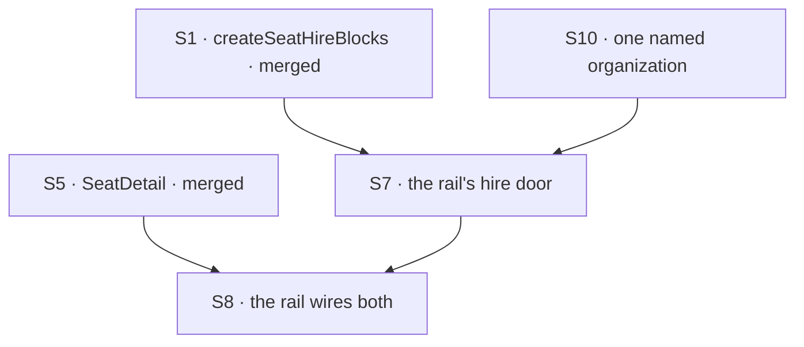

# FIX-1500 · Plan

[Spec](SPEC.md) · [Decisions](DECISIONS.md) · [Rules](BUSINESS-RULES.md) · **Plan** · [Docs](DOCS.md) · [Evolution](EVOLUTION.md)

Written for the implementing agent. IDs cross-reference [BUSINESS-RULES.md](BUSINESS-RULES.md)
(BR-n) and [DECISIONS.md](DECISIONS.md) (D-n, E-n). `tdd`. **Four PRs.** The two package PRs,
PR-A and PR-C, have merged. PR-B gives kitchen-sink its one organization. PR-D is the app PR,
and it waits on PR-B only ([PR plan](#pr-plan)).

## Surfaces

Only live rows appear here. What moved to FIX-1539 or was struck is listed in
[EVOLUTION.md](EVOLUTION.md#amendment-option-c).

| ID | Package · role | Change | Rules |
|---|---|---|---|
| S1 | `workforce` · the seat-hire sequence, model-free | **Merged in [#2123](https://github.com/fixpoint-labs/flow-state-dev/pull/2123).** `createSeatHireBlocks(options)` returns `{ hire, fire }`, the handlers `createSeatHireCapability` mounts as tools. The flow that mounts one as an action declares the roster and seat-inventory collections under `HIRED_ROSTER_RESOURCE` and `SEAT_INVENTORY_RESOURCE`. **Inherited, not fixed:** the inventory write after registration sits outside the compensation (BR-11), and `fire` leaves the inventory row ([FIX-1540](https://linear.app/fixpoint-labs/issue/FIX-1540)) | BR-11 – BR-15 BR-32 |
| S5 | `react` · `SeatDetail` | **Merged in [#2122](https://github.com/fixpoint-labs/flow-state-dev/pull/2122).** One seat's **kind** (a prop, no read) and **instructions** (one item read through the host's `resourceClient`), with five states kept apart | BR-5 BR-27 BR-29 – BR-31 |
| S10 | kitchen-sink · the one organization ([D6](DECISIONS.md#d6)) | Pass one host-level `resolvePrincipal` to `createFlowState` in `apps/kitchen-sink/fsdev.config.ts`. It returns `{ userId: "devuser", orgId: KITCHEN_SINK_ORG_ID }`, both constants, and reads **nothing** from the request (BP-031). It is the host's **fallback**: every flow with no resolver of its own resolves through it, which covers `chat-agent`, every seat and every channel. `workforce-admin` and `weekly-digest` keep their own resolvers ([E3](DECISIONS.md#e3)). **Pin `workforce-admin`'s organization.** `WORKFORCE_ADMIN_TOKENS` accepts only entries that name `KITCHEN_SINK_ORG_ID`. An entry naming any other organization is refused at boot, fail-closed and logged, the way a shared token is refused today. A token bound elsewhere would miss every rail and mara hire (POC N5). Move the app's own admin tests off `acme`/`bravo` to the pinned organization, and keep the collision rule. **The user is a constant as well**, because read routes carry no body (POC N7). Keep the Playwright suite green: its per-test `?e2eUserId=` no longer separates users, and how isolation survives is yours to decide, provided the organization still comes only from the constant. **A store written before this PR** has its channel sessions in the development organization, and the first boot after it cannot open them (POC N8). **There is no upgrade path: the store is wiped** ([H1](DECISIONS.md#h1), the owner's call). Before the channel open, the boot checks the store and, if any file-declared channel is stored under another organization, throws an error naming each one and the fix: delete the store. The check only reads. It never swallows the error, and never migrates, moves or deletes anything (V19). The kitchen-sink README says to wipe the store after upgrading | BR-1 BR-3 BR-4 BR-33 BR-34 |
| S7 | kitchen-sink · the hire door | On the flow the rail's session runs on: declare the roster and seat-inventory collections under the S1 keys, and add one action whose block **is** `createSeatHireBlocks(kitchenSinkSeatHireOptions).hire`. **One roster key.** `chat-agent` declares the panel's roster under `"roster"` today, and the hire block reads `HIRED_ROSTER_RESOURCE`. The two cannot both be declared on one flow, because definition refuses them as a resource collision (POC). So re-key the panel's roster to `HIRED_ROSTER_RESOURCE`. `kitchenSinkSeatHireOptions` is the **one shared options object** exported from `apps/kitchen-sink/workforce/hire.ts`, which FIX-1527's `createSeatHireCapability` takes too. Whichever of the two PRs lands first creates it, and the other imports it. Its `register` is `workforceRegistrar.registerFromRoster(seat, { pin })`, and its `unregister` goes through `workforceRegistrar.isFromRoster` before it releases anything. **The organization is the session's own binding**, through `ctx.org`, which S10 makes the kitchen-sink organization. It never comes from the body or from a credential ([D1](DECISIONS.md#d1), BR-2). No app code writes the roster | BR-1 – BR-3 BR-11 – BR-16 BR-32 |
| S8 | kitchen-sink · the rail | **Merged in [#2193](https://github.com/fixpoint-labs/flow-state-dev/pull/2193), and amended since ([E4](DECISIONS.md#e4)).** An open seat's `SeatDetail`, with its kind, and the hire affordance render in the navigator's **new open-leaf slot** (working name `leafDetail`): on their own line directly under the seat's row, inside the rail, indented at the leaf's column. The seat's row stays one line. `leafToolbar` draws on the row itself ([FIX-1561 D1](../FIX-1561/DECISIONS.md#d1)), so the pane does not go in it. The slot is FIX-1561's to publish ([its exception](../FIX-1561/DECISIONS.md#d1-leafdetail)), and this issue adds no package change of its own. The hire affordance calls S7, then refreshes the roster by a **specified, checked remount** ([D4](DECISIONS.md#d4)). `RosterProps` publishes no refresh, ref or version, and this issue adds none. `Roster`, `SeatDetail` and the hire use **one** roster ref, `HIRED_ROSTER_RESOURCE`, passed as `collectionRef`, because both components default to `"roster"`. No create affordance for a channel or a board | BR-5 BR-16 BR-24 BR-29 – BR-31 |
| S9 | Docs | `packages/workforce/README.md` and the `react` README shipped with PR-A and PR-C. The [DOCS.md](DOCS.md) site operations publish with the PR whose behaviour they describe. **No changeset for kitchen-sink**, which is private (BP-022) | — |

**Two rules are inherited rather than built.** BR-20 (a stored seat that cannot be brought back at
boot is named in the rail) is [FIX-1477](https://linear.app/fixpoint-labs/issue/FIX-1477)'s boot
report and `problems` prop. BR-17 (another browser seeing this one's hire) is
[FIX-1506](https://linear.app/fixpoint-labs/issue/FIX-1506)'s.

**What is *not* here.** Not the rail itself, meaning the `FlowNavigator` mount, the `Roster` and
`BoardColumns` panels, and the shell that holds them. Those are FIX-1477's, merged in
[#2113](https://github.com/fixpoint-labs/flow-state-dev/pull/2113). Not `fire` in the rail, not
runtime channel or board creation, and not a seat's skills, channels and boards
([FIX-1539](https://linear.app/fixpoint-labs/issue/FIX-1539)).

## Sequence



<a name="pr-plan"></a>
## PR plan

| PR | Surfaces | depends_on | Why this seam |
|---|---|---|---|
| PR-A | S1 · its README and doc comments · changeset | — | **Merged, [#2123](https://github.com/fixpoint-labs/flow-state-dev/pull/2123).** The public boundary first (BP-004) |
| PR-B | S10 | — | **Kitchen-sink only, no package change, no changeset.** It changes which organization the app runs as, and pins the operator's door to it, so it goes alone, and its e2e run is the fence. Without it, S7's hire is refused in the app as shipped ([D6](DECISIONS.md#d6)) |
| PR-C | S5 · the `react` README · changeset | — | **Merged, [#2122](https://github.com/fixpoint-labs/flow-state-dev/pull/2122).** |
| PR-D | S7 S8 · kitchen-sink docs | PR-B | The app. It carries the goal check. The rail it builds on is FIX-1477's, merged in [#2113](https://github.com/fixpoint-labs/flow-state-dev/pull/2113) with `SHOW_SEATS_IN_RAIL = true` (`apps/kitchen-sink/app/page.tsx:81`), so that dependency is satisfied |

**The completion gate is determinate: `VG` passes on PR-D.** It isn't "the rail looks right" and
it isn't a screenshot. It is the run in [BUSINESS-RULES.md](BUSINESS-RULES.md) → *Acceptance
criteria*, asserted including its network path.

### Changesets

| Fragment | Packages | Bump | Rides |
|---|---|---|---|
| `seat-hire-blocks` | `workforce` | `patch` | PR-A, merged |
| `seat-detail` | `react` | `patch` | PR-C, merged |
| — | kitchen-sink | **none** | PR-B and PR-D. Private (BP-022) |

## Checks

Every row names what would make it fail. A check with no producible red state proves nothing.

| ID | Runs after | Passes when | Would fail if — the red state |
|---|---|---|---|
| V1 – V3 | S1 | **Merged with PR-A**: one code path, `create()` as the duplicate refusal, and the compensating delete. See #2123 | — |
| V9 · V10 | S5 | **Merged with PR-C**: the host's credential reaches the read, and five distinct states. See #2122 | — |
| V11 | S7 | A hire whose body carries `orgId: "other"` lands in the **session's** organization | Read the body's value: the seat lands in `other`. The assertion is on *where the row ended up* (BR-2) |
| V12 | S8 | The actions this issue adds to the rail's flow are exactly the hire | Uses an **allow-list**, not a denylist of two names, so any added create action fails it (BR-24) |
| V14 | S7 | **Persistence boundary, two assertions, and NOT in the browser suite.** After a hire through the rail's action: (a) the row is in the durable store, read **out of band**; (b) a runtime built on a **fresh** store handle over the same location lists the seat | (a) goes red if the hire only registered in-process; (b) goes red if the reload is skipped. **Negative control for (b):** point boot two at an **empty** location. It must go red, or a module-level cache makes (b) pass while proving nothing (BR-18, BR-19) |
| V16 | S7 | The rail's hire action's block **is** the `hire` that `createSeatHireBlocks` returned | Mock the factory from `@flow-state-dev/workforce` to return marked blocks, and assert the action's block is the marked one. **Red: an app handler that writes the roster itself** (BR-32) |
| V17 | S8 | A user-owned seat `<org>.~<user>.<id>` whose short id matches an org-visible seat's opens as *not published*, with no roster read | Strip the user segment and read the roster: the pane shows the other seat's instructions (BR-31) |
| V18 | S10 | **Through the app's router**, not `runAction`: a session created on the rail's flow, on a seat and on a channel binds to `KITCHEN_SINK_ORG_ID`. A rail hire is read back through the rail's session, and a seat's `discover` lists it. Promote the POC's N1 to N3 over the app's real `fsdev.config.ts` wiring | Remove the resolver: every binding is the development organization and the hire is refused. That is the POC's `POC_RESOLVER=default` red (BR-1, BR-3, BR-33) |
| V19 | S10 | **On a persistent store written by the app before PR-B** (a pre-change boot, then the PR-B boot over the same location): the boot **refuses to start** with an error naming every file-declared channel stored under another organization and saying to delete the store. Afterwards every channel is still under its old organization, so nothing was migrated or moved. Once the store is deleted, the same location boots and a channel reads 200 under `kitchen-sink` | Remove the guard: the boot fails with the bare `could not be opened — Request failed (403)` (the POC's N8), which names neither the cause nor the fix (BR-34) |
| V20 | S10 | `pnpm --filter @flow-state-dev/kitchen-sink test:e2e` is green | Turns red wherever a scenario relied on its own `?e2eUserId=` user being separate |
| V22 | S10 | With `WORKFORCE_ADMIN_TOKENS="acme:t1,kitchen-sink:t2"`: the `acme` token gets a 401 and is named in the boot log, and the `kitchen-sink` token's `fire` releases a rail hire and a mara hire | Accept the `acme` binding: that token resolves and its fire answers `This organization hired no seat`, missing both hires. That is POC N5's `POC_ADMIN_ORG=acme` red |
| V21 | S7 | Firing a rail hire whose address is now held by a registration the roster did not make leaves that registration in place (`released: false`) | Pass `unregister` straight through: it releases the other registration. The POC's `POC_UNGUARDED=1` red (N6) |
| VG | S8 | **Playwright, against the Next-built app** (`apps/kitchen-sink/e2e/`): open the rail → open a **file-declared** seat → its **kind** renders under the seat's row, in the open-leaf slot → hire another instance of that kind, with instructions → **the hired** seat appears in the rail **with no page reload** → open it → its **kind and instructions** render under its row. The conversation's session carries no hire request. **The network log shows the instructions arriving from the collection route**, with no request to a developer-tool or app-private endpoint. **No restart step** | Serve the instructions from app-owned state: the DOM passes and the network assertion fails. Reload after the hire: the no-reload assertion goes red. Hire through a user-owned path: the hired seat never appears. Run it without PR-B: the hire is refused. **Both seats are named on purpose**: opening only the hired one never exercises the declared path. The suite runs `next start` itself with `STORE_TYPE: "memory"` (`apps/kitchen-sink/playwright.config.ts`), so a restart there cannot fail honestly. Durability is V14's |

**No model runs in any of this**, so no `goals/` check applies. `VG` is the real-path check, in a
suite that already drives the built app.

<a name="reuse"></a>
## Reuse — what already exists, so it is not written twice

| For | Use | Not |
|---|---|---|
| The hire sequence | `createSeatHireBlocks` (S1), the same code the catalog tool runs | `workforce-admin`'s handler, or a copy of either |
| The hire's options | `kitchenSinkSeatHireOptions` from `apps/kitchen-sink/workforce/hire.ts`, the object FIX-1527's mara takes too | A second options object. Two objects are how the rail and mara come to hire different `agent` kinds, or release addresses differently |
| A seat's kind | The navigator row's `kind`, from the flow listing the host holds | A read |
| A hired seat's instructions | `getCollectionItemState` on the host's resource client: one item, filtered at the source (BP-033) | Listing a roster page and filtering: a seat past the first page would read as *not published* |
| Reading one item, or a page of rows, into a panel | `usePanelItem` and `usePanelRows`, which share `useFencedRead`, so the stale-response fence lives once (#2122) | A third read hook with its own fence |
| The roster's default ref | `DEFAULT_ROSTER_REF`, exported once from `Roster` and imported by `SeatDetail` (#2122) | A second `"roster"` literal. S8 passes `HIRED_ROSTER_RESOURCE` anyway |
| Whether a row is a seat | `isSeat`, which requires `instructions` to be a string, `null` or absent, so an object never reaches React as a child (#2122) | A looser check of its own |
| An address to a roster topic | `splitSeatAddress(orgId, address)`, for an org-visible address only | A hand split, and never for `<org>.~<user>.<id>`, whose short id is not the public row's key |
| The organization a hire lands in | The session's own binding, which the sequence reads through `ctx.org`, and which S10 makes the kitchen-sink organization | `orgOf(credential)` as `workforce-admin` derives it. That is the **operator's** organization, which rebuilds the split D1 closes |
| Registering the hired seat | `workforceRegistrar.registerFromRoster(seat, { pin })` | `register`, which loses the provenance `fire` checks |
| Releasing it | `unregister` guarded by `workforceRegistrar.isFromRoster` | A bare `unregister`. The capability's own `fire` checks kind, not provenance |

## Pinned names

| Where | Name | Why pinned |
|---|---|---|
| `workforce` export | `createSeatHireBlocks(options: SeatHireCapabilityOptions): SeatHireBlocks` | Public, merged |
| `workforce` export | `SeatHireBlocks`, which is `{ readonly hire; readonly fire }` | Public, merged |
| `react` export | `SeatDetail` | Public, merged |
| kitchen-sink | `KITCHEN_SINK_ORG_ID = "kitchen-sink"` | The only organization `WORKFORCE_ADMIN_TOKENS` may name, and the one the docs name |
| kitchen-sink | `kitchenSinkSeatHireOptions`, exported from `workforce/hire.ts` | Two PRs in two issues import it (this one's PR-D and FIX-1527) |

Everything else is yours: the action's name, the resolver's module, hook names, file layout.

## Guardrails

| Rule | Because |
|---|---|
| **One** hire sequence for the capability and the rail; no third | Tenet 5. `workforce-admin` keeps its own, pre-existing, user-owned sequence, and converging it is not this issue ([Follow-ups](#follow-ups)) |
| The rail adds no roster or inventory write of its own | Every durable effect of a hire is the sequence's. A write beside it has no compensation |
| Organization never comes from a body, a query, a cookie or a caller-controlled header (BP-031). S10's is a constant | It is the whole of D1's safety, and of D6's |
| One resolver, on the host. No per-flow resolver on the rail's flow or on a seat kind | A second answer to "which organization" is how the rail and the seats come to disagree (POC N3) |
| The rail passes its own resource client to every panel it mounts (BR-27) | A panel left on its fallback client reads through no credential. FIX-1477 pinned this once already |
| *Not published*, *none given* and *could not be read* stay distinct | A declared seat and a failed read that look alike is the silent-partial failure this epic keeps finding |

## Docs

[DOCS.md](DOCS.md) carries the proposed prose and its publish order. Reconcile it against the
built behaviour before publishing. The limit in BR-4 is written for a reader.

## Sketch · pseudocode, illustrative, react to the shape

```
kitchen-sink runtime assembly (PR-B):
    createFlowState({ …, resolvePrincipal: () => ({ userId: "devuser", orgId: KITCHEN_SINK_ORG_ID }) })
                                                   ← constants; nothing read from the request

workforce/hire.ts (whichever of PR-D and FIX-1527 lands first):
    kitchenSinkSeatHireOptions = { kinds, register: registerFromRoster,
                                   unregister: isFromRoster && unregister, kindAt }

the rail's flow (PR-D):
    resources: roster + seat inventory, under the exported keys   ← the panel's roster re-keyed
    actions:   hireSeat → createSeatHireBlocks(kitchenSinkSeatHireOptions).hire

opening a seat:
    kind          ← the row the host holds                          no read
    instructions  ← org-visible:  getCollectionItemState(HIRED_ROSTER_RESOURCE, seatId)
                    otherwise:    "not published"                   no read
```

**POCs:**
- [`poc/evidence/`](poc/evidence/README.md): authoring-time evidence, not a gate. What it settled
  and what no longer holds is in [DECISIONS.md → Settled](DECISIONS.md#settled).
- [`poc/named-org/`](poc/named-org/README.md): D6's mechanism, run through the app's real router
  and kinds. Eight legs, each with a planted control seen red. It showed the host-level resolver
  holds D1 with no package change, and it found the user-id, roster-key and pre-change-store
  consequences recorded in S10, S7 and V19. What V19 asks of the pre-change store has since
  changed: it is wiped, not upgraded ([H1](DECISIONS.md#h1)).

## At implement time

Re-check these against the repo before building. Each of them moves.

- **Has FIX-1527 landed?** If it has, `kitchenSinkSeatHireOptions` exists. Import it, and don't
  build a second one.
- **Which ref does the shell declare the roster under?** It is `"roster"` on `main`
  (`apps/kitchen-sink/lib/workforce-shell.ts`, `ROSTER_REF`). Re-key it to
  `HIRED_ROSTER_RESOURCE` and pass that to both components. Either way the ref must contain **no
  slash**: the list route is `/sessions/:id/resources/:ref`, so `workforce/roster` parses as
  `ref: "workforce"`, `topic: "roster"` and reads the wrong thing. FIX-1477 hit it.
- **Can the host map a navigator address to a roster topic?** `splitSeatAddress` needs the
  session's organization, and the session record returned at creation carries `orgId`
  (`packages/engine/src/routes/session-routes.ts:347`). If the host cannot reach it, raise it.
- **When this lands, reconcile FIX-1475's retained rules so one story stands**, in particular
  BR-35, which code has already overtaken ([EVOLUTION.md](EVOLUTION.md#br35-overtaken)).
- **Has [FIX-1506](https://linear.app/fixpoint-labs/issue/FIX-1506) landed?** If it has, BR-17
  stops being a named non-goal and the refresh in S8 may become a subscription. If not, do not
  design one.
- **Has [FIX-1503](https://linear.app/fixpoint-labs/issue/FIX-1503) landed?** If it has, D1's and
  D6's *what would change my mind* is live. S10's resolver is replaced by a viewer's identity,
  and BR-4's documented limit is deleted rather than reworded.

<a name="blocked-on"></a>
## Blocked on

**Nothing outside this plan.** The rail merged with FIX-1477 (#2113). PR-D waits on PR-B, which is
this plan's own. What remains are limits this issue ships with.

**The restart half of the acceptance spine cannot run in the browser suite as configured.** That
suite launches `next start` itself and sets `STORE_TYPE: "memory"`, so it has no restart control,
and an in-memory store would discard the hired row anyway. BR-18 and BR-19 belong to V14, at node
level, until a persistent store profile exists along with a harness that genuinely replaces the
server process.

**There is no credential in this repository that represents a viewer, and there will not be one
in this issue.** Every operator token resolves to a single fixed machine user
(`ADMIN_USER_ID = "workforce-admin"`, `apps/kitchen-sink/lib/workforce-admin-auth.ts:40`). The
browser's identity is a caller-side constant a resolver cannot trust
(`const userId = e2eUserId ?? "devuser"`, `apps/kitchen-sink/app/page.tsx:143`). With no resolver,
a session binds to the framework's development organization
(`orgId: ctx.principal?.orgId ?? DEFAULT_ORG_ID`,
`packages/engine/src/routes/session-routes.ts:300`), and **a hire there is refused**, because that
organization's name is not a legal seat address. That is why [D6](DECISIONS.md#d6) exists: S10
gives every flow without a resolver of its own one named organization, set in host code, and pins
the operator's door to the same one. Real identity is
[FIX-1503](https://linear.app/fixpoint-labs/issue/FIX-1503), and it replaces S10.

**What that costs here is different from what it cost FIX-1477, and the difference is the point.**
FIX-1477's panels read an organization that a hire under an operator token had not written to, so
a configured deployment rendered them *correct and empty*. This issue's hire and read resolve
their organization the same way ([D1](DECISIONS.md#d1)), so they cannot disagree:

| Deployment | The rail |
|---|---|
| A clone with no operator tokens | **The whole spine works**, in the kitchen-sink organization. Every visitor hires into it, and every visitor reads it |
| Operator tokens configured | **The whole spine still works**, in the kitchen-sink organization. Tokens are bound to `kitchen-sink` (V22), so an operator administers the same seats and can fire a rail or mara hire. The operator's own hires are user-owned and are not listed in the rail |

That the operator's own hires stay out of the rail is a **known limit, documented in [DOCS.md](DOCS.md)**, not a defect for someone
to rediscover.

**Cross-session liveness is [FIX-1506](https://linear.app/fixpoint-labs/issue/FIX-1506)'s.** The
panels read on mount and after an action this rail performed. Do not design a subscription
against a seam that today delivers only the writer's own changes.

## Notes from review

Verbatim, from the spec PR. They are inputs, not instructions: adopt, adapt or discard them, and
you owe no justification for discarding one.

- "**Four PRs / five changeset fragments.** The A∥B substrate split is intellectually clean but
  costly for additive `patch` work. **Consider three PRs:** merge current PR-A + PR-B (workforce +
  react substrate), keep `SeatDetail`, keep kitchen-sink + `VG`. **Or** one changeset per PR
  instead of three workforce fragments on PR-B." — cursor
  ([thread](https://github.com/fixpoint-labs/flow-state-dev/pull/2061#pullrequestreview-cursor))
  — The plan went to three PRs because PR-B's surfaces left with [D5](DECISIONS.md#d5), not
  because this note was adopted. It is four again because [D6](DECISIONS.md#d6) put a new
  surface in the empty slot. Each PR still changes one package or one app.
- "**Doc triplication.** Rejected alternatives appear in the DECISIONS mermaid, each D-card, and
  'Considered and dropped'… **Blocked on** (~45 lines) restates D1/DOCS org limits." — cursor
  (*ibid.*). The tree, the cards' *Instead of* row and the dropped table answer three different
  questions the spec template requires separately. **Blocked on** stays long on purpose, because
  it carries the FIX-1503 argument, which is the part most likely to be re-litigated.
- "**Declared vs hired seats:** … VG fixtures should assert **both** paths, not only post-hire
  rows." — cursor, round 2
  ([review](https://github.com/fixpoint-labs/flow-state-dev/pull/2061#pullrequestreview-5282457130))
  — Adopted. VG names which seat is declared and which is hired, and asserts different things of
  each: kind for the declared seat, kind and instructions for the hired one.
- "**~230 lines of custom parsing is a lot for throwaway evidence. C2+C3 might suffice; reserve
  C1-style totality for the `packages/workforce` follow-up.**" — cursor, round 2 (*ibid.*)
  — **Declined.** A throwaway authoring script carries no maintenance burden, so the cost being
  cited is not being incurred.
- "**BR 'Proved by' could be check IDs only; keep red-state prose in PLAN only.**" — cursor,
  round 2 (*ibid.*)
- "**D1 / default-org story** … One canonical narrative (D1 + BR table); elsewhere one sentence +
  link." — cursor, round 2 (*ibid.*) — **Blocked on stays long, deliberately.** Re-litigation is
  exactly what is expected of the FIX-1503 argument.

<a name="follow-ups"></a>
## Follow-ups

- `fire` from the rail. The export carries it, so adding the affordance later writes no new
  sequence. Out of scope, because the spine does not ask for it.
- **`workforce-admin` keeps its own hire sequence**, which writes user-owned rows beside the
  package's org-visible one. Two sequences over one roster is the drift tenet 5 warns about.
  Converging them is a visibility question as well as a refactor. Named, not filed.
- **The seat-hire sequence's inventory write sits outside its compensation** (BR-11). A failure
  there leaves a hired, registered seat with no inventory row. Named, not filed. It belongs
  beside [FIX-1540](https://linear.app/fixpoint-labs/issue/FIX-1540), not inside this export.
- **Nothing asserts, going forward, that every collection in `packages/workforce` has *decided*
  about browser readability.** The authoring-time checker did it once, and its re-run at the
  amendment already finds an unclassified collection (the private roster writer). The standing
  version belongs in `packages/workforce` and has to enumerate from **source**, because these
  collections are built inside factory functions.
- **`fsdev run` and `fsdev chat` never consult the app's resolver.** They pin the development
  organization (`packages/cli/src/commands/run.ts:304`, `:373`;
  `packages/cli/src/chat/turn.ts:136`). So after S10, a seat run from the CLI is still in a
  different organization from the same seat run from the browser. That's a package question.
  Named, not filed.
