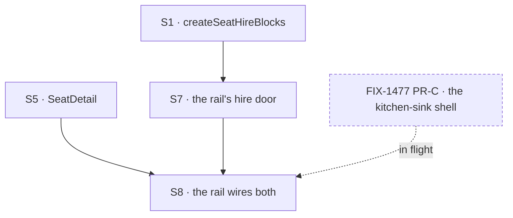

# FIX-1500 · Plan

[Spec](SPEC.md) · [Decisions](DECISIONS.md) · [Rules](BUSINESS-RULES.md) · **Plan** · [Docs](DOCS.md) · [Evolution](EVOLUTION.md)

Written for the implementing agent. IDs cross-reference [BUSINESS-RULES.md](BUSINESS-RULES.md)
(BR-n) and [DECISIONS.md](DECISIONS.md) (D-n, E-n). `tdd`. **Three PRs**: two package PRs that
stand alone, and the app PR that waits on them and on the rail ([PR plan](#pr-plan)).

## Surfaces

| ID | Package · role | Change | Rules |
|---|---|---|---|
| S1 | `workforce` · the seat-hire sequence, model-free | **Add `createSeatHireBlocks(options)`** ([E1](DECISIONS.md#e1)). It returns `{ hire, fire }`: the two handlers that are local to `createSeatHireCapability` today, moved **verbatim** — same names (`hire`, `fire`), descriptions, schemas, refusals, order and compensation. `createSeatHireCapability` then builds its tools preset from that call and changes nothing else. Define the factory in a module the capability imports, so V1 can intercept it; re-export it from the package root beside `createSeatHireCapability`. The flow that mounts a handler as an action declares the roster and seat-inventory collections under `HIRED_ROSTER_RESOURCE` and `SEAT_INVENTORY_RESOURCE`, as the capability does for a worker kind. **Inherited, not fixed:** the inventory write after registration sits outside the compensation (BR-11), and `fire` leaves the inventory row ([FIX-1540](https://linear.app/fixpoint-labs/issue/FIX-1540)) | BR-11 – BR-15 BR-32 |
| ~~S2~~ | **Moved to [FIX-1539](https://linear.app/fixpoint-labs/issue/FIX-1539).** No pane in this issue reads an inventory collection ([D3](DECISIONS.md#d3)) | — | — |
| ~~S3~~ | **Struck.** This issue stores no skills anywhere; skills are FIX-1539's ([D2](DECISIONS.md#d2)) | — | — |
| ~~S4~~ | **Struck.** This issue adds no inventory write of its own. The seat-hire sequence it reuses writes one, under FIX-1525's contract ([EVOLUTION](EVOLUTION.md#br35-overtaken)) | — | — |
| S5 | `react` · `SeatDetail` | One seat's **kind** and **instructions**. Kind is a prop from the row the host already holds — the navigator's flow listing — and costs no read. Instructions are **one item read**, `getCollectionItemState(sessionId, rosterRef, seatId)`, through a `resourceClient` prop typed `Pick<ResourceClient, "getCollectionItemState">` — the same prop, and the same credential-less fallback when it is left out, that `Roster` and `BoardColumns` ship with. The rail **passes its own client** so the read carries its credential (BR-27). The host passes a `seatId` only for an org-visible seat; a user-owned address gets *not published* with no read (BR-31). Five states, kept apart: the instructions, *none given*, *not published*, still reading, could not be read | BR-5 BR-27 BR-29 – BR-31 |
| ~~S6~~ | **Moved to [FIX-1539](https://linear.app/fixpoint-labs/issue/FIX-1539).** `topicPrefix` served the channels section; the instructions read is a single-item read and needs no prefix | — | — |
| S7 | kitchen-sink · the hire door | On the flow the rail's session runs on: declare the roster and seat-inventory collections under the S1 keys, build `createSeatHireBlocks({ kinds: kitchenSinkKinds, register: (seat, pin) => workforceRegistrar.registerFromRoster(seat, { pin }), unregister, kindAt })`, and add one action whose block **is** the returned `hire`. `registerFromRoster`, not `register`: it records the provenance `workforce-admin`'s `fire` checks. **The organization is the session's own binding**, through `ctx.org` — never the body, and never a credential's ([D1](DECISIONS.md#d1), BR-2). No app code writes the roster | BR-1 – BR-3 BR-11 – BR-16 BR-32 |
| S8 | kitchen-sink · the rail | A seat row opens `SeatDetail` with its kind. The hire affordance calls S7, then refreshes the roster by a **specified, checked remount** ([D4](DECISIONS.md#d4)) — `RosterProps` publishes no refresh, ref or version, and this issue adds none. The `Roster` panel and the hire use **one** roster ref, `HIRED_ROSTER_RESOURCE`. No create affordance for a channel or a board | BR-5 BR-16 BR-24 BR-29 – BR-31 |
| S9 | Docs · changesets | Each public surface's documentation rides its own PR: `packages/workforce/README.md` and the export's doc comments (BP-007) with PR-A, the `react` README with PR-C, the [DOCS.md](DOCS.md) site operations with the PR whose behaviour they describe. **None for kitchen-sink** — private (BP-022) | — |

**Two rules are inherited rather than built.** BR-20 (a stored seat that cannot be brought back at
boot is named in the rail) is [FIX-1477](https://linear.app/fixpoint-labs/issue/FIX-1477)'s boot
report and `problems` prop. BR-17 (another browser seeing this one's hire) is
[FIX-1506](https://linear.app/fixpoint-labs/issue/FIX-1506)'s.

**What is *not* here.** The rail itself — the `FlowNavigator` mount, the `Roster` and
`BoardColumns` panels and the shell that holds them — is
[FIX-1477](https://linear.app/fixpoint-labs/issue/FIX-1477)'s S8 ([Blocked on](#blocked-on)). Nor
`fire` in the rail, runtime channel or board creation, or a seat's skills, channels and boards
([FIX-1539](https://linear.app/fixpoint-labs/issue/FIX-1539)).

## Sequence



The dashed node is another issue's surface, not one of this plan's.

<a name="pr-plan"></a>
## PR plan

| PR | Surfaces | depends_on | Why this seam |
|---|---|---|---|
| PR-A | S1 · its README and doc comments · changeset | — | The public boundary first (BP-004): an additive export whose only regression fence is the existing seat-hire suite plus V1, so it goes alone |
| PR-B | — | — | **Empty.** Its surfaces, S2 and S6, moved to FIX-1539 |
| PR-C | S5 · the `react` README · changeset | — | The component. It reads the roster collection, which is already browser-readable, so nothing in this plan precedes it |
| PR-D | S7 S8 · kitchen-sink docs | PR-A, PR-C, [FIX-1477](https://linear.app/fixpoint-labs/issue/FIX-1477) PR-C | The app. The only one that waits, and the only one carrying the goal check. FIX-1477 PR-C, the shell, is being built now in its own PR; this issue does not re-own it |

PR-A and PR-C are independent and can be reviewed in parallel; each changes one package, so a red
check in either names its own cause.

**The completion gate is determinate: `VG` passes on PR-D.** Not "the rail looks right" and not a
screenshot — the run in [BUSINESS-RULES.md](BUSINESS-RULES.md) → *Acceptance criteria*, asserted
including its network path.

### Changesets

| Fragment | Packages | Bump | Rides |
|---|---|---|---|
| `seat-hire-blocks` | `workforce` | `patch` | PR-A |
| `seat-detail` | `react` | `patch` | PR-C |
| — | kitchen-sink | **none** | private (BP-022) |

Both `patch`: each is a new export and changes nothing a consumer already calls
([release-notes-workflow.md](../../../docs/contributing/release-notes-workflow.md#pre-10-discipline-current-state)).
Each names FIX-1500.

## Checks

Every row names what would make it fail. A check with no producible red state proves nothing.

| ID | Runs after | Passes when | Would fail if — the red state |
|---|---|---|---|
| V1 | S1 | **One code path.** The capability's `hire` tool is the block `createSeatHireBlocks` returned — and the existing seat-hire suite passes with **no edits** | Mock the factory's module so it returns marked blocks that pass through to the real ones, build the capability, drive a seat's `hire` call through the existing harness, and assert the marked block ran. **Red: the capability defines its own `hire` handler again** — the marked block never runs. The unedited suite is the additive-only fence: any change to the tool's inputs, outputs, refusals or compensation it covers turns it red |
| V2 | S1 | Two hires of one id through the export, with `kindAt` omitted, leave one roster row; the second is refused **by `create()` throwing**, both in sequence and arriving at once | Replace `create()` with `upsert()`. The existing suite cannot catch this — its duplicate test is refused earlier, by `kindAt` — so this check exists (BR-12, BR-13) |
| V3 | S1 | `register` throwing leaves **no roster row and no inventory row**, read back from both collections | Remove the compensating delete: the roster row survives and the check goes red. Asserted by reading back, not by trusting the error (BR-15) |
| ~~V4 – V8~~ | — | **Moved to FIX-1539** with S2 and S6. They checked the inventory's browser read and the `topicPrefix` read | — |
| V9 | S5 | Rendered against a deployment whose resource routes require `Authorization`, with the host passing its own resource client, the instructions arrive | Ignore the prop and read through the fallback client, or build the component on `useResourceCollection`: either 401s, because neither carries the host's credential. This is [FIX-1477's V16](../FIX-1477/PLAN.md#checks) pointed at a third component (BR-27) |
| V10 | S5 | The instructions section shows five distinguishable states: the text, *none given*, *not published*, still reading, could not be read | Collapse *not published* and *could not be read*: a declared seat and a read that 403'd look the same, and the check goes red. That is the silent-partial shape (BR-30, BR-31) |
| V11 | S7 | A hire whose body carries `orgId: "other"` lands in the **session's** organization | Read the body's value: the seat lands in `other`. The assertion is on *where the row ended up* (BR-2) |
| V12 | S8 | The actions this issue adds to the rail's flow are exactly the hire | An **allow-list**, not a denylist of two names, so any added create action fails it (BR-24) |
| ~~V13~~ | — | **Retired with S4** | — |
| V14 | S7 | **Persistence boundary, two assertions, and NOT in the browser suite.** After a hire through the rail's action: (a) the row is in the durable store read **out of band**; (b) a runtime built on a **fresh** store handle over the same location lists the seat | (a) goes red if the hire only registered in-process; (b) if the reload is skipped. **Negative control for (b):** point boot two at an **empty** location — it must go red, or a module-level cache makes (b) pass while proving nothing (BR-18, BR-19) |
| ~~V15~~ | — | **Dropped in review** (BP-037): a spec directory is design history, not a home for CI machinery. [EVOLUTION.md](EVOLUTION.md#v15) | — |
| V16 | S7 | The rail's hire action's block **is** the `hire` that `createSeatHireBlocks` returned | Mock the factory from `@flow-state-dev/workforce` to return marked blocks and assert the action's block is the marked one. **Red: an app handler that writes the roster itself** (BR-32) |
| V17 | S5 S8 | A user-owned seat `<org>.~<user>.<id>` whose short id matches an org-visible seat's opens as *not published*, with no roster read | Strip the user segment and read the roster: the pane shows the other seat's instructions (BR-31) |
| VG | S8 | **Playwright, against the Next-built app** (`apps/kitchen-sink/e2e/`): open the rail → open a **file-declared** seat → its **kind** renders → hire another instance of that kind, with instructions → **the hired** seat appears **with no page reload** → open it → its **kind and instructions** render. **The network log shows the instructions arriving from the collection route**, with no request to a developer-tool or app-private endpoint. **No restart step** | Serve the instructions from app-owned state: the DOM passes and the network assertion fails. Reload after the hire: the no-reload assertion goes red. Hire through a user-owned path: the hired seat never appears. **Both seats are named on purpose**: opening only the hired one never exercises the declared path. The suite runs `next start` itself with `STORE_TYPE: "memory"` (`apps/kitchen-sink/playwright.config.ts`), so a restart there cannot fail honestly; durability is V14's |

**No model runs in any of this**, so no `goals/` check applies. `VG` is the real-path check, in a
suite that already drives the built app.

## Reuse — what already exists, so it is not written twice

| For | Use | Not |
|---|---|---|
| The hire sequence | `createSeatHireBlocks` (S1) — the same code the catalog tool runs | `workforce-admin`'s handler, or a copy of either |
| A seat's kind | The navigator row's `kind`, from the flow listing the host holds | A read |
| A hired seat's instructions | `getCollectionItemState` on the host's resource client — one item, filtered at the source (BP-033) | Listing a roster page and filtering: a seat past the first page would read as *not published* |
| An address to a roster topic | `splitSeatAddress(orgId, address)`, for an org-visible address only | A hand split — and never for `<org>.~<user>.<id>`, whose short id is not the public row's key |
| The organization a hire lands in | The session's own binding, which the sequence reads through `ctx.org` | `orgOf(credential)` as `workforce-admin` derives it — the **operator's** organization, which rebuilds the split D1 closes |
| Registering the hired seat | `workforceRegistrar.registerFromRoster(seat, { pin })` | `register`, which loses the provenance `fire` checks |

## Pinned names

| Where | Name | Why pinned |
|---|---|---|
| `workforce` export | `createSeatHireBlocks(options: SeatHireCapabilityOptions): SeatHireBlocks` | Public. Named for what it returns, beside `createSeatHireCapability`, and taking that factory's options type unchanged |
| `workforce` export | `SeatHireBlocks` — `{ readonly hire; readonly fire }`, the two handlers | Public; the handlers keep the tool names `hire` and `fire` |
| `react` export | `SeatDetail` | Public, beside `Roster` and `BoardColumns` |

Everything else — the action's name, `SeatDetail`'s prop names, hook names, file layout — is yours.

## Guardrails

| Rule | Because |
|---|---|
| **One** hire sequence for the capability and the rail; no third | Tenet 5. `workforce-admin` keeps its own, pre-existing, user-owned sequence; converging it is not this issue ([Follow-ups](#follow-ups)) |
| S1 is additive: the tool's inputs, outputs, refusals and compensation stay byte-for-byte | The unedited seat-hire suite is the only fence on the capability, and a move that also edits behaviour disarms it. The two inherited gaps (BR-11, FIX-1540) are fixed where they are tracked, not inside this export |
| The rail adds no roster or inventory write of its own | Every durable effect of a hire is the sequence's. A write beside it has no compensation |
| Organization never comes from a body, a query or a caller-controlled header (BP-031) | It is the whole of D1's safety |
| The rail passes its own resource client to every panel it mounts (BR-27) | A panel left on its fallback client reads through no credential. FIX-1477 pinned this once already |
| *Not published*, *none given* and *could not be read* stay distinct | A declared seat and a failed read that look alike is the silent-partial failure this epic keeps finding |

## Docs

[DOCS.md](DOCS.md) carries the proposed prose and its publish order. Reconcile it against the
built behaviour before publishing; the limit in BR-4 is written for a reader.

## Sketch · pseudocode, illustrative, react to the shape

```
workforce package:
    createSeatHireBlocks(options) → { hire, fire }     ← today's tool handlers, moved verbatim
    createSeatHireCapability(options):
        tools = createSeatHireBlocks(options)          ← one code path

the rail's flow:
    resources: roster + seat inventory, under the exported keys
    actions:   hireSeat → blocks.hire                  ← org from the session, never the body

opening a seat:
    kind          ← the row the host holds                          no read
    instructions  ← org-visible:  getCollectionItemState(roster, seatId)
                    otherwise:    "not published"                   no read
```

**POC:** [`poc/evidence/`](poc/evidence/README.md) — authoring-time evidence, not a gate. What it
settled and what no longer holds is in [DECISIONS.md → Settled](DECISIONS.md#settled).

## At implement time

Re-check these against the repo before building; each of them moves.

- **Is the rail mounted yet?** It is FIX-1477 PR-C's, in flight as this amendment was written.
  PR-A and PR-C need none of it. **PR-D cannot land without it.** If it is still unbuilt when PR-D
  is ready, raise it — do not widen PR-D to build it, and do not mount the components yourself to
  get a check green.
- **Have the capability's handlers changed?** S1 moves them verbatim, so read them fresh.
  [FIX-1527](https://linear.app/fixpoint-labs/issue/FIX-1527) is being specced against the same
  capability, through the tool path, and does not change its surface.
- **Which ref does the shell declare the roster under?** Use `HIRED_ROSTER_RESOURCE` for both the
  panel and the hire. If FIX-1477 PR-C lands with another ref on the rail's flow, align on one
  rather than declaring the pattern twice. Either way the ref must contain **no slash**: the list
  route is `/sessions/:id/resources/:ref`, so `workforce/roster` parses as `ref: "workforce"`,
  `topic: "roster"` and reads the wrong thing. FIX-1477 hit it.
- **Can the host map a navigator address to a roster topic?** `splitSeatAddress` needs the
  session's organization; the session record returned at creation carries `orgId`
  (`packages/engine/src/routes/session-routes.ts:347`). If the host cannot reach it, raise it.
- **When this lands, reconcile FIX-1475's retained rules so one story stands** — in particular
  BR-35, which code has already overtaken ([EVOLUTION.md](EVOLUTION.md#br35-overtaken)).
- **Has [FIX-1506](https://linear.app/fixpoint-labs/issue/FIX-1506) landed?** If it has, BR-17
  stops being a named non-goal and the refresh in S8 may become a subscription. If not, do not
  design one.
- **Has [FIX-1503](https://linear.app/fixpoint-labs/issue/FIX-1503) landed?** If it has, D1's
  *what would change my mind* is live: the hire door goes behind a viewer identity and BR-4's
  documented limit is deleted rather than reworded.

<a name="blocked-on"></a>
## Blocked on

**One dependency outside this plan, and three limits it ships with. None is a reason to hold the
design.**

**The rail is [FIX-1477](https://linear.app/fixpoint-labs/issue/FIX-1477)'s S8, assigned to its
PR-C** ([its plan](../FIX-1477/PLAN.md#pr-plan)) and being built in a separate PR now. That surface
is the kitchen-sink shell whose left rail is one `FlowNavigator` with Channels and Seats sections
and whose right panel is `BoardColumns` plus `Roster`. This issue builds what a seat row opens
*into* and the hire door beside it; a second navigator is an invent-kill. **PR-D is the only part
of this plan that needs it.**

**The restart half of the acceptance spine cannot run in the browser suite as configured.** That
suite launches `next start` itself and sets `STORE_TYPE: "memory"`, so it has no restart control
and an in-memory store would discard the hired row anyway. BR-18 and BR-19 are V14's, at node
level, until a persistent store profile and a harness that genuinely replaces the server process
exist.

**There is no credential in this repository that represents a viewer, and there will not be one
in this issue.** Every operator token resolves to a single fixed machine user
(`ADMIN_USER_ID = "workforce-admin"`, `apps/kitchen-sink/lib/workforce-admin-auth.ts:40`), and the
browser's identity is a caller-side constant a resolver cannot trust
(`const userId = e2eUserId ?? "devuser"`, `apps/kitchen-sink/app/page.tsx:95`). So a session binds
to its principal's organization, or to the default one when there is no principal
(`orgId: ctx.principal?.orgId ?? DEFAULT_ORG_ID`,
`packages/engine/src/routes/session-routes.ts:285`). Real identity is
[FIX-1503](https://linear.app/fixpoint-labs/issue/FIX-1503).

**What that costs here is different from what it cost FIX-1477, and the difference is the point.**
FIX-1477's panels read an organization that a hire under an operator token had not written to, so
a configured deployment rendered them *correct and empty*. This issue's hire and read resolve
their organization the same way ([D1](DECISIONS.md#d1)), so they cannot disagree:

| Deployment | The rail |
|---|---|
| A clone with no operator tokens | **The whole spine works.** Hire and read are both the default organization, and every acceptance step closes |
| Operator tokens configured | **The whole spine still works**, on the default organization. Seats hired under a token are in that token's organization, owned by its operator user, and are not listed here. The rail is never empty-for-no-reason; the docs say what it shows |

That second row is a **known limit, documented in [DOCS.md](DOCS.md)** — not a defect for someone
to rediscover.

**Waiting would be incoherent, not cautious.** FIX-1503's own *Out* section names FIX-1477 and
rules out hard-blocking kitchen-sink on it, and this issue's own fences name *"hard-blocking the
slice on every soft-related cleanup"* as an invent-kill.

**Cross-session liveness is [FIX-1506](https://linear.app/fixpoint-labs/issue/FIX-1506)'s.** The
panels read on mount and after an action this rail performed. Do not design a subscription
against a seam that today delivers only the writer's own changes.

## Notes from review

Verbatim, from the spec PR. Inputs, not instructions — adopt, adapt or discard; you owe no
justification for discarding one.

- "**Four PRs / five changeset fragments.** The A∥B substrate split is intellectually clean but
  costly for additive `patch` work. **Consider three PRs:** merge current PR-A + PR-B (workforce +
  react substrate), keep `SeatDetail`, keep kitchen-sink + `VG`. **Or** one changeset per PR
  instead of three workforce fragments on PR-B." — cursor
  ([thread](https://github.com/fixpoint-labs/flow-state-dev/pull/2061#pullrequestreview-cursor))
  — The plan is now three PRs with one fragment each, because PR-B's surfaces left with
  [D5](DECISIONS.md#d5), not because this note was adopted. Each remaining PR still changes one
  package, which is the attributability argument the note was declined on.
- "**Doc triplication.** Rejected alternatives appear in the DECISIONS mermaid, each D-card, and
  'Considered and dropped'… **Blocked on** (~45 lines) restates D1/DOCS org limits." — cursor
  (*ibid.*). The tree, the cards' *Instead of* row and the dropped table answer three different
  questions the spec template requires separately. **Blocked on** stays long on purpose; it
  carries the FIX-1503 argument, which is the part most likely to be re-litigated.
- "**Declared vs hired seats:** … VG fixtures should assert **both** paths, not only post-hire
  rows." — cursor, round 2
  ([review](https://github.com/fixpoint-labs/flow-state-dev/pull/2061#pullrequestreview-5282457130))
  — Adopted. VG names which seat is declared and which is hired, and asserts different things of
  each: kind for the declared seat, kind and instructions for the hired one.
- "**~230 lines of custom parsing is a lot for throwaway evidence. C2+C3 might suffice; reserve
  C1-style totality for the `packages/workforce` follow-up.**" — cursor, round 2 (*ibid.*)
  — **Declined.** A throwaway authoring script carries no maintenance burden, so the cost being
  cited is not being incurred.
- "**BR 'Proved by' could be check IDs only; keep red-state prose in PLAN only.**" — cursor,
  round 2 (*ibid.*)
- "**D1 / default-org story** … One canonical narrative (D1 + BR table); elsewhere one sentence +
  link." — cursor, round 2 (*ibid.*) — **Blocked on stays long, deliberately.** Re-litigation is
  exactly what is expected of the FIX-1503 argument.

<a name="follow-ups"></a>
## Follow-ups

- `fire` from the rail. The export carries it, so adding the affordance later writes no new
  sequence. Out of scope: the spine does not ask for it.
- **`workforce-admin` keeps its own hire sequence**, which writes user-owned rows, beside the
  package's org-visible one. Two sequences over one roster is the drift tenet 5 warns about.
  Converging them is a visibility question as well as a refactor. Named, not filed.
- **The seat-hire sequence's inventory write sits outside its compensation** (BR-11): a failure
  there leaves a hired, registered seat with no inventory row. Named, not filed; it belongs
  beside [FIX-1540](https://linear.app/fixpoint-labs/issue/FIX-1540), not inside this export.
- **Nothing asserts, going forward, that every collection in `packages/workforce` has *decided*
  about browser readability.** The authoring-time checker did it once; its re-run at the
  amendment already finds an unclassified collection (the private roster writer). The standing
  version belongs in `packages/workforce` and has to enumerate from **source**, because these
  collections are built inside factory functions.
