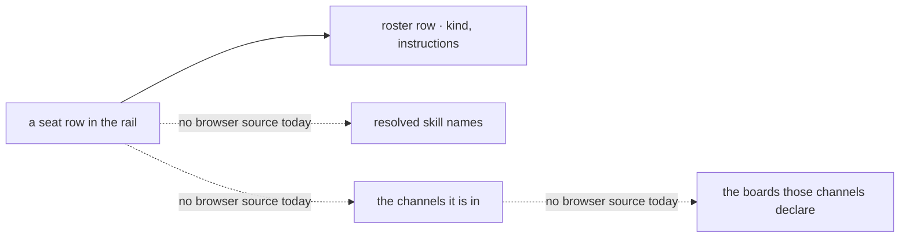

# FIX-1500 · Goal 1 human path — channel + seat UX

**Spec** · [Decisions](DECISIONS.md) · [Rules](BUSINESS-RULES.md) · [Plan](PLAN.md) · [Docs](DOCS.md) · [Evolution](EVOLUTION.md)

Feature · `workforce` + `react` + kitchen-sink · large · 4 PRs · epic
[FIX-1455](https://linear.app/fixpoint-labs/issue/FIX-1455) ·
[epic spec](../../epics/FIX-1455/SPEC.md)

## Five people, before and after

| Someone who… | Today | After |
|---|---|---|
| **runs Goal 1 acceptance** | Proves the pieces one at a time and in different places — a hire through an HTTP call, a roster in a panel, a board in the developer tool. No single run starts and finishes in the human rail, so the published goal has never actually been tested | One run: open the rail, open a seat, hire another of its kind, watch it appear, restart the app, find it still there |
| **opens a seat in the rail** | Reads its name in a roster list, and that is all there is. Its kind, the skills it can reach and the channels it sits in are nowhere in the human rail — a developer can go digging in the developer tool's resource tree, which is explicitly not what this goal is about | Opens it and reads its kind, the skills its own folders resolved for it, the channels it is in, and the boards those channels declare |
| **wants a second seat of a kind they already have** | Needs an operator's bearer token and something that speaks HTTP. In a clone with no token configured there is **no hire path at all** — the door is not registered | Hires it from the seat surface. The new seat appears in the same list, without a page reload and without opening the developer tool |
| **restarts the app after hiring** | Cannot tell whether anything survived, because nothing in the human rail ever showed the seat in the first place | Comes back to the same rail and the seat is there, rebuilt from durable organization state rather than from the process that hired it |
| **runs a deployment that configures operator tokens** | The rail reads the default organization and shows none of what was hired under a token — correct, empty, and unexplained | The rail hires **and** reads one organization, so the two can no longer disagree. With no viewer identity that organization is the default one, and the app says so |

The pieces of a Workforce all exist and none of them meet. A person can be shown a roster, or
shown a board, or told that a hire persisted — each by a different tool, none of them the app
somebody would copy. Goal 1 is a claim about a *person running an org*, and a claim like that is
only tested by a run that a person could have done.

## What changes


Look at the organization boxes. On the left there are two and nothing joins them, which is why a
hire can succeed and the rail still show nothing. On the right there is one, because hire and read
now resolve their organization by the same framework path — so whatever organization the rail is
looking at is the organization it hires into, and the empty-panel failure is not fixed so much as
made unreachable.

**Hiring a second seat, as a person does it:**

```diff
  Seats ▸ support.ada                     kind: agent
+   skills   triage · escalate · draft
+   channels support.desk · support.ada-wren
+   boards   support.desk.followups · support.desk.escalations
+
+   [ Hire another agent ]  →  id: support.bruno
+                              hired. support.bruno appears in the roster.
```

**And what the app's own wiring gains — one action, on the flow the rail already runs on:**

```diff
  defineFlow({
    kind: "chat-agent",
    requireUser: true,
+   resources: { roster: defineHiredRosterCollection() },
+   actions: {
+     // The organization comes from the session's principal, or the default one.
+     // The body is never asked. Same stored contract as the operator's door.
+     hireSeat: { inputSchema: hireSeatInput, block: hireSeatBlock },
+   },
  })
```

## How a seat's detail is assembled — and what does not exist yet



**One of the four reads exists. Three do not, and review found that after the first draft claimed
otherwise.** The roster is already browser-readable and answers a seat's kind. The other three
have no path to a browser in this app today:

| What a seat detail shows | Where the answer lives | Reachable from a browser? |
|---|---|---|
| kind, instructions | the hired-roster collection | **Yes** — already declared readable, and the panels read it |
| resolved skills | each seat flow's own config bag (`seatSkills`), computed at boot from folders | **No.** Config is not a readable surface |
| the channels it is in | the live inventory's membership index | **No.** `openInventory` is called nowhere in this app — verified, and [FIX-1475](https://linear.app/fixpoint-labs/issue/FIX-1475) says the same: *"Standing one up is a surface, not a line"* |
| declared board names | `CHANNEL.md` → a channel action's **output** schema | **No.** Action output has no path to a browser; a channel's *session state* carries members, instructions and transcript, and no boards |

So the honest statement of this issue's cost is: **the seat detail needs a browser-readable source
for three things that have none**, and building it is a surface rather than a wiring change. That
is a scope question the objective does not already answer, so it is [open](DECISIONS.md#open)
rather than decided here.

Everything else in this spec stands on its own and is unaffected: the hire door and its one
organization ([D1](DECISIONS.md#d1)), the extracted hire sequence, durable persistence across a
restart, and the rail reaching a channel's board once a board name is obtainable.

## What stays as it is

- **The rail itself.** One `FlowNavigator`, sections by kind, depth from cardinality — the epic's
  D8 and [FIX-1477](https://linear.app/fixpoint-labs/issue/FIX-1477)'s. This issue adds what a seat
  row opens *into*; it does not add a second navigator or fork a tree browser.
- **The operator's hire door.** `workforce-admin` keeps its bearer credential, its organization
  from that credential, and its fail-closed registration. It gains one thing: it stops being the
  only place the hire sequence is written down.
- **What a durable hire *is*.** The same roster collection, the same `create()`-not-`upsert()`
  refusal of a duplicate, the same compensating delete when registration fails
  ([FIX-1475](https://linear.app/fixpoint-labs/issue/FIX-1475)). No second persistence layer.
- **Channel and board creation at runtime.** Still out, still parked on
  [FIX-1415](https://linear.app/fixpoint-labs/issue/FIX-1415). This browses what a `CHANNEL.md`
  declared.
- **Skills authoring.** A seat's skills are shown, not edited, and not registered a second time.
- **Cross-session liveness.** A panel reads on mount and after an action this rail performed. One
  browser watching another browser's hire is
  [FIX-1506](https://linear.app/fixpoint-labs/issue/FIX-1506)'s.

## Sign off

1. **[D1](DECISIONS.md#d1) · The rail's hire door is an action on the flow the rail's own session
   already runs on, not the operator's credentialed flow reached from a browser.** If wrong: in a
   deployment that authenticates nobody, anybody who can open the app can hire a seat into the
   default organization — and reversing it later means the Goal 1 run stops being demonstrable
   until identity ships.
2. **[D2](DECISIONS.md#d2) · A seat's skills are the names its own folders resolved at boot —
   a boot-fresh register, not a live one.** If wrong: the rail shows a list that a skill added
   since the last restart is missing from, and we have promised a live view we do not have.
   *Where* they are published is [Open 1](DECISIONS.md#open)'s and is not part of this card.
3. **[D3](DECISIONS.md#d3) · The live inventory becomes ordinary readable in-organization data,
   on the same terms the roster and the board already are.** If wrong: three more collections any
   member of an organization can list, and taking that back later breaks whatever reads them.

**Open: one, and it gates part of what this delivers.** How a seat's skills, channels and boards
become browser-readable at all — [DECISIONS.md → Open](DECISIONS.md#open). How the rail refreshes
after a hire is **not** open: it is the checked remount of [D4](DECISIONS.md#d4). There is also a
**conflict with an approved spec** raised rather than settled:
[EVOLUTION.md → the BR-35 clash](EVOLUTION.md#br35-conflict).

Number 1 is still the decision to weigh — it is the only line here whose cost is not recoverable
by editing code. The reasoning, what each rejected and what each locks in is in
[DECISIONS.md](DECISIONS.md); the cases in [BUSINESS-RULES.md](BUSINESS-RULES.md).
