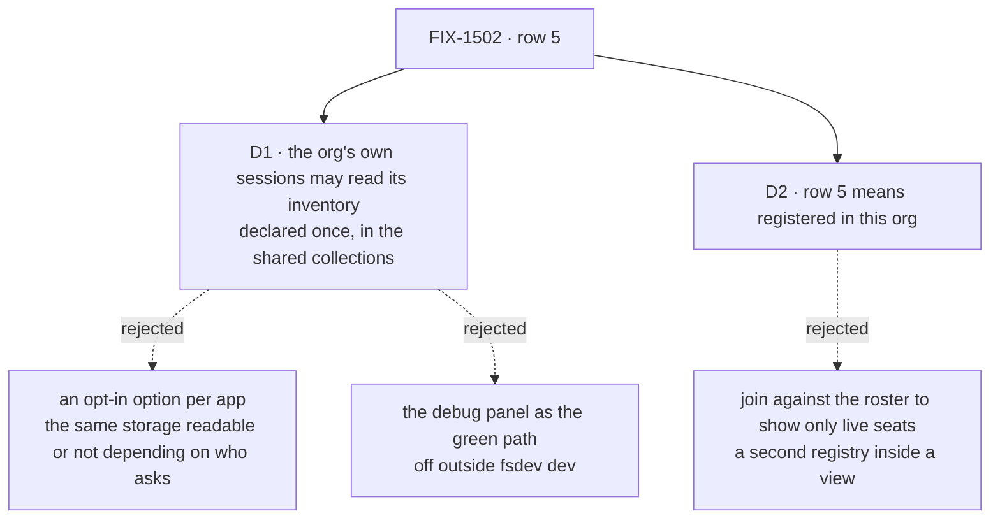

# FIX-1502 · Decisions

[Spec](SPEC.md) · **Decisions** · [Rules](BUSINESS-RULES.md) · [Plan](PLAN.md) · [Docs](DOCS.md) · [Evolution](EVOLUTION.md)

Two decisions are the sign-off surface. **The scope itself is not one of them**: the owner
answered the epic's [Open 1](../../epics/FIX-1457/DECISIONS.md#open) on **2026-09-24 with (a)**
— row 5 is satisfied by a channel session's view of the whole organization, build it in W5. That
answer is recorded on [FIX-1502](https://linear.app/fixpoint-labs/issue/FIX-1502) and is landing
in the epic's `DECISIONS.md` through an amendment in flight. This spec builds on it and does not
reopen it.

## The tree

Solid edges are what you are signing. Dashed edges lost, and the label says why.

## D1 · The organization's inventory becomes readable by that organization's own sessions, declared once in the three shared collections

| | |
|---|---|
| **Instead of** | An opt-in option each app passes to the collections · a second, readable declaration only on the channel flow · keeping the rows server-only and pointing row 5 at the debug panel |
| **Because** | The roster collection beside it already does exactly this: a browser read, named fields, and a test that fails if another organization's rows come back. The read takes the organization from the session, never the request — [settled 2026-09-22](../../epics/FIX-1457/DECISIONS.md#settled-org-read) with two organizations and a refused control. The rows carry identity only. An option would make a contract the package calls *"not app settings"* into one that every app must remember. A second declaration gives one question two answers depending on which flow asks. The debug panel is off wherever the app really runs |
| **Locks in** | Anyone with a session on a flow that installs these collections — a channel, a seat carrying the hire tools, an app's own flow — can list the organization's registered seats, channels and memberships. At one person per organization ([epic D7](../../epics/FIX-1457/DECISIONS.md)) that reveals nothing they do not already own. When a second person joins an organization, *every member sees the organization's layout* becomes the default, and narrowing it then is a breaking change for any reader built on it. Fields added to a row later stay hidden until someone adds them to the list |

**This is the contract change [ER-17](../../epics/FIX-1457/BUSINESS-RULES.md#er-17) says the owner
signs**, not an engineering call made quietly: the collections' own header reads *"the prefix, the
scope and the sharing are the contract other layers join against, not app settings."* The
prefix, scope and sharing do not move. A read is added beside them.

**What would change my mind:** a real plan for a second person per organization inside this
release. Then the read should wait for the permission model that plan brings, and row 5 exits on
five of six.

## D2 · Row 5 goes green on *registered in this organization*, not *open right now*

| | |
|---|---|
| **Instead of** | Filtering the view to seats still on the roster and channels still open |
| **Because** | Inventory rows are never deleted: a row means *was registered here*, by design, and whether that should change is [FIX-1485](https://linear.app/fixpoint-labs/issue/FIX-1485)'s. Filtering in the DevTool would make the view the one place that decides what *live* means — a second registry, which the issue's fences rule out. So the view says what the rows say, and labels it |
| **Locks in** | Until [FIX-1540](https://linear.app/fixpoint-labs/issue/FIX-1540) is fixed, a fired seat is listed. A seat that left a channel after the channel registered still shows as a member of it. The launch claim for row 5 is *every seat and channel registered in this organization, and who was in which when it registered*. When FIX-1485 or FIX-1540 changes what rows exist, the view shows the new truth with no change of its own |

**What would change my mind:** the owner reading row 5's *"who exists"* as *who is working now*.
Then row 5 waits on FIX-1485, and this spec ships the read with the label and not the green.

## Decided, not asked

- **The lab the check reads gets the documented boot, and nothing else** — what the inventory docs
  tell every app to write, and the first piece the owner priced. It runs in the lab's served
  config, as the kitchen-sink already opens its channels at boot. Anything the docs do not show is
  a framework gap and goes up, not into the lab.
- **The view lives in the DevTool only.** No new public component.
- **The DevTool finds the collections by their three published key patterns** in the session's
  manifest, with no dependency on the workforce package. The tab appears only where one is readable.
- **Named fields, not the whole row** ([BP-015](../../../docs/contributing/best-practices/resources.md)).
- **Every page is read**; an organization bigger than one page is shown whole.
- **The view names no organization.** Showing which one is
  [FIX-1486](https://linear.app/fixpoint-labs/issue/FIX-1486)'s.
- **The check extends FIX-1481's checklist goal** as a row-5 leg, served with debug off.
- **FIX-1540 is not a dependency.** It changes which rows exist, not how they are read.

## Considered and dropped

| Alternative | Why not |
|---|---|
| An organization-level surface apart from any session | The owner answered (a) on 2026-09-24 |
| Wait for [FIX-1486](https://linear.app/fixpoint-labs/issue/FIX-1486) | Its subject is choosing among organizations; one person, one organization does not need it |
| The debug Resources panel as the green path | Off outside `fsdev dev`, and `fsdev dev` turns it on by default, so a check reading it would pass while production readers are refused. Named as an invent-kill on the issue |
| A generic browser for every readable collection | Duplicates the debug panel on another route, and a table of raw rows does not answer *which channels is this seat in* |
| A public `Inventory` panel beside the roster panel | One consumer. More public surface than the row needs |
| A wrapper flow declaring the collections for the DevTool | ER-Devtool's *no special wrapper*: it would pass the row and prove nothing |
| The framework opening the inventory at hire on its own | New behaviour in a shared package, arriving under a polish label ([ER-25](../../epics/FIX-1457/BUSINESS-RULES.md)) |

## How it got here

- **Draft** — framed on the owner's 2026-09-24 answer (a); the collections gain a read for the
  organization's own sessions (D1), the view reports *registered* (D2), the lab the check reads gains
  the documented boot; three PRs, one of them the checklist's row-5 leg.

**Open: none.**
