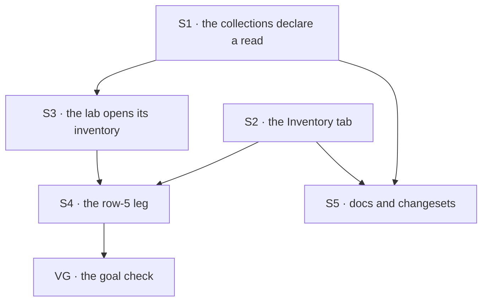

# FIX-1502 · Plan

[Spec](SPEC.md) · [Decisions](DECISIONS.md) · [Rules](BUSINESS-RULES.md) · **Plan** · [Docs](DOCS.md) · [Evolution](EVOLUTION.md)

Written for the implementing agent. IDs cross-reference [BUSINESS-RULES.md](BUSINESS-RULES.md)
(BR-n) and [DECISIONS.md](DECISIONS.md) (D-n). `tdd`. Three PRs; the first two are independent.

## Surfaces

| ID | Package · role | Change | Rules |
|---|---|---|---|
| S1 | `workforce` · the three inventory collection factories | A browser read with named fields on each (D1). Prefix, scope, sharing and the no-options signature do not move. The header says what the read opens, as the roster collection's does | BR-1 – BR-6 |
| S2 | `devtool` · a new Inventory tab in the session workspace | Shown when the manifest lists any readable collection on the three patterns; one section per declared collection, *not installed on this flow* for the rest. Reads every page through the production collection read, **over the DevTool's shared credential-aware client seam** (the one every other DevTool client already goes through), never a bare client | BR-7 – BR-16 · BR-24 · BR-25 |
| S3 | `goals/multi-seat-collab/lab` · the served config and host | The documented boot, in-process: the channel kind with the inventory on, `openInventory` after the channel opens, under the lab's organization. Refuse to serve on problems | BR-17 – BR-20 |
| S4 | `goals/devtool-workforce-visibility/the-checklist-rows` | A row-5 leg, graded on the same hire in the same browser run (VG) | the acceptance criterion |
| S5 | Docs + changesets | [DOCS.md](DOCS.md)'s operations. `minor` changesets for `@flow-state-dev/workforce` and `@flow-state-dev/devtool`. The goal lab is private and gets none | — |

**Removed: nothing.** The row-5 line in the checklist goal's own `goal.md` (*"row 5 to FIX-1502,
this check neither builds nor grades"*) is rewritten, not kept beside the new leg.

## Sequence

### PR plan

| PR | Surfaces | depends_on | Why it is its own PR |
|---|---|---|---|
| PR-A | S1, S5 for `workforce` | — | The contract change D1 signs, alone, with its isolation tests. Reviewable without a UI |
| PR-B | S2, S5 for `devtool` | — | The view. Its tests build their own collections on the three patterns, so it does not wait on PR-A |
| PR-C | S3, S4 | PR-A, PR-B | The lab's boot and the graded leg need both to be real |

## Checks

| ID | Runs after | Passes when |
|---|---|---|
| V1 | S1 | BR-1 – BR-5 through the real router and the real channel kind, rows written by the real writer for **two organizations with different ids** (identical rows would make a leaking read look isolated). Assert each organization's rows are stored, then that each session lists only its own. Controls, each seen red: same patterns **without** the read → 403 (BR-3); an organization named in body, query and header → ignored (BR-4); an extra key written into a stored row → absent (BR-5). Extend `packages/workforce/test/cross-org-collection-read.test.ts`, beside the roster's case |
| V2 | S1 | BR-6, both states of the channel's inventory flag |
| V3 | S2 | BR-7 – BR-14, BR-16. BR-12 scans the rendered text: it **must find** *registered* and none of the four words, so a heading changed to *Open channels* turns it red. BR-9 runs past one page. BR-10 runs a 403 and asserts the tab does **not** say the organization is empty |
| V3a | S2 | BR-25, with a bearer token configured: the **manifest request and both page 1 and page 2** of a paginated collection read each carry `Authorization: Bearer <token>`. **Red state, run and seen:** the reader built on a bare resource client fails this case. **VG cannot catch this** — the lab configures no principal resolver, so an unauthenticated read succeeds there — which is why the check lives here |
| V3b | S2 | BR-7, BR-8, BR-24 on a **seat-only manifest**, the shape the hire tools install: the tab appears, the seat section renders its rows, and the channel and membership sections read *not installed on this flow*. **Red state, run and seen:** rendering a missing collection as an empty table fails the case, because the absent text and the empty text are asserted to differ |
| V4 | S3 | BR-17 – BR-20 on the lab's own config: one seat row per seat, one channel row with the channel's members, one membership row per member, **all derived from the tree at run time**. A second boot changes nothing. Control `no-inventory` leaves the store empty |
| V5 | S1 | BR-15: hire and fire through the seat-hire tools, then list seats through the route; the fired seat is **still there**. FIX-1540's fix flips it on purpose |
| V6 | S3 | BR-21 – BR-23: the debug-gate suite passes unmodified; FIX-1481's row-4 leg and `multi-seat-collab/it-hands-a-row-between-two-seats-in-view` pass on the lab with the boot |
| VG | S4 | The goal, below |

### VG · row 5 on a live hire

A row-5 leg in `goals/devtool-workforce-visibility/the-checklist-rows/`, **extended rather than a
new goal** because the checklist is one proof: one hire, one served app, one browser. Chromium
from `goals/lib/playwright.mts`; every served run through `goals/lib/env.mts`'s `intentFreeEnv`,
which strips `FSDEV_DEFAULT_MODEL` and every `FSDEV_INTENT_*`
([FIX-1511](https://linear.app/fixpoint-labs/issue/FIX-1511)).

1. **Plant a foreign organization.** Before the server starts, write one seat and one channel row
   under a second organization into the lab's database through the store's own API, ids appearing
   nowhere in the tree. Assert they are stored.
2. **Serve** the lab with the shipped `fsdev dev` over its own config, the DevTool bundle rebuilt
   first, **`FSDEV_DEBUG_ENDPOINTS=0`** for this serve.
3. **Positive record.** The store holds exactly V4's rows for the lab's organization. Nothing on
   screen is judged until this holds.
4. **Screen.** From the navigator, the channel's session, then the Inventory tab, no expander open
   (counted in the same read). Rows read by id inside the tab: each seat with kind and channels;
   the channel with its members. Counts equal the store's. The foreign ids appear **nowhere on the
   page**.
5. **In view on both axes**, by row 4's bound: at least 40px wide and one line tall after every
   clipping ancestor and the window.
6. **Production read.** The network log shows a 200 on the collection read for each collection
   rendered and **no request under `/debug/`**; the debug Resources surface reports disabled.

**What would make this green with row 5 broken, and what stops it:**

| Hollow pass | Stopped by |
|---|---|
| An empty tab graded as "nothing wrong" | Step 3: counts come from the tree, and a zero fails before the screen is read |
| The text found somewhere on the page | Step 4 reads cells inside the tab, on the row with that id |
| Rows read off the debug panel | Steps 2 and 6: debug is off, and the network log is asserted |
| A view that reads every organization | Step 1's foreign rows must be absent from the page |
| A grade against the fixture, not the store | Step 3 grades the store against the tree; step 4 grades the screen against the store |
| A stale DevTool bundle | Rebuilt at the start of the run |
| Rows present but scrolled away | Step 5 |
| A reader that drops the bearer token | **Not caught by VG**: the lab has no principal resolver. V3a owns it |

**Controls.** Named ones run as `GOAL_CONTROL=<name>` and join the goal's self-check table; each
must redden exactly the legs named. Hand mutations are produced once, recorded in the verdict log,
and reverted.

| Control | How | Must fail at | Why it counts |
|---|---|---|---|
| `no-inventory` | The lab boots without opening the inventory | Row 5 only, at step 3 | Row 4 stays green, so the leg is separable |
| the read removed | Delete S1's read, rebuild | Row 5, with the tab **naming a 403** | The check tells *refused* from *empty* |
| the view on the debug route | Point S2 at the debug read | Row 5, at step 6 | The production path is graded, not assumed |
| off-screen | Push the tab's table down its pane | Row 5, at step 5 | The bound measures what is visible |

## Pinned names

| Where | Name | Why pinned |
|---|---|---|
| The goal control | `no-inventory` | The goal's self-check table keys on it |
| What the view matches | `inventory/seats/*` · `inventory/channels/*` · `inventory/members/**` | The collections' published key patterns. The DevTool joins on them and nothing else |

The tab's label is yours, except it is never *Roster* and never says *live* (BR-12, BR-23).

## Guardrails

| Rule | Because |
|---|---|
| The organization always comes from the session. No organization parameter on the view, the route or the client call ([BP-031](../../../docs/contributing/best-practices.md)) | It is what makes D1 safe. A caller-named organization is the hole FIX-1442 closed |
| The read is declared in the three factories and nowhere else (tenet 5) | Every flow that installs a collection gets the same answer. A second declaration with a different read is the divergence D1 rejects |
| The view renders rows; it never filters, joins or infers liveness (D2, tenet 1) | The one place *live* would be decided is the one place nobody would look for it |
| A refused or failed read, or an undeclared collection, is never drawn as an empty list | An empty table after a 403, or for a collection the flow never installed, reads as "nothing registered" when that is not what happened |
| Every Inventory request goes through the DevTool's shared credential-aware client seam | The DevTool's other clients already do; a bare client passes every unauthenticated check and 401s in any app with a resolver |
| No wrapper flow, no lab-only route, and no HTTP door to the internal seat writer | ER-Devtool's *no special wrapper*; the seat writer is internal because its whole input is row data |
| The DevTool takes no dependency on `@flow-state-dev/workforce` | It stays a framework tool; the patterns are the contract |
| The debug gate, its origin allow-list and its default do not move | Row 5 is green without it, which is the point |

## Docs

Reconcile [DOCS.md](DOCS.md) against shipped behaviour and publish it with PR-A (the
inventory page and README) and PR-B (the DevTool page). Published prose goes through the
`docs-writer` then `docs-editor` pass.

## The POC

**None.** The premise that looked unverified — boot work in a served `fsdev dev` config before it
takes requests — already runs: the kitchen-sink's config reloads its roster and opens its channels
that way. The read's isolation was settled on the epic on 2026-09-22. No counted factual base: the
one enumeration, which flows install these collections, is stated as a rule in D1, not a count.

## At implement time

- **Re-point the owner-decision links** in [DECISIONS.md](DECISIONS.md) and
  [EVOLUTION.md](EVOLUTION.md) to the epic's `DECISIONS.md` once the amendment carrying the
  2026-09-24 answer merges. Until then they cite the date and the answer, not a `main` anchor.
- **Does the DevTool navigate with debug off?** If a panel it needs fails, raise it; do not turn
  debug back on for the leg.
- **Where the lab's channel opens.** The driver opens it over HTTP today, and `openInventory`
  needs it open first. Opening it in the config and letting the driver meet the existing session
  is the likely shape; `openChannels` already handles one that exists.
- **Has FIX-1540 or FIX-1485 landed?** Then V5 and BR-15 move with it.
- **Each collection's manifest name** comes from the manifest, never hard-coded.

## Follow-ups

- **The kitchen-sink opens its channels but not its inventory.** Comment on
  [FIX-1455](https://linear.app/fixpoint-labs/issue/FIX-1455); not built here
  ([ER-24](../../epics/FIX-1457/BUSINESS-RULES.md#er-24)).
- **A public inventory panel** beside the roster panel, if an app asks for one.
- **Who may read the organization's layout** once a second person can join an organization
  (D1's *locks in*).
