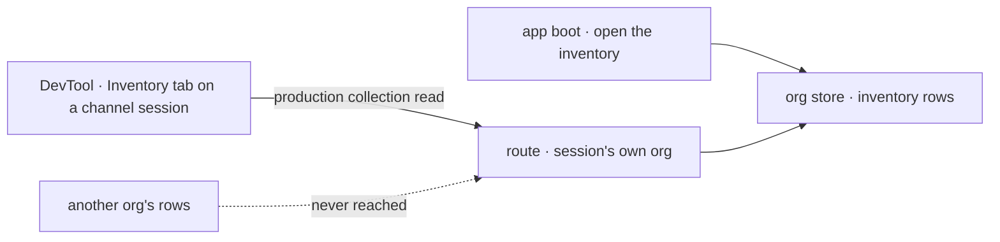

# FIX-1502 · ER-Devtool row 5: an org-level inventory view in Devtool (seats, channels, members)

**Spec** · [Decisions](DECISIONS.md) · [Rules](BUSINESS-RULES.md) · [Plan](PLAN.md) · [Docs](DOCS.md) · [Evolution](EVOLUTION.md)

Improvement · `workforce` + `devtool` + a goal lab · medium · 3 PRs · epic
[FIX-1457](https://linear.app/fixpoint-labs/issue/FIX-1457) · ER-Devtool
[row 5](../../epics/FIX-1457/BUSINESS-RULES.md#devtool-checklist) · sibling
[FIX-1481](../FIX-1481/SPEC.md) (rows 4 and 6)

## Five people, before and after

| Someone who… | Today | After |
|---|---|---|
| **opens the DevTool on a running workforce and asks "who is in this organization?"** | Cannot find out. Nothing writes the organization's inventory, and nothing in the DevTool reads it | Opens the channel's session, picks the Inventory tab, and sees every seat, every channel, and who is in which |
| **asks which channels one seat is in** | Reads each `CHANNEL.md` on disk and cross-references by hand | Reads it off the seat's row |
| **runs the app somewhere other than `fsdev dev`** | The only way in is the debug Resources panel, which is off there | Same view, on the ordinary read the app's own browser code can use |
| **shares a database between two organizations** | n/a — nothing is readable | Sees only their own organization's rows. The other one's are never shown |
| **fired a seat yesterday** | n/a | Still sees it, labelled *registered*. The list is who was ever registered in this organization, not who is open right now ([D2](DECISIONS.md#d2)) |

Row 5 is the one checklist row nobody could build. On 2026-09-24 the owner answered the epic's
open question (a): a channel session's view of the whole organization satisfies it, so no
organization picker is needed. That makes it three small pieces of ordinary work.

## What changes


Read the two lanes left to right: who writes, what is stored, who reads. The middle column is
the one decision ([D1](DECISIONS.md#d1)): the stored rows become readable by the organization's
own sessions. The fence at the bottom is what that read can never reach.

**What the three shared collections declare, as a person reading the package sees it:**

```diff
  defineResourceCollection({
    pattern: "inventory/channels/*",
    scope: "org",
    flowIsolation: false,
    stateSchema: channelInventoryRowSchema,
+   client: { state: { read: true }, expose: ["id", "kind", "members", "openedAt"] },
  })
```

The same line lands on the seat and membership collections, each exposing its own fields. **An
app writes nothing new to get this.** An app that wants rows writes the boot its docs already
describe, and the lab the check reads gains exactly that:

```diff
- const instances = channelInstances(roster.channels);
+ const instances = channelInstances(roster.channels, { inventory: true });
  await openChannels(roster.channels, { client, userId });
+ await openInventory({ seats, channels: roster.channels },
+   { run, seatWriter: { flowKind: "channel" }, userId, orgId: DEFAULT_ORG_ID });
```

## How a row reaches the screen



The DevTool asks through the same route any app's browser code would use. The route resolves the
organization from the session, never from the request, which is why the fence holds without new
code.

## What stays as it is

- **The debug Resources panel and its gate.** Unchanged, and not what row 5 reads.
- **Who writes the inventory, and that nothing deletes a row.** This reads what is there.
- **The roster.** The hired-roster collection and its panel answer a different question and are
  not merged with this.
- **Organization selection.** Still [FIX-1486](https://linear.app/fixpoint-labs/issue/FIX-1486)'s.
  The view shows the session's own organization and names no other.
- **The kitchen-sink.** It gains no inventory wiring here; that app is a sibling epic's.

## Sign off

1. **[D1](DECISIONS.md#d1) · The organization's inventory becomes readable by that
   organization's own sessions, declared once in the three shared collections.** If wrong: when a
   second person joins an organization, every member can list its seats and channels by default,
   and narrowing that later breaks every reader built on it.
2. **[D2](DECISIONS.md#d2) · Row 5 goes green on *registered in this organization*, not *open
   right now*.** If wrong: someone reads a fired seat off the DevTool as still working.

**Open: none.** Number 1 is the one to weigh: it changes a contract the package's own comments
call closed, which the epic's rules say the owner signs ([ER-17](../../epics/FIX-1457/BUSINESS-RULES.md#er-17)).
Reasoning and what lost: [DECISIONS.md](DECISIONS.md). The cases: [BUSINESS-RULES.md](BUSINESS-RULES.md).
