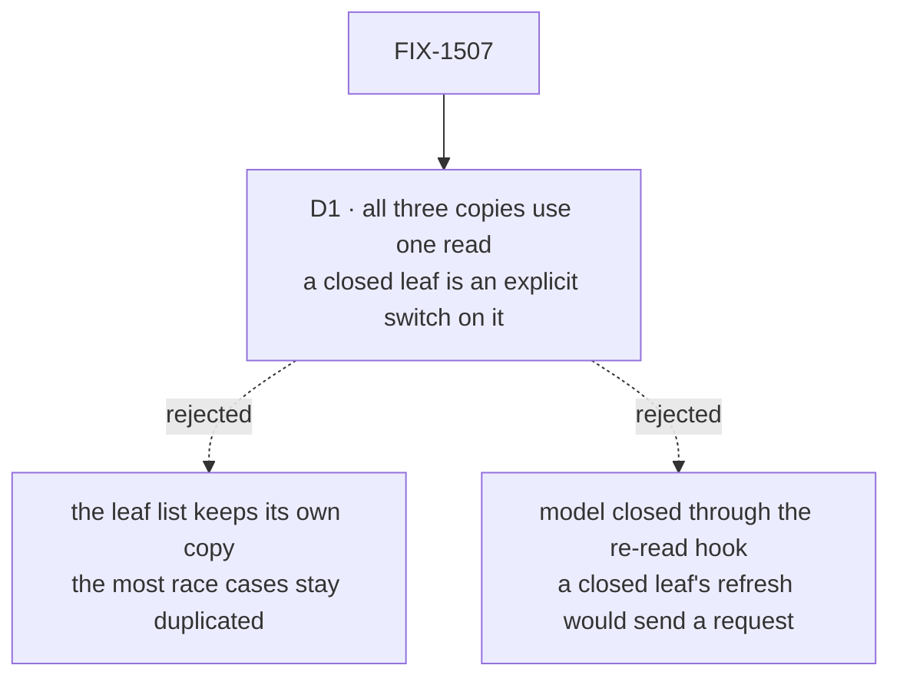

# FIX-1507 · Decisions

[Spec](SPEC.md) · **Decisions** · [Rules](BUSINESS-RULES.md) · [Plan](PLAN.md) · [Docs](DOCS.md)

What was considered, what was chosen, and what it locks in. One decision is the sign-off
surface. The rest is context for it.

## The tree

Solid edges are what you're signing. Dashed edges lost, and the label says why.

## D1 · All three copies move onto the one read, and a closed leaf's "ask for nothing" becomes an explicit switch on it

| | |
|---|---|
| **Instead of** | Moving only the flow list, and leaving the leaf's session list with its own copy because it has one rule the others don't |
| **Because** | The leaf list is the read with the most race cases: a leaf closed mid-read, reopened, re-pointed, and refreshed from an earlier visit. A race fix that skips it is the drift this issue exists to end. Its one extra rule, a closed leaf reads nothing even on refresh, is one input on the shared read, and today every other read simply leaves it on |
| **Locks in** | The shared read has a switch only the navigator sets today. A future read that needs "hold off" uses it rather than growing its own copy. Removing it later means the leaf list goes back to hand-rolled |

![D1, trade-off. Chosen: all three copies on one read, with a read-only-while-enabled switch. Instead of: the leaf session list keeps its own copy. It comes down to the first row: with the chosen shape a race fix reaches every read, while the alternative leaves the read with the most race cases outside it. The price is the second row: the shared read carries one input only the navigator sets. Behaviour is a tie: identical either way. Locks in: a switch on the shared read. Flips if: the leaf list's rules grow apart from the others'](figures/d1-one-read.svg)

It comes down to where a race fix lands: leaving the leaf list out leaves its hardest case behind.

**What would change my mind:** evidence that the leaf list's rules are about to diverge further
(a per-visit cache, say). Then a shared read with switches becomes a mode flag, and the leaf
list is better off alone.

## Decided, not asked

- **The shared read lives in the package's internal folder**, beside the session follower the
  live board already uses, and is not exported. The panels' read moves there rather than the
  navigator importing from the panels' folder, which would make one component depend on
  another's internals. The fence settled "no public API change".
- **The panel client set-up is one internal helper in the panels' folder.** Only panels build a
  fallback client; the navigator takes its clients as props and has nothing to share here.
- **`BoardList`'s own address and transport feed the same helper.** The others pass neither. An
  omitted transport and one passed as `undefined` already resolve identically in the client
  factory, so one helper serves both shapes with no branch.
- **The error-text helper moves with the read.** It is the same four lines in both files.
- **The every-page loop stays where it is.** [FIX-1674](https://linear.app/fixpoint-labs/issue/FIX-1674) owns it (sibling boundary).

## Considered and dropped

| Alternative | Why not |
|---|---|
| Express "closed" through the existing re-read hook (start nothing while closed) | Refresh calls the read directly, not through the hook. A closed leaf's refresh would then send a request it doesn't send today. A behaviour change passing as a refactor |
| A new public `useFencedQuery` hook, as the issue first suggested | The issue's own scope says internal only; exporting a read lets a host mount it twice, which FIX-1477 BR-10 forbids |
| Fold `useReadFence` itself into the shared read | `useReadFence` is public and the developer tool uses it directly. Out of this fence |
| Leave it until S8 lands | S8 adds consumers; every new copy doubles the next race fix. The issue asks for before |

## How it got here

- **Draft** — framed as finishing FIX-1500's consolidation: the navigator's two copies and the
  panels' four client set-ups move onto internal helpers; one switch carries the leaf's closed
  rule; equivalence pinned by characterization tests written on `main` first.

**Open: none.**
