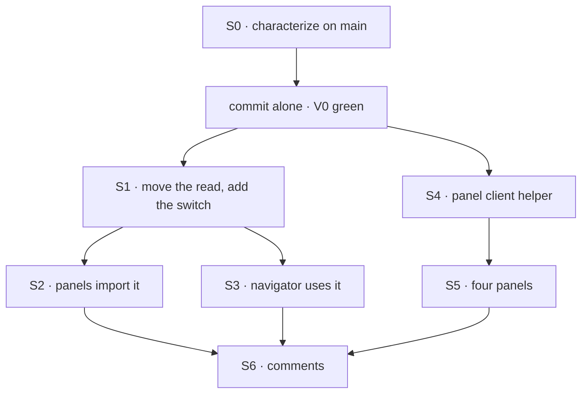

# FIX-1507 · Plan

[Spec](SPEC.md) · [Decisions](DECISIONS.md) · [Rules](BUSINESS-RULES.md) · **Plan** · [Docs](DOCS.md)

Written for the implementing agent. IDs cross-reference [BUSINESS-RULES.md](BUSINESS-RULES.md)
(BR-n) and [DECISIONS.md](DECISIONS.md) (D-n). Discipline: characterize, then refactor (`tdd`'s
refactor step, with the red state produced by a planted control). One PR, the characterization
tests committed alone first.

## Surfaces

| ID | Package · role | Change | Rules |
|---|---|---|---|
| S0 | `react` · tests beside the existing panel and navigator suites | One characterization test per **char** row, out-of-order deferred promises (the `flow-navigator-read-fence` pattern). Green on unmodified `main` source | BR-1…BR-4, BR-6, BR-7, BR-9, BR-10, BR-13, BR-14, BR-19 |
| S1 | `react` · **the internal fenced read**, in the package's internal folder | The panels' `useFencedRead` and its error-text helper, moved verbatim, plus one switch: while off, a read returns before taking a sequence number and writes nothing (D1). Default on. Not exported | BR-1…BR-10, BR-13…BR-15 |
| S2 | `react` · the panels' read module | Imports S1; keeps `usePanelRows` (paging loop untouched), `usePanelItem`, the live-board hook and the source types | BR-9, BR-12 |
| S3 | `react` · the navigator's read module | `useFlowInventory` and `useLeafSessions` become calls to S1. The leaf keeps its per-visit token in the identity and passes "open" as the switch. Returned shapes and names unchanged | BR-1…BR-4, BR-6, BR-7, BR-13…BR-16 |
| S4 | `react` · **the panel client helper**, in the panels' folder | "The host's client, else one built from the address and transport", memoised on both. Address defaults to the provider's; `BoardList` passes its own address and transport | BR-17…BR-19 |
| S5 | `react` · `Roster`, `BoardColumns`, `BoardList`, `SeatDetail` | Use S4 | BR-17, BR-18 |
| S6 | `react` · file headers and doc comments | Say where the recipe lives now (BP-034). The panels' header stops claiming the read "lives once" there | — |
| — | **Removed** | The navigator's two inline recipes, its own error-text helper, and the four inline client set-ups | — |

## Sequence

## Checks

| ID | Runs after | Passes when |
|---|---|---|
| V0 | S0, on unmodified `main` source | Every **char** row has a test and all pass. The commit touches test files only |
| V1 | S6 | `pnpm --filter @flow-state-dev/react test` and `pnpm typecheck` pass, the devtool suite too (it renders these components). `git diff <V0 commit>..HEAD -- 'packages/react/test/**'` is empty |
| V2 | S6 | **The control.** Remove S1's after-the-wait staleness check (write whatever resolves). BR-2's tests for a panel read **and** a navigator read go red together. Then remove the switch's early return: BR-14 goes red. Revert each. The PR shows the reds |
| V3 | S6 | BR-20: the package's export list is identical to `main`, and no file outside `src/` imports S1 or S4 |
| V4 | S6 | [`poc/census`](poc/census/census.mjs) `--after` passes: one in-scope `useReadFence` call site, S1's, under `packages/react/src/internal/` (none left under `components/`), and one `createResourceClient` under `components/panels/` (S4's), with its planted control failing. `--after` is coupled to S1's filename (`internal/useFencedRead.ts` in its `IN` map): if you name the module differently, update the map in the same PR |

The second path (BP-035) is the closed leaf and the rebuilt client: BR-14 and BR-19 are what a
refactor breaks unnoticed, and neither has a test today.

## Pinned names

None. The shared read may keep the name `useFencedRead`; the helper and switch names are yours.

## Guardrails

| Rule | Because |
|---|---|
| The switch is checked **before** `begin()`, never after | Taking a sequence number supersedes a read in flight; a closed leaf's refresh must not cancel anything (the ordering `useReadFence` calls load-bearing) |
| Derive, don't sync: held identity compared during render, no effect that copies props into state (BP-010) | This is how BR-4 holds today; an effect-based reset shows one frame of stale rows |
| The loader stays in a ref, and the effect keys on the fence alone | The navigator today re-creates its read whenever its inputs change. Those inputs are all in the identity, so keying on the fence is the same timing. A loader in the deps would refetch every render (BR-10) |
| No test edited after the V0 commit | An edited test is how a behaviour change passes as a refactor |
| Do not touch the every-page loop | FIX-1674 is rewriting it. Touching it here makes a conflict and blurs whose change moved paging |

## Docs

[DOCS.md](DOCS.md): no reader-facing impact. Nothing to publish.

## Sketch

None. The shared read already exists; the diff in [SPEC.md](SPEC.md#what-changes) is the shape.

**POC:** none built for direction. [`poc/census/`](poc/census/census.mjs) is the factual-base
checker: it re-derives the three read copies and four set-ups this spec counts, asserts every
match is classified, and fails its planted control (`node specs/issues/FIX-1507/poc/census/census.mjs --plant`).

## At implement time

- **FIX-1674** ([GH #2460](https://github.com/fixpoint-labs/flow-state-dev/issues/2460)) edits
  the same panels' read module, inside `usePanelRows`'s loader. The two are independent; the
  second to land rebases a small textual conflict at the import block. If FIX-1674 has landed,
  keep its loop exactly as merged.
- Re-run the census on fresh `main` first. A new copy of the recipe or the set-up since this was
  written is in scope and gets the same treatment.

## Notes from review

Recorded verbatim for the implementer to weigh against real code. Not folded into the design.

- **Cursor (review on `ccadf674`), S0:** "reuse or extract the `deferredSource` pattern from `flow-navigator-read-fence.test.ts` rather than a third ad-hoc deferred style."
- **Cursor (review on `ccadf674`), S1:** "lift `useFencedRead` + `describe` **verbatim** from `panels/reads.ts`; the spec's guardrails (switch before `begin()`, loader ref, effect deps) match the subtle bugs in today's leaf/flow copies."
- **Second look (PR comment), BR-13:** "a closed leaf never calls `setHeldIdentity`, so `holdsCurrent` stays false and BR-13's \"reports loading, no error\" falls out for free. The char test should assert that state, not only \"no request\"."
- **Second look (PR comment), evidence weight:** "The V2 control (remove the after-the-wait check, watch both a panel and a navigator test go red) is the part that proves the goal. I'd keep that and the BR-14 / BR-19 tests, which are the ones with no coverage today. The rest of the char rows can be as thin as one assertion each."
- **Second look (PR comment), S4:** "Today every panel builds a fallback client even when the host passes one (`useMemo` runs unconditionally). The helper should keep that, since making it lazy is a change in when `createResourceClient` runs, and this PR claims none. No action, just don't \"improve\" it in passing."

## Follow-ups

- None filed. The public resource hooks fence differently and are not copies; revisit only if
  one of them grows this recipe.
