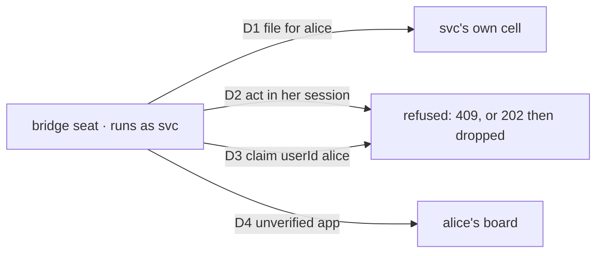

# FIX-1522 · org- and user-owned Workforce planes: what the POC found

An Explore, not a spec. There is no approval gate, and nothing here ships. The five-document spec
set is deliberately skipped: this directory holds the findings, six figures, and the runnable POC
they come from ([`poc/owner-planes/`](poc/owner-planes/README.md), 24 legs, all green on `main`
at `d8d4c26`). Linear: [FIX-1522](https://linear.app/fixpoint-labs/issue/FIX-1522).

## The short version

**One hire store works.** An org's team and each user's private team can share FIX-1475's roster
row, prefix and reload path. The owner only picks which storage cell a row lands in, and the
engine's existing session binding keeps users out of each other's cells. No second store and no
`UserWorkforce`.

**It is not shippable yet.** Four surfaces leak a user's plane, and none of them is in the roster:

1. The shipped **channel board** and **seat inventory** hard-code org scope, so a user's board
   tasks and seat rows land org-wide (C9, C10).
2. The **flow catalog** (`GET /api/flows`) lists every registered seat to every caller, from any
   org (C8).
3. A **user cell is one per person, not per org**, so alice's private team from `acme` shows up
   in her `globex` session's browser read (C7).

**The bridge seat is falsified.** An org-hired seat cannot reach a user's plane under verified
identity. The only way through is to mint the user's principal, which is what verified identity
([FIX-1503](https://linear.app/fixpoint-labs/issue/FIX-1503)) exists to stop.

## What was asked, and what the POC answered

| The ask | Answer | Legs |
|---|---|---|
| 1 · owner key through hire → inventory → channel open → boards | `owner: { type: "org" \| "user", id }` maps to the resource scope. The org id always comes from the session. Hire, roster, reload, address, board and drain carry it as a parameter. Inventory and the shipped channel board can't carry it yet | A1–A4, C5, C9, C10 · [fig 1](#fig-1), [fig 6](#fig-6) |
| 2 · seed pack → durable store | Seed **once per plane**, recorded in a per-plane ledger (a user's is keyed by org too). Seeding "if the row is missing" brings back seats the user fired | B1–B5 · [fig 3](#fig-3) |
| 3 · prove isolation | user↔user holds on list and act, and org↛user holds on drain. Assign is the soft spot: without a guard, a cross-plane write *succeeds in the wrong cell* instead of failing. Two leaks sit outside Workforce | C1–C10 · [fig 2](#fig-2), [fig 5](#fig-5) |
| 4 · bridge seat | Fails under verified identity, and "works" only by impersonation without it | D1–D4 · [fig 4](#fig-4) |

## The figures

**One store, and the owner picks the cell.** Look at the three boxes. Every line is identical
except `cell` and the address. The org cell is byte-identical to what FIX-1475 writes today, so
nothing persisted has to move. A user row puts the org in its key (`acme/…`) because a user cell
is not per-org (see figure 5).

**Where isolation holds, and where it doesn't.** Read down the right-hand column first: the
catalog leaks to everyone, whoever is calling. Then the amber cells. An unguarded cross-plane
write doesn't fail. It completes in the caller's own cell, so the work silently goes nowhere.
The blue cells fail closed but ack `202` first (see *Found on the way*).

**Seed once, not whenever a row is missing.** The roster can't tell "never seeded" from "seeded,
then the user fired everything". Only a record of the seeding itself can. `plane.ts` keeps it
beside the roster, per plane, keyed by pack id.

**The bridge seat stops at the session owner.** Three of the four paths never cross the fence.
The fourth crosses only because an unverified app takes the caller's word for who it is.

**Two leaks Workforce can't fix from its side.** The boot reload is per-org because it reads by
prefix. The browser read route lists the whole cell. The catalog lists every registered instance,
and a seat is one.

**What it would take.** The blue boxes are a parameter in `plane.ts`. The two red boxes are
shipped Workforce declarations that need an owner parameter (small). The dashed box, plus C7, is
engine work.

## Need your sign-off

**1 · Does a person's private team follow them across orgs, or stay in the org it was built in?**
*Plain terms:* if alice builds a private research team at Acme and then signs into Globex, should
her Acme team be there? Today the storage says yes, and the key trick in the POC only hides it
from some readers. *Trade-off:* following her is simpler and feels personal. Staying put is what
every org admin will assume, and it matches "org is never optional". *My recommendation:* stays
in the org. That needs the engine to gain a user-within-org storage cell, and I'd file it as an
engine issue rather than work around it in Workforce. *What would change my mind:* a customer
story where the private team is explicitly personal, like a personal assistant that goes wherever
you go. *If we're wrong:* choosing per-org and later wanting it portable is a data move. Choosing
portable and later needing per-org means users already have cross-org data we'd have to split.

**2 · Do user planes wait for the catalog to be scoped?** *Plain terms:* every seat's address is
visible to anyone who asks the server, and a user seat's address carries the user id and the seat
name (`acme.~alice.therapy-notes`). *Trade-off:* waiting ties user planes to
[FIX-1486](https://linear.app/fixpoint-labs/issue/FIX-1486)'s listing work. Not waiting ships a
name leak. *My recommendation:* wait. Org seats leak the same way today, but a seat name a user
typed is personal data in a way an org's `eng.lead` isn't. *What would change my mind:* seat
names that are always system-generated. *If we're wrong:* a privacy incident that's cheap to
cause and hard to take back.

No sign-off is needed on the bridge. It's falsified, and the invent-kill stands: cross-plane
collaboration stays a named gap, and its door is an explicit grant or invite rather than a seat.

## Found on the way

These are outside the owner question. Each one is pinned by a leg, so a fix will show up as a red
test.

- **A cross-plane write succeeds in the wrong place (C3, D1).** A user-scoped declaration used
  from another user's session resolves *that* session's cell. There's no error. The work just
  lands where its owner never looks. `assertOwnPlane` in `plane.ts` turns it into a named refusal
  (C4). Any productized plane needs that guard at the door, not per call site.
- **A refused action still acks `202` (C2, D2, D3).** When a caller posts into a session another
  user owns, the route answers `202 in_progress` and `UserBindingMismatchError` then refuses the
  run before a request record exists, so polling the id never finds it. It fails closed, so this
  is not a security bug. But the action route's own contract is that a `202` means the request is
  discoverable, and here it never is.
- **A runtime hire in an app without authentication bricks the reload (X1).** The hire is stored
  under `DEFAULT_ORG_ID` (`__fsd_default_org__`), which isn't a legal address segment. When that
  org is in `orgIds`, `reloadHiredSeats` rejects outright rather than skipping the row, so no org's
  seats come back. Kitchen-sink's hire principal is always an admin token bound to a named org, so
  it doesn't hit this. An unauthenticated dev app that hires at runtime would.

## What this directory is not

- Not a supported API. `plane.ts` is written to be portable, but nothing imports it.
- No user-facing docs and no changeset: nothing ships, and the package surface is unchanged.
- No kitchen-sink surface, per the ticket's fence against a kitchen-sink-only owner key.
