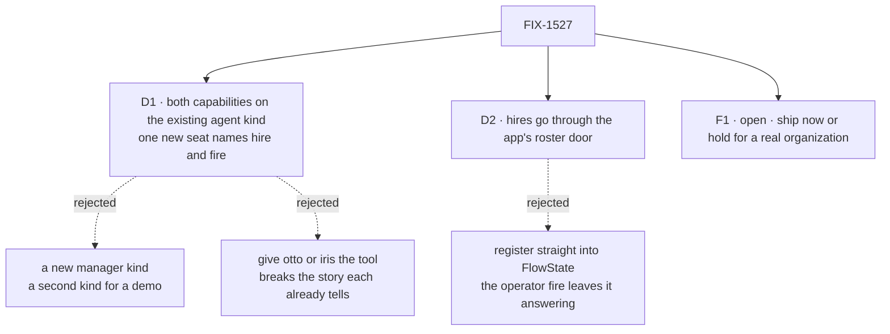

# FIX-1527 · Decisions

[Spec](SPEC.md) · **Decisions** · [Rules](BUSINESS-RULES.md) · [Plan](PLAN.md) · [Docs](DOCS.md) · [Evolution](EVOLUTION.md)

What was considered, what was chosen, and what each choice locks in. Two decisions and one open
question make up the sign-off.

## The tree

Solid edges are what you're signing. Dashed edges lost, and the label says why.

## D1 · Both capabilities go on the existing `agent` kind, and one new seat, `support.mara`, names `hire` and `fire`

| | |
|---|---|
| **Instead of** | A new manager kind that only mara runs · handing the tools to otto or iris |
| **Because** | The ratified shape is *the kind installs, the seat names* ([FIX-1388](https://linear.app/fixpoint-labs/issue/FIX-1388), [FIX-1393](https://linear.app/fixpoint-labs/issue/FIX-1393)), on an existing kind rather than one invented for the teach. The `agent` kind is the one map the file roster, the operator's action and the boot reload share (`apps/kitchen-sink/workforce/hire.ts:64-70`). Otto and iris each already teach something else. Discover rides along because a hire nobody can find is what FIX-1526 exists to prevent |
| **Locks in** | Every agent-kind seat in kitchen-sink, including any seat hired later, is **one line away** from hiring: name the tool. That includes a seat that mara hires with `tools` in its settings. The capability's contract allows it, and who may hire is [FIX-1525](https://linear.app/fixpoint-labs/issue/FIX-1525)'s open wall, not ours. Every agent seat also gains `discover`, a control no `tools:` line removes (`packages/workforce/src/agent-worker-flow.ts:54-60`) |

**What would change my mind:** a decision that `discover` must stay opt-in per seat. Then
discover moves off the kind until the framework offers a per-seat switch, and mara shows hire
alone.

## D2 · Mara's hires go through the app's existing roster door

| | |
|---|---|
| **Instead of** | Handing the capability `FlowState.register` directly |
| **Because** | Kitchen-sink records which addresses it registered *from a roster row*. The boot reload writes that record (`apps/kitchen-sink/fsdev.config.ts:287`, `lib/workforce-registrar.ts:118-128`) and the operator's fire reads it. Going around it, the operator's fire would delete the row of a seat mara hired and leave the seat answering until the next boot (`apps/kitchen-sink/flows/workforce-admin/flow.ts:293-304`). The capability's `register` receives the owner pin that door already takes, so the wiring is one line each for `register`, `unregister` and `kindAt` |
| **Locks in** | One roster, three writers that must agree: the file boot, the operator's action, and mara. A seat mara hires comes back on the next boot and can be fired by the operator. Mara cannot fire an operator hire, because those rows are user-owned and the capability reads only org-visible rows |

## Open

### F1 · Ship mara now, working only for apps that authenticate, or hold it until kitchen-sink runs seats under a real organization?

**Plain terms.** A hired seat's address starts with its organization's name. Kitchen-sink
checks nobody's identity, so every request to one of its seats runs under the framework's
placeholder organization. That name is deliberately not usable as an address. Ask mara to hire
in the app as it ships, and the hire is refused before anything is written: the run stops with
an error naming the organization. Hand the same files to an app that verifies its callers and
it works. We ran both cases ([Settled](#settled)).

**The trade-off.** Shipping now puts a working pattern in the reference app, with a test that
hires under a real organization. But anyone who runs kitchen-sink and asks mara to hire gets
a refusal. Holding keeps the app clean of a seat that can't do its job there, at the cost of
another cycle with no in-app example.

**My recommendation: ship now.** People copy files from kitchen-sink, and these files are
right. The refusal is loud and names its reason. The gap is the whole app's, not mara's: the
human rail's hire ([FIX-1500](https://linear.app/fixpoint-labs/issue/FIX-1500)) reuses the
same capability and meets the same wall. When the app gets a real organization, mara starts
hiring with nothing further to change, provided that organization also reaches the seats.

**What would change my mind:** if Goal 1 acceptance, or a demo you've promised, needs someone
to watch mara hire inside the running app. Then hold it and sequence it after whichever issue
gives kitchen-sink's seats a real organization.

**Cost of being wrong: low, and reversible either way.** It's one seat file and a few lines of
wiring. Shipping early costs a seat that refuses in the default run until identity lands.
Holding costs a cycle.

## Decided, not asked

- **Seat `support.mara`**, on the support team beside the seats it staffs, with no `flow:` line,
  the same as iris and otto. Kind stays `flow:`, and no demo UI picks a kind.
- **`tools: [hire, fire]`.** The capability ships both. A teach that can hire and not fire would
  leave the roster with no way back.
- **No `allowKinds`.** Mara offers what the operator's action offers: `agent`, `desk-clerk`,
  `followup-runner`, from one shared map. An allowlist is FIX-1525's open wall.
- **No `channelBoards`.** The warning is computed against the one seat just hired
  (`packages/workforce/src/seat-hire-capability.ts:282`, `packages/workforce/src/hire.ts:803-833`). Passing the app's
  boards would warn on every hire about boards ada and grace already drain.
- **Discover's file roster is empty.** Kitchen-sink writes no inventory rows for file-declared
  seats, so they would not be listed either way.
- **The capability's surface is untouched.** The model-free export is FIX-1500's
  `createSeatHireBlocks(options): { hire, fire }`, pinned on
  [#2111](https://github.com/fixpoint-labs/flow-state-dev/pull/2111), and the capability's tools
  are built from it. Mara uses the tools, so she goes through the same sequence.
- **[FIX-1540](https://linear.app/fixpoint-labs/issue/FIX-1540) is not fixed here.** Mara's
  fire leaves the inventory row. `discover` still withholds the seat, because its seat list
  needs the roster row too (`packages/workforce/src/manifest-sources.ts:181-227`).

## Considered and dropped

| Alternative | Why not |
|---|---|
| A resolver on mara's flow so it runs under a real organization | Seats are minted from a shared kind, which takes no authentication option. It would also be an app-only identity path the invent-kills name |
| Make the placeholder organization legal in an address | An invent-kill on [FIX-1536](https://linear.app/fixpoint-labs/issue/FIX-1536), and a change to the capability's surface |
| Mara names `hire` only | Smaller, but it leaves any seat she hires stuck on the roster unless the operator removes it |
| No `discover` in kitchen-sink | The smallest version, and the package suite already proves discover. Dropped because the issue's point is that a hire people can't find is theater |

## Settled

- **Composed on kitchen-sink's real kind, mara hires under a named organization. The row is
  the one the existing boot reload brings back, the address is marked as roster-minted, and
  `discover` lists it.** **CONFIRMED** by [`poc/manager-seat/`](poc/manager-seat/README.md)
  P1 and P5. P5 was run against an organization that hired nothing and went red.
- **Under the placeholder organization the same hire is refused and writes nothing.**
  **CONFIRMED** by P2. The run went red when pointed at a named organization, because there the
  hire succeeds. The real `fsdev run support.mara` path logs
  `orgId: "__fsd_default_org__"` with the composed kind booted (README → leg R).
- **A neighbour that does not name `hire` cannot hire.** **CONFIRMED** by P3. The run went red
  when the neighbour was handed `hire`.
- **A seat mara hires with `tools: [hire]` in its settings can itself hire** (D1 → *Locks in*).
  **CONFIRMED** by P6. The run went red when the hired seat was given no tools.

## How it got here

- **Draft** — framed as the reference teach for the landed capability. The POC found that
  kitchen-sink's seats can't hire under the organization they run under, which became F1. The
  build is one seat file plus a few lines on the existing kind.
