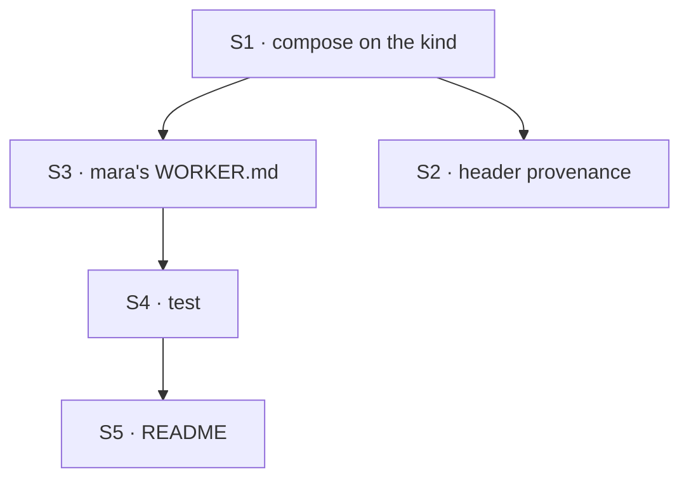

# FIX-1527 · Plan

[Spec](SPEC.md) · [Decisions](DECISIONS.md) · [Rules](BUSINESS-RULES.md) · **Plan** · [Docs](DOCS.md) · [Evolution](EVOLUTION.md)

Written for the implementing agent. IDs cross-reference [BUSINESS-RULES.md](BUSINESS-RULES.md)
(BR-n) and [DECISIONS.md](DECISIONS.md) (D-n, F1). `tdd`. One PR. Kitchen-sink only, no
package change, no changeset (private app).

## Surfaces

| ID | Where · role | Change | Rules |
|---|---|---|---|
| S1 | `apps/kitchen-sink/workforce/hire.ts` · the `agent` kind | Compose `createSeatHireCapability` and `createWorkforceCapability` onto the existing kind (D1). The capability closes over **the same object** exported as `kitchenSinkKinds`, so declare the map first and assign `agent` into it. **Export the options as one object, `kitchenSinkSeatHireOptions`**, and pass that same object to the capability. FIX-1500's PR-D passes it to `createSeatHireBlocks` for the rail ([shared options](DECISIONS.md#shared-options)). If PR-D lands first, import its object and don't build a second. Its fields: `register` → `workforceRegistrar.registerFromRoster(seat, { pin })`, `kindAt` → the registrar, and `unregister` → **`workforceRegistrar.isFromRoster(id) && workforceRegistrar.unregister(id)`**, so a fire never releases an address the roster did not register (D2, BR-13). No `allowKinds`, no `channelBoards`. Discover: `inventory.seats` + `hiredRoster` keys, empty file roster | BR-1 to BR-11 BR-13 |
| S2 | same file · header | The header says nothing outside `fsdev.config.ts` reaches this subtree (`:10-16`). It now imports `lib/workforce-registrar`, so say so (BP-034) | — |
| S3 | `apps/kitchen-sink/workforce/teams/support/workers/mara/WORKER.md` · new seat | `description:`, `tools: [hire, fire]`, no `flow:`. The body says it staffs the desk by hiring kinds the app already has | BR-1 BR-2 |
| S4 | `apps/kitchen-sink/test/` · one new file | Promote the POC's legs to a real test over **the app's exported kinds** rather than a rebuilt copy. **Import `kitchenSinkKinds` and `kitchenSinkSeatHireOptions` from `@/workforce/hire`.** The POC's `kitchenSinkKindsWithHire()` rebuilds the composition inside the test, so it would stay green while `hire.ts` composes something else. The promoted test would not | V1 to V7, V9 |
| S5 | `apps/kitchen-sink/README.md` | [DOCS.md](DOCS.md) | — |

Nothing is removed. Nothing in `packages/` changes.

## Sequence



## Checks

| ID | Runs after | Passes when |
|---|---|---|
| V1 | S4 | Under org `acme`: mara hires, roster `["<seatId>"]`, `isFromRoster` true, `discover` lists the address. Fire: released, roster empty, `discover` empty, inventory row present (BR-1 BR-8 BR-9) |
| V2 | S4 | Under `DEFAULT_ORG_ID`: the error names the organization. Roster, inventory and registry all stay empty (BR-2). **Must be seen red** by running it once under `acme`. **It stays a unit test under `DEFAULT_ORG_ID` after FIX-1500's PR-B.** The refusal is still the package's behaviour, and `fsdev run` still reaches it |
| V3 | S4 | Otto runs a scripted `hire` call. The run succeeds and nothing is registered (BR-3) |
| V4 | S4 | Mara hires `desk-clerk` with a `desk` setting. It registers with kind `desk-clerk` (BR-6) |
| V5 | S4 | `reloadHiredSeats` over the test's stores and `kitchenSinkKinds` returns mara's hire with no problems (BR-7) |
| V6 | S4 | A seat mara hires with `settings.tools: ["hire"]` hires in turn (BR-5) |
| V7 | S4 | The operator's `workforce-admin` fire releases a seat mara hired. Mara's `fire` of an operator hire is refused (BR-10 BR-11). Drive the admin flow the way `test/workforce-admin.test.ts` does |
| V9 | S4 | A seat mara hired, whose address has since been released and re-taken by a same-kind registration the roster did not make: mara's `fire` removes the row, reports `released: false`, and the other registration is still there (BR-13) | Pass `unregister` straight through: the other registration is released. FIX-1500's POC produced this red (`POC_UNGUARDED=1`, N6) |
| VG | S3 | **Goal, real model, real path:** `cd apps/kitchen-sink && STORE_TYPE=filesystem pnpm fsdev run support.mara run -i '{"message":"Hire support.pat, an agent seat that takes refunds."}' --capture …`. Passes when the capture shows mara's `hire` tool call and the run ends in BR-2's refusal, **and a zero-model read of the roster over the same store finds no `support.pat` row**. "Nothing written" rests on the store, not on the model's transcript. Read it out of band, because the CLI's organization is not one the app's routes serve. **Once FIX-1500's PR-B lands, VG re-runs and passes on a hire followed by `discover` listing it.** That run goes **through the app's own HTTP router** (`pnpm fsdev dev`, or the Next app), not `fsdev run`: the CLI pins the development organization (`packages/cli/src/commands/run.ts:373`) and never consults the app's resolver, so it would still be refused. Its zero-model read is the roster's resource route, `GET /api/flows/sessions/<a kitchen-sink session>/resources/<roster ref>/support.pat`, which must return the row |
| V8 | S5 | `pnpm --filter kitchen-sink test` and `pnpm typecheck` green. `fsdev gen --check` clean (no generated change expected) |

The second path (BP-035) is V2 plus V7: the default organization, and the other hire path.

## Pinned names

| Where | Name | Why pinned |
|---|---|---|
| Seat | `support.mara` (folder `workforce/teams/support/workers/mara/`) | README, docs and FIX-1500's rail all name it |
| Seat tools | `[hire, fire]` | The capability's own tool names, and what the teach shows |
| `workforce/hire.ts` export | `kitchenSinkSeatHireOptions` | FIX-1500's PR-D imports it for the rail, so the two doors share one object |

Everything else is yours.

## Guardrails

| Rule | Because |
|---|---|
| One kinds object: `kitchenSinkKinds` **is** the map the capability closed over | Otherwise the file roster, the operator and mara hire different `agent` kinds, and `hire.ts` warns against exactly this (`:64-69`) |
| Register only through the registrar's roster door | The operator's fire and the reload depend on its provenance mark (D2) |
| Don't add, rename or reshape any capability export, and don't pass `orgId` | FIX-1525/1526 own the surface, and FIX-1500 owns `createSeatHireBlocks`. Org comes from the principal (BP-031) |
| Don't route around BR-2 in this PR: no dev resolver, no org remap, no catch that turns the refusal into success | FIX-1536 lists remapping the placeholder org as an invent-kill. The app's one organization is FIX-1500's PR-B ([D6](../FIX-1500/DECISIONS.md#d6)), and it is a resolver, not a remap |
| One seat-hire options object, and an `unregister` that checks `isFromRoster` | Two objects let the rail and mara hire or release differently. A bare `unregister` releases what the roster never registered (BR-13) |
| Don't fix FIX-1540 here | Separate bug, and `discover` isn't misled by it |

## Docs

Reconcile and publish [DOCS.md](DOCS.md) after V1 to V7 pass and VG has run. Kitchen-sink
README only.

## Sketch · pseudocode, illustrative

```
kinds map ← generated kinds                     (one object, exported as kitchenSinkKinds)
seat-hire ← capability(kinds map, the registrar's roster door)
discover  ← workforce capability(seat inventory key, hired roster key)
agent     ← the kind, uses: team capabilities + seat-hire + discover, catalog: blocks
kinds map.agent ← agent
```

**POC:** [`poc/manager-seat/`](poc/manager-seat/README.md). It composed this shape on the real
kind with the real registrar proxy. P1 to P6 passed, and four planted controls each went red. It
also found the organization gate (P2, leg R), which reshaped the spec around F1. Everything
else held.

**FIX-1500's [`poc/named-org/`](../FIX-1500/poc/named-org/README.md)** then ran mara through
the app's real router under the one named organization FIX-1500 D6 gives kitchen-sink. Her
`discover` lists a rail hire (N3). The operator's fire releases a hire she made when the token
names that organization (N5). With the shared options' `isFromRoster` guard, her `fire` leaves
alone a registration the roster did not make (N6).

## At implement time

- F1 is answered *ship* ([#2112](https://github.com/fixpoint-labs/flow-state-dev/pull/2112)).
  Build.
- FIX-1500's `createSeatHireBlocks` landed in
  [#2123](https://github.com/fixpoint-labs/flow-state-dev/pull/2123), and the capability's tools
  are built from it. Nothing in S1 changes, since mara still uses the tools. Re-run V1 to V7.
- **Has FIX-1500's PR-D landed?** If it has, `kitchenSinkSeatHireOptions` already exists. Import
  it.
- Line citations in this set are against origin/main `ffe2b6e26`. The #2094 build fix, ported
  onto this PR, shifts `seat-hire-capability.ts` lines after `:250` by a few.
- [FIX-1540](https://linear.app/fixpoint-labs/issue/FIX-1540) may have landed. If so, V1's
  inventory-row-present assertion flips. Follow the shipped behaviour.
- **Has FIX-1500's PR-B landed?** If it has, kitchen-sink's seats run as one named
  organization, and VG takes its success form through the app's HTTP router. V2 stays as it is.

## Follow-ups

- `apps/docs` documents `createSeatHireCapability` nowhere. That's the package's surface, so
  it belongs to FIX-1525's docs, not this app.
- Kitchen-sink writes no seat inventory for file-declared seats, so `discover` lists only
  runtime hires. Owned by the rail and read-model work
  ([FIX-1500](https://linear.app/fixpoint-labs/issue/FIX-1500),
  [FIX-1539](https://linear.app/fixpoint-labs/issue/FIX-1539)).
