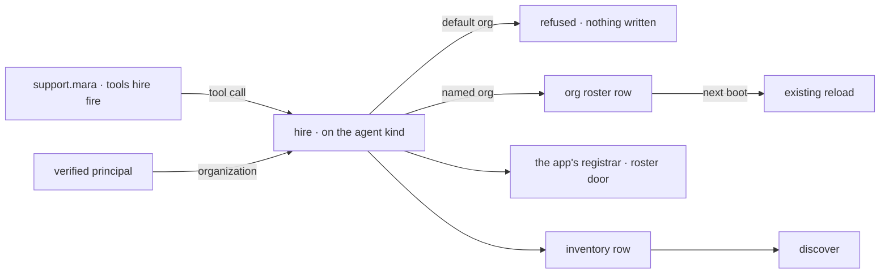

# FIX-1527 · Kitchen-sink: one manager seat names hire

**Spec** · [Decisions](DECISIONS.md) · [Rules](BUSINESS-RULES.md) · [Plan](PLAN.md) · [Docs](DOCS.md) · [Evolution](EVOLUTION.md)

Feature · kitchen-sink only · small · 1 PR · epic
[FIX-1455](https://linear.app/fixpoint-labs/issue/FIX-1455) ·
[epic spec](../../epics/FIX-1455/SPEC.md)

## Six people, before and after

| Someone who… | Today | After |
|---|---|---|
| **copies kitchen-sink to learn how a seat hires** | Finds hiring only as an operator's token-guarded HTTP action. No seat in the app can do it | Finds `support.mara`, a seat whose `WORKER.md` names `hire` and `fire`, on the same kind as the seats beside it |
| **runs mara in an app that authenticates its callers** | n/a | Mara hires a seat of a kind the app already has. It answers straight away, is still there after a restart, and `discover` lists it |
| **runs kitchen-sink as it ships and asks mara to hire** | n/a | **Refused, and nothing is written, until [FIX-1500](https://linear.app/fixpoint-labs/issue/FIX-1500)'s PR-B lands.** The app authenticates nobody, so every seat runs under the framework's development organization, and a hired seat cannot be addressed under it. Once PR-B lands, the whole app runs as one named organization ([FIX-1500 D6](../FIX-1500/DECISIONS.md#d6)) and mara hires. From `fsdev run`, which always uses the development organization, she is still refused |
| **runs iris or otto** | Cannot hire | Still cannot. Their kind now offers `hire`; neither seat names it |
| **fires a seat through mara** | n/a | The address stops answering and `discover` stops listing it. Its inventory row stays behind ([FIX-1540](https://linear.app/fixpoint-labs/issue/FIX-1540), not fixed here) |
| **asks `discover` who is around, from any agent seat** | No agent seat has `discover` | Sees seats hired at runtime in this organization. File-declared seats are not listed, because kitchen-sink writes no inventory rows for them |

The package README shows the capability in a snippet, which isn't the same as a working app.
Kitchen-sink is what people clone, so this is where a manager seat that hires has to exist. It
is **not** the only proof: the package's own suite already shows a hire on `discover`
(`seat-hire-capability.test.ts:334`).

## What changes


Look at the kind box: the two new capabilities sit on the kind the other seats already run on,
and only mara's own file names the tools. The red line is the finding that shapes this spec. A
hire goes through only under a real organization, and kitchen-sink gets one with FIX-1500's
PR-B.

**The seat, as somebody writes it.** No `flow:` line, the same as iris and otto, so it runs the
built-in `agent` kind:

```diff
+ # workforce/teams/support/workers/mara/WORKER.md
+ ---
+ description: Staffs the support desk — hires a seat of a kind the app already has, and fires one it hired.
+ tools: [hire, fire]
+ ---
+
+ You staff the support desk. …
```

**The kind, as the app composes it.** The same map the file roster, the operator's action and
the boot reload already share:

```diff
- const agent = defineAgentWorkerFlow({ uses: capabilities, catalog: blocks });
+ const agent = defineAgentWorkerFlow({
+   uses: [...capabilities, seatHire, discoverDoor],
+   catalog: blocks,
+ });
```

## How a hire reaches the roster



The organization comes from the verified caller, never from the tool's input. Kitchen-sink
verifies no caller on its seats today, so the `default org` branch is what happens in a default
run. Once FIX-1500's PR-B lands, every seat request resolves kitchen-sink's one named
organization, and the `named org` branch is what happens.

## What stays as it is

- The capability. Its tools, inputs, refusals and exports are
  [FIX-1525](https://linear.app/fixpoint-labs/issue/FIX-1525)'s and
  [FIX-1526](https://linear.app/fixpoint-labs/issue/FIX-1526)'s. This issue composes them.
- The operator's `workforce-admin` hire. It still writes a user-owned row. Mara writes
  org-visible rows. The two stay separate hire paths over the same store.
- The roster store and the boot reload. Nothing new persists. How the app decides an
  organization changes too, but in FIX-1500's PR-B, not here.
- Kind stays `flow:`. No demo UI names or picks a kind.

## Sign off

**F1 · answered: ship.** The product owner merged
[#2112](https://github.com/fixpoint-labs/flow-state-dev/pull/2112) with the recommendation to
ship now ([DECISIONS.md → F1](DECISIONS.md#f1)). The owner has since chosen
[FIX-1455 D9](../../epics/FIX-1455/DECISIONS.md#d9) as well: kitchen-sink will run as one named
organization, so mara hires in the running app once FIX-1500's PR-B lands.

1. **[D1](DECISIONS.md#d1) · Both capabilities go on the existing `agent` kind, and one new
   seat names `hire` and `fire`.** If wrong: every agent seat in the app, including any hired
   later, can be given hire by naming it, and iris and otto gain `discover`.
2. **[D2](DECISIONS.md#d2) · Mara's hires go through the app's existing roster door.** If
   wrong: her hires lean on a record only kitchen-sink keeps. Going around it costs more, since
   the operator's fire would delete the row and leave the seat answering until the next boot.

The cases are in [BUSINESS-RULES.md](BUSINESS-RULES.md). What this amendment changed, and
why, is in [EVOLUTION.md](EVOLUTION.md#amendment-named-org).
