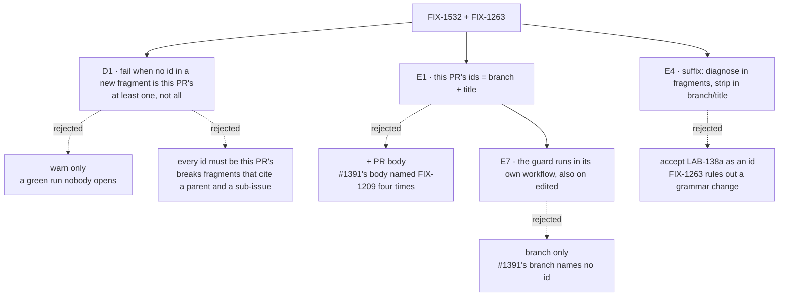

# FIX-1532 · Decisions

[Spec](SPEC.md) · **Decisions** · [Rules](BUSINESS-RULES.md) · [Plan](PLAN.md) · [Docs](DOCS.md)

One decision is the sign-off surface. The rest are engineering calls, recorded so nobody
re-derives them.

Solid edges are what you're signing. Dashed edges lost, and the label says why.

## D1 · A new fragment fails unless at least one id it cites is this PR's issue

| | |
|---|---|
| **Instead of** | A warning on a green run; or requiring *every* cited id to be this PR's |
| **Because** | The ledger filed this as a guard because reviewer attention is what failed: a warning asks for that same attention. "All" breaks the fragments that already cite a sub-issue and its parent, e.g. `(FIX-850, part of FIX-1804)` on `main` |
| **Locks in** | A PR that bundles fixes for sibling issues under one parent must name the parent in each fragment, or name the siblings in its title. Measured once: 4 of the 212 changeset PRs merged since the changeset reset would have failed this way, and none for another reason ([below](#d1-evidence)) |

It comes down to who catches a wrong id: the guard, at a cost of one added id on ~2% of
changeset PRs, or a reviewer, at no cost until one is missed.

**The evidence, frozen.** Prices D1 only, not FIX-1263; not re-run by
the implementation or CI. [`poc/replay/replay.mjs`](poc/replay/replay.mjs), run 2026-10-09 on
`main` at `078ab5805`: of **212** PRs that added a fragment since the reset (`b3e6e2279`), **4**
fail, **#2387, #2678, #2710, #2883**, each citing a sub-issue alone under a parent. (#1662 printed
only for its blank merge-commit title.)

**Why this is not a live fork:** the issue already chose "at least one" and a failing guard. The
replay only priced it, and the remedy is a one-line edit the failure message spells out.

**What would change my mind:** a workflow where bundling sibling fixes is the norm rather than
2%. Then the parent id would belong in the title by convention, and the message should say that
first.

## Engineering calls

- **E1 · This PR's issue ids come from the branch name and the PR title, never
  the body.** Branch and title are where every lifecycle skill puts the issue id. The body is
  where a PR names its neighbours: #1391's named `FIX-1209` four times, so reading it would pass
  the case this issue exists for. The title is read from the event payload GitHub already writes
  for the run; no API call.
- **E2 · No id in the branch or title → the match is skipped, with a one-line notice.** There is
  nothing to compare against, and failing here would add a new rule ("every PR title names an
  issue") that nobody asked for. At most 20 of the 212 replayed PRs, mostly
  `claude/project-thread-*`; the presence check still applies to them.
- **E3 · Only *added* fragments are matched. An edited fragment keeps
  today's presence check.** An edited fragment is usually someone else's; holding its editor to
  their own issue fires at the wrong person, as this guard once did (FIX-1191). Today's script
  drops the add/edit status it already gets from `git diff`; keeping it is new, small scope.
- **E4 · A suffixed id is diagnosed in a fragment and stripped in the branch
  and title.** In a fragment, `LAB-138a` is still not an id (FIX-1263: "the defect is the
  diagnostic, not the rule"); when no id is found, the guard looks for one with a letter suffix
  and names the bare id. In the branch or title, `lab-138a` or `(LAB-138a)` means "this PR is
  LAB-138", so a sub-PR's fragment that cites the bare parent passes the match. This is the one
  point where the two issues meet, and why they ship together.
- **E5 · Branch ids are read case-insensitively and must end at a separator.** Branches are
  usually lower case (`claude/fix-1532-…`). Requiring a boundary after the number keeps random
  branch suffixes out: `project-thread-8ra0ke` would otherwise read as `THREAD-8` (on the
  replay, 13 false failures down to the 8 fragments of the PRs above).
- **E6 · The decision logic is a pure exported function, tested from `packages/core/test/`.**
  That is how every sibling guard is tested (`spec-folder-check.test.ts`,
  `publish-set-check.test.ts`). The header says its two cases are exercised; no test exists yet.
- **E7 · The guard moves to its own workflow, which also runs on `edited`.**
  CI's bare `pull_request:` trigger skips `edited`, so with the title as a source a title edit
  after a green run leaves a stale verdict. `edited` on `ci.yml` would re-run every job
  (typecheck, tests, packed-install) per edit. `changeset-refs.yml` on `opened, synchronize,
  reopened, edited` runs only the guard: a full-history checkout and one `node` call, no install,
  under a minute. **Cost:** a run on every description edit too (no title-only filter), and a
  check under a new name. The repo rulesets require no check by name; classic protection was not
  readable here ([PLAN → At implement time](PLAN.md#at-implement-time)).

## Considered and dropped

| Alternative | Why not |
|---|---|
| Branch only, dropping the title | No stale-title problem, but #1391's branch names no id, so it would have been skipped (E2, E7) |
| Add `edited` to `ci.yml`'s trigger | Every description edit re-runs the whole CI workflow for one sub-minute guard (E7) |
| Ask Linear which issue the PR is attached to | Needs `LINEAR_API_KEY` in a fork-reachable check and a network call; the branch and title already carry the id |
| Read the PR body, with a weight for the "Links" line | Recovers the bundles, but the #1391 body had the wrong id in prose and the right one on its Links line; a parser that trusts one line of free text is a regress waiting to happen |
| Accept `LAB-138a` as a valid id | A grammar change FIX-1263 rejects: sub-PRs of one issue should cite that issue |

## How it got here

- **Draft** — one spec for both issues, at the architect's request. Framed as "the guard checks
  the id is this PR's", with the suffix diagnostic folded in where the two meet. Direction
  priced by replaying the rule over every changeset PR merged since the reset.
- **Review round 1** — the title became a source CI must re-run on, so the guard moves to its own
  workflow that also runs on `edited` (E7). The draft cited a package-rename exemption that `main`
  no longer has (removed in FIX-850); the baseline is now the real two-case script, and keeping
  add/edit status is named as new scope (E3). The replay is frozen as D1's evidence, not a gate.

**Open: none.**
