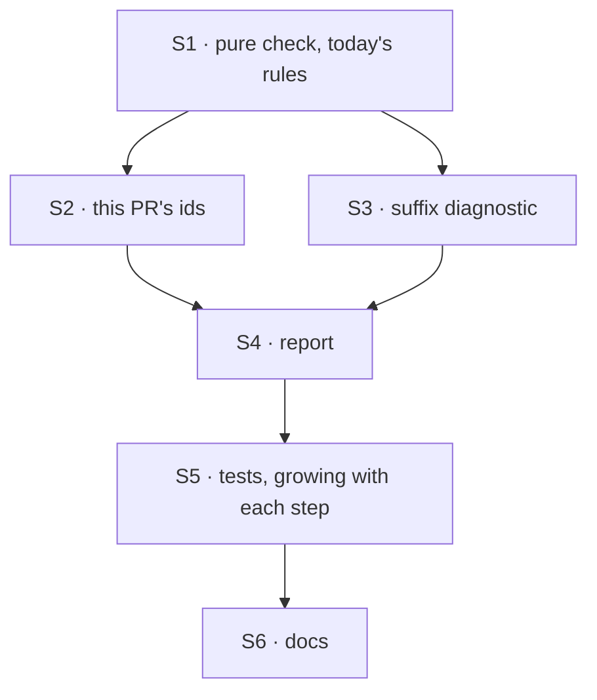

# FIX-1532 · Plan

[Spec](SPEC.md) · [Decisions](DECISIONS.md) · [Rules](BUSINESS-RULES.md) · **Plan** · [Docs](DOCS.md)

Written for the implementing agent. IDs cross-reference [BUSINESS-RULES.md](BUSINESS-RULES.md)
(BR-n) and [DECISIONS.md](DECISIONS.md) (D1, E-n). `tdd`. One PR, closing FIX-1532 and FIX-1263.

## Surfaces

| ID | Where | Change | Rules |
|---|---|---|---|
| S1 | `scripts/validate-changeset-refs.mjs` · a pure check | Export a function that takes this PR's ids and the changed fragments (status, path, source, and for `M` the base source) and returns offenders with reasons. The rename exemption and empty-fragment skip move inside it unchanged | BR-1…BR-6, BR-13…BR-18 |
| S2 | same file · reading this PR's ids | From `GITHUB_HEAD_REF` (else the current branch) and the `pull_request.title` in `GITHUB_EVENT_PATH` when present. Branch: case-insensitive, number ends at a separator, one trailing letter stripped (E4, E5). Title: `TEAM-123`, one trailing letter stripped. Never the body (E1) | BR-7…BR-12 |
| S3 | same file · the suffix diagnostic | When a fragment has no id, look for `TEAM-123x`; if found, the reason names it and the bare id | BR-13 |
| S4 | same file · the report | Reason per offender names what to do. Mismatch: the cited ids, this PR's ids and their source, and the two remedies (add this PR's id to the fragment, or the cited id to the title and re-run). One notice line when no PR id was found (E2). Guard the `main` entry so importing the file runs nothing (the `validate-spec-folder.mjs` pattern) | BR-2, BR-5 |
| S5 | `packages/core/test/changeset-refs-check.test.ts` | New. One test per rule, against the exported function; no git, no temp repo | all |
| S6 | `docs/contributing/release-notes-workflow.md`, `docs/contributing/best-practices.md` | Per [DOCS.md](DOCS.md) | — |

No changeset: `scripts/` is not a published package (BP-022).

## Sequence



Land S1 with tests for today's five header cases first (BR-16…BR-18 plus BR-6), so the refactor
is proved behaviour-preserving before any new rule goes in.

## Checks

| ID | Runs after | Passes when |
|---|---|---|
| V1 | S1 | Today's cases 1, 2, 2b, 2c and 3 pass/fail as the header says, through the exported function |
| V2 | S2 | BR-7…BR-12 |
| V3 | S3 | BR-13…BR-15. BR-13 is FIX-1263's *done when* |
| V4 | S4 | **#1391's real inputs** (fragment citing `FIX-1209`, title naming `FIX-1215`, branch `change/drop-scope-clientdata-shim`, body naming `FIX-1209`) fail, naming both ids. **Control:** the same inputs through `main`'s presence-only rule pass — show it in the PR |
| V5 | S4 | `node specs/issues/FIX-1532/poc/replay/replay.mjs`, re-pointed at the real check, fails only #2387, #2678, #2710, #2883 (and #1662 only for its blank merge title). Anything else is a rule the spec missed: stop and surface it |
| V6 | S4 | `node scripts/validate-changeset-refs.mjs` on this PR's own branch passes, and run against a scratch branch carrying a wrong-id fragment fails |
| V7 | S5 | `pnpm --filter @flow-state-dev/core test changeset-refs-check` green |

No goal check under `goals/` applies (SPEC → The goal says why); V4 with its control and V5 are
what prove the goal.

## Pinned names

None. The test file name follows its siblings; everything else is yours.

## Guardrails

| Rule | Because |
|---|---|
| Never read the PR body for this PR's ids | #1391's body carried the wrong id; reading it passes the case this exists for (E1) |
| Edited fragments keep presence-only; don't extend the match to `M` | The header's regress list: the guard once fired at whoever touched a file (E3) |
| Don't widen `RENAMED_PACKAGES` or the id grammar | The header names both as the regress restarting. A suffixed id is diagnosed, not accepted (E4) |
| No dependency, no network, no secret | CI runs this before install, on fork PRs too |
| An unreadable or absent event payload falls back to the branch; it is never a failure | A local run has no payload, and a guard that fails on its own plumbing teaches people to skip it |

## Sketch · pseudocode, illustrative

```
prIds   ← ids(branch, case-insensitive, separator-bounded, strip suffix)
        ∪ ids(event.pull_request.title, strip suffix)          // never the body
for each added or edited fragment with a bump:
    if edited and only the rename applied: skip                 // case 3
    ids ← TEAM-123 tokens in the body
    if ids empty:
        suffixed ← TEAM-123x tokens
        offend(suffixed ? "found X; cite the bare id Y" : "no issue id")
    else if added and prIds non-empty and no id ∈ prIds:
        offend("cites ids; this PR is prIds (from branch/title); remedies")
if prIds empty: notice("no issue id in branch or title; match skipped")
```

**POC:** [`poc/replay/`](poc/replay/replay.mjs) replays this rule over the 212 changeset PRs
merged since the reset. It showed the cost of D1 is four bundled PRs, and that a loose branch
pattern adds false failures (`THREAD-8`, `GATES-4`, `FLOW-7`), hence E5.

## At implement time

- The script header still says specs live in Linear, not the repo. That is stale since retained
  specs; correct that sentence while editing the header (BP-034), nothing more.
- Re-run the replay against current `main`; new bundles since this spec only move the count.

## Follow-ups

- None filed.
