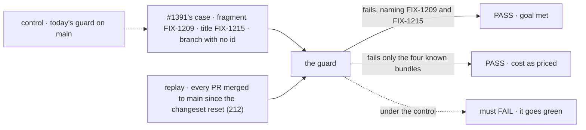

# FIX-1532 · The changeset guard checks the id is this PR's issue, and says why a suffixed id fails

**Spec** · [Decisions](DECISIONS.md) · [Rules](BUSINESS-RULES.md) · [Plan](PLAN.md) · [Docs](DOCS.md)

| Someone who… | Today | After |
|---|---|---|
| **writes a changeset for FIX-1215 that cites `FIX-1209` by mistake** | CI is green. Only a reviewer reading the fragment can catch it ([#1391](https://github.com/fixpoint-labs/flow-state-dev/pull/1391): three did) | CI fails and names both: the fragment cites `FIX-1209`, this PR is `FIX-1215` |
| **cites only a lettered sub-issue id, `LAB-138a`** | CI says the fragment has no issue id at all, so they hunt for a typo that isn't there | CI names the token it found and the id to use: `LAB-138` |
| **ships one PR that fixes two sub-issues under a parent, each with its own fragment** | Green | Fails unless each fragment also names the PR's issue, or the PR title names theirs. The message says both ways out |
| **opens a PR whose branch and title name no issue** | Green if every fragment cites some id | The same. The guard has nothing to compare against, and says so in one line |
| **edits a fragment someone else wrote** | Must keep an id in it | The same. An edited fragment keeps its own author's id |
| **reads a released CHANGELOG entry** | May follow an id to the wrong issue | Follows it to the issue the change came from |

Folds in [FIX-1263](https://linear.app/fixpoint-labs/issue/FIX-1263): the same script, the same
failure message, and the two changes meet at one point, reading a suffixed id
([E4](DECISIONS.md#e4)).

## The goal, and how we'll know it's met

**A changeset that cites a well-formed id that is not this PR's issue fails CI with a message
naming both ids, and one that cites only a suffixed id fails with a message naming the bare id to
use.**

| Is it the right goal? | |
|---|---|
| **The real need** | The guard, not reviewer attention, stops a wrong id ([FIX-1532](https://linear.app/fixpoint-labs/issue/FIX-1532); [cycle 15](../../../docs/internal/cycle-ledger/cycle-15.md), "Filed, not proposed"). A suffix failure says what is wrong ([FIX-1263](https://linear.app/fixpoint-labs/issue/FIX-1263)) |
| **Smaller, and rejected** | Warn instead of fail. A warning on a green run is the same as today for anyone who doesn't open the log, and the ledger filed this as a guard because attention already failed once |
| **Bigger, and not this issue's** | Check the id against Linear (does it exist, is it linked to this PR). That needs a network call and a secret in a check that runs with no install. Nothing shows the cheaper check leaves a gap that matters |
| **Not done if** | The tests pass but the #1391 case still goes green · the PRs we merged start failing in numbers nobody priced · a suffixed id is accepted as if it were bare (that is a grammar change FIX-1263 rules out) |



The check runs the new guard on #1391's real inputs and on every changeset PR merged since the
reset, and reads the verdicts. Today's guard must pass #1391's case, or the check proves nothing.

No goal check under `goals/` applies: this is a CI script with no flow and no model. The proof is
the unit tests and the replay in [PLAN → Checks](PLAN.md#checks).

## What changes

What the author sees when the check fails. Wording is illustrative; the content of each line is the rule:

```diff
- ✗ 1 changeset(s) missing a Linear issue reference:
-     .changeset/drop-clientdata-shim.md  (no Linear issue id in the body)
+ ✗ 1 changeset(s) do not name their issue correctly:
+     .changeset/drop-clientdata-shim.md  (cites FIX-1209; this PR is FIX-1215, from its title)
+   If the fragment is right to cite FIX-1209, name FIX-1215 in it too, e.g. "(FIX-1209, part of FIX-1215)".
```

```diff
- ✗ 1 changeset(s) missing a Linear issue reference:
-     .changeset/sub-pr.md  (no Linear issue id in the body)
+ ✗ 1 changeset(s) do not name their issue correctly:
+     .changeset/sub-pr.md  (found "LAB-138a"; cite the bare parent id "LAB-138")
```

**How:** the guard reads this PR's issue ids from its branch name and its title, and each new
fragment must cite at least one of them. The PR body is not read: #1391's body named `FIX-1209`
four times, so reading it would have passed the exact case this exists for ([E1](DECISIONS.md#e1)).

## What stays as it is

- A PR with no changeset passes. This guard never requires one (BP-022).
- The id grammar, `TEAM-123`. A suffixed id is still not an id; it is now explained.
- Edited fragments and the package-rename exemption: unchanged rules ([E3](DECISIONS.md#e3)).
- No Linear call, no secret, no install. The guard stays a dependency-free script.

## Sign off

**[The goal](#the-goal-and-how-well-know-its-met), at that size:** a wrong id fails CI; a suffix
failure names the fix. If wrong: the guard stays something a reader can't trust, and reviewers
keep checking ids by eye.

1. **[D1](DECISIONS.md#d1) · Fail when no id in a new fragment is this PR's, not warn, and
   "at least one", not "all".** About 2 in 100 changeset PRs (4 of 212 merged since the reset)
   bundled sub-issue fixes and would need one more id in a fragment or the title. If wrong: we
   either annoy those PRs for nothing, or keep paying reviewers to catch what the guard could.

**Open: none.** D1 is the one to weigh; the issue already chose its direction, and the replay
priced it. Reasoning: [DECISIONS.md](DECISIONS.md). Cases: [BUSINESS-RULES.md](BUSINESS-RULES.md).

Improvement · `scripts/` + one test in `packages/core/test/` · small · 1 PR · folds in FIX-1263 · no epic
