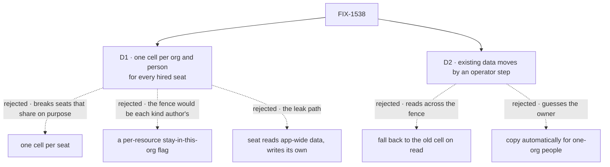

# FIX-1538 · Decisions

[Spec](SPEC.md) · **Decisions** · [Rules](BUSINESS-RULES.md) · [Plan](PLAN.md) · [Docs](DOCS.md) · [Evolution](EVOLUTION.md)

Two decisions are the sign-off surface. The product calls above them are already made: a private
team is not portable, and only a hired seat's own data moves (epic
[D2](../../epics/FIX-1528/DECISIONS.md#d2)). These two are what that costs a customer.

## The tree

Solid edges are what you're signing. Dashed edges lost, and the label says why.

## D1 · A hired seat stores a person's data in one cell per (org, person), and reads none of the person's app-wide data

| | |
|---|---|
| **Instead of** | One cell per seat · a per-resource "stay in this org" flag · a seat that reads the person's app-wide cell and writes its own |
| **Because** | Epic D2 names the cell, and the three planes stay separate (Architect fences on FIX-1528). A resource lives in exactly one cell, so a seat that could read the person's app-wide data would also write there, and Globex would read it back. A per-resource flag leaves the fence to every kind author, and the shipped seat kind defaults to shared (epic ER-12). One cell per seat would also stop Alice's seats in one org sharing what they know about her, which a resource declared shared promises |
| **Locks in** | Every hired seat, org-visible or private, stops seeing what the app's own flows keep about a person, and they stop seeing what the seat keeps. Alice's seats in one org still share with each other. An app that wants a seat to read a person's app-wide preferences needs an opt-in that does not exist yet. Adding one later is additive |

**What would change my mind:** a shipping app whose hired seats read a person's app-wide data by
design. Then the opt-in moves into this issue instead of after it.

The issue says "a person in one org sees no change" (epic ER-5). That holds for what a seat
itself saved, once the operator runs D2's step. It does not hold for app-wide data a seat used to
read. The fence makes that unavoidable, and this card is where it is signed.

## D2 · Existing seat data moves only by an operator step, and data two orgs' seats both wrote is never copied into either

| | |
|---|---|
| **Instead of** | A read that falls back to the person's old cell · an automatic copy for people who used seats in one org only |
| **Because** | A fallback is the leak itself: Alice's Globex seat would read what her Acme seat saved. Only the operator's records say which org a person's old data came from; the framework cannot tell a one-org person from a person whose other org has not signed in yet. The same call was made for per-copy data, with the same offline procedure (`apps/docs/docs/persistence/overview.md` → "Who owns a record") |
| **Locks in** | After upgrading, each hired seat opens with an empty cell for each person until the operator runs the documented step. The old data is never moved or deleted by the framework. For a person whose seats ran in two orgs, the old data is already mixed, and the step leaves it where it is |

**What would change my mind:** a deployment large enough that the operator step is impractical.
Then a framework-shipped inventory command earns its place, still with no runtime fallback.

## Decided, not asked

- **The org comes from the seat's pin**, which is copied from the hire row. The person comes from
  the admitted caller. Admission has already proved the two agree (BP-031).
- **Org-visible hired seats get the cell too.** Bob using Acme's `eng.lead` stores in (acme, bob).
- **The key is a third, distinct shape**: three escaped parts, so it cannot collide with a
  person's cross-org key or a flow-isolated key ([PLAN → Pinned names](PLAN.md#pinned-names)).
- **A refused run writes nothing into the cell**, not even an empty record (BR-9).
- **The scheduled-actions resolver keeps reading the person's own cell.** It fails closed for a
  seat and is a follow-up, not part of this fence.
- **Roster keys do not move.** The Linear implementer note assumed they would; they are org-scoped
  and untouched, so the core caller-prefix helper stays a separate cleanup.
- **The goal is the epic's assembled proof**, one scenario through every door, with Alice signed
  into Globex as the sharpest caller (epic D1, ER-15).

## Considered and dropped

| Alternative | Why not |
|---|---|
| Re-key user scope to (user, org) for every flow | Decides the person's cross-org data, which nobody has decided (epic ER-9) |
| Store the cell under org scope instead of user scope | Moves a person's data out of every user-scoped reader and listing for no gain in isolation |
| A separate store for seat data | Invent-killed: one store, and the key picks the cell (epic ER-6) |

## What the POC showed

`poc/cell-sites/` counts every place a user-scoped key is built or used. Three files derive one,
all with the flow in hand; one production reader bypasses the derivation and fails closed. The
premise that this is a narrow change held. Its negative control failed as it should.

## How it got here

- **Draft** — framed as the storage half of "not portable"; the seat's pin picks an (org, person)
  cell at the one key derivation; one PR carrying the epic's assembled goal and the operator step.

**Open: none.**
