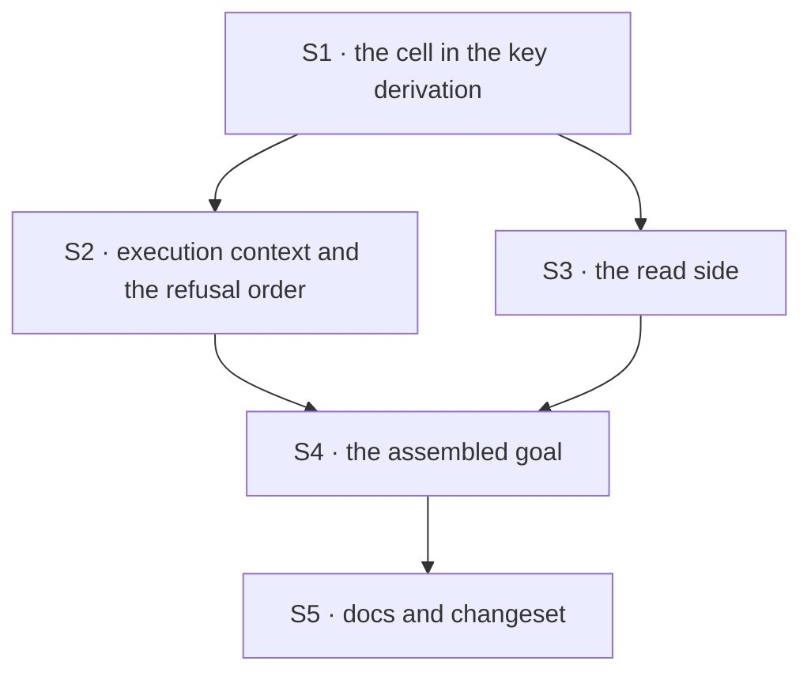

# FIX-1538 · Plan

[Spec](SPEC.md) · [Decisions](DECISIONS.md) · [Rules](BUSINESS-RULES.md) · **Plan** · [Docs](DOCS.md) · [Evolution](EVOLUTION.md)

Written for the implementing agent. IDs cross-reference [BUSINESS-RULES.md](BUSINESS-RULES.md)
(BR-n), [DECISIONS.md](DECISIONS.md) (D-n) and the epic's rules (ER-n). `tdd`. One PR. It is the
epic's last child: it merges only once FIX-1534's and FIX-1535's legs are on `main` (both are).

## Surfaces

| ID | Package · role | Change | Rules |
|---|---|---|---|
| S1 | `engine` · the key derivation (`stores/scope-keys.ts`) | A shared user-scoped key for a flow carrying an owner pin becomes the (org, person) cell: org from the pin, person from the caller. Covers the scope record and per-resource buckets alike. Flow-isolated keys, org keys and unpinned flows are byte-identical to today. The isolation shape gains the pin; `toIsolationFlow` forwards it | BR-1–BR-8, BR-11 |
| S2 | `engine` · execution context | Hand the registered instance's pin to S1 for the scope record and both resource paths. Move the pin refusal ahead of the first user-record create, so a refused run writes nothing | BR-1, BR-4, BR-5, BR-9, BR-12 |
| S3 | `engine` + `scheduled` · the read side | `getPersistedData` (state route, resource routes, debug snapshot, sibling transports) and the state route's scope-record read resolve the same cell as S2. `ResourceOwnerFlow` carries the pin. The dynamic-schedule resolver stops building a bare user key: its dispatch route already holds the registered instance, hands that instance's pin into the resolution context, and the resolver derives the key through the engine's derivation. A stored row whose org differs from the pin's resolves as missing | BR-10, BR-17 |
| S4 | `goals/hire-plane/` · the assembled goal | One new goal: Alice's private Acme seat walked through every door, graded by who asks, plus the two stored-data legs ([Checks](#checks) VG). Shipped legs of the sibling goals are not edited (epic PLAN, coordination seams) | ER-15 · BR-1–BR-3 |
| S5 | Docs | Publish [DOCS.md](DOCS.md). Internal: `docs/architecture/state-and-scopes.md` (the cross-flow and isolation sections) and `docs/architecture/authentication.md` (the pin paragraph) gain the cell; BP-027's second bullet names the hired-seat exception; the `scope-keys.ts` header gains a FIX-1538 paragraph; `packages/engine/README.md`'s scope-key section. One `minor` changeset for `@flow-state-dev/engine`, carrying the upgrade note | ER-16 · BR-13–BR-16 |

Nothing is removed ([EVOLUTION.md](EVOLUTION.md) has what is amended).

## Sequence



## Checks

| ID | Runs after | Passes when |
|---|---|---|
| V1 | S1 | Key table: unpinned shared, unpinned isolated, pinned isolated and every org key equal today's strings exactly; a pinned shared user key is the pinned shape. BR-11's collision table: ids with `:` and `\`, an org id equal to a flow id, a user id that looks like a cell key. All distinct |
| V2 | S2 | BR-1, BR-4, BR-5 through a real run. BR-9: a direct run by a caller outside the pin throws the pin error and the store holds no new user record under any key. BR-12 |
| V3 | S3 | BR-10: the state route, a user-scope resource read, and the debug snapshot for a seat session each return the value S2 wrote and not a planted value in the person's cross-org cell. BR-17: a schedule a seat run writes to its schedule collection resolves through the dispatch route for that seat; the same row planted only in the person's cross-org cell resolves as missing; an unpinned flow's schedule still resolves from the cross-org cell |
| V4 | S2 | BR-13: a value planted in the person's cross-org cell before the run is not read by a seat and is still there, unchanged, after the run |
| V5 | S5 | BR-14–BR-16, BR-18: the persistence procedure walked once against a SQLite file with one one-org person, one two-org person, one key shared with an app flow, a user-state record, a collection with a deletion marker, and a destination a seat already wrote to. Only the seat-only keys of the one-org person are copied, marker included; the shared key and the user-state record are not; the non-empty destination stops the step and names its keys. Recorded in the PR, not a CI test |
| VG | S4 | **Goal**, real router and worker pool, in-memory stores, no model. Callers: Alice in Acme (owner), Alice in Globex, Bob in Acme. (a) owner opens her private seat and saves a marker to a shared user resource and to user state. (b) `GET /api/flows` lists the seat for the owner only. (c) opening it is `404` for both others. (d) running an action on it is `404` for both. (e) resuming the owner's session is refused for both. (f) a Globex board drained by Alice, and an Acme board drained by Bob, onto the seat: row `errored`, unheld, no session minted. (g) with debug endpoints on, neither sees the private roster row. (h) the owner's next run reads the marker back. (i) Alice's Globex seat of the same kind reads no marker. (j) Bob's Acme seat of the same kind reads no marker. `pnpm tsx goals/hire-plane/keeps-a-private-team-in-the-org-it-was-built-in/run.mts` |
| VC | VG | **Control, a source revert:** make S1 return today's key for pinned flows. Must FAIL legs (i) only; (h) and (j) stay green, because Bob's cell was never Alice's. Record it in the goal's verdict log. Then restore and PASS |

(j) guards a cell keyed by org alone; its control is to drop the person from the key: must FAIL (j).

## Pinned names

| Where | Name | Why pinned |
|---|---|---|
| The cell key | `<person>:~org:<org>`, each part through the existing component escaping | Persisted. The operator step and the docs name it. Three parts cannot equal a one-part cross-org key or a two-part isolated key, because the escaping is decodable |
| The goal | `goals/hire-plane/keeps-a-private-team-in-the-org-it-was-built-in/` | The epic's proof is cited by path |

Everything else is yours to name, including whether the pin rides the isolation shape or a
separate argument.

## Guardrails

| Rule | Because |
|---|---|
| The org in the key comes from the pin, never from the session, a header or the body (BP-031) | The pin is from the hire row, and admission has already proved the caller's org equals it |
| Every engine call that builds a user-scoped key passes the registered instance or forwards its pin. Re-run `poc/cell-sites/check.mjs` and update its table in the same PR (tenet 5) | Three files derive a key today; a fourth that drops the pin reopens the leak silently |
| The exported helpers keep accepting a shape with no pin, and return today's key for it (BP-030) | They are public. A caller passing `{ id, isolateUserState }` must still compile and still get the key it got before |
| No read falls back to the person's cross-org cell for a seat, ever (D2) | The fallback is the leak |
| Test the second path (BP-035): an org-visible seat, a refused run, a legacy value planted in the old cell, an id with `:` | Each is a place the obvious implementation passes the happy path and fails the fence |

## Docs

Reconcile [DOCS.md](DOCS.md) against shipped behaviour after VG passes (its bullets are true only
when every leg holds), then publish through `docs-writer` and `docs-editor`. S5's internal docs
need no draft.

## Sketch · pseudocode, illustrative

```
key for (scope user, person, flow, resource):
    if resource is isolated:        person : flow address          (today)
    else if flow has a pin:         person : ~org : pin's org      (new)
    else:                           person                         (today)
```

**POC:** `poc/cell-sites/` counted every user-scoped key site (3 derive, 1 production bypass, 2
harness files) and failed its planted control. The premise held. The bypass, the dynamic-schedule
resolver, joins S3; after the build the checker's bypass class is empty.

## At implement time

- Re-run `poc/cell-sites/check.mjs` first. A changed count means a site moved since `e337c7a2a`.
- FIX-1541 (#2118) touches workforce's `roster/rows.ts`, not the key path. Rebase if it merges.
- The coordinator is filing the duplicate hired-seat pin helper (`seat-hire-capability.ts` and
  `roster/register-hired-seat.ts`) as its own cleanup. This change does not need either.
- The registry's cross-flow schema check still compares a seat's shared user resources with
  unpinned flows', which no longer share a cell. Stricter than needed; leave it unless a real
  registration fails on it.

## Follow-ups

- The testing harness seeds user state at the bare person id for every flow, pinned or not.
- The Linear implementer note's core caller-prefix helper for the private roster check stays a
  separate cleanup: roster keys do not move here.
- An opt-in for a resource that should follow the person into every org (D1). Product call first.
