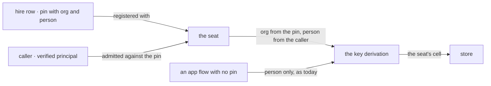

# FIX-1538 · A user's private team stays in the org it was built in

**Spec** · [Decisions](DECISIONS.md) · [Rules](BUSINESS-RULES.md) · [Plan](PLAN.md) · [Docs](DOCS.md) · [Evolution](EVOLUTION.md)

Feature · `engine` + docs + one goal · medium · 1 PR · epic [FIX-1528](../../epics/FIX-1528/SPEC.md) (its last child, and its proof)

## Five people, before and after

| Someone who… | Today | After |
|---|---|---|
| **works in Acme and Globex, with a private research seat in each** | Her Globex seat reads the notes her Acme seat saved about her | Each seat sees only what was saved in its own org. Globex's starts empty |
| **is Bob, Alice's teammate in Acme, with his own research seat** | His seat stores in his own cell. Alice's notes never reach it | Unchanged, and now proved by the same check |
| **runs an app where a seat and the app's chat flow share what they know about a person** | The seat reads the person's app-wide data, and writes into it | The seat keeps its own per-org copy. The app's flows keep theirs. Neither sees the other |
| **upgrades an app that already has hired seats in production** | n/a | Seats open with an empty cell until the operator runs a documented copy step. Nothing is moved or deleted without them |
| **reviews the epic's promise** | Each door is proved by its own issue's check. No check walks one seat through all of them, and none covers stored data | One check walks Alice's private seat through every door and both halves of the cell |

A hired seat already refuses callers outside its organization and person. What it saved for a
person did not follow that rule: it lived in one cell per person, across every org. The product
owner decided a private team is not portable, and this issue makes the storage agree.

## What changes


Read the red lines on the left: two orgs writing into one cell is the leak. On the right each seat
lands inside its org's box, and the chat flow's cell has not moved.

**Nothing a developer writes changes.** A seat kind keeps declaring `scope: "user"` resources
exactly as today. The org comes from the hire row the seat was registered with, never from the
request:

```diff
  defineResource({ scope: "user", stateSchema: notesSchema })   // unchanged
- // on a hired seat: stored per person, shared by every org
+ // on a hired seat: stored per (org, person); unhired flows unchanged
```

## How a seat finds its cell



One derivation decides every user-scoped key, and it already holds the flow. A pinned flow's
shared user data gets an org in its key; a flow with no pin is untouched.

## What stays as it is

- **Flows that are not hired seats**, including seats declared in a `WORKER.md` file. The
  person's cross-org data keeps its key (epic [ER-9](../../epics/FIX-1528/BUSINESS-RULES.md)).
- **A seat's org-scoped data** is the org's, shared with every member, as the kind declared.
- **A seat's flow-isolated data** already keys by the seat's address, which carries org and person.
- **Roster rows and addresses.** Nothing about hiring, firing or reload moves.
- **User planes**, portability, and an opt-in for a resource that should follow the person
  ([D4](../../epics/FIX-1528/DECISIONS.md#d4)).

## Sign off

1. **[D1](DECISIONS.md#d1) · A hired seat stores a person's data in one cell per (org, person),
   and reads none of the person's app-wide data.** If wrong: a seat built to read a person's
   app-wide preferences stops seeing them, until an opt-in exists.
2. **[D2](DECISIONS.md#d2) · Existing seat data moves only by an operator step, and data two
   orgs' seats both wrote is never copied into either.** If wrong: an upgraded seat looks like
   it forgot what it knew about each person until someone runs the step.

**Open: none.** Number 1 is the one to weigh. The goal is the epic's assembled proof, decided by
the epic ([D1](../../epics/FIX-1528/DECISIONS.md#d1)), and is not re-asked. Reasoning and what lost:
[DECISIONS.md](DECISIONS.md). The cases: [BUSINESS-RULES.md](BUSINESS-RULES.md).
