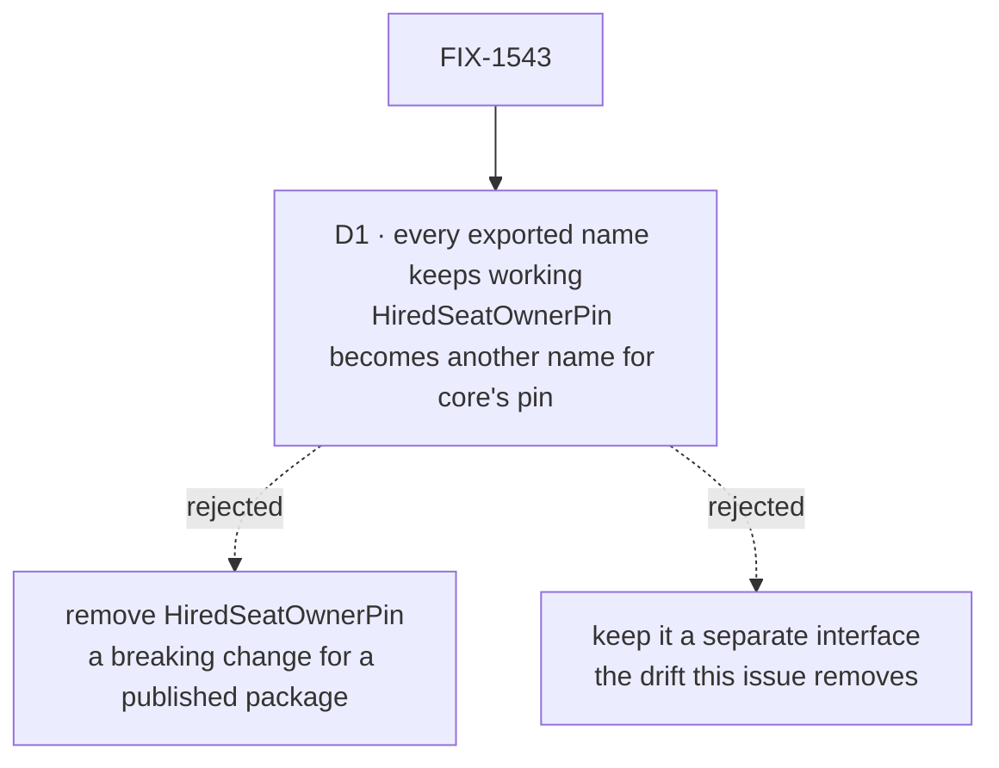

# FIX-1543 · Decisions

[Spec](SPEC.md) · **Decisions** · [Rules](BUSINESS-RULES.md) · [Plan](PLAN.md) · [Docs](DOCS.md)

What was considered, what was chosen, why, and what it locks in. One decision is the sign-off
surface. The rest was decided without asking and is recorded so nobody re-derives it.

## The tree

Solid edges are what you're signing. Dashed edges lost, and the label says why.

## D1 · Every name the package exports today keeps working; `HiredSeatOwnerPin` stays, as another name for core's `InstanceOwnerPin`

| | |
|---|---|
| **Instead of** | Removing `HiredSeatOwnerPin` and pointing its users at `InstanceOwnerPin`, or keeping it as its own declaration that extends core's |
| **Because** | `@flow-state-dev/workforce` is published and its README documents the name as an export, so a user outside this repository may import it. Inside the repository nothing outside the package's own source, one test and the README names it, which is why removing it looks free and isn't. A separate declaration, even one extending core's, could gain a field core's lacks: the same drift this issue exists to end (tenet 5, one convergence point) |
| **Locks in** | Two public names for one type until someone deprecates one on purpose. No changeset: nothing a user can observe changes. The one theoretical loss is augmenting `HiredSeatOwnerPin` through declaration merging, which a type alias does not allow; nothing in the repository does it |

**What would change my mind:** a decision to trim the workforce export surface before 1.0.
Then removing the name belongs in that pass, with a changeset, not in a refactor that promises
no visible change.

## Decided, not asked

- **The roster module's copy survives.** It is already typed on core's pin, so the change is
  a deletion plus imports. Keeping the other copy would mean retyping it and moving the pin
  type's home.
- **The drift guard is one small test, both halves cheap.** It checks the functions reachable
  from the package root, the seat-hire module and the roster module are the same objects, and
  that the gate's refusal sentence appears in exactly one source file. The first half catches an
  exported copy; the second catches a private one pasted in with its message, which is how
  this one arose. Precedent: `contracts-zero-dep.spec.ts` scans source the same way. The
  test is red on today's `main`, so it has a red state before it goes green.
- **The stale reference goes with the deleted copy**, and the `(FIX-1529 / F2-PLAN)` label is
  dropped from the `register` option's doc beside it (BP-006). The sentence it tags stays true.
- **The README lists `registerHiredSeat` in two tables.** Both rows stay true of the one
  function, so they stay. Only the `HiredSeatOwnerPin` row changes ([DOCS.md](DOCS.md)).
- **`hiredSeatOwnerPin(orgId, row)` in the roster rows module is not a third copy.** It builds
  a pin from a stored row and refuses nothing. It shares the empty-`userId` rule, so it is
  flagged in [PLAN → Follow-ups](PLAN.md#follow-ups), not merged here.

## Considered and dropped

| Alternative | Why not |
|---|---|
| Keep both copies and add a test that they behave alike | Keeps two things to edit and adds a third that must track them. Deleting one is less code |
| Keep the hire-block copy and delete the roster one | Same size of change, but the survivor is typed on a local interface, so core's type would have to be threaded in anyway |
| A lint rule or a repository-wide duplicate-code scan | Heavier than one test, and would flag unrelated code the issue does not own |

## How it got here

- **Draft** — framed as one security-relevant gate with two copies. The roster copy survives,
  the hire blocks import it, every public name is kept, and a guard test makes a second copy
  fail CI. One PR in `workforce`.

**Open: none.**
