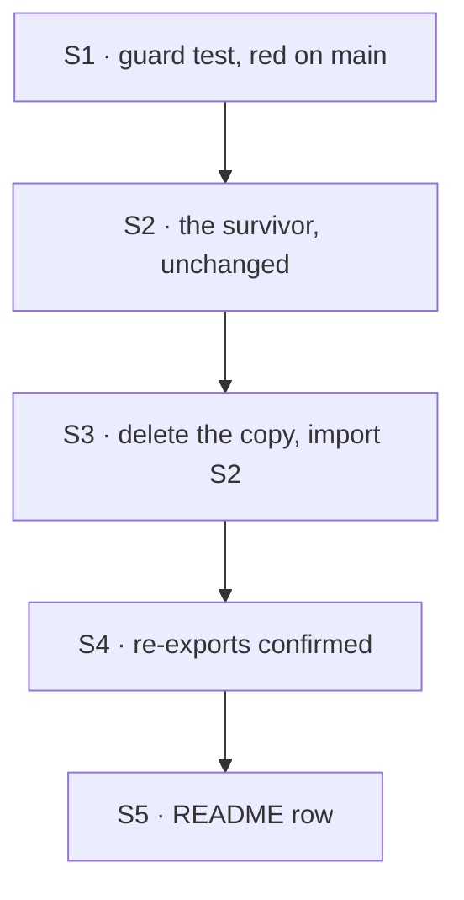

# FIX-1543 · Plan

[Spec](SPEC.md) · [Decisions](DECISIONS.md) · [Rules](BUSINESS-RULES.md) · **Plan** · [Docs](DOCS.md)

Written for the implementing agent. IDs cross-reference [BUSINESS-RULES.md](BUSINESS-RULES.md)
(BR-n) and [DECISIONS.md](DECISIONS.md) (D-n). `tdd`. One PR.

## Surfaces

| ID | Package · role | Change | Rules |
|---|---|---|---|
| S1 | `workforce` · test, the drift guard | **New.** Both functions are identical objects across the root, `seat-hire-capability` and `roster` modules; the refusal sentence appears in exactly one file under `src/` | BR-6 BR-9 BR-10 |
| S2 | `workforce` · `roster/register-hired-seat.ts` | Stays the one implementation, unchanged in behaviour. The `HiredSeatOwnerPin` alias may live here or in S3; your call (D1) | BR-1–BR-5 |
| S3 | `workforce` · `seat-hire-blocks.ts` | **Remove** the local interface, both functions and their doc comments, stale reference included. Import from S2. Keep exporting all three names, `HiredSeatOwnerPin` as `type = InstanceOwnerPin`. Drop the `(FIX-1529 / F2-PLAN)` label from the `register` option's doc | BR-6 BR-7 |
| S4 | `workforce` · `seat-hire-capability.ts`, `index.ts`, `roster/index.ts` | Expected: no change; they re-export by name. Confirm the root still exports all three | BR-6 BR-8 |
| S5 | docs | [DOCS.md](DOCS.md): one README row. No changeset (D1) | — |

## Sequence

## Checks

| ID | Runs after | Passes when |
|---|---|---|
| V0 | S1 | **The red state.** On today's code the guard fails on both halves: the root's functions differ from the roster module's, and the sentence is in two files. Record the output |
| V1 | S3 | The guard passes. Then restore the deleted copy in the working tree and watch it go red again, then revert (negative control) |
| V2 | S3 | `pnpm --filter @flow-state-dev/workforce test` passes with **no assertion edited** in `hire-plane.test.ts` or `seat-hire-capability.test.ts` (BR-1–BR-5) |
| V3 | S4 | `pnpm --filter @flow-state-dev/workforce typecheck` and `pnpm --filter @flow-state-dev/kitchen-sink typecheck` pass, the kitchen-sink untouched (BR-7 BR-8) |
| VG | S4 | Goal, on the real path: `pnpm tsx goals/seat-hire/refuses-an-unpinned-register/run.mts` passes, and `GOAL_CONTROL=unpinned-ok` still fails on leg (a) |

## Pinned names

| Where | Name | Why pinned |
|---|---|---|
| Package root | `registerHiredSeat`, `hiredSeatOwnerPinFromRosterOwner`, `HiredSeatOwnerPin` | Public and documented (D1) |
| The refusal | Today's sentence, word for word | Tests match `/owner pin/`, and the guard keys on it |

Everything else is yours to name, including the guard test's file.

## Guardrails

| Rule | Because |
|---|---|
| No existing test assertion changes | The promise is identical behaviour. An edited assertion means behaviour moved |
| Every hired-seat register path calls the one gate (tenet 5): the `hire` block, and the root export apps call from their registrars | One gate reached from some paths is the drift this issue closes |
| Do not edit `apps/kitchen-sink/lib/workforce-registrar.ts` | FIX-1563 (#2169) is changing it. It typechecks against the root either way |
| No import from `seat-hire-blocks` into the roster module | The roster module takes core types only; the dependency runs one way |

## Docs

Publish [DOCS.md](DOCS.md)'s one row after V2 passes. No page under `apps/docs` changes.

## Counted facts, and how to re-derive them

No checker POC: the spec rests on two greps and one language rule, and V0 re-measures all of
it. `grep -rnE "export function (hiredSeatOwnerPinFromRosterOwner|registerHiredSeat)\b" packages/workforce/src`
prints four lines, two per file; the refusal sentence is in the same two files. Outside
`packages/workforce/src` and `specs/`, `HiredSeatOwnerPin` appears only in the package's
`seat-hire-capability` test and README. The root resolves to the hire-block copy because an
explicit `export { … }` shadows `export * from "./roster"`; a two-file Node run confirmed it.

## At implement time

- Open PRs touching these files as of `fbdf250f6`: #2178 (FIX-1549, spec only; its plan
  rewrites fence cases in `hire-plane.test.ts`), #2162 (other README rows), #2169
  (kitchen-sink). Rebase and re-run the two greps.

## Follow-ups

- `hiredSeatOwnerPin(orgId, row)` in `roster/rows.ts` repeats the gate's empty-`userId` rule
  without the refusal. Not a copy of the gate; flag for `improve-codebase-architecture` if
  the rule ever changes.
