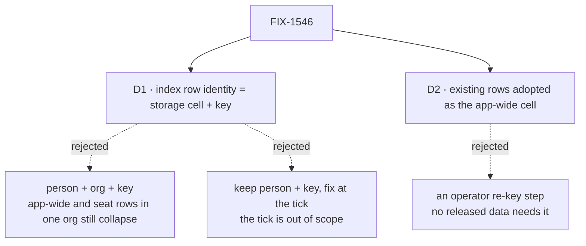

# FIX-1546 · Decisions

[Spec](SPEC.md) · **Decisions** · [Rules](BUSINESS-RULES.md) · [Plan](PLAN.md) · [Docs](DOCS.md) · [Evolution](EVOLUTION.md)

What was considered, what was chosen, why, and what each choice locks in. Two decisions are the
sign-off surface. Everything else here is context for them.

## The tree

Solid edges are what you're signing. Dashed edges lost, and the label says why.

## D1 · A schedule's index row is identified by the storage cell the schedule lives in plus its name

| | |
|---|---|
| **Instead of** | Adding the organization to the key: person + org + key |
| **Because** | The index is a mirror of the schedule rows, and a schedule row's address is its cell plus its name. Keying the mirror on the source's own address makes a collision impossible by construction: two schedules can share an index row only if they are the same schedule. Organization is not the cell. An app-wide schedule and a seat schedule with one name, both made in Acme, are two schedules in two cells with the same organization, and would still collapse (tenet 5: one address, derived once) |
| **Locks in** | Every index backend, ours and anyone's own, stores one more column and keys on it. Custom backends have to change their `remove` and their unique key once, at upgrade |

The cell comes from the engine, which already derives it for every write, and is handed to the
collection hook. The scheduled package never re-derives it, so the index cannot drift from where the
schedule actually lives. The row keeps the person (who the schedule runs as, and the dispatch
address) and the organization (where it fires) as data, not as identity.

**What would change my mind:** a plan to let one schedule collection store into more than one cell
per person and org — for example a flow-isolated schedule collection — that wants rows to *merge*
across those cells. Nothing like that exists or is proposed.

## D2 · Existing rows are adopted in place as the person's app-wide cell, automatically

| | |
|---|---|
| **Instead of** | An offline operator step that re-keys or rebuilds the index |
| **Because** | Every released version wrote index rows only from the person's app-wide cell: per-org seat cells are unreleased (FIX-1538's changeset is still pending). So "this row belongs to the person's app-wide cell" is exactly true for every row in any released deployment, and schema init can fill it in without guessing (BP-030) |
| **Locks in** | Only a database written by an unreleased build between FIX-1538 and this change can hold a seat row misfiled as app-wide. It keeps working, and can fire an extra time until the seat rewrites or deletes that schedule |

Shipping this in the same release as FIX-1538 makes the exception empty. That is a release-timing
note for whoever cuts the release, not a condition of this spec.

## Decided, not asked

- **`remove` takes `{ cell, key }`, not two strings.** Changing what the first string *means* would
  compile and silently delete nothing for a custom backend. An object makes the change a type error.
  Pre-1.0 `minor` changeset for every package whose public surface moves (list in the plan, S9).
- **The cell value is the engine's own storage key for the cell, stored verbatim.** It is already
  escaped and injective (FIX-1323, FIX-1538 BR-11), so the index inherits that guarantee.
- **BullMQ's scheduler id is built from the cell.** For an ordinary id the app-wide cell equals the
  person's id, so existing BullMQ schedulers keep their ids and nothing re-registers.
- **A mismatch (BR-19) removes only its own cell's row.** The rule is unchanged; it just can no
  longer reach another cell.
- **The collection hook context gains the cell for every scope**, not only user scope. One field,
  filled at the one place the context is built; a narrower field would be a second derivation.

## Considered and dropped

| Alternative | Why not |
|---|---|
| Person + org + key | Simpler to explain, and wrong in one case: an app-wide schedule and a seat schedule with one name in one org. Also makes delete ambiguous: the delete hook has no stored org, only the org of the run deleting |
| Let the scheduled package derive the cell from the org | Needs to know whether the run is a hired seat, which only the engine knows. A second derivation is how a write and its read land in different cells |
| Fix it at dispatch: put the cell in the dispatch address | That is tick-handler targeting, out of scope by the issue and the EM fences. Flagged as a follow-up |
| Fold into FIX-1545's fire fix | Invent-killed by the EM fences without an owner call; FIX-1545 is also already Done |

## How it got here

- **Draft** — framed as the index mirroring a schedule under a coarser address than the schedule
  itself; chose the source's own address (cell + key) over org + key; one PR across the index
  contract, its three backends, and one new hook-context field.

**Open: none.**
