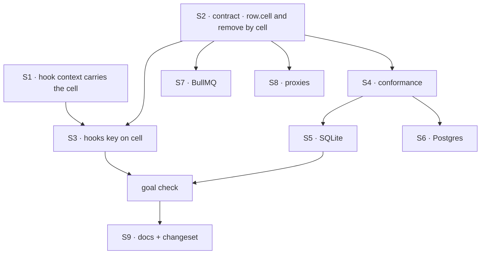

# FIX-1546 · Plan

[Spec](SPEC.md) · [Decisions](DECISIONS.md) · [Rules](BUSINESS-RULES.md) · **Plan** · [Docs](DOCS.md) · [Evolution](EVOLUTION.md)

Written for the implementing agent. IDs cross-reference [BUSINESS-RULES.md](BUSINESS-RULES.md)
(BR-n) and [DECISIONS.md](DECISIONS.md) (D-n). `tdd`. One PR.

## Surfaces

| ID | Package · role | Change | Rules |
|---|---|---|---|
| S1 | `core` type + `engine` · the collection hook context | Add `cell`: the storage scope id this collection's rows are persisted under. Filled at the **one** place the hook context is built (`createScopeResourceRegistry`, per collection config), from the same derivation the persisters use (`resolveResourceScopeId` with the collection's own isolation). `scopeId` keeps meaning the bare identity | BR-1–BR-3 |
| S2 | `scheduled` · the index contract | `ScheduleIndexRow` gains `cell: string` (required). `remove(userId, key)` becomes `remove({ cell, key })` (DECISIONS → *Decided, not asked*). Header comment: identity is `(cell, key)`; `userId` is who it runs as | BR-1, BR-9, BR-16 |
| S3 | `scheduled` · `defineScheduleCollection` hooks | Every `upsert` row and every `remove` uses `ctx.cell` + bare key. Six call sites today (one upsert on create, one on update, four removes). `indexOrgFor` unchanged | BR-2–BR-8 |
| S4 | `scheduled` · conformance suite (`testing.ts`) | Rows carry `cell`. New cases: two cells, one person, one key → two rows (BR-2 shape); remove one leaves the other due; claimDue returns `cell` | BR-1, BR-4, BR-5, BR-9, BR-10 |
| S5 | `store-sqlite` · table, migration, index | New column `cell TEXT NOT NULL`, PK `(cell, key)`. Migration: detect missing column → rebuild the table in one transaction (SQLite cannot alter a PK), filling `cell` with the escaped person id (BR-13). Statements key on `cell` | BR-10, BR-12–BR-14 |
| S6 | `store-postgres` · table, migration, index | Same column and PK. Idempotent migration in the existing list, under the schema advisory lock: add column, backfill escaped person id, set NOT NULL, swap the primary key. Batched advance keys on `cell` | BR-10, BR-12–BR-14 |
| S7 | `bullmq` · scheduler id | Built from `cell` + key. Job data unchanged | BR-15 |
| S8 | `vercel` store proxy + no-op, kitchen-sink proxy + no-op | Forward the new `remove` shape | BR-16 |
| S9 | Docs + changeset | Publish [DOCS.md](DOCS.md). One `minor` changeset: `scheduled`, `core`, `engine`, `store-sqlite`, `store-postgres`, `bullmq`, `vercel` | — |

**Nothing is removed**, and no second store appears. The tick handler (`vercel/src/schedules.ts`),
the dispatch route and the resolver are **not** surfaces (issue Scope Out, EM fences).

## Sequence

## Checks

| ID | Runs after | Passes when |
|---|---|---|
| V1 | S1 | A user-scope collection hook sees `cell` equal to the key its row was written under: bare person for an unpinned flow, `<person>:~org:<org>` for a pinned one. Read the stored row back at that key to prove it |
| V2 | S4 | Conformance green on SQLite, Postgres (PGlite) and every in-repo fake; the two-cells case fails against today's `(user_id, key)` table — run it against the old DDL once and see it red |
| V3 | S3 | BR-6–BR-8 with a hook context per cell; removing in one cell leaves the other row due |
| V4 | S5, S6 | BR-12–BR-14: seed an old-shape table (with a `a:b` person), init twice, rows keyed by escaped cell, second init a no-op, an app-wide write updates in place |
| V5 | S7 | BR-15: an app-wide row's scheduler id is byte-identical to today's |
| V6 | S8 | Typecheck: a fixture implementing `remove(userId, key)` fails to compile (BR-16), then is deleted |
| VG | S3 + S5 | **Goal, real path, no model:** two flow instances pinned to Acme and Globex for Alice, each running `schedules.create("weekly", …)` through a real `defineScheduleCollection` over a real SQLite index; disable in Acme; `claimDue` returns exactly Globex's row, `orgId` `globex`. **Run it on `main` first and see it return nothing.** Second path (BP-035): the same with an unpinned flow plus an Acme seat (BR-3) |

## Pinned names

| Where | Name | Why pinned |
|---|---|---|
| `ScheduleIndexRow` field and `CollectionHookContext` field | `cell` | Public, on two types that must agree; one word for one thing |
| Column | `cell` | Public DDL in the docs; users running `skipSchemaInit` type it |
| `remove` argument | `{ cell, key }` | Public; the object shape is what turns the change into a type error |

Everything else is yours to name.

## Guardrails

| Rule | Because |
|---|---|
| The cell is derived once, by the engine, and only read by `scheduled` (tenet 5) | A second derivation is how a write and its read land in different cells — FIX-1538 found exactly that bypass in the resolver |
| Every writer of the index goes through the identity: the six hook call sites, three backends, two proxies. `poc/index-surface/check.mjs` lists them; keep it green | An invariant enforced at one call site is the review class that costs the most rounds |
| Old rows are adopted, never dropped or quarantined (BP-030) | A released deployment's schedules must keep firing across the upgrade (D2) |
| No change to what the tick dispatches or where | Scope Out and the EM fences; routing is a separate follow-up |

## Docs

Reconcile and publish [DOCS.md](DOCS.md) after V4 and VG pass. No new page.

## POC

**`poc/index-surface/check.mjs`** (throwaway, not in CI) re-derives the surface list: every
non-test file naming `ScheduleIndex` must be classified; stale entries fail. 16 files, 5
implementations or proxies, PASS. Its `--plant` control adds an unlisted file and was seen to fail. The one hook-context construction site (S1) was found by
`grep -n "CollectionHookContext = {" packages/engine/src/context/resource-registry.ts` (one hit).

## At implement time

- FIX-1545 (Done) and FIX-1538 (merged, unreleased) both edited `defineScheduleCollection.ts` and
  the resolver. No open PR touches the index files as of this spec; re-check before starting.
- If FIX-1538 has been released before this lands, say so in the changeset (D2's exception).

## Follow-ups

- The dispatch address (person + key) does not name the cell, so two seat rows for one person and
  key share a dispatch address and an idempotency key under one tick. Tick-handler targeting;
  out of scope here by the issue. Flag to the owner of multi-flow tick routing.
