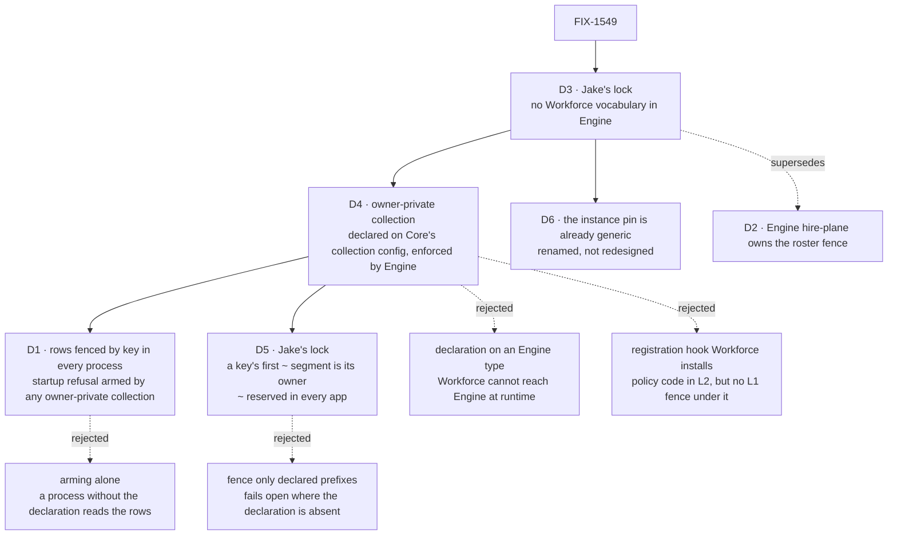

# FIX-1549 · Decisions

[Spec](SPEC.md) · **Decisions** · [Rules](BUSINESS-RULES.md) · [Plan](PLAN.md) · [Docs](DOCS.md) · [Evolution](EVOLUTION.md)

What was considered, what was chosen, why, and what each choice locks in. This is the amended
set: [D3](#d3) and [D5](#d5) are Jake's locks, and D3 supersedes [D2](#d2)'s placement. Nothing is
asked. Everything else is context for them.

## The tree

Solid edges are what you're signing. Dashed edges lost or were superseded, and the label says why.

## D3 · Jake's lock: Engine holds no Workforce vocabulary; it carries generic Layer-1 primitives Workforce opts into

| | |
|---|---|
| **Locked by** | Jake, product owner, 2026-09-24, on [#2196](https://github.com/fixpoint-labs/flow-state-dev/pull/2196): "we have stuck Layer 2 'Workforce' concepts inside of our Layer 1 Engine (was in Core which was worse). Hiring is not an engine concept, or a layer 1 concept at all." Then, choosing between the options put to him: **"Re-spec, lift all"** |
| **Means** | Every roster, hire or seat concept leaves `packages/engine/src`, including the FIX-1529 code that was already there: the instance pin's `"roster-owner"` reason and the hire-plane module. Engine keeps only primitives with no Workforce name: the owner-private collection ([D4](#d4)) and the instance pin ([D6](#d6)). Workforce states its policy by declaring them. Core's roster exports go to Workforce for the same reason |
| **Supersedes** | [D2](#d2)'s placement, and the Architect guidance that named a generic primitive with one consumer an invent-kill. That guidance asked for an owner lock; this is one |
| **Keeps** | Every FIX-1529 acceptance guarantee stays fail-closed wherever Workforce is in use: the pin's 404, the caller-only read, the debug listing, and [D1](#d1)'s key fence in every process |

Not re-argued here. The cards below are how the lock is carried out.

## D4 · An owner-private collection is declared on Core's collection config and enforced only by Engine

| | |
|---|---|
| **Instead of** | Declaring it on an Engine type, or a registration hook Workforce installs into Engine |
| **Because** | Workforce has no runtime dependency on Engine (`@flow-state-dev/engine` is a dev dependency of `@flow-state-dev/workforce`) and Engine cannot import Workforce. The one place both reach is Core, which already owns `ResourceCollectionConfig`. A field on that type is a contract, not a policy: Core validates only its shape at definition, the way it already validates `client` and `contentTemplate`, and Engine is the one enforcer. A hook would put the fence's code in Workforce, but a process that never loads Workforce would then have no fence at all ([D1](#d1)'s leak again) |
| **Locks in** | A new optional field, `ownerPrivate: { param: string }`, on every resource collection in every app. It names the pattern parameter that holds the owner. Its rows are keyed by `ownerSegment(userId)` (`~` plus the escaped user id) in that position. Only that collection reads or writes them, and only for the user each belongs to. Pre-1.0, Core minor |

**What Engine enforces.** A key fence on every read and write path, and a startup refusal of any
other collection whose pattern can reach those keys ([D1](#d1)). Engine names none of it after
Workforce. Workforce's private roster collection opts in with one line:
`ownerPrivate: { param: "owner" }` on `workforce/roster/[owner]/[seat]`.

**A spread copy is not a hole.** Today's brand is non-enumerable so a spread copy loses it and is
refused. A spread copy of an owner-private collection keeps the field and enforces the same owner
rule, so there is nothing to refuse. A copy *without* the field is an ordinary overlapping
collection and is refused as one.

**What would change my mind:** a second, stronger consumer that needs the owner taken from
somewhere other than the session user (an org, a team). Then the declaration should name the
axis, and it is better to learn that before the field ships than after.

## D1 · Owner-private rows are fenced by their key in every process; the startup refusal arms once any owner-private collection registers, in either order, and stays armed

| | |
|---|---|
| **Instead of** | Keeping the registration scan unconditional, arming it from an app-level flag, or arming it per registry and relying on that alone |
| **Because** | Unconditional makes every app pay for Workforce: `[tenant]/**` and `[a]/[b]/[c]/[d]` refuse to start in apps that never heard of it ([poc/characterize](poc/characterize/README.md)). A flag fails open for exactly the app that forgets it (tenet 5). Arming alone is that flag again: the rows outlive the registry, so a process without the declaration admits an overlap that reads them ([poc/unarmed-leak](poc/unarmed-leak/README.md)). The stored key is durable and the same in every process, so the fence is decided there. The declaration still arms the startup refusal, which keeps a Workforce app failing loudly on an overlap |
| **Locks in** | Every read path asks one predicate: the resource handle, the request-start seed cache, the browser resource routes, `/state`, the debug endpoints, projected collections. No deployment rule: a process without the owner-private collection admits an overlapping collection and still cannot read a row. The key shape the fence reads is [D5](#d5) |

**Either order.** If an overlapping flow is already registered when the owner-private collection
arrives, its registration is refused and the message names the earlier flow. **Stays armed** after
the declaring flow unregisters, as the registry already keeps a kind's schemas after its last
instance leaves: the rows outlive the registration.

Unchanged in substance from the approved D1. Amended in words only: "Workforce's branded writer"
is now "any owner-private collection", and the reserved shape is [D5](#d5)'s.

## D5 · Jake's lock: `~` is reserved key syntax in every app, and a key's first segment beginning `~` is its owner

| | |
|---|---|
| **Locked by** | Jake, product owner, 2026-09-24, answering this amendment's ask on [#2207](https://github.com/fixpoint-labs/flow-state-dev/pull/2207): **"Reserve ~"** |
| **Instead of** | Fencing only the prefixes of owner-private collections a process has registered |
| **Because** | Engine can no longer hard-code `workforce/roster/~` ([D3](#d3)), and a fence that learns its prefixes from declarations is blind in a process that never loaded them. That is the leak [poc/unarmed-leak](poc/unarmed-leak/README.md) proved. A marker in the key itself is what lets the fence hold in every process with no vocabulary. `~` is the marker because Workforce's stored rows already carry it: nothing is migrated (BP-030) |
| **Locks in** | Every app gives up key segments that begin `~`, except at and after an owner-private collection's owner parameter. Through any other collection a write of one is refused loudly, and a read finds nothing. Nothing on `main` writes such a key except the private roster |

**Why the first `~` segment.** The owner has to be read off the key alone, or a process without
the declaration can't tell whose row it holds. Taking the first `~` segment gives every key at
most one owner, the same in every process. An owner-private collection is served only when that
segment is its owner parameter; a `~` segment after it is ordinary data. That matters for rows
already stored: Workforce's row schema accepts a seat id such as `~research`, so
`workforce/roster/~alice/~research` can exist, and it reads back unmigrated (BR-22). Refusing
every second `~` segment would have made it unreadable.

## D6 · The instance pin is already the generic seam; it is renamed, not redesigned

| | |
|---|---|
| **Instead of** | A new "pinned to its creator" primitive |
| **Because** | The mechanism has no Workforce in it: `register(flow, { pin: { orgId, userId? } })` pins any instance to an org and optionally a user, and Engine refuses a caller outside it. Workforce passes the hire row's owner. Only the words are Workforce's: the module is `hire-plane.ts`, the mismatch reason is `"roster-owner"`, the comments speak of hired seats. A redesign would change behaviour the FIX-1529 goals prove, for no gain |
| **Locks in** | `InstancePinMismatchError.reason` reads `"owning-user"` where it read `"roster-owner"`. Nothing outside Engine reads it on `main`. `pinRejectsCaller` and `InstancePinCaller` keep their names. The two refusal sentences are already generic and stay |

## Superseded

### D2 · ~~The fence lives in one place, Engine's hire-plane admission~~ · superseded by [D3](#d3)

Approved in [#2178](https://github.com/fixpoint-labs/flow-state-dev/pull/2178). It kept Workforce's
roster names in Engine "until a generic hook earns its place", on the Architect guidance that a
generic primitive with one consumer and no owner lock is an invent-kill. Jake's lock is that owner
lock. What D2 got right survives in [D4](#d4): one enforcer, in Engine, and Core runs no roster
policy.

## Decided, not asked

- **Refusal messages change, and the refusals don't.** The approved spec promised today's messages
  word for word. They name the roster, the hire and fire helpers and hired seats, which is the
  vocabulary [D3](#d3) takes out of Engine. Every pattern refused on `main` is still refused
  (BR-14); the new sentences are generic and pinned in [PLAN](PLAN.md#pinned-names). The
  Workforce-specific advice ("declare `workforce/roster/*` for the org roster") moves to
  Workforce's docs. A hint field on the declaration, so Engine could repeat Workforce's words,
  would be config for one message.
- **"Cannot be redeclared" folds into the overlap refusal.** An undeclared copy of the private
  pattern is an overlapping collection, refused with the same sentence as `workforce/roster/**`.
- **The browser-read refusal moves to definition, and covers every browser read.** It is a shape
  rule on the declaration, so Core's generic define-time check owns it, like `client`'s own
  checks. `client.state.read`, `client.content.read` and `client.content.prefetch` are
  independent, and each serves rows to the browser, so all three are refused. Workforce's
  collection sets none.
- **An owner-private pattern cannot contain `**`, and names its owner parameter exactly once.**
  The owner has to sit at one known segment for the overlap test and the key fence to agree.
  `drafts/[owner]/[owner]` is a valid pattern today, but every key it resolves would carry the
  owner twice.
- **The startup fence compares collections within one scope.** Storage is routed by a
  collection's scope, and patterns may overlap across scopes
  ([resource collections](../../../docs/architecture/resource-collections.md#patterns)). A
  session-scoped `[tenant]/**` cannot reach an org-scoped roster row, so it registers beside
  Workforce, where `main` refuses it. The key fence still governs its keys (BR-24).
- **Identical owner-private declarations on several flows are admitted.** Same pattern, parameter
  and scope is one collection declared twice, as Workforce does per flow. Owner-private
  collections that overlap otherwise are refused.
- **`encodeUserSegment` stays in Core.** It is generic, and the owner segment is built from it.
  `ownerSegment(userId)` joins it. The roster patterns and the brand move to Workforce; the brand
  is deleted once Engine no longer reads it.
- **The vocabulary guard checks coupling, not words.** It fails on an import from Workforce, a
  roster symbol, the `workforce/roster` key, the `"roster-owner"` reason or a `hire-plane`
  module. A word ban would also catch ordinary English ("an operator's seat") and task-board
  vocabulary, and turn future prose into CI failures. PR-B still rewords Engine's Workforce
  prose; review checks that.
- **The trace store's `_roster.json` stays.** It is a list of trace request ids, not Workforce's
  roster, and renaming the persisted file would orphan existing trace directories.
- **Task-board words in Engine are not this issue.** `runAction` speaks of a board's seat, and
  `gatedBy` and `boardId` are orchestration's. They belong to their own audit
  ([PLAN → Follow-ups](PLAN.md#follow-ups)).

## Considered and dropped

| Alternative | Why not |
|---|---|
| Keep D2 and rename the hire-plane module | Renaming hides the vocabulary without removing the knowledge: Engine would still hard-code Workforce's key shape |
| A registration hook Workforce installs | Moves the policy's code into Workforce, but a process that never loads Workforce has no key fence |
| Declaration on an Engine type | Workforce cannot import Engine at runtime ([D4](#d4)) |
| A fresh reserved prefix such as `~owner/…` | Distinctive, but moves every stored roster row. `~` in the owner position is already what the rows carry |
| Engine fills the owner parameter from the session | Kinder to callers, and new behaviour nobody asked for. Callers pass `ownerSegment(userId)` as they pass `~${encodeUserSegment(userId)}` today |
| The key fence alone, no startup refusal | A Workforce app with an overlapping collection would start and silently see less, where today it fails to start |

## Settled

- **Today's cost to an app without Workforce** — **CONFIRMED** on `55c9581`: of twelve patterns,
  eight are refused, every one by a roster message ([poc/characterize](poc/characterize/README.md)).
- **Workforce cannot enforce at registration itself** — **CONFIRMED** by manifest.
- **An unarmed registry lets an overlap read another member's row** — **CONFIRMED** on `01a9d43`
  ([poc/unarmed-leak](poc/unarmed-leak/README.md)).
- **Every read path #2196 fenced is fenceable by one key predicate** — **CONFIRMED** by
  [#2196](https://github.com/fixpoint-labs/flow-state-dev/pull/2196) at `799ed1f`, green: the handle,
  seed cache, projected collections, resource routes, `/state` and debug endpoints each ask one
  function of (collection, key, user). Only the function's body is Workforce's.

## How it got here

- **Draft** — package-agnostic admission, fence preserved wherever Workforce writes user-owned
  rows; one PR in `core` and `engine`.
- **Review round 1 · D1 pivot** — the rows are fenced by key in every process, because arming
  alone failed open wherever the writer was absent.
- **Approved and merged** in [#2178](https://github.com/fixpoint-labs/flow-state-dev/pull/2178).
  Built as [#2196](https://github.com/fixpoint-labs/flow-state-dev/pull/2196), green.
- **Amendment · D3 pivot** — Jake put #2196 on hold: hiring is not a Layer-1 concept. He chose
  "Re-spec, lift all". D2 is superseded; D4, D5 and D6 carry the lift; D1 is re-worded, not
  re-decided. One PR becomes three ([PLAN](PLAN.md#the-pr-plan)).
- **D5 locked** — Jake chose "Reserve ~" on 2026-09-24.

**Open: none.**
