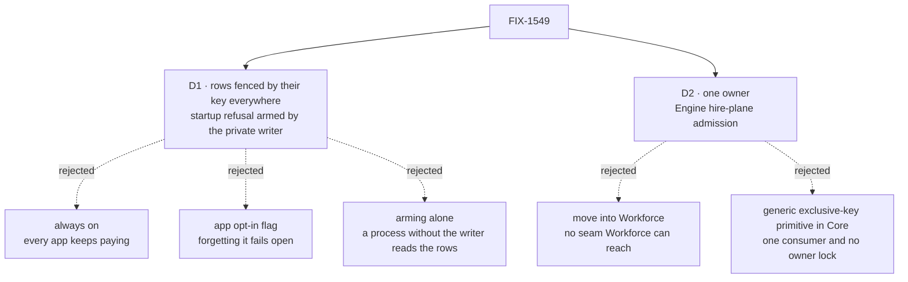

# FIX-1549 · Decisions

[Spec](SPEC.md) · **Decisions** · [Rules](BUSINESS-RULES.md) · [Plan](PLAN.md) · [Docs](DOCS.md) · [Evolution](EVOLUTION.md)

What was considered, what was chosen, why, and what each choice locks in. Two decisions are the
sign-off surface. Everything else here is context for them.

## The tree

Solid edges are what you're signing. Dashed edges lost, and the label says why.

## D1 · A user-owned roster row is fenced by its key in every process; the startup refusal arms per registry once Workforce's private roster writer is registered, in either order, and stays armed

| | |
|---|---|
| **Instead of** | Keeping the registration scan unconditional, arming it from an app-level opt-in flag, or arming it per registry and relying on that alone (the first draft) |
| **Because** | Unconditional keeps every app paying for Workforce: `[tenant]/**` and `[a]/[b]/[c]/[d]` refuse to start in apps that never heard of it ([poc/characterize](poc/characterize/README.md)). An opt-in flag fails open for exactly the app that forgets it (tenet 5: one convergence point, not a remembered switch). Arming alone is that switch again: the rows outlive the registry, so a process without the writer admits an overlap that reads them ([poc/unarmed-leak](poc/unarmed-leak/README.md)). The stored key, `workforce/roster/~<user>/<seat>`, is durable and the same in every process, so the fence is decided there. The writer still arms the startup refusal, which keeps what the fence refuses unchanged where Workforce is registered |
| **Locks in** | Every app reserves keys under `workforce/roster/~` for the branded writer. Engine's hire-plane predicate is asked on every collection read path: handle, browser routes, debug endpoints. No deployment rule: a process without the writer admits an overlapping collection and still cannot read a row. No app loses anything it can do on `main`, where every pattern that reaches those keys is already refused at registration |

**Either order.** If an overlapping flow is already registered when the writer arrives, the
writer's registration is the one refused, and the message names the earlier flow. **Stays
armed** after the writer's flow unregisters, for the reason the registry already keeps a
kind's schemas after its last instance leaves: the rows outlive the registration, so the
constraint has to as well.

**What would change my mind:** an app with no Workforce that stores its own data under keys
beginning `workforce/roster/~`, which the key fence would hide from it. Or a read path the
predicate cannot reach; then that path is exposed in processes without the writer, as the
first draft was, and it needs its own call before this ships.

## D2 · The fence lives in one place, Engine's hire-plane admission, and Core's `defineResourceCollection` runs no roster policy

| | |
|---|---|
| **Instead of** | Moving the rules into Workforce, or minting a generic "exclusive key space" primitive in Core that Workforce's writer would declare |
| **Because** | Engine already holds the other two thirds of the hire plane from FIX-1529: the pin and the caller-only read. Admission joins them, and Core goes back to package-agnostic. Workforce cannot own it today: it has no runtime dependency on Engine, and Engine cannot import it. A generic primitive would be new Layer-1 vocabulary with one consumer, which the Architect guidance names as an invent-kill without an owner lock (tenet 2: refine, don't add) |
| **Locks in** | Engine keeps Workforce's roster names in its hire-plane module until a generic hook earns its place. Core's public surface loses `assertRosterCollectionIsNotDeep`, a minor bump. Its only caller is Engine |

The smallest move that satisfies both halves of the issue: Core stops enforcing, and the
one enforcer is the module that already enforces the rest of the plane.

## Decided, not asked

- **The define-time check goes, not moves.** Every pattern it refused is refused at
  registration in an armed registry (the corpus shows it). A Workforce app finds a mistake at
  startup instead of module load.
- **What an armed fence refuses is unchanged**, message for message. Changing it is out of
  scope by the issue's own terms.
- **A branded writer with a browser read is refused whether or not anything else is
  registered.** Only Workforce sets the brand, so this costs no other app anything.
- **The brand, both roster patterns and `encodeUserSegment` stay exported from Core.** They
  are the shared seam; moving them is churn with no user-visible effect.
- **The key fence is the caller-only read, widened.** `privateRosterAdmits` already decides a
  key for the branded writer; it now also refuses a user-owned key to every other collection.
  The writer's own behaviour and the debug filter's result for it are unchanged.

## Considered and dropped

| Alternative | Why not |
|---|---|
| Delete only the Core call, keep Engine's scan unconditional | The smallest diff, and it fixes the first row of the people table only. The second row, generic patterns refused at startup, stays. The issue's own example still throws, one step later |
| A process-wide flag set when `@flow-state-dev/workforce` is imported | Import side effects into a Core global. Arms in processes that import Workforce for types and never write a row, and misses bundlers that tree-shake the import |
| Arm from any collection under `workforce/` | A second, looser signal that still reserves a namespace for apps that merely reuse the prefix |
| Arm from the store at boot: refuse overlaps when user-owned rows exist | Registration is synchronous and store-agnostic today, and a row written after boot by another process would still slip past. The key fence covers the same case without reading the store at registration |
| The key fence alone, no startup refusal | Simpler, one mechanism. But a Workforce app with an overlapping collection would start and silently see less, where today it fails to start with a message. The issue keeps what the fence refuses unchanged |
| Narrow the fence to an allow-list plus a literal ban (a FIX-1529 review suggestion) | Changes what the fence refuses. Out of scope |

## Settled

- **Today's cost to an app without Workforce** — **CONFIRMED** on `55c9581`: of twelve
  patterns, eight are refused, every one by a roster message; four of the eight name nothing
  Workforce. The check goes red when a row is planted wrong.
  ([poc/characterize](poc/characterize/README.md))
- **Workforce cannot enforce at registration itself** — **CONFIRMED** by manifest:
  `@flow-state-dev/engine` is a dev dependency of `@flow-state-dev/workforce` only.
- **An unarmed registry lets an overlap read another member's row** (Codex, review round 1)
  — **CONFIRMED** on `01a9d43`: with the admission check a no-op, Bob's `[a]/[b]/[c]/[d]`
  collection listed Alice's `workforce/roster/~alice/research`; the `[a]/[b]/[c]` control saw
  nothing. ([poc/unarmed-leak](poc/unarmed-leak/README.md))

## How it got here

- **Draft** — framed as package-agnostic admission with the fence preserved wherever Workforce
  writes user-owned rows; the define-time check removed and Engine's registration scan armed by
  the branded writer; one PR in `core` and `engine`.
- **Review round 1 · D1 pivot** — the rows are now fenced by their key in every process, and
  arming only gates the startup refusal, because per-registry arming failed open wherever the
  writer was absent and the rows were not ([poc/unarmed-leak](poc/unarmed-leak/README.md)).

**Open: none.**
