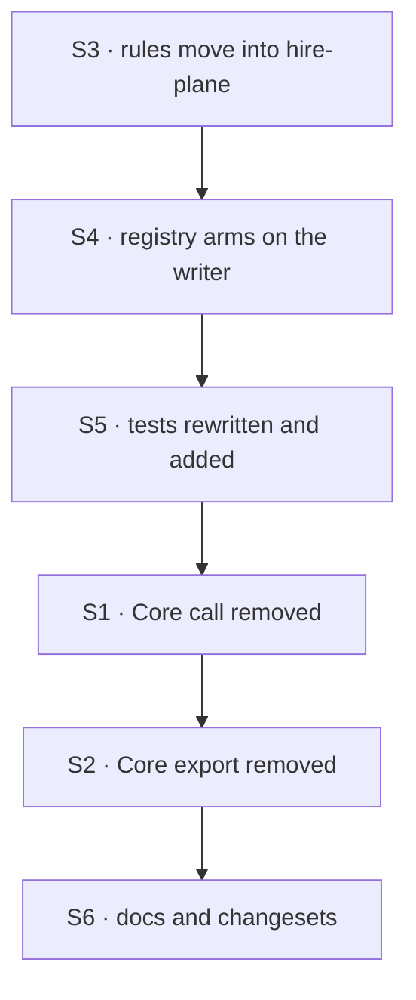

# FIX-1549 · Plan

[Spec](SPEC.md) · [Decisions](DECISIONS.md) · [Rules](BUSINESS-RULES.md) · **Plan** · [Docs](DOCS.md) · [Evolution](EVOLUTION.md)

Written for the implementing agent. IDs cross-reference [BUSINESS-RULES.md](BUSINESS-RULES.md)
(BR-n) and [DECISIONS.md](DECISIONS.md) (D-n). `tdd`. One PR.

## Surfaces

| ID | Package · role | Change | Rules |
|---|---|---|---|
| S1 | `core` · `defineResourceCollection` | **Remove** the roster call. Generic checks only (D2) | BR-1 |
| S2 | `core` · collection patterns | **Remove** `assertRosterCollectionIsNotDeep`, its define-stage branch, and the private helpers only it uses; drop both re-exports (`types/resource-collection.ts`, `types/index.ts`). Keep the brand, mark/is, both roster pattern constants and `encodeUserSegment` | BR-1 |
| S3 | `engine` · the hire-plane module (`context/hire-plane.ts`) | Gains the roster admission rules, register stage only, logic and messages unchanged. The one owner of the fence (D2) | BR-4 BR-7 BR-8 BR-14 |
| S4 | `engine` · the flow registry | Replace the per-flow unconditional scan with a registry-level fence: arm when an admitted flow carries the writer; on arming, check every held flow and the incoming one; once armed, check each incoming flow. Validate before mutating, like the scope checks. Never disarm (D1) | BR-2 BR-3 BR-4 BR-5 BR-6 BR-9 BR-10 BR-11 |
| S5 | tests · `engine/test/hire-plane-fence.test.ts`, `workforce/test/hire-plane.test.ts` | The cases that assert refusal with no writer present are **rewritten**, not deleted: same patterns, now in an armed registry, both orders. Add the unarmed admissions | BR-2 BR-4 BR-5 BR-7 |
| S6 | docs · changesets | [DOCS.md](DOCS.md). `@flow-state-dev/core` minor (export removed), `@flow-state-dev/engine` patch (admission change) | — |

## Sequence



Engine takes ownership before Core lets go, so no commit leaves the fence unenforced for a
Workforce registry.

## Checks

| ID | Runs after | Passes when |
|---|---|---|
| V1 | S4 | Unarmed registry admits BR-2 and BR-3 patterns (D1's off state, BP-035) |
| V2 | S4 | BR-4 and BR-5: both orders refused; after BR-5's refusal the registry holds exactly what it held before |
| V3 | S4 | BR-6, BR-7, BR-8, BR-9, BR-10 |
| V4 | S4 | **Corpus equivalence.** Replay [poc/characterize](poc/characterize/README.md)'s twelve patterns in an armed registry: every register verdict equals today's. In an unarmed one: all twelve admitted. Plant one wrong row and watch it go red |
| V5 | S2 | Nothing imports `assertRosterCollectionIsNotDeep`; `pnpm typecheck` and `knip` clean |
| V6 | S2 | BR-12, BR-13: the existing `hire-plane-fence` runtime legs pass untouched |
| VG | S6 | Goal, on the real path: the acceptance criterion in [Rules](BUSINESS-RULES.md#acceptance-criteria-this-issue-owns), through `createFlowState` and the HTTP router: an app with no Workforce import writes and lists through `[tenant]/**` and `workforce/roster/[owner]/notes`; the same flow beside the writer refuses at startup. No model call is involved, so no goal file under `goals/` applies |

## Pinned names

| Where | Name | Why pinned |
|---|---|---|
| Refusal messages | Today's three strings | Users and tests match them (BR-14) |
| Core exports kept | `HIRED_ROSTER_PRIVATE_BRAND`, `markHiredRosterPrivateCollection`, `isHiredRosterPrivateCollection`, `HIRED_ROSTER_BROWSER_PATTERN`, `HIRED_ROSTER_PRIVATE_PATTERN`, `encodeUserSegment` | Workforce and Engine both use them; removing any is a separate change |

Everything else is yours to name, including the registry's armed state and the moved function.

## Guardrails

| Rule | Because |
|---|---|
| One enforcer. After this change, nothing outside Engine's hire-plane module evaluates a roster pattern (tenet 5) | Two enforcers is the split the issue exists to end |
| Every path that admits a flow goes through the armed check: startup `registerMany`, runtime hires, the kitchen-sink registrar | An invariant checked at one door is the review class that costs most. They all funnel through `register`; confirm it |
| Arming is order-independent and never reverses | A fence that depends on registration order is one a refactor of boot order silently turns off |
| A refused registration mutates nothing | Every existing registry check keeps that promise; a half-armed registry is worse than either state |
| The unarmed path costs one boolean read per registration | This is an app that never asked for Workforce |

## Docs

Reconcile and publish [DOCS.md](DOCS.md) after V4 passes. It extends two existing pages and adds
the deployment rule D1 locks in; no new page.

## Sketch · pseudocode, illustrative, react to the shape

```
registry.register(flow):
    incomingHasWriter ← flow's resources include a branded writer
    if incomingHasWriter or armed:
        toCheck ← incomingHasWriter and not armed ? held flows + flow : [flow]
        for each collection in toCheck: hire-plane rules (register stage)   ← throws, nothing mutated
    commit flow
    if incomingHasWriter: armed ← true
branded writer with browser read: refused on sight, armed or not
```

**POC:** `poc/characterize/` measured today's cost on `55c9581`: eight of twelve patterns
refused in an app with no Workforce, all by the roster fence. It is also V4's corpus. The
premise held.

## At implement time

- Resources that reach a flow through `uses` capabilities: confirm they are on
  `flow.resources` at `register`, as today's scan assumes. If any path hides one, arm from it
  too.
- FIX-1563 (#2169) and FIX-1500 PR-B (#2159) touch the kitchen-sink registrar; neither touches
  these files as of `55c9581`. Rebase and re-check.

## Follow-ups

- Moving the fence into Workforce needs a generic registration hook Engine exposes. Flag for
  `improve-codebase-architecture` when a second package needs one.
- The FIX-1529 review note on `scopePrivateRosterToCaller` listing the whole org roster before
  filtering is unrelated to this issue and stays where it was raised.
