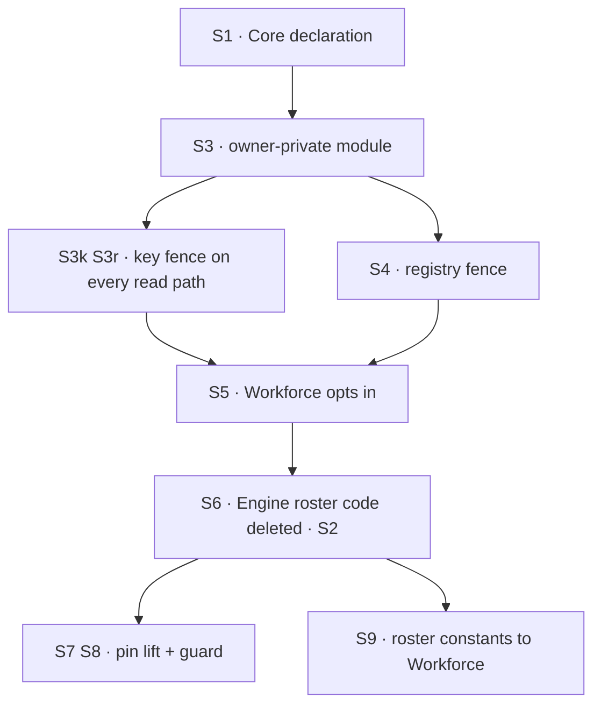

# FIX-1549 · Plan

[Spec](SPEC.md) · [Decisions](DECISIONS.md) · [Rules](BUSINESS-RULES.md) · **Plan** · [Docs](DOCS.md) · [Evolution](EVOLUTION.md)

Written for the implementing agent. IDs cross-reference [BUSINESS-RULES.md](BUSINESS-RULES.md)
(BR-n) and [DECISIONS.md](DECISIONS.md) (D-n). `tdd`. Three PRs, below.

## Surfaces

| ID | Package · role | Change | Rules |
|---|---|---|---|
| S1 | `core` · `ResourceCollectionConfig`, `defineResourceCollection` | **Add** `ownerPrivate?: { param: string }` and its define-time shape checks: the parameter is in the pattern, no `**`, no browser read. **Add** `ownerSegment(userId)`. **Remove** the roster call from `defineResourceCollection` (D4) | BR-1 BR-8 |
| S2 | `core` · collection patterns | **Remove** `assertRosterCollectionIsNotDeep`, its private helpers and both re-exports | BR-1 |
| S3 | `engine` · a new owner-private module (not `hire-plane.ts`) | The one key predicate `(collection, storageKey, userId) → admitted`, the generic reach test between two patterns, and the startup fence. No Workforce name (D1 D3 D5) | BR-4…BR-7 BR-14 BR-20 BR-21 |
| S3k | `engine` · resource handle, request-start seed cache, projected collections | Every collection a `~` key can reach is wrapped: list and count filter, reads are absent, writes refused. Collections that cannot reach one stay unwrapped | BR-15…BR-17 BR-19 BR-21 |
| S3r | `engine` · `routes/resource-routes.ts`, `routes/route-utils.ts`, `routes/state-routes.ts`, `routes/debug-snapshot.ts` | Every handler that lists, reads, writes or deletes a collection key asks S3's predicate | BR-18 |
| S4 | `engine` · the flow registry | Replace the per-flow roster scan with the registry-level fence, armed by any flow declaring an owner-private collection. Validate before mutating. Never disarm (D1) | BR-2…BR-7 BR-9…BR-11 |
| S5 | `workforce` · `defineHiredRosterPrivateCollection` | Declares `ownerPrivate: { param: "owner" }`. Stops relying on the brand | BR-12 BR-22 |
| S6 | `engine` · every roster file of the hire plane | **Delete** `privateRosterAdmits`, `scopePrivateRosterToCaller`, `assertFlowRosterPatterns` and their Core imports, in the same PR that lands S3 to S5 | — |
| S7 | `engine` · the instance pin | Move out of `context/hire-plane.ts` into a module named for the pin. `"roster-owner"` → `"owning-user"`. Reword every roster, hire and seat comment and doc string in `packages/engine/src` (the pin's callers, `stores/scope-keys.ts`'s owner-pinned cell, `resources/internal.ts`, `flowstate/types.ts`, `flow-registry.ts`, `createFlowState.ts`, `runAction.ts`'s one "seat"). Engine README's "Hired seats" becomes "Owner-pinned instances" (D6) | BR-12 BR-23 |
| S8 | `engine` · a guard test | Greps `packages/engine/src` for the words roster, hire, seat and workforce, case-insensitive; allowlists `stores/filesystem/trace-store.ts` by path | BR-23 |
| S9 | `core` → `workforce` · roster constants | Move `HIRED_ROSTER_BROWSER_PATTERN` and `HIRED_ROSTER_PRIVATE_PATTERN` into Workforce. **Delete** `HIRED_ROSTER_PRIVATE_BRAND`, `markHiredRosterPrivateCollection`, `isHiredRosterPrivateCollection`. Reword `InstanceOwnerPin`'s doc without hire | — |
| S10 | tests | Port #2196's suites with the predicate swapped: `roster-admission` and the unarmed legs of `hire-plane-fence` become Engine tests over a **generic** owner-private collection (`notes/[owner]/[id]`); the Workforce-shaped corpus and the kitchen-sink acceptance stay as Workforce tests | all |
| S11 | docs · changesets | [DOCS.md](DOCS.md), each page with the PR that makes it true | — |

## Sequence



### The PR plan

| PR | Surfaces | depends_on | Why it stands alone |
|---|---|---|---|
| PR-A | S1 S2 S3 S3k S3r S4 S5 S6 · S10 for them · DOCS: the owner-private reference, durable-hire, Workforce README · changeset | — | The swap has to be atomic. A declared field Engine ignores fails open; an Engine fence without Workforce's declaration refuses Workforce's own rows. So the primitive, Workforce's opt-in and the deletion of Engine's roster code land together. This is where [#2196](https://github.com/fixpoint-labs/flow-state-dev/pull/2196) is reworked |
| PR-B | S7 S8 · Engine README · changeset | PR-A | Renames and comment rewrites across ten Engine files. No behaviour but one error `reason` literal. The guard can only go green once PR-A has removed the roster code |
| PR-C | S9 · changeset | PR-A | Core and Workforce only; touches no Engine file, so it runs beside PR-B. The brand can only be deleted once nothing in Engine reads it |

**What happens to #2196.** It is superseded, not merged. PR-A starts from fresh `main` and ports
#2196's read-path wiring (`f2e099c`, `8cc0737`) and its tests, with `privateRosterAdmits` replaced
by S3's predicate, `rosterPatternOverlapsPrivate` by the generic reach test, and the brand test by
`ownerPrivate`. Its registry fence (`admitRosterCollections`, the armed flag) ports with the same
swap. Its docs commits are rewritten from [DOCS.md](DOCS.md). `799ed1f` is not needed: #2191 has
merged. The coordinator closes #2196 unmerged, linking PR-A, once PR-A is open; until then it is
the reference build.

## Checks

| ID | Runs after | Passes when | Red state |
|---|---|---|---|
| V1 | PR-A | An unarmed registry admits the BR-2 and BR-3 patterns (D1's off state, BP-035) | Arm unconditionally |
| V2 | PR-A | BR-4 and BR-5: both orders refused; after BR-5 the registry holds exactly what it held | Check only the incoming flow |
| V3 | PR-A | BR-6, BR-7, BR-9, BR-10, BR-20 | Disarm on unregister (BR-9); compare declarations by identity (BR-10) |
| V4 | PR-A | **Corpus equivalence.** [poc/characterize](poc/characterize/README.md)'s twelve patterns: armed by Workforce's collection, every pattern refused on `main` is refused, with the pinned message in full; unarmed, all twelve admitted | Drop the `**`-in-the-middle case from the reach test |
| V7 | PR-A | BR-15 to BR-19 through the handle, the seed cache, projected collections, each resource route, `/state` and the debug endpoints, in an **unarmed** registry with Alice's row planted store-direct. #2196's suite, ported | Skip the predicate in any one path; that path's case goes red |
| V8 | PR-A | BR-21: an owner-private collection serves only the caller's segment; refuses a write under another user's segment and under a non-`~` owner value; a second `~` segment is refused | Compare the raw user id instead of `ownerSegment` |
| V9 | PR-A | BR-8 at definition, each of the three shapes | — |
| V10 | PR-A | BR-22: a row planted at `workforce/roster/~alice/research` reads back through Workforce's collection for Alice | Change the marker |
| V11 | PR-A | A generic owner-private collection in an app with no Workforce import gets V2, V7 and V8's answers | — |
| V5 | PR-A, PR-C | Nothing imports `assertRosterCollectionIsNotDeep` (A) or the brand (C); `pnpm typecheck` and `knip` clean | — |
| V6 | PR-A, PR-B | BR-12, BR-13: existing pin and debug suites pass; the only edit is `"roster-owner"` → `"owning-user"` in PR-B | — |
| V12 | PR-B | BR-23: the guard passes | Add the word "seat" to any Engine comment |
| VG | all merged | Goal, on the real path through `createFlowState` and the HTTP router: the [acceptance criterion](BUSINESS-RULES.md#acceptance-criteria-this-issue-owns), and every `goals/hire-plane/*` goal re-run green on the assembled `main` | — |

## Pinned names

| Where | Name | Why pinned |
|---|---|---|
| Core config | `ownerPrivate: { param: string }` | Public API every app sees (D4) |
| Core helper | `ownerSegment(userId)` → `` `~${encodeUserSegment(userId)}` `` | The marker is D5's; the stored rows already carry it |
| Pin reason | `"owning-user"` (with `"owning-org"`, unchanged) | D6 |
| Overlap refusal | `Collection pattern "<P>" can reach the rows of owner-private collection "<Q>". Only that collection reads or writes them, each for the user it belongs to.` plus, when the overlap is a held flow, ` Flow "<id>" declares it and is already registered.` | Replaces today's roster and "cannot be redeclared" sentences (BR-14) |
| Row refusal | `A row of an owner-private collection is readable only by the user it belongs to.` | Replaces "A hired-seat row is readable…". Says nothing about whether the row exists |
| Define refusals | `Owner-private collection "<P>" must not enable a browser read.` · `… names parameter "<p>", which its pattern does not declare.` · `… must not use "**": its owner sits at one segment.` | BR-8 |
| Kept exports | `encodeUserSegment`, `pinRejectsCaller`, `InstancePinCaller`, `InstanceOwnerPin` | Generic already; callers in `cli` and `workforce` |

Everything else is yours to name, as long as S8's guard passes.

## Guardrails

| Rule | Because |
|---|---|
| One enforcer. After PR-A, nothing outside Engine's owner-private module decides an owner key or an owner-private admission (tenet 5) | Two enforcers is the split the issue exists to end |
| Every path that admits a flow goes through `register`: `registerMany`, runtime registration, the kitchen-sink registrar. Confirm it | An invariant checked at one door is the review class that costs most |
| Every path that reads or writes a collection key asks the one predicate. List them in PR-A's body with the test that covers each | The key fence is the guarantee. A path it misses is exposed in every process without the declaration |
| No commit leaves an owner row readable or Workforce's own rows refused | Hence PR-A is one PR |
| Arming is order-independent and never reverses; a refused registration mutates nothing | A fence that depends on boot order is one a refactor turns off |
| The unarmed path costs one boolean read per registration; a collection that cannot reach a `~` key is never wrapped | This is an app that never asked for it |
| Engine tests of the primitive use a generic collection, not Workforce's pattern | Otherwise the test suite quietly keeps Workforce's shape as Engine's contract |

## Docs

Each PR publishes its part of [DOCS.md](DOCS.md) once its checks pass.

## Sketch · pseudocode, illustrative

```
ownerKeyAdmits(collection, key, user):            ← the one predicate
    owners ← segments of key beginning "~"
    if collection.ownerPrivate is unset: return owners is empty
    if user is missing: return false
    return owners == [segment at collection's owner parameter]
       and that segment == ownerSegment(user)

registry.register(flow):
    declares ← flow has an owner-private collection
    if declares or armed:
        toCheck ← declares and not armed ? held flows + flow : [flow]
        refuse any collection in toCheck that reaches an owner-private one
        and is not the same declaration                     ← throws, nothing mutated
    commit flow; if declares: armed ← true
```

**POCs:** `poc/characterize/` is V4's corpus. `poc/unarmed-leak/` is V7's first case. Neither
needs rerunning for the amendment: both measure the shape of the fence, not where its code lives.

## At implement time

- Confirm `validatePattern` and `resolveCollectionKey` accept a `~`-leading parameter value, as
  the private roster already relies on.
- `[tenant]/**` listed nothing in the POC harness where `[a]/[b]/[c]/[d]` leaked; #2196 found why.
  Carry its answer over.
- Resources reaching a flow through `uses` capabilities: confirm they are on `flow.resources` at
  `register`.
- `apps/kitchen-sink/flows/workforce-admin/flow.ts` builds `~${encodeUserSegment(userId)}` by
  hand; switching it to `ownerSegment` is optional.

## Follow-ups

- **Task-board words in Layer 1.** Engine's `runAction` gate reads `gatedBy.boardId`; Core's
  dispatch and task types speak of seats and boards. Orchestration's vocabulary, the same class
  of leak Jake named. Worth an `audit-coherence` pass of its own.
- The FIX-1529 review note on listing the whole org roster before filtering stays where it was
  raised.
