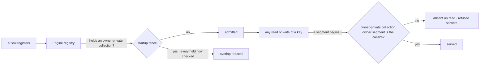

# FIX-1549 · Workforce's roster policy is enforced from Core's generic defineResourceCollection

**Spec** · [Decisions](DECISIONS.md) · [Rules](BUSINESS-RULES.md) · [Plan](PLAN.md) · [Docs](DOCS.md) · [Evolution](EVOLUTION.md)

Improvement · `core` + `engine` + `workforce` · medium · 3 PRs · no epic (follows [FIX-1529](https://linear.app/fixpoint-labs/issue/FIX-1529), under [FIX-1528](https://linear.app/fixpoint-labs/issue/FIX-1528))

> **Amended after merge.** The approved spec ([#2178](https://github.com/fixpoint-labs/flow-state-dev/pull/2178))
> moved the roster fence from Core into Engine's hire-plane module. Jake's call on its build
> ([#2196](https://github.com/fixpoint-labs/flow-state-dev/pull/2196)): hiring is not a Layer-1
> concept, so it leaves Engine too, and so does the FIX-1529 hire-plane code already there
> ([D3](DECISIONS.md#d3)). Engine gains one generic primitive in its place.

## Seven people, before and after

| Someone who… | Today | After |
|---|---|---|
| **builds an app without Workforce and declares `workforce/roster/[owner]/notes`** | `defineResourceCollection` throws: "can read user-owned roster rows" | Defines and registers like any other pattern |
| **builds an app without Workforce and declares `[tenant]/**` or `[a]/[b]/[c]/[d]`** | The app refuses to start, naming "user-owned roster rows" | Registers. No Workforce name appears anywhere on their path |
| **wants rows only their owner can read, without Workforce** | Not possible: the fence is Workforce's alone | Declares `ownerPrivate: { param: "owner" }` on a collection and gets the same fence Workforce gets ([D4](DECISIONS.md#d4)) |
| **runs Workforce with user-owned seats, and some flow declares `workforce/roster/**`, `[tenant]/**`, or an undeclared copy of the private collection** | Refused | Refused, whichever flow registered first. The message is generic: it names the owner-private collection, not the roster |
| **owns a user-owned seat, or is another member of the org** | Only the owner opens the seat or reads its row | Unchanged. The pin, the caller-only read and the debug listing behave exactly as today ([D6](DECISIONS.md#d6)) |
| **runs a process over a store holding user-owned rows, without Workforce** (a split worker, a second app) | That process refuses overlapping patterns | The overlapping collection registers and cannot read or write any owner's row ([D1](DECISIONS.md#d1)) |
| **stores a key segment beginning `~` through an ordinary collection** | Allowed | Refused on write: `~` marks an owner segment in every app ([D5](DECISIONS.md#d5), the one open call). Nothing on `main` does this but the private roster |

Rows one and two are measured, not argued: [poc/characterize](poc/characterize/README.md) runs
twelve patterns through both paths in an app with no Workforce. Eight are refused, all by the
roster fence.

## What changes


Look at the horizontal line. Today Workforce's names sit below it, in Core and Engine. After,
they stay above it, and what crosses is one declaration.

```diff
 // packages/workforce/src/roster/collections.ts
 export function defineHiredRosterPrivateCollection() {
-  return markHiredRosterPrivateCollection(
-    defineResourceCollection({
-      pattern: HIRED_ROSTER_PRIVATE_PATTERN,
+  return defineResourceCollection({
+    pattern: HIRED_ROSTER_PRIVATE_PATTERN,      // now Workforce's own constant
+    ownerPrivate: { param: "owner" },           // the generic primitive
     scope: "org",
     flowIsolation: SHARED_ACROSS_FLOWS,
     stateSchema: hiredSeatRowSchema,
-    }),
-  );
+  });
 }
```

Any app can write the same line. Nobody else has to change code: an app without Workforce stops
being refused, and a Workforce app keeps writing what
[durable hire](../../../apps/docs/docs/workforce/durable-hire.md) documents.

## How an owner's row stays private



Two layers, one Engine module, no Workforce name. **The key fence** is the guarantee: a key with a
`~` segment is served only through an owner-private collection, to the user that segment encodes,
on every read path. It reads the key, so it holds in every process. **The startup fence** keeps
the loud failure: once a registry holds an owner-private collection, it refuses any other
collection whose pattern can reach its keys, held or incoming.

## What stays as it is

- **Which patterns a Workforce app is refused.** Same patterns; generic sentences
  ([Decided, not asked](DECISIONS.md#decided-not-asked)). The corpus is the check.
- **FIX-1529's guarantees.** The pin's 404 for another org or user, the caller-only read, the
  debug listing. Its goals under `goals/hire-plane/` re-run unchanged.
- **Stored rows.** `workforce/roster/~<user>/<seat>` is read back as-is. Nothing migrates.

## Sign off

**[D3](DECISIONS.md#d3) is Jake's lock** and is recorded, not asked. [D1](DECISIONS.md#d1),
[D4](DECISIONS.md#d4) and [D6](DECISIONS.md#d6) carry it out and are decided. One call is yours.

### Reserve `~` key segments in every app, or fence only where the declaration is loaded?

**Plain terms.** Engine can't name Workforce's key any more, so it needs another way to recognise
an owner's row. Either every app agrees that a key segment starting `~` is an owner's, and the
fence holds in any process that touches the store. Or Engine fences only the collections it has
been told about, and a process that was never told (a background worker, a second app on the same
database) can read other members' private seats.

**The trade-off.** Reserving costs every app one character at the start of a key segment, which
nobody but Workforce uses today, and a write that tries it fails loudly. Not reserving costs
nothing up front and reopens the leak a POC already proved.

**My recommendation: reserve `~`.** It keeps the promise FIX-1529 made, fail-closed wherever the
rows exist, and it is the marker the stored rows already carry.

**What would change my mind.** An app that needs `~`-leading keys of its own, or a plan to run
Workforce's rows only in processes that always load Workforce. Then the narrower fence plus a
deployment rule is cheaper.

**What being wrong costs.** Reserving wrongly: an app hits a refused write and renames a key,
once, before launch. Not reserving wrongly: another member's private seat is readable from a
worker process, found after it has happened. Relaxing a reservation later is easy; adding one
after apps store `~` keys is a migration.
