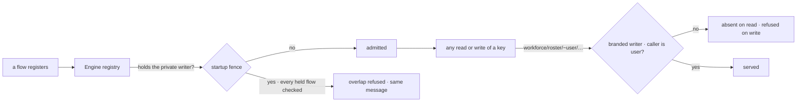

# FIX-1549 · Workforce's roster policy is enforced from Core's generic defineResourceCollection

**Spec** · [Decisions](DECISIONS.md) · [Rules](BUSINESS-RULES.md) · [Plan](PLAN.md) · [Docs](DOCS.md) · [Evolution](EVOLUTION.md)

Improvement · `core` + `engine` · small · 1 PR · no epic (follows [FIX-1529](https://linear.app/fixpoint-labs/issue/FIX-1529), under [FIX-1528](https://linear.app/fixpoint-labs/issue/FIX-1528))

## Six people, before and after

| Someone who… | Today | After |
|---|---|---|
| **builds an app without Workforce and declares `workforce/roster/[owner]/notes`** | `defineResourceCollection` throws: "can read user-owned roster rows" | Defines and registers like any other pattern |
| **builds an app without Workforce and declares a generic org collection such as `[tenant]/**` or `[a]/[b]/[c]/[d]`** | Defines fine, then the app refuses to start: registration names "user-owned roster rows" | Registers. No Workforce name appears anywhere on their path |
| **runs Workforce with user-owned seats, and some flow declares `workforce/roster/**`, `[tenant]/**`, or a copy of the private writer** | Refused | Refused, with the same message, whichever of the two flows registered first ([D1](DECISIONS.md#d1)) |
| **runs Workforce and writes the literal deep pattern `workforce/roster/**`** | Refused when the module loads (definition) | Refused when the app starts (registration). Same outcome, one step later |
| **owns a user-owned seat, or is another member of the org** | Only the owner opens the seat or reads its row | Unchanged: the pin, the caller-only read and the debug listing are untouched |
| **runs a process over a store that holds user-owned rows, without the private roster writer** (a split worker, an app that dropped Workforce, a second app on the same store) | That process refuses overlapping patterns too | The overlapping collection registers, and cannot read or write any user-owned row. The rows are fenced by their key, in every process ([D1](DECISIONS.md#d1)) |

The first two rows are measured on today's `main`, not argued:
[poc/characterize](poc/characterize/README.md) runs twelve patterns through both paths in an app
with no Workforce at all. Eight are refused, all by the roster fence. Four of those carry no
Workforce name: `**`, `[tenant]/**`, `[a]/[b]/[c]/[d]`, `*/**`.

## What changes

Top row, today: two unconditional checks. Bottom rows, after: none at definition, a startup
refusal armed by the writer, and a fence on the rows themselves that needs no arming.

**Nothing changes in how anyone writes code.** An app without Workforce simply stops being
refused; a Workforce app keeps writing the collections exactly as
[durable hire](../../../apps/docs/docs/workforce/durable-hire.md) documents. The one public
change is a removal: Core no longer exports `assertRosterCollectionIsNotDeep`. Nothing outside
Engine calls it.

## How a user-owned row stays private

Two layers, both in Engine's hire-plane module. **The key fence** is the guarantee: a
user-owned key is served only through Workforce's branded writer, to its owner, on every read
path. It is decided by the stored key, so it holds in every process, whatever that process
registered. **The startup fence** keeps today's loud failure where Workforce is in play: once a
registry holds the writer it checks every flow, held or incoming, with today's rules and
messages.

## What stays as it is

- **What the fence refuses, once armed.** Same patterns, same messages. The characterization
  corpus is the equivalence check ([PLAN V4](PLAN.md#checks)).
- **Acceptance 5 of FIX-1529, roster-owner refuse.** That is the pin, and the pin never touched
  pattern admission.
- **The caller-only read of the private writer.** The key fence extends the same predicate to
  every other collection; the writer itself behaves exactly as today.
- **The brand, the two roster patterns and `encodeUserSegment`** stay in Core. Workforce builds
  the writer with them and Engine recognizes it; Workforce has no runtime dependency on Engine,
  so this is the one seam both can reach.

## Sign off

1. **[D1](DECISIONS.md#d1) · A user-owned roster row is fenced by its key in every process;
   the startup refusal arms per registry once Workforce's private roster writer is registered,
   in either order, and stays armed.** Changed in review round 1: the first draft relied on
   arming alone, and a POC showed a process without the writer reading another member's row.
   If wrong: every app, Workforce or not, reserves keys under `workforce/roster/~…` for the
   writer, and a missed read path is exposed only in processes without the writer.
2. **[D2](DECISIONS.md#d2) · The fence lives in one place, Engine's hire-plane admission,
   and Core's `defineResourceCollection` runs no roster policy.** If wrong: Engine keeps
   carrying Workforce's roster names until a generic hook exists, and a minor bump drops one
   export nobody else calls.

**Open: none.** Number 1 is the one to weigh, and it changed since the last review. Reasoning and what lost:
[DECISIONS.md](DECISIONS.md). The cases: [BUSINESS-RULES.md](BUSINESS-RULES.md).
