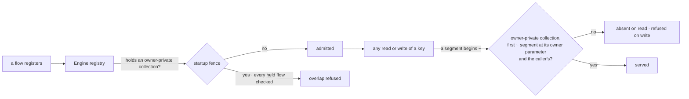

# FIX-1549 · Workforce's roster policy is enforced from Core's generic defineResourceCollection

**Spec** · [Decisions](DECISIONS.md) · [Rules](BUSINESS-RULES.md) · [Plan](PLAN.md) · [Docs](DOCS.md) · [Evolution](EVOLUTION.md)

Improvement · `core` + `engine` + `workforce` · medium · 3 PRs · no epic (follows [FIX-1529](https://linear.app/fixpoint-labs/issue/FIX-1529), under [FIX-1528](https://linear.app/fixpoint-labs/issue/FIX-1528))

> **Amended after merge.** The approved spec ([#2178](https://github.com/fixpoint-labs/flow-state-dev/pull/2178))
> moved the roster fence from Core into Engine's hire-plane module. Jake's call on its build
> ([#2196](https://github.com/fixpoint-labs/flow-state-dev/pull/2196)): hiring is not a Layer-1
> concept, so it leaves Engine too, and so does the FIX-1529 hire-plane code already there
> ([D3](DECISIONS.md#d3)). Engine gains one generic primitive in its place.

## Seven people, before and after

| Someone who… | Today | After |
|---|---|---|
| **builds an app without Workforce and declares `workforce/roster/[owner]/notes`** | `defineResourceCollection` throws: "can read user-owned roster rows" | Defines and registers like any other pattern |
| **builds an app without Workforce and declares `[tenant]/**` or `[a]/[b]/[c]/[d]`** | The app refuses to start, naming "user-owned roster rows" | Registers. No Workforce name appears anywhere on their path |
| **wants rows only their owner can read, without Workforce** | Not possible: the fence is Workforce's alone | Declares `ownerPrivate: { param: "owner" }` on a collection and gets the same fence Workforce gets ([D4](DECISIONS.md#d4)) |
| **runs Workforce with user-owned seats, and some flow declares an org-scoped `workforce/roster/**`, `[tenant]/**`, or an undeclared copy of the private collection** | Refused | Refused, whichever flow registered first. The message is generic: it names the owner-private collection, not the roster. A collection in another scope can't reach the rows and registers |
| **owns a user-owned seat, or is another member of the org** | Only the owner opens the seat or reads its row | Unchanged. The pin, the caller-only read and the debug listing behave exactly as today ([D6](DECISIONS.md#d6)) |
| **runs a process over a store holding user-owned rows, without Workforce** (a split worker, a second app) | That process refuses overlapping patterns | The overlapping collection registers and cannot read or write any owner's row ([D1](DECISIONS.md#d1)) |
| **stores a key segment beginning `~` through an ordinary collection** | Allowed | Refused on write: `~` marks an owner segment in every app ([D5](DECISIONS.md#d5), Jake's lock). Nothing on `main` does this but the private roster |

Rows one and two are measured, not argued: [poc/characterize](poc/characterize/README.md) runs
twelve patterns through both paths in an app with no Workforce. Eight are refused, all by the
roster fence.

## What changes


Look at the horizontal line. Today Workforce's names sit below it, in Core and Engine. After,
they stay above it, and what crosses is one declaration.

```diff
 // packages/workforce/src/roster/collections.ts
 export function defineHiredRosterPrivateCollection() {
-  return markHiredRosterPrivateCollection(
-    defineResourceCollection({
-      pattern: HIRED_ROSTER_PRIVATE_PATTERN,
+  return defineResourceCollection({
+    pattern: HIRED_ROSTER_PRIVATE_PATTERN,      // now Workforce's own constant
+    ownerPrivate: { param: "owner" },           // the generic primitive
     scope: "org",
     flowIsolation: SHARED_ACROSS_FLOWS,
     stateSchema: hiredSeatRowSchema,
-    }),
-  );
+  });
 }
```

Any app can write the same line. Nobody else has to change code: an app without Workforce stops
being refused, and a Workforce app keeps writing what
[durable hire](../../../apps/docs/docs/workforce/durable-hire.md) documents.

## How an owner's row stays private



Two layers, one Engine module, no Workforce name. **The key fence** is the guarantee: a key's
first `~` segment is its owner, and a key with one is served only through an owner-private
collection whose owner parameter sits there, to the user that segment encodes, on every read
path. It reads the key, so it holds in every process. **The startup fence** keeps the loud
failure: once a registry holds an owner-private collection, it refuses any other collection in
the same scope whose pattern can reach its keys, held or incoming.

## What stays as it is

- **Which patterns a Workforce app is refused.** Same patterns in the roster's scope; generic
  sentences ([Decided, not asked](DECISIONS.md#decided-not-asked)). The corpus is the check.
- **FIX-1529's guarantees.** The pin's 404 for another org or user, the caller-only read, the
  debug listing. Its goals under `goals/hire-plane/` re-run unchanged.
- **Stored rows.** `workforce/roster/~<user>/<seat>` is read back as-is, whatever the seat id.
  Nothing migrates.

## Sign off

**[D3](DECISIONS.md#d3) and [D5](DECISIONS.md#d5) are Jake's locks**, recorded, not asked. D5
reserves key segments beginning `~` for owner-private collections in every app; a key's first
one names its owner. The three below carry the locks out.

1. **[D4](DECISIONS.md#d4) · `ownerPrivate: { param }` on Core's collection config, enforced
   only by Engine.** If wrong: a public field every app sees, and a second consumer whose owner
   is not the session user would want the axis named.
2. **[D1](DECISIONS.md#d1) · Rows fenced by their key in every process; the startup refusal arms
   on any owner-private collection and never disarms.** If wrong: an app with an overlapping
   collection in the same scope fails to start where the key fence alone would have kept it
   safe.
3. **[D6](DECISIONS.md#d6) · The instance pin is renamed, not redesigned.** If wrong: one
   `reason` literal changed for nothing; nothing outside Engine reads it.

**Open: none.** Number 1 is the one to weigh: it is new public API. The reasoning and what lost:
[DECISIONS.md](DECISIONS.md). The cases: [BUSINESS-RULES.md](BUSINESS-RULES.md).
