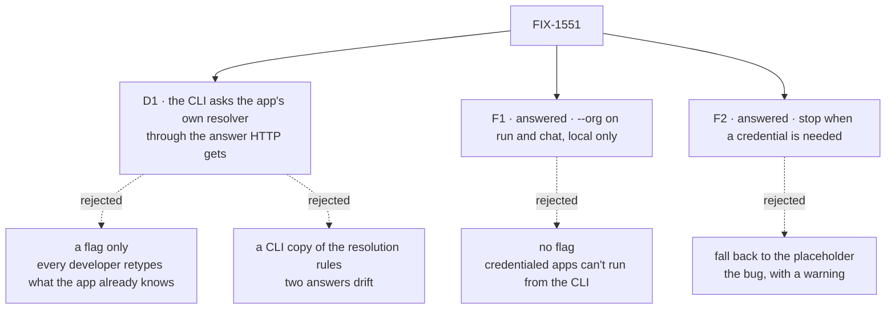

# FIX-1551 · Decisions

[Spec](SPEC.md) · **Decisions** · [Rules](BUSINESS-RULES.md) · [Plan](PLAN.md) · [Docs](DOCS.md) · [Evolution](EVOLUTION.md)

One decision to ratify. Two forks the owner has answered. The rest was decided here so the
implementer doesn't re-derive it.

## The tree

Solid edges are what you're signing or what the owner answered. Dashed edges lost, and the label says why.

## D1 · The CLI asks the app's own resolver, through the same answer the app's HTTP host gives

| | |
|---|---|
| **Instead of** | (b) a flag only, where the developer always names the organization · (c-copy) the CLI re-implementing which resolver wins and what organizations are legal |
| **Because** | The app already says who its callers are, in one place; the CLI is one more caller. A flag-only CLI makes every developer retype what the app's code holds. A CLI copy of the rules is a second answer to "who is this caller" (tenet 5) that drifts the first time the engine's rules change. The host's own answer matched HTTP flow for flow in the POC (P3), refusals included |
| **Locks in** | Every app with a resolver sees its CLI runs change identity. In kitchen-sink after PR-B they become `devuser` in `kitchen-sink` and show up in the browser's session list. CLI sessions from before stay in the placeholder organization and are refused if resumed. The engine gains a public, in-process "who is this caller" read. `source: "cli"` becomes reserved: only that in-process read can produce it, and a transport adapter that stamps it is refused, including an app's own custom adapter |

**What would change my mind:** an app whose resolver *should* answer a terminal differently from
a browser and can't tell them apart. It can: the resolver sees `source: "cli"`, which the
framework refuses from any network transport. If that proves too subtle for app authors, the flag becomes the default path.

## Answered by the owner

Both forks were put to the owner in full on the review PR, and the owner took both
recommendations on 2026-09-24 ([comment](https://github.com/fixpoint-labs/flow-state-dev/pull/2158#issuecomment-5820173185)). The alternatives that lost stay in the tree.

### F1 · A developer can name any organization locally with `--org` — answered: yes

| | |
|---|---|
| **Answer** | `--org` on `fsdev run` and `fsdev chat`, and `--user` on `fsdev run` (`fsdev chat` already has it). Local-only: never on `fsdev serve`, `fsdev dev` or any route |
| **Instead of** | No flag, where the CLI only ever gets the app's answer |
| **Because** | Apps whose check wants a credential have no other terminal path under F2, and multi-tenant debugging would mean editing the app's resolver. The flag grants nothing the operator lacks, since they hold the store credentials the CLI uses. Records written under it stay invisible to other organizations' callers (POC P5), and every run records whether a flag chose its organization |
| **Reopen if** | People run `fsdev` against production stores without holding the store credentials themselves, such as a bastion that injects them. Then the flag is an escalation and is refused on the production profile |
| **Cost of reversing** | Moderate, not low. Once shipped, scripts pass `--org`, and removing it breaks them: a `minor` release pre-1.0, not a `patch` (AGENTS.md → Changesets). Corrected after the owner's answer; the reasons for the answer don't depend on it |

### F2 · When the app's check wants a credential the CLI doesn't have — answered: stop

| | |
|---|---|
| **Answer** | Stop before anything is written. The message names the flow and `--org` |
| **Instead of** | Keep running in the placeholder organization with a warning |
| **Because** | The app's HTTP host refuses the same caller, so the CLI now agrees with it (POC P3). The fallback writes records nobody using the app can read, which is this issue's bug with a warning attached, and it is what sent FIX-1527's success check off the CLI. Stopping breaks such a script once, loudly, with the fix in the message |
| **Reopen if** | A CI job runs credentialed flows from the terminal and can't take a flag. Then fall back, warning on every run |

## Decided, not asked

- **Asked per run, and per turn in `fsdev chat`** on that turn's target, as HTTP asks per
  request. A per-flow resolver wins over the host's, as it does over HTTP.
- **The CLI's question carries `source: "cli"`**, its local user as the caller-named `userId`
  (so an app with no identity configured keeps `cli-user` in the placeholder, byte for byte), and
  no request and no credential.
- **`--org` skips the ask; `--user` alone keeps the app's organization and replaces its user.**
  `--org` is checked like any organization id and may not be the reserved placeholder.
- **A refusal exits with the existing invalid-arguments code.** No new exit code.
- **One identity per invocation.** `--seed-session` writes under the same one the run uses, and
  only after the existing session's flow, organization **and user** have been checked against it.
  Today the seed lands before the run's user check (POC P8).
- **`cli` is reserved by an in-process mark, not by a source list.** The engine's host keeps a
  mark it never exports; only the in-process entry point sets it, and the host refuses
  `source: "cli"` on any context without it. Transport adapters never receive that entry point.
- **`--capture` records the identity and where it came from**; stderr names the organization in
  one line. Stdout NDJSON is unchanged.
- **Old sessions are not migrated.** A session bound to another organization is refused by the
  engine's existing check.
- **The directory-discovery path takes the same ask**, with no host resolver to consult.

## Considered and dropped

| Alternative | Why not |
|---|---|
| (a) alone, no flag | F1's alternative. Leaves credentialed and multi-tenant apps with no terminal path |
| Route the CLI through the app's HTTP router in-process | A second transport to own, replacing the CLI's direct run. The answer is what's needed, not the route |
| Hand the app's resolver function to the CLI and let it call it raw | The organization rules live around the resolver, not in it. Raw calls skip the placeholder guard (tenet 5) |
| Reserve `cli` by refusing an adapter that *declares* it | The host is shared and each adapter builds its own resolution context, so an adapter declaring `custom-ws` still stamped `cli` and got the local identity (POC P6). Only a mark the adapter can't set closes it (P7) |
| A CLI identity block in `fsdev.config.ts` | A second place identity is configured, which FIX-1500's plan rules out ("one resolver, on the host"). `source: "cli"` does the job inside the resolver |

## Settled

- **The app's host resolver is not reachable from anything a loaded app exposes to the CLI** —
  **CONFIRMED** ([P2](poc/cli-principal/README.md)). So the engine owes one read. A resolver on
  the flow itself *is* reachable, and the CLI ignores that too today.
- **The host's own answer, asked with a terminal's question, matches HTTP flow by flow** —
  **CONFIRMED** ([P3](poc/cli-principal/README.md)) against the HTTP **action** route:
  `devuser@kitchen-sink` for a flow on the host resolver, and the same refusal message for a
  bearer flow and a weekly-digest-shaped wrapper on both paths.
- **A custom network adapter can stamp `source: "cli"` today** — **CONFIRMED** (P6), whatever
  source it declares. **A mark only the in-process entry point sets closes it** (P7), and the
  CLI's own ask still gets its answer.
- **`--seed-session` rewrites a same-organization, other-user session before the run refuses
  it** — **CONFIRMED** (P8) against today's CLI.
- **The placeholder is not a legal seat address** — already proven on `main` by
  `apps/kitchen-sink/test/manager-seat.test.ts` (FIX-1527 V2). Not re-run here.

## How it got here

- **Draft** — framed as the CLI answering for itself where the app already has an answer; chose
  asking the app through the host's own answer, with a local-only `--org` and a stop on
  credentials as two forks; one PR, engine read plus CLI.
- **Owner answer** (2026-09-24) — F1 and F2 closed on their recommendations ([comment](https://github.com/fixpoint-labs/flow-state-dev/pull/2158#issuecomment-5820173185)).
  No shape moved; the plan was already built to them.
- **Review (Codex, round 1)** — D1's approach unchanged; its lock-ins gained the reserved
  `cli` source, because P6 showed a custom adapter could stamp it. The seed now waits for an
  ownership check, because P8 showed it lands first. F1's reversal cost corrected to `minor`.

**Open: none.**
