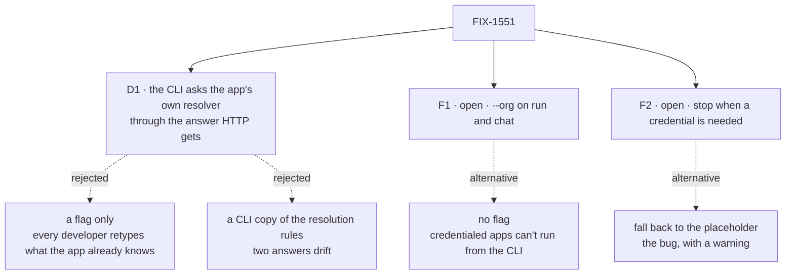

# FIX-1551 · Decisions

[Spec](SPEC.md) · **Decisions** · [Rules](BUSINESS-RULES.md) · [Plan](PLAN.md) · [Docs](DOCS.md) · [Evolution](EVOLUTION.md)

One decision to ratify and two forks to answer. The rest was decided here so the implementer
doesn't re-derive it.

## The tree

Solid edges are what you're signing or answering. Dashed edges lost or are the alternative.

## D1 · The CLI asks the app's own resolver, through the same answer the app's HTTP host gives

| | |
|---|---|
| **Instead of** | (b) a flag only, where the developer always names the organization · (c-copy) the CLI re-implementing which resolver wins and what organizations are legal |
| **Because** | The app already says who its callers are, in one place; the CLI is one more caller. A flag-only CLI makes every developer retype what the app's code holds. A CLI copy of the rules is a second answer to "who is this caller" (tenet 5) that drifts the first time the engine's rules change. The host's own answer matched HTTP flow for flow in the POC (P3), refusals included |
| **Locks in** | Every app with a resolver sees its CLI runs change identity. In kitchen-sink after PR-B they become `devuser` in `kitchen-sink` and show up in the browser's session list. CLI sessions from before stay in the placeholder organization and are refused if resumed. The engine gains a public, in-process "who is this caller" read |

**What would change my mind:** an app whose resolver *should* answer a terminal differently from
a browser and can't tell them apart. It can: the resolver sees `source: "cli"`, which no network
transport sends. If that proves too subtle for app authors, the flag becomes the default path.

## Open

### F1 · Can a developer name any organization locally with `--org`, or does the CLI only ever get the app's answer?

**Plain terms.** Some apps can't be asked from a terminal: their check wants a login or a token.
Others serve many customers, and a developer debugging one of them wants to run as that customer.
`--org` lets the person at the keyboard name the organization and skips the app's check. It exists
only on the two commands that run in the developer's own process, never on one that serves a network.

**The trade-off.** With the flag, anyone who can run `fsdev` against an app's database can write
records into any organization in it. They already can: that person holds the database password.
Without it, apps whose check wants a credential can't be run from a terminal at all under F2's
recommendation, and multi-tenant debugging means editing the app's resolver.

**My recommendation.** Add `--org` to `fsdev run` and `fsdev chat`, and `--user` to `fsdev run`
(`fsdev chat` has it). It grants nothing the operator lacks, records written under it stay invisible
to other organizations' callers (POC P5), and every run records whether a flag chose its organization.

**What would change my mind:** a deployment where people run `fsdev` against production stores
without holding the store credentials themselves, such as a shared bastion that injects them. Then
the flag is an escalation, and it should be refused when the production profile is active.

**What being wrong costs.** Low and reversible. Removing a flag before 1.0 is a patch release.

### F2 · When the app's check wants a credential the CLI doesn't have, stop, or keep running in the placeholder organization?

**Plain terms.** Some flows check for a bearer token or a signed header, as kitchen-sink's
operator flow and the knowledge-base example do when their secret is set. A terminal run carries
no such thing. Today those runs work, but they land in the placeholder organization, which the
app never serves. Their output is somewhere nobody using the app will look.

**The trade-off.** Stopping breaks scripts that run such flows from the terminal today. Each one
gets an error naming the fix, `--org <id>`. Falling back keeps those scripts green and keeps
writing records nobody can read, which is this issue's bug with a warning attached.

**My recommendation.** Stop, before anything is written, with a message naming the flow and
`--org`. The app's HTTP host refuses the same caller, so the CLI now agrees with it (POC P3). The
fallback is the behaviour that sent FIX-1527's success check off the CLI.

**What would change my mind:** a team running credentialed flows from the terminal in CI that
can't add a flag, such as a pinned third-party script. Then fall back, with a warning on every run.

**What being wrong costs.** Moderate. Choosing stop wrongly breaks a script once, loudly, with the
fix in the message. Choosing fallback wrongly repeats FIX-1527's detour for the next app.

## Decided, not asked

- **Asked per run, and per turn in `fsdev chat`** on that turn's target, as HTTP asks per
  request. A per-flow resolver wins over the host's, as it does over HTTP.
- **The CLI's question carries `source: "cli"`**, its local user as the caller-named `userId`
  (so an app with no identity configured keeps `cli-user` in the placeholder, byte for byte), and
  no request and no credential.
- **`--org` skips the ask; `--user` alone keeps the app's organization and replaces its user.**
  `--org` is checked like any organization id and may not be the reserved placeholder.
- **A refusal exits with the existing invalid-arguments code.** No new exit code.
- **One identity per invocation.** `--seed-session` writes under the same one the run uses.
- **`--capture` records the identity and where it came from**; stderr names the organization in
  one line. Stdout NDJSON is unchanged.
- **Old sessions are not migrated.** A session bound to another organization is refused by the
  engine's existing check.
- **The directory-discovery path takes the same ask**, with no host resolver to consult.

## Considered and dropped

| Alternative | Why not |
|---|---|
| (a) alone, no flag | F1's alternative. Leaves credentialed and multi-tenant apps with no terminal path |
| Route the CLI through the app's HTTP router in-process | A second transport to own, replacing the CLI's direct run. The answer is what's needed, not the route |
| Hand the app's resolver function to the CLI and let it call it raw | The organization rules live around the resolver, not in it. Raw calls skip the placeholder guard (tenet 5) |
| A CLI identity block in `fsdev.config.ts` | A second place identity is configured, which FIX-1500's plan rules out ("one resolver, on the host"). `source: "cli"` does the job inside the resolver |

## Settled

- **The app's host resolver is not reachable from anything a loaded app exposes to the CLI** —
  **CONFIRMED** ([P2](poc/cli-principal/README.md)). So the engine owes one read. A resolver on
  the flow itself *is* reachable, and the CLI ignores that too today.
- **The host's own answer, asked with a terminal's question, matches HTTP flow by flow** —
  **CONFIRMED** ([P3](poc/cli-principal/README.md)): `devuser@kitchen-sink` for a flow on the
  host resolver, 401 for a bearer flow and for a weekly-digest-shaped wrapper, on both paths.
- **The placeholder is not a legal seat address** — already proven on `main` by
  `apps/kitchen-sink/test/manager-seat.test.ts` (FIX-1527 V2). Not re-run here.

## How it got here

- **Draft** — framed as the CLI answering for itself where the app already has an answer; chose
  asking the app through the host's own answer, with a local-only `--org` and a stop on
  credentials as two forks; one PR, engine read plus CLI.

**Open: F1, F2.**
