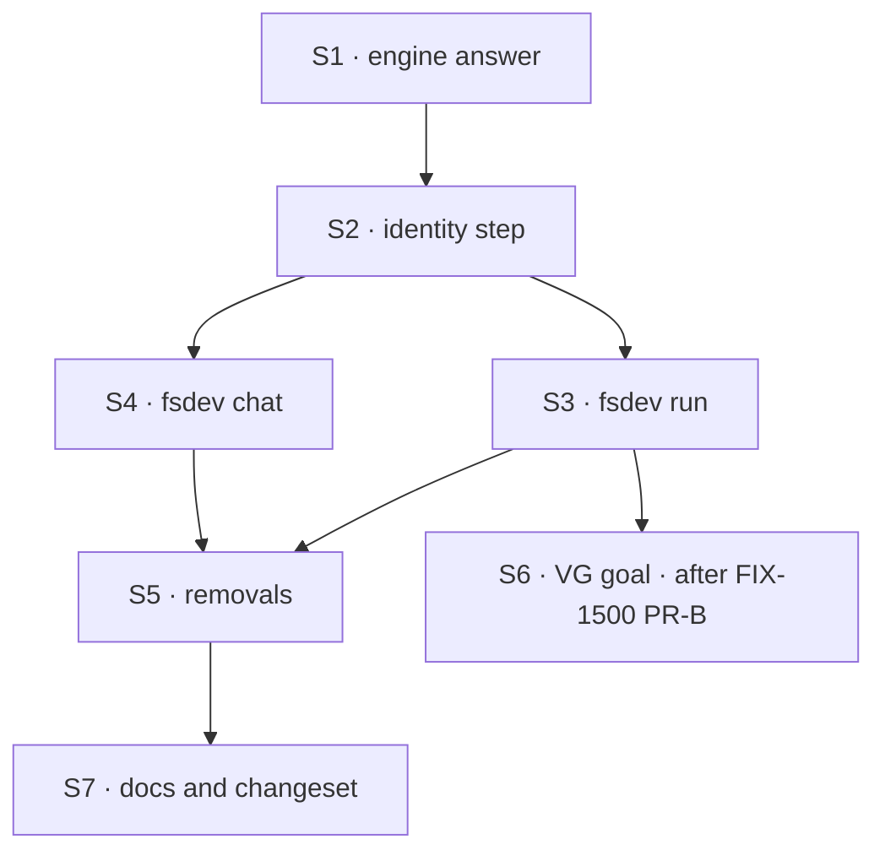

# FIX-1551 · Plan

[Spec](SPEC.md) · [Decisions](DECISIONS.md) · [Rules](BUSINESS-RULES.md) · **Plan** · [Docs](DOCS.md) · [Evolution](EVOLUTION.md)

Written for the implementing agent. IDs cross-reference [BUSINESS-RULES.md](BUSINESS-RULES.md)
(BR-n) and [DECISIONS.md](DECISIONS.md) (D1, F1, F2). `tdd`. One PR. Build F1 and F2 to the
owner's answers; the rows below assume the recommendations.

## Surfaces

| ID | Package · role | Change | Rules |
|---|---|---|---|
| S1 | `engine` · a loaded app's answer to "who is this in-process caller" | Expose the host's **own** resolution (resolver precedence plus the organization rules, what the router's inbound host calls) to in-process callers of a loaded FlowState, and for a bare registry with no host resolver (the discovery path). No route, no transport, not on `runAction` (D1). Shape is yours | BR-1 – BR-6 |
| S2 | `fsdev` · one identity step, shared by `run` and `chat` | Build the terminal's question (`source: "cli"`, the flow id, the action, the input, the local user as the caller-named `userId`, no request) and ask S1. Apply `--org` / `--user` (F1). Return the user, the organization, and where they came from, or a refusal naming the flow and `--org` (F2) | BR-5 BR-7 – BR-9 |
| S3 | `fsdev` · `fsdev run` | Add `--org` and `--user`. Take one identity from S2 before any write, and use it for both `--seed-session` and the run. Record it in the capture under `command.principal`. One stderr line names the organization | BR-1 BR-2 BR-12 BR-14 |
| S4 | `fsdev` · `fsdev chat` | Add `--org`. Each turn takes its identity from S2 for that turn's target. `/status` shows the organization. The session guard compares against the same identity | BR-13 |
| S5 | `fsdev` · removals | **Remove** the two hard-coded placeholder organizations and the two `cli-user` literals in `fsdev run`, the placeholder in the chat turn, and their now-unused imports. Rewrite the comment above the seed path that says the CLI names the organization | — |
| S6 | `goals/` · VG | One goal directory for VG, following `goals/_template`. Name it | acceptance |
| S7 | Docs · release | Publish [DOCS.md](DOCS.md). One changeset, `minor`, for `@flow-state-dev/engine` (S1) and `@flow-state-dev/fsdev` (flags, identity change) | — |

## Sequence



## Checks

| ID | Runs after | Passes when | Seen red by |
|---|---|---|---|
| V1 | S3 | **Model-free: the organization the CLI binds to.** A `fsdev` test over a fixture config whose host resolver names `dev` in `acme-dev`, run with `--capture` and `--seed-session`: `command.principal` is `dev` / `acme-dev` / `resolver`, and the stored session says `acme-dev`. After PR-B, on the real app: `cd apps/kitchen-sink && KITCHEN_SINK_TEST_MODE=1 STORE_TYPE=filesystem pnpm fsdev run chat-agent run -i '{"message":"hi","mode":"ask"}' -s fix1551-v1 --capture /tmp/fix1551-v1.json` records `devuser` / `kitchen-sink`, and `.fsdev/data/sessions/fix1551-v1.json` has `orgId: "kitchen-sink"` | No host resolver: the placeholder. S3 still hard-coded: the placeholder despite the resolver (POC P1) |
| V2 | S3 | Every existing `run-command` and `chat` test passes unchanged, except assertions on the new capture field | — |
| V3 | S2 | Promote POC P3 into the `fsdev` package: for a flow on the host resolver, a bearer-checking flow, a weekly-digest-shaped flow, and a resolver that returns the placeholder, the terminal's outcome equals the app router's outcome for a credential-less HTTP caller | Plant a fallback to the placeholder on refusal: two rows diverge (POC `POC_CLI_FALLBACK=1`) |
| V4 | S3 | A refused run leaves no session and no request record, exits 2, and its message names the flow and `--org` | Resolve after the seed write: the seeded record survives |
| V5 | S2 | The flag matrix: `--org`, blank `--org`, `--org` set to the placeholder, `--user` alone, both. A flag-named organization's session is refused by the app's router as the app's user (POC P5) | Name the app's own organization: readable (POC `POC_NAMED_ORG=kitchen-sink`) |
| V6 | S3 | `-s` naming a session bound to the placeholder, run against an app with a resolver: refused with both organizations named; the record is unchanged | — |
| V7 | S4 | `fsdev chat` over two targets, one refused: that turn fails, the next turn on the other target succeeds, `/status` shows the organization | — |
| V8 | S3 S4 | `fsdev serve --org x` and `fsdev dev --org x` are unknown options. The existing node bind-guard tests and the FIX-1442 body-organization tests pass untouched. Nothing under the engine's routes calls S1 | Add `--org` to `serve`: the first assertion fails |
| VG | S6 | **Goal, real model, real path. Needs FIX-1500 PR-B merged.** `cd apps/kitchen-sink && STORE_TYPE=filesystem pnpm fsdev run support.mara run -i '{"message":"Hire support.pat, an agent seat that takes refunds."}' --capture /tmp/fix1551-vg.json`. Passes when the principal is `devuser` / `kitchen-sink` / `resolver`, mara's `hire` call succeeds, and **a zero-model read of the roster over the same store finds `support.pat` under `kitchen-sink` and nothing under the placeholder**. The store decides, not the transcript | On `main` today the same command ends in `Organization id "__fsd_default_org__"` (FIX-1527 VG's first form) |

## Pinned names

| Where | Name | Why pinned |
|---|---|---|
| Flag | `--org <id>` on `fsdev run` and `fsdev chat`; `--user <id>` on `fsdev run` | Public. People type them. `fsdev chat` already has `--user` |
| Principal context | `source: "cli"` | Public. App resolvers may branch on it |
| Capture | `command.principal: { userId, orgId, from }`, `from` one of `resolver`, `flag`, `development-default` | Public output goal checks read |

Everything else is yours to name, including S1's shape.

## Guardrails

| Rule | Because |
|---|---|
| No copy of resolver precedence or the organization rules outside the engine (tenet 5) | Two answers to "who is this caller" is how the CLI and the app drift. V3 is the fence |
| S1 is in-process only. No route, header, query or environment variable reaches it (BP-031) | It is the whole security argument. The terminal's question is safe because only the terminal can ask it |
| `--org` and `--user` exist only on `run` and `chat` | Those run in the developer's process. `serve` and `dev` face a network |
| Never fall back to the placeholder when a configured resolver refuses (F2) | The silent fallback is this issue's bug |
| One identity per invocation, resolved before the first write | Two sites that could disagree are what the two hard-coded placeholders were |
| Leave the run entry's organization check, the hired-seat pin, the resolver contract and the node bind guard as they are | FIX-1442, FIX-1529 and FIX-1503 own them. This issue calls them |

## Docs

Reconcile [DOCS.md](DOCS.md) against the shipped flags and messages after V1 to V8 pass, then
publish it. No new page.

## Sketch · pseudocode, illustrative

```
identity for (app, flow, action, input, flags):
    if flags.org:            return { user: flags.user or "cli-user", org: flags.org, from: flag }
    answer = app's in-process answer (source cli, flow, action, input,
                                      caller-named user = flags.user or "cli-user",
                                      no request, no credential)             ← S1, the same one HTTP gets
    if answer refused:       stop, write nothing: "<flow>'s resolver needs a credential … pass --org"
    return { user: flags.user or answer.user, org: answer.org, from: answer.devDefault ? development-default : resolver }
```

**POC:** [`poc/cli-principal/`](poc/cli-principal/README.md), five legs, each control seen red:
today's split (P1), the host resolver unreachable from a loaded app, hence S1 (P2), the host's
answer matching HTTP for every flow shape (P3), the result readable by the app (P4), a
flag-named organization not (P5). The premise held; the approach did not move.

## At implement time

- **Has FIX-1500 PR-B merged?** V1's kitchen-sink half and VG need its host resolver. Without it,
  run them against the fixture only and leave VG for the lifecycle to re-run.
- **Has FIX-1503's engine child flipped the default?** If the framework default becomes a
  verifier, S1 would refuse every terminal run under F2. Keep BR-2: a flow on the framework
  default gets the development identity from S1. Whichever lands second reconciles this.
- **FIX-1548** may have added its own principal handling for hired seats. S1 must return what the
  router's host returns after that change, not before.

## Follow-ups

- FIX-1527's VG can take its success form through `fsdev run` again once this and PR-B ship.
  That is an amendment to FIX-1527's spec, not this PR.
- A weekly-digest-shaped resolver is refused over HTTP for every non-scheduled caller (POC P3).
  Check kitchen-sink's own weekly-digest for the same gap. Not this issue.
- The node bind guard cannot see a host-level resolver (its header says so). S1 would let it;
  already named as a deepening in FIX-1503's plan.
