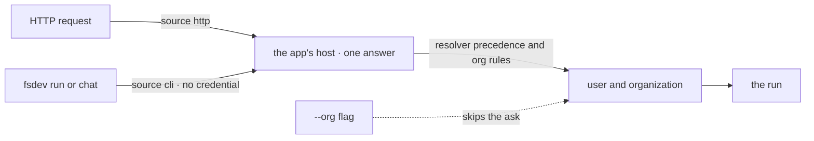

# FIX-1551 · CLI flow execution can't run under an app's real organization

**Spec** · [Decisions](DECISIONS.md) · [Rules](BUSINESS-RULES.md) · [Plan](PLAN.md) · [Docs](DOCS.md) · [Evolution](EVOLUTION.md)

Improvement · `engine` + `fsdev` · small · 1 PR · epic [FIX-1455](https://linear.app/fixpoint-labs/issue/FIX-1455)

## Five people, before and after

| Someone who… | Today | After |
|---|---|---|
| **runs a kitchen-sink seat from the terminal** (`fsdev run support.mara`) | Runs in the framework's placeholder organization. Mara's hire is refused, and the app's pages can't see the session | Runs as the app would run a browser visitor: `devuser` in `kitchen-sink`. The hire lands, and the browser can read the session |
| **runs any app that names its organization in host code** | The CLI ignores that code and uses the placeholder | The CLI asks that code the same question the app's HTTP host asks, and uses the answer |
| **runs an app with no identity configured** | `cli-user` in the placeholder organization | Unchanged |
| **runs a flow whose own check wants a credential** (a bearer token, a signed header) | Runs anyway, in the placeholder organization the app never serves | Stops before writing anything and says so, naming `--org` as the way through ([F2](DECISIONS.md#f2)) |
| **wants to try a flow as another tenant locally** | Can't | Passes `--org acme` on `fsdev run` or `fsdev chat` ([F1](DECISIONS.md#f1)). Nothing reachable over the network gains this |

FIX-1527 had to move its success check off the CLI and onto the app's HTTP router for exactly
this reason ([its plan, VG](../FIX-1527/PLAN.md)). The CLI is where developers and agents verify
flows, so a CLI that can't reach the app's organization can't verify anything organization-shaped.

## What changes


The top rows are the fix: the CLI stops skipping the app's resolver. The bottom row is fork F1's
recommendation, a developer-named organization that the app's own callers never see.

**In a terminal, against kitchen-sink after FIX-1500's PR-B:**

```diff
  $ pnpm fsdev run support.mara run -i '{"message":"Hire support.pat …"}' --capture run.json
- # hire refused: Organization id "__fsd_default_org__" …
+ # support.pat hired into kitchen-sink; run.json records who the run was:
+ #   "command": { …, "principal": { "userId": "devuser", "orgId": "kitchen-sink", "from": "resolver" } }

+ $ pnpm fsdev run support.mara run -i '…' --org acme --user alice     # F1
+ $ pnpm fsdev run workforce-admin fire -i '…'
+ # refused: this flow's resolver needs a credential the CLI doesn't carry.
+ # Pass --org <id> to name the organization yourself.                 # F2
```

No app code changes. An app that wants the CLI to get a particular identity says so in its own
resolver, which sees `source: "cli"` — a value no network transport can send.

## How the CLI gets its answer



One place decides who a caller is, and the CLI now calls it instead of answering for itself. The
proof it can: [poc/cli-principal](poc/cli-principal/README.md), where the CLI's answer matched the
app's HTTP answer for every flow shape, and each planted divergence turned it red.

## What stays as it is

- **The rules for who a caller is.** Resolver precedence, the organization guard, and the
  hired-seat pin ([FIX-1442](https://linear.app/fixpoint-labs/issue/FIX-1442),
  [FIX-1529](https://linear.app/fixpoint-labs/issue/FIX-1529)) are called, not copied or softened.
- **Everything reachable over a network.** `fsdev serve`, `fsdev dev` and the HTTP routes gain no
  flag, and the node host still refuses to bind a network address for a flow with no identity.
- **Verified identity by default** is [FIX-1503](https://linear.app/fixpoint-labs/issue/FIX-1503)'s,
  which keeps `fsdev run` a trusted in-process caller. This spec stays inside that.
- **Opening a hired seat from a browser** is
  [FIX-1548](https://linear.app/fixpoint-labs/issue/FIX-1548)'s.
- **`fsdev block`**, which runs one block in a test context and never loads the app's identity.

## Sign off

**Two open forks, asked in full in [DECISIONS.md](DECISIONS.md#open):**

- **[F1](DECISIONS.md#f1) · Can a developer name any organization locally with `--org`?**
  Recommendation: yes, on `fsdev run` and `fsdev chat` only.
- **[F2](DECISIONS.md#f2) · When the app's check wants a credential, stop or fall back?**
  Recommendation: stop, and name `--org`.

**Ratify:**

1. **[D1](DECISIONS.md#d1) · The CLI asks the app's own resolver, through the same answer HTTP
   gets.** If wrong: the CLI and the app disagree about who a caller is in some case nobody
   tested, which is the bug this issue exists to close.

D1 is the one to weigh. The cases are in [BUSINESS-RULES.md](BUSINESS-RULES.md).
