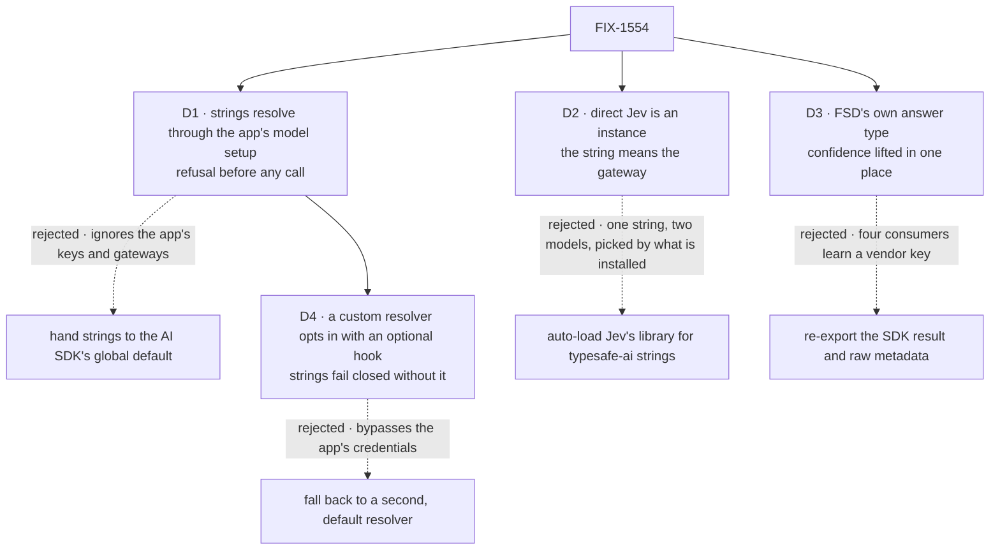

# FIX-1554 · Decisions

[Spec](SPEC.md) · **Decisions** · [Rules](BUSINESS-RULES.md) · [Plan](PLAN.md) · [Docs](DOCS.md) · [Evolution](EVOLUTION.md)

The owner's locks on [FIX-1553](https://linear.app/fixpoint-labs/issue/FIX-1553) and the
epic's cards ([D1–D4](../../epics/FIX-1553/DECISIONS.md)) are decided input, not reopened here.
The four cards are the calls those locks leave to this issue. D4 was added after merge, by the
first amendment (see *How it got here*).

## The tree

Solid edges are what you're signing. Dashed edges lost, and the label says why.

## D1 · A model string resolves through the app's own model setup, and a model that can't evaluate is refused before any call

| | |
|---|---|
| **Instead of** | Passing strings straight to `experimental_evaluate`, which resolves them with the AI SDK's global default provider (Vercel's gateway unless `AI_SDK_DEFAULT_PROVIDER` is set) · or an `evaluate()` handler factory that resolves its own model, as the #1903 lab did |
| **Because** | An app configures keys, providers and gateways once, and every generator honours that. An evaluator that ignored it would bill a different account. Resolution and the refusal are why the epic made this a kind ([epic, Decided in review](../../epics/FIX-1553/DECISIONS.md#decided-in-review)); tenet 5, one place decides |
| **Locks in** | A second, evaluation path in the model resolver, with a generator string's precedence: direct when installed and keyed, else a gateway. Intents, arrays and `selectModel` are refused, so adding one later is additive. The SDK's global default is never consulted |

**What would change my mind:** evidence that apps using evaluation configure the AI SDK's global
provider and not FSD's resolver. Then the SDK default is the setup they already have, and a second
path is ours to maintain for nothing.

## D2 · Direct Jev is an instance the author builds from Jev's library; the string `typesafe-ai/jev` always means the gateway

| | |
|---|---|
| **Instead of** | Auto-loading Jev's library for `typesafe-ai/...` strings when it is installed, the way the resolver loads `@ai-sdk/openai` for `openai/...` |
| **Because** | The owner prefers the gateway. The two paths name the model differently (`jev` vs `jev-latest`), so a string routed by what is installed would call a different model on a teammate's machine |
| **Locks in** | Jev's library (`@ai-sdk/typesafe-ai`) is an optional peer of `@flow-state-dev/core`, declared there and nowhere else (ER-9, ER-11). FSD never imports it; the author does, with their own `TYPESAFE_AI_API_KEY`. Teaching a string to reach it later is additive |

**What would change my mind:** the gateway and the library converging on one model id. Then a
string can route either way without changing which model answers.

## D3 · The answer is FSD's own type: the SDK's answer, plus `confidence` when the model returned one, read from Jev's metadata in one place

| | |
|---|---|
| **Instead of** | Re-exporting the SDK's `Experimental_EvaluationResult` and its raw `providerMetadata`, so each consumer reads `providerMetadata.typesafe.confidence` itself |
| **Because** | Four consumers read this shape (ER-3). The SDK may change its evaluation contract in patch releases; on our surface, every such patch is an FSD API change. Lifting one vendor's key into a neutral field at one seam is normalization, not leakage: a second provider is one more mapping there |
| **Locks in** | `choice`, `score` or `boolean` answers as the SDK returns them, each with an optional `confidence` and nothing else added. The boolean's required `probability` is **not** confidence. Output is `{ answers }`; usage and model identity go on the trace |

Read the confidence row. It is filled only by the model's own report and is otherwise absent,
never zero. The boolean's `probability` sits above that row because it is an answer, not a
certainty.

## D4 · An app's custom model resolver opts in to evaluation with an optional hook; without it, evaluator strings fail closed

| | |
|---|---|
| **Instead of** | Falling back to FSD's default resolver for evaluation strings when the app passes its own `modelResolver` · or requiring every custom resolver to implement evaluation |
| **Because** | `createFlowState({ modelResolver })` replaces `models` entirely, and the public `ModelResolver` can only return a generator model, so D1 has no source for an evaluation model in those apps. A second, default resolver would read keys and gateways the app never configured, which is the account-billing failure D1 exists to prevent. Making the hook required would break every existing custom resolver, generator-only apps included |
| **Locks in** | `ModelResolver` gains one **optional** member, `resolveEvaluationModel(modelId, blockName?)`, returning an evaluation model or throwing the same refusals as S3. FSD's built-in resolver implements it. A custom resolver without it type-checks and runs generators unchanged; an evaluator **string** on it is refused at first execution, before any provider call, with an error naming the missing hook. An evaluation model **instance** needs no resolver and works either way. Nothing falls back to another resolver |

**What would change my mind:** evidence that apps passing a custom resolver want FSD's default
resolution for evaluation and nothing else. Then an explicit opt-in to delegate would be worth
adding, and it would still be additive.

Owner-approved in session after Codex's review of #2190; the call is the engineering manager's.

## Decided, not asked

- **Refusal timing.** An instance is checked at build; a string at first execution, before any
  provider call.
- **One call per execution.** The SDK's transient retry is off (the no-retry lock). A failed call
  is recovered, not retried, by `.rescue`, which runs a substitute block in its place.
- **`model` is required.** No vendor default in core; "prefer Jev" lives in the docs.
- **Questions are static or `(input, ctx) => …`**, typed either way. FIX-1559's choices are its
  skill catalog.
- **`state` defaults to the block's input.**
- **Silent like a handler.** The trace and the DevTool carry it; no client items.
- **`uses` installs resources, state and helpers only.** Model, tool and context contributions
  stay generator-only.
- **One PR.** A widened union must land with every reader, and ER-8 puts the count in the same
  change.
- **Core's `ai` floor rises**; 7.0.103 is the first release exporting `experimental_evaluate`.

## Considered and dropped

| Alternative | Why not |
|---|---|
| An `evaluate()` handler factory, four kinds untouched (the epic's tripwire fallback) | Resolution, usage accounting and trace identity are all keyed on kind today. See *Settled* |
| Evaluation strings on a custom resolver fall back to FSD's default resolver | Reads credentials the app never configured and bills a different account. See [D4](#d4) |
| A default model of `typesafe-ai/jev` | A call to a vendor account the author never named. Reversible later |
| Treating the boolean's `probability` as its confidence | The SDK documents it as P(true), "not confidence in either outcome". FIX-1558 would open a gate on a number that doesn't mean what the gate thinks |
| Question sets overridable from the block's input (the lab's `input.questions`) | Makes the question set caller-controllable input (BP-031) and loses answer typing. The function form covers the real case |
| Keeping the lab's `noul` alias | A dual-read for a name nothing in FSD ever shipped |

## Settled

- **The kind earns its place; the epic's tripwire does not fire.** **CONFIRMED** on `main` at
  `5f48575c`: `ctx.resolveModel` returns a generator model (`ModelResolver`,
  `packages/core/src/types/model.ts`); usage is captured only for `block.kind === "generator"`
  (`executeBlock.ts`, `sequencer.ts`); the DevTool keys on `blockKind`. A handler factory gets
  none of the three without a kind-shaped marker.
- **Every path this spec names can evaluate.** **CONFIRMED** from the published packages:
  `ai@7.0.114` exports `experimental_evaluate`; `@ai-sdk/gateway@4.0.92`, `@ai-sdk/openai@4.0.75`,
  `@ai-sdk/anthropic@4.0.63` and `@ai-sdk/typesafe-ai@3.0.6` each expose `evaluationModel(id)`;
  the gateway's known evaluation id is `typesafe-ai/jev`, the library's is `jev-latest`, and the
  library reports confidence only in `providerMetadata.typesafe.confidence`, for choice and score.

## How it got here

- **Draft** — framed as the kind the epic's four consumers wait on; resolution through the app's
  model setup, direct Jev as an author-built instance, and FSD's own answer type; one PR across
  six packages with the five-kinds sweep; FIX-1560's acceptance carried verbatim.
- **Merged** as [#2190](https://github.com/fixpoint-labs/flow-state-dev/pull/2190) at `065ebcc`.
- **Amendment 1** — folds Codex's review of #2190, which landed after merge: [D4](#d4) and
  BR-29/BR-30 for custom resolvers; `.rescue` described as recovery, not retry; distinct checks
  for a malformed result (BR-20) and a cancelled pending call (BR-22); the changeset draft names
  FIX-1554.

**Open: none.**
