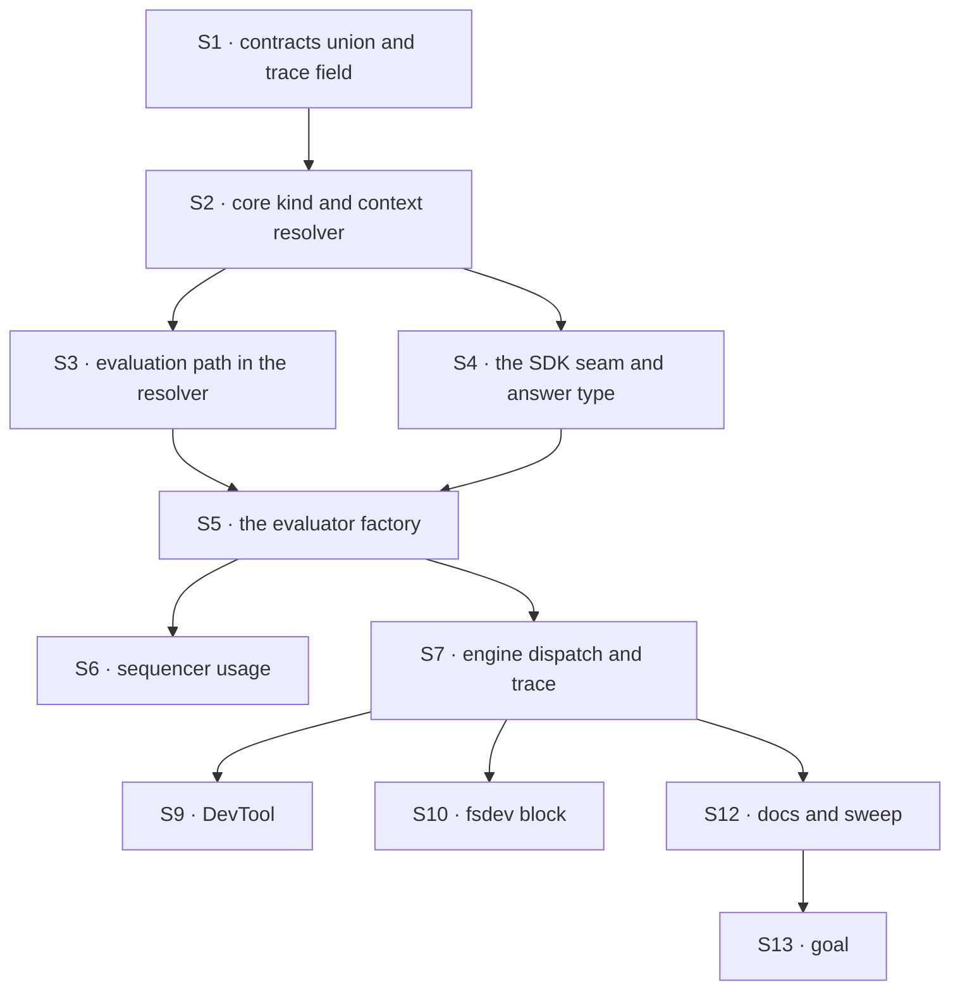

# FIX-1554 · Plan

[Spec](SPEC.md) · [Decisions](DECISIONS.md) · [Rules](BUSINESS-RULES.md) · **Plan** · [Docs](DOCS.md) · [Evolution](EVOLUTION.md)

Written for the implementing agent. IDs cross-reference [BUSINESS-RULES.md](BUSINESS-RULES.md)
(BR-n), [DECISIONS.md](DECISIONS.md) (D-n) and the epic's rules (ER-n). `tdd`. **One PR**
(why: [Decided, not asked](DECISIONS.md#decided-not-asked)).

## Surfaces

| ID | Package · role | Change | Rules |
|---|---|---|---|
| S1 | `contracts` · the trace item's kind union | Add `"evaluator"`. Add a trace field for the requested model and the question set, sibling of the generator one | BR-24 BR-27 |
| S2 | `core` · the block-kind union and the block context | Add `"evaluator"` to `BlockKind` (and its JSDoc). Give the context an evaluation-model resolver beside `resolveModel` | BR-6 to BR-13 |
| S3 | `core` · the model resolver | An evaluation path with the generator precedence (direct, else gateway), calling `evaluationModel(id)` on the provider, gateway or explicit `providers` instance. Refuses intents, arrays and providers without evaluation before any call. Never the SDK's global default ([D1](DECISIONS.md#d1)) | BR-6 to BR-8 BR-11 to BR-13 BR-15 |
| S4 | `core` · the SDK seam (new, one module) | The only importer of the SDK's experimental evaluation types. Calls `experimental_evaluate` with `maxRetries: 0` and the request's abort signal; maps the result into FSD's answer type, lifting `providerMetadata.typesafe.confidence[id]` into `confidence` and nothing else ([D3](DECISIONS.md#d3)); reports usage and model identity | BR-1 BR-5 BR-14 BR-16 to BR-22 |
| S5 | `core` · the `evaluator()` factory and question builders | Kind `evaluator`: validates questions, refuses a language or generator model instance at build, resolves a string at execution, derives state, calls S4, returns `{ answers }` typed from static or function questions. Shared fields and scope schemas as on a handler. Exported with the answer types | BR-1 to BR-4 BR-9 BR-10 BR-12 |
| S6 | `core` · the sequencer kernel | Capture model usage for `evaluator` as it does for `generator`, on success and failure | BR-23 |
| S7 | `engine` · block dispatch and the execution context | Dispatch `evaluator` (today an unknown kind throws); capture usage and model identity onto the trace row; wire the context's evaluation resolver from the flow's model resolver; widen the two local `blockKind` unions | BR-23 BR-24 BR-27 |
| S8 | `testing` · mocks and trace snapshots | A mock evaluation model (scripted answers, optional confidence, call counter). Widen the snapshot kind union | V1 to V5 |
| S9 | `devtool` · trace tree and detail | Kind indicator for `evaluator`; the detail view shows questions and answers; inference accepts the new kind | BR-25 |
| S10 | `fsdev` · block loader | Accept `evaluator` as a valid kind | BR-26 |
| S11 | `core/package.json` | Raise the `ai` floor (see *Pinned*). Add `@ai-sdk/typesafe-ai` as an **optional peer** and a dev dependency for V3. No other package lists it ([D2](DECISIONS.md#d2), ER-9, ER-11) | BR-9 |
| S12 | Docs, READMEs, changeset, the five-kinds sweep | Publish [DOCS.md](DOCS.md); run the sweep ([epic DOCS](../../epics/FIX-1553/DOCS.md#update--the-same-count-everywhere-it-is-stated)); `minor` changeset for `contracts`, `core`, `engine`, `testing`, `devtool`, `fsdev` naming `evaluator` as a new core block kind | BR-28 |
| S13 | `goals/evaluator/answers-on-a-real-evaluation-model/` | The goal check VG | acceptance |

**Removed:** nothing shipped. The lab on #1903 is superseded, not lifted ([EVOLUTION.md](EVOLUTION.md)).

## Sequence



S8 grows alongside S4 and S5, since their tests need it. S11 lands with S4.

## Checks

| ID | Runs after | Passes when |
|---|---|---|
| V1 | S5 | A language model instance and an FSD generator model are each refused at build, error naming `evaluationModel(...)` (BR-10). Intent, array and `selectModel` refused (BR-12). Mock call counter is 0 |
| V2 | S3 | BR-6, BR-7, BR-8 (Jev's library never loaded), BR-11 with zero fetches, BR-13, BR-15. **Control:** a spy `AI_SDK_DEFAULT_PROVIDER` is never called ([D1](DECISIONS.md#d1)) |
| V3 | S4 · S11 | Direct Jev: `createTypeSafeAi({ apiKey, fetch })` on a stub fetch. Key sent; choice and score carry the reported `confidence`, the boolean none (BR-9, BR-16, BR-17). Without confidence the key is absent (assert with `in`). BR-18, BR-19 |
| V4 | S5 | BR-1 to BR-5 on the mock evaluation model; answer types checked by a type test (a wrong option key fails to compile) |
| V5 | S7 · S6 | BR-23, BR-24 top-level and nested, on success and failure. A stored four-kind trace still renders (BR-27) |
| V6 | S9 | DevTool trace-tree test: an evaluator row renders with its kind and its questions and answers |
| V7 | S10 | `fsdev block` runs a file exporting an evaluator against the mock |
| V8 | S12 | The sweep: the epic's patterns, plus any line naming all four kinds, find no live hit outside dated history (blog, `CHANGELOG.md`, `docs/internal/`, `specs/`). **Negative control:** a planted untracked "four block kinds" file fails it |
| V9 | S4 | A throwing mock: one call, block fails, no generate call anywhere (BR-14, BR-21). BR-20, BR-22 |
| VG | S13 | **Goal, real model** (ER-13): `pnpm tsx goals/evaluator/answers-on-a-real-evaluation-model/run.mts`. Jev via the gateway answers a held-out ticket; choice and score carry `confidence`, the boolean none; the choice is a declared key. The block with `openai("gpt-5.4-mini")` is refused before any call. **Anti-game:** assert shape and presence, never a specific option. **Control:** `GOAL_CONTROL=synthetic-confidence` defaults a confidence in the seam and must fail |

One check per decision: D1 is V2's control, D2 is V2's library-not-loaded assertion plus V3, D3
is V3.

## Pinned names

| Where | Name | Why pinned |
|---|---|---|
| Block factory | `evaluator` | The kind's name, locked by the owner |
| Kind literal | `"evaluator"` | Public on `BlockKind` and on stored traces |
| Question builders | `choice`, `score`, `boolean` | The epic's approved docs draft teaches them. Where they are exported from (root, or a namespace to avoid a bare `boolean` export) is yours; reconcile [DOCS.md](DOCS.md) to it |
| Answer fields | `type`, `choice`, `score`, `probability`, `probabilities`, `confidence` | Four consumers read them ([D3](DECISIONS.md#d3)) |
| Output | `{ answers }` | Same |
| Optional peer | `@ai-sdk/typesafe-ai` on `@flow-state-dev/core`, `optional: true` in `peerDependenciesMeta` | One place (ER-11); the codex package is the precedent |
| `ai` floor | the lowest release V1 to V9 pass on, no lower than `7.0.103` | The first release exporting `experimental_evaluate` |

Everything else is yours to name.

## Guardrails

| Rule | Because |
|---|---|
| Only S4 imports the SDK's experimental evaluation types; the public answer type is FSD's | The SDK says the contract may change in patch releases. One module absorbs that, and four consumers never see it ([D3](DECISIONS.md#d3)) |
| Every evaluation resolution goes through S3, including the goal's and the tests' | One place decides which model answers (tenet 5). A second path is how an evaluator ends up billed to a different account |
| No number enters an answer that the model didn't return. No default, no `0`, no copy of `probability` | ER-3 and the owner's invent-kill. FIX-1558's fail-closed gate is only as honest as this seam |
| One provider call per execution, no fallback, no generate call on any path | ER-2, ER-9. A refusal that quietly generates is the failure the kind exists to prevent |
| Every reader that switches on kind is updated in this PR; grep for `"router"` literals, not just the two unions | A closed union that widens in one place and not another throws at run time, not at compile time |
| Existing four kinds behave byte for byte (BP-035's off path) | The kind is additive; a regression here breaks every app, not just evaluator users |

## Docs

Reconcile and publish [DOCS.md](DOCS.md) after V5 passes, with the sweep (V8) in the same commit
series. The shared opening and the count rule are the epic's
([epic DOCS](../../epics/FIX-1553/DOCS.md)); this issue's drafts cover the reference section,
options, models and README.

## Sketch · pseudocode, illustrative, react to the shape

```
evaluator(config):
    if config.model is an instance:
        refuse unless it is an evaluation model               ← BR-10, at build
    return block of kind "evaluator" that, on run(input, ctx):
        questions ← config.questions, or config.questions(input, ctx)
        state     ← config.state(input, ctx) if given, else input
        model     ← instance, or ctx's evaluation resolver(config.model)   ← D1, refuses first
        result    ← the SDK seam(model, state, questions, abort)          ← one call
        return { answers: result.answers }                                ← D3 shape
the SDK seam:
    raw ← experimental_evaluate(model, state, questions, maxRetries 0)
    for each answer: copy SDK fields; confidence ← raw.providerMetadata.typesafe.confidence[id] if present
    report usage and model identity to the trace hook
```

**POC:** none. The premise that every named path can evaluate was checked against the published
packages ([Settled](DECISIONS.md#settled)); the rest extends existing seams. No counted fact
rests on hand derivation: the sweep is a check the implementer runs (V8), not a list this spec
asserts.

## At implement time

- `experimental_evaluate` is experimental. Re-read its signature and the `EvaluationModelV4`
  contract in the `ai` release you pin; if a field moved, S4 absorbs it.
- Re-check `@ai-sdk/typesafe-ai`'s current version and its confidence metadata key.
- [FIX-1495](https://linear.app/fixpoint-labs/issue/FIX-1495) may have changed model string
  grammar. If it landed, S3 follows its grammar; examples use the current strings.
- Re-run the sweep's pattern set against current `main`; the epic's list was a 2026-09-24 snapshot.
- Compare [EVOLUTION.md](EVOLUTION.md)'s lab claims against the lab at `b33a072`, not memory.

## Follow-ups

- Evaluation intents (`intent/classify`) and dynamic model selection for evaluators. Flag only;
  file when a consumer needs one.
- The generator and evaluation resolution paths share precedence logic; if a third model type
  arrives, that is a deepening opportunity (`improve-codebase-architecture`).
