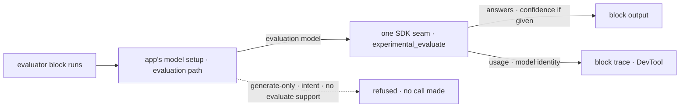

# FIX-1554 · Impl — core `evaluator` block

**Spec** · [Decisions](DECISIONS.md) · [Rules](BUSINESS-RULES.md) · [Plan](PLAN.md) · [Docs](DOCS.md) · [Evolution](EVOLUTION.md)

Feature · `contracts` + `core` + `engine` + `testing` + `devtool` + `fsdev` · large · 1 PR · epic
[FIX-1553](../../epics/FIX-1553/SPEC.md) · carries [FIX-1560](https://linear.app/fixpoint-labs/issue/FIX-1560)
(folded, [epic D1](../../epics/FIX-1553/DECISIONS.md#d1))

## Seven people, before and after

| Someone who… | Today | After |
|---|---|---|
| **classifies a support ticket with a model** | Writes a `generator` with a Zod schema and asks the model to report its own confidence as a field | Declares the questions on an `evaluator` block and gets typed answers: which option, what score, P(true). Confidence is there when the model gave it, and missing when it didn't |
| **has Jev on Vercel's gateway** | Hand-rolls `experimental_evaluate` in a handler that reads its own keys | Writes `model: "typesafe-ai/jev"`. The string resolves through the same keys and gateways the app's generators already use ([D1](DECISIONS.md#d1)) |
| **holds their own Jev key** | Same hand-rolled handler | Installs Jev's library and passes `typeSafeAi.evaluationModel("jev-latest")`. FSD never installs it for them ([D2](DECISIONS.md#d2)) |
| **uses OpenAI or Anthropic** | Same | Passes `openai.evaluationModel(...)` or the string `openai/gpt-5.4-mini`. Same block, same answers, no confidence |
| **supplies their own model resolver** | Their resolver serves generators only | Adds the optional `resolveEvaluationModel` hook to use evaluator strings. Without it, a string is refused before any call and the error names the hook; an evaluation model instance works either way ([D4](DECISIONS.md#d4)) |
| **passes a model that can only generate** | Would get a generate call, or a confusing provider error | Is refused before any call, with an error that says which kind of model to pass. Nothing falls back to a generate call |
| **debugs a flow in the DevTool** | Sees a handler with an opaque output | Sees an `evaluator` node: the questions, the answers, the model that ran and its token usage |

Every classifier in the repo today is a generator pretending to be one. The four consumers in this
epic ([FIX-1558](https://linear.app/fixpoint-labs/issue/FIX-1558),
[FIX-1559](https://linear.app/fixpoint-labs/issue/FIX-1559),
[FIX-1557](https://linear.app/fixpoint-labs/issue/FIX-1557),
[FIX-1555](https://linear.app/fixpoint-labs/issue/FIX-1555)) all wait on this block and on the
answer shape it defines ([D3](DECISIONS.md#d3)).

## What changes


Read the right panel's fence. The app's model setup gains a second door, and a model that cannot
evaluate stops there before any call. Everything a generator already honours (keys, providers,
gateways) now reaches evaluation too.

**What an author writes:**

```diff
- const triage = generator({
-   name: "triage",
-   model: "openai/gpt-5.4-mini",
-   prompt: "Route this ticket. Report how confident you are from 0 to 1.",
-   user: (input) => input.message,
-   outputSchema: z.object({
-     team: z.enum(["billing", "technical"]),
-     urgent: z.boolean(),
-     confidence: z.number(),        // a number the model made up
-   }),
- });
+ const triage = evaluator({
+   name: "triage",
+   model: "typesafe-ai/jev",        // or typeSafeAi.evaluationModel("jev-latest"), or openai.evaluationModel("gpt-5.4-mini")
+   state: (input) => input.message,
+   questions: {
+     team: choice("Which team should handle this?", {
+       billing: "Payments and refunds",
+       technical: "Bugs and outages",
+     }),
+     urgent: boolean("Does this need someone now?"),
+   },
+ });
+ // output.answers.team   → { type: "choice", choice: "billing", confidence?: 0.94, probabilities?: {…} }
+ // output.answers.urgent → { type: "boolean", probability: 0.12 }
```

## How a call reaches the model



The block owns resolution and the refusal; the one SDK seam owns the call and the mapping into
FSD's answer type. Nothing downstream of the seam imports the SDK's experimental types.

## What stays as it is

- **The four existing kinds.** Handler, generator, sequencer and router are untouched. Their
  traces, their resolution and their docs stay as they are, except where a doc states the count.
- **Gating and routing.** No confidence floor, no tree, no retry and no fallback inside the block
  ([epic D2](../../epics/FIX-1553/DECISIONS.md#d2), ER-10). `cascadingRouter` is FIX-1558's.
- **Generator model resolution.** Intents, fallback arrays and `selectModel` keep working for
  generators. The evaluator accepts none of them in this release.
- **Dispatcher** stays a handler factory. The count is five.
- **The #1903 lab** stays a draft and is never merged.

## Sign off

1. **[D1](DECISIONS.md#d1) · A model string on an evaluator resolves through the app's own model
   setup, and a model that can't evaluate is refused before any call.** If wrong: we own a second
   resolution path, and an app with no gateway or provider key gets an error where the AI SDK's
   global default would have tried Vercel's gateway anyway.
2. **[D3](DECISIONS.md#d3) · The answer is FSD's own type: the SDK's answer plus `confidence` when
   the model returned one, read from Jev's metadata in one place.** If wrong: four consumers are
   built on a shape we then have to change, or on a vendor key they each learn.
3. **[D2](DECISIONS.md#d2) · Direct Jev is an instance the author builds from Jev's library; the
   string `typesafe-ai/jev` always means the gateway.** If wrong: an author with only a Jev key
   writes one import where a string would do.

4. **[D4](DECISIONS.md#d4) · An app with its own model resolver resolves evaluator strings only
   by adding an optional hook; without it, those strings fail before any call, and nothing falls
   back to FSD's default resolver.** Added by amendment 1 after Codex's review of
   [#2190](https://github.com/fixpoint-labs/flow-state-dev/pull/2190); owner-approved in session.
   If wrong: an app with a custom resolver has to write one method before its evaluator strings
   work, where a fallback would have run them on credentials it never configured.

**Open: none.** Number 2 is the one to weigh: it is the contract the rest of the epic reads. The
reasoning and what lost are in [DECISIONS.md](DECISIONS.md); the cases in
[BUSINESS-RULES.md](BUSINESS-RULES.md), including FIX-1560's four acceptance items verbatim.
