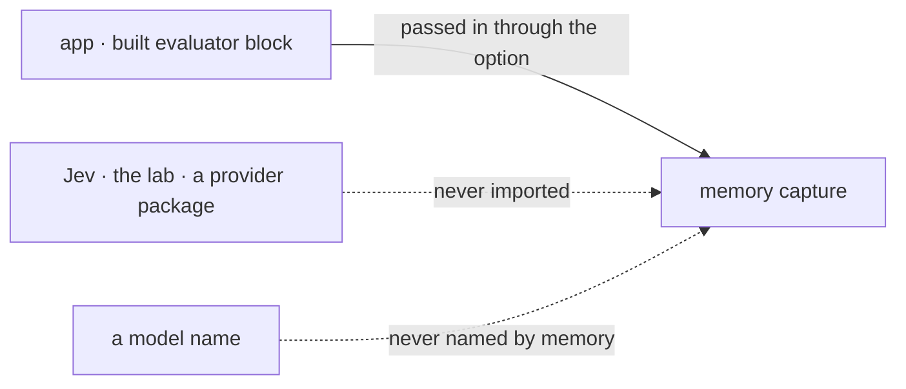

# FIX-1555 · Business rules

[Spec](SPEC.md) · [Decisions](DECISIONS.md) · **Rules** · [Plan](PLAN.md) · [Docs](DOCS.md) · [Evolution](EVOLUTION.md)

The cases, written as rules. The *proved by* column is the check the plan runs. The epic's rules
(ER-n, [epic](../../epics/FIX-1553/BUSINESS-RULES.md)) bind here too; ER-7 is the one this issue
owns.

## With no evaluator

| # | When | Then | Proved by |
|---|---|---|---|
| BR-1 | An app builds `system()` without an evaluator and captures a turn | Exactly today: one observer call on the new messages, the same writes, the same state afterwards. No evaluator step exists in the pipeline or the trace | CI, the existing memory suite unchanged plus a trace assertion · goal VG1 (the epic's leg (f)) |
| BR-2 | An app uses `createMemoryCapability` | Unaffected. It has no capture and no evaluator option | Existing suite |

## With an evaluator

| # | When | Then | Proved by |
|---|---|---|---|
| BR-3 | New messages exist and the evaluator answers **remember** | The observer runs on those same messages and memory is written as today | CI, mock evaluation model · VG2 |
| BR-4 | The evaluator answers **skip** | The observer is not called. Nothing is written to working, episodic or semantic memory. The turn is marked read, so no later capture observes it. The clock tick runs | CI: observer call count 0 and stores unchanged. An implementation that ignores the evaluator fails here · VG2 |
| BR-5 | Nothing new since the last capture | The evaluator is not called | CI, mock call count 0 |
| BR-6 | The evaluator throws, or its model is refused at first run | That capture fails as an observer failure does today. The turn stays unread and the next capture's evaluator sees it. The observer is never called in its place | CI, a throwing mock |
| BR-7 | The answer carries no confidence | Same outcome as the same answer with confidence. Memory reads the choice only | CI, both shapes, one outcome |
| BR-8 | The app's evaluator declares more questions than memory's | Memory reads its own answer and ignores the rest | CI |
| BR-9 | The app set a `source` override | The evaluator reads the `source` text, the same text the observer would | CI |
| BR-10 | The app's evaluator lacks memory's question | A type error where the questions are static. At run time, a missing answer fails the capture as in BR-6, with an error naming `captureQuestions` | Type test · CI |
| BR-11 | Someone reads the trace of a skipped turn | The evaluator row shows its answer, and no observer row follows it | CI, trace assertion |

## The fence

One arrow crosses: the finished block, passed in. Everything that names or reaches a model stays
on the app's side, which is BR-12.

## What memory never does

| # | When | Then | Proved by |
|---|---|---|---|
| BR-12 | The package is built and published | It depends on core alone for the evaluator's types. It imports no Jev, no lab, no provider package, builds no evaluator and names no evaluation model (ER-9, ER-11) | CI, a dependency and import check |
| BR-13 | Any answer, any model | Memory supplies no number the model didn't: no threshold, no default confidence (ER-3) | Code review against V5 |

## Failure taxonomy

An evaluator failure is a capture failure for that turn, and nothing more: it is as fatal to the
user's turn as an observer failure is today, no less and no more. The turn is not lost; it stays
unread until a capture succeeds. A skip is not a failure and is never retried. Memory retries
nothing itself.

## Acceptance criteria this issue owns

- **ER-7, both clauses.** Memory runs with no evaluator (BR-1). With one passed, the seam calls
  it and its answer changes what memory does (BR-3, BR-4), proved by this issue's own tests.
- **The epic's leg (f).** On a real model, memory captures unchanged with no evaluator
  installed. This issue builds the goal; [FIX-1556](https://linear.app/fixpoint-labs/issue/FIX-1556)
  assembles it (ER-15).
